---
sidebar_navigation:
  title: JIRA migration
  priority: 90
---

# Migrating from JIRA and Confluence to OpenProject

> [!NOTE]
>
> This page is a work in progress. The OpenProject team is actively developing an upcoming JIRA and Confluence migration tool. Information on this page may change as new migration options become available.
>
> Last edited on: March 20, 2026.

## Overview

This guide provides an overview of the current options for migrating data from Atlassian JIRA or Confluence to OpenProject. It also describes ongoing community and in-house development efforts for dedicated migration solutions.

With the [end of life for JIRA Data Center](https://www.openproject.org/blog/jira-alternative-end-of-data-center/), many organizations are evaluating [OpenProject as a secure, open-source, and self-hosted alternative for project management and collaboration](https://www.openproject.org/alternative-atlassian-jira-data-center/).

## Migration Options

### 1. OpenProject migration tool

OpenProject is developing a solution for migrating from JIRA and Confluence. You can follow the progress of OpenProject's [JIRA migration Stream](https://community.openproject.org/projects/jira-migration) and provide feedback. This tool will simplify data import for JIRA projects, including:

- Issue types
- Users and groups
- Fields and custom fields
- Attachments
- Workflows

> [!IMPORTANT]
> This feature is under active development and not yet available for production use.

**Contributing and data donation**

To support the development of the official migration tool, we are collecting anonymized data samples. This data helps test and validate import capabilities across different JIRA and Confluence configurations.

> [!TIP]
> Please reach out to us if you want to donate your data, we will sign an NDA to ensure confidentiality.

#### Current progress
> [!IMPORTANT]
> This section reflects the current state of development as of OpenProject 17.2. The migration tool is still under active development and is not yet production-ready. To test it, you must first enable it in your OpenProject instance adminstration (/admin/settings/experimental).

Navigate to *Administration → Import*. To create a new import configuration, click the **+ Jira configuration** button.

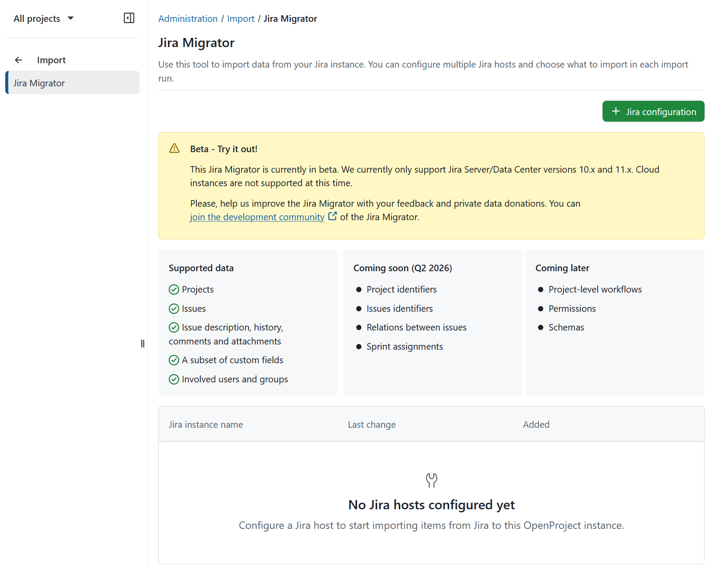

Provide the following details:
-  A name for the import configuration
-  Your Jira Server or Data Center URL
-  A Personal Access Token. The migration tool requires a token with admin permissions. Otherwise you will get 403 error during the import process.

Click **Test configuration** to verify the connection.

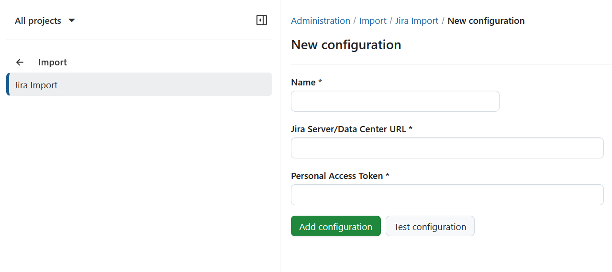
If the connection is successful, a confirmation banner will appear.

Click **Add configuration** to proceed to the import runs overview. Initially, no import runs will be listed.

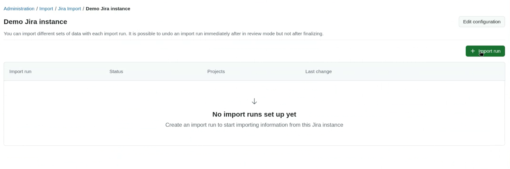

Click **Import run** to start a new import. In the *Get base data* section, click **Check available data** to retrieve metadata from your Jira instance.

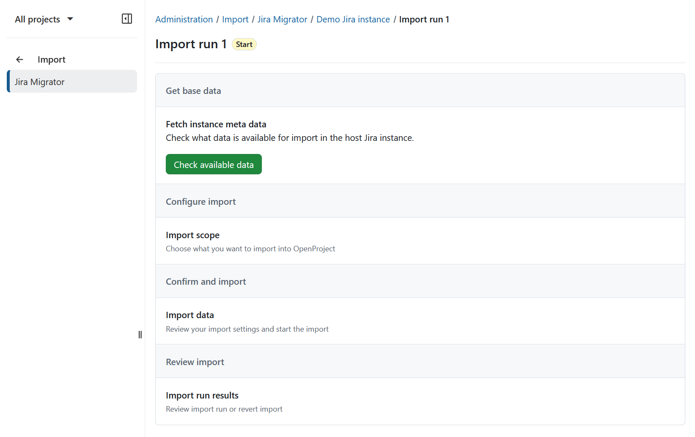

Once fetched, you will see which data can and cannot be imported. Click **Continue**.

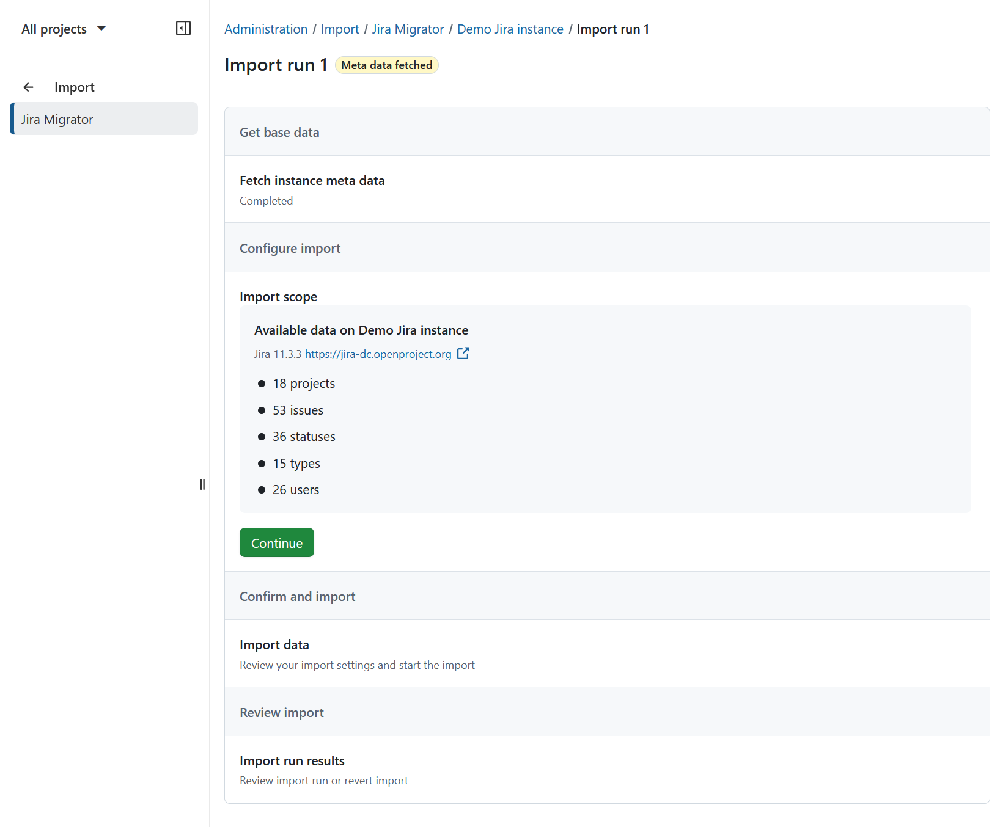

Next, select the projects you want to import. Click **Select projects**.

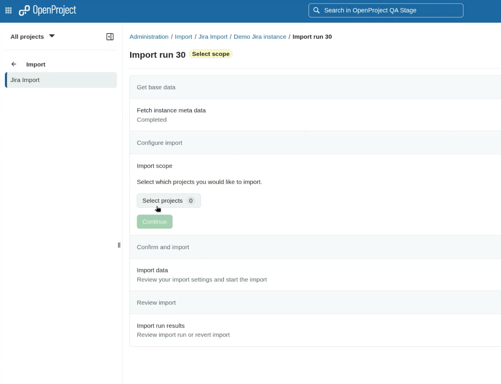

In the modal dialog, choose one or more projects and confirm by clicking **Continue**.

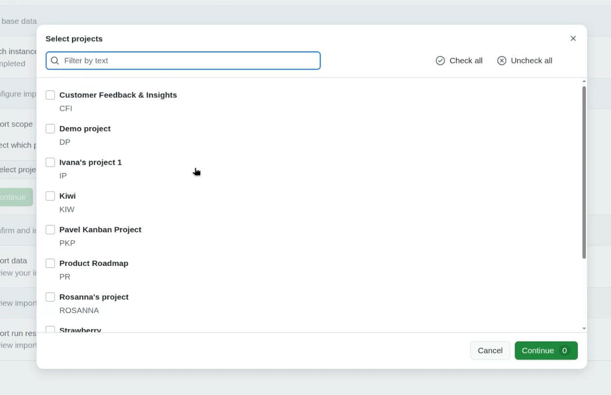

Click **Start import** to begin the import process.

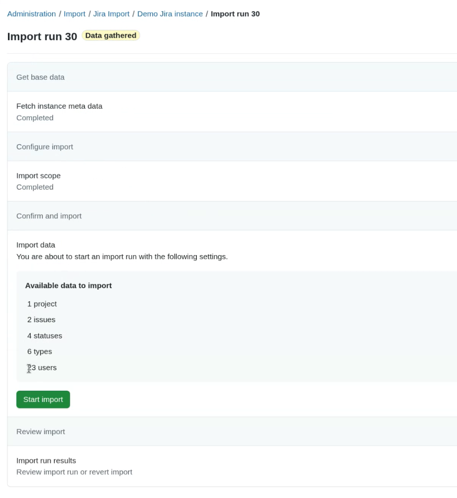

A warning dialog will appear. Confirm that you understand the limitations (e.g., incomplete feature coverage, recommendation to avoid production use, and the need for backups). Select *I understand* and click **Start import**.

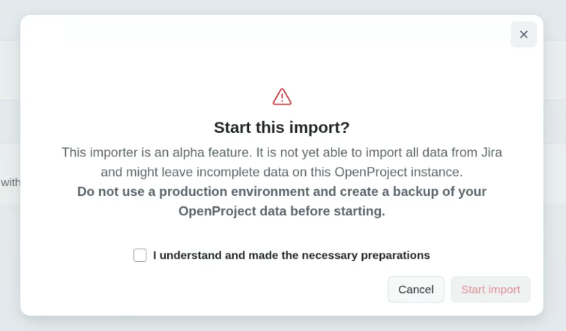

During import, Jira wiki markup is automatically converted to OpenProject’s markdown format.

> [!TIP]
> If a user already exists in OpenProject from a previous import, they will not be duplicated.

After the import completes, the data is available in *review mode*. You can:
-  Inspect imported projects and work packages
-  Validate data integrity
-  Decide whether to finalize or revert the import

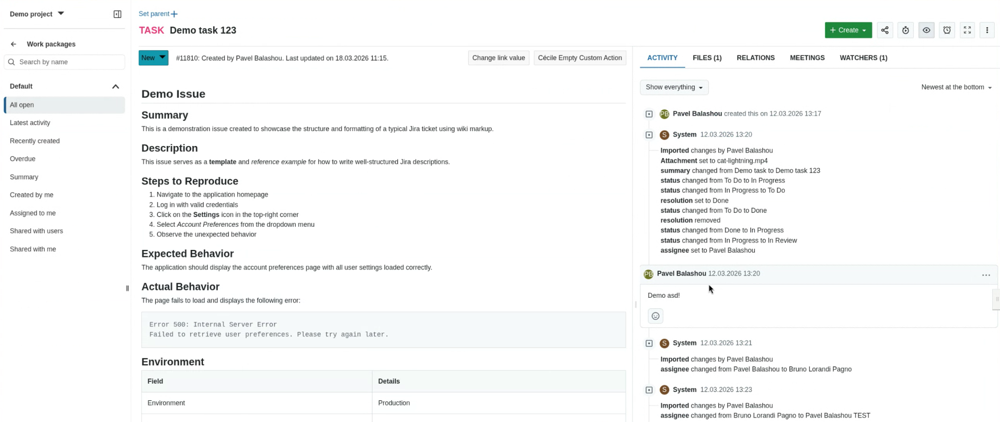

To proceed, choose one of the following actions: finalize or revert the import.

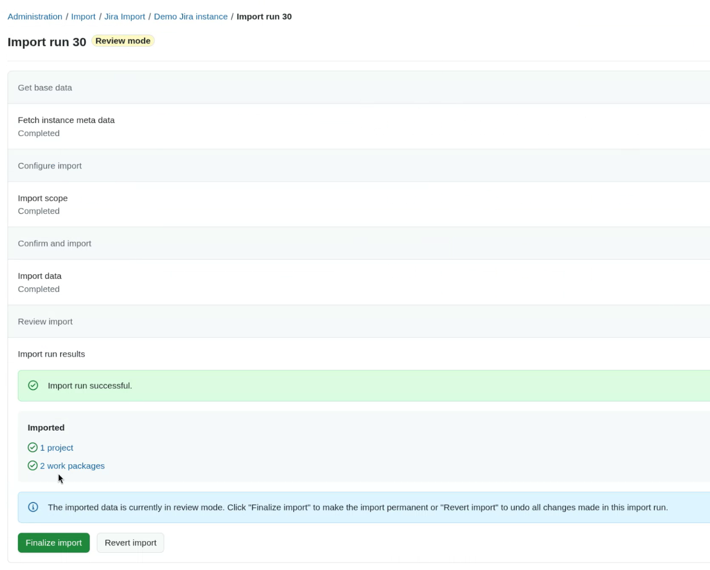

**Finalize import**
- Activates newly created users
- Makes imported data permanent
- Disables the option to revert the import

A confirmation warning will be shown before proceeding.

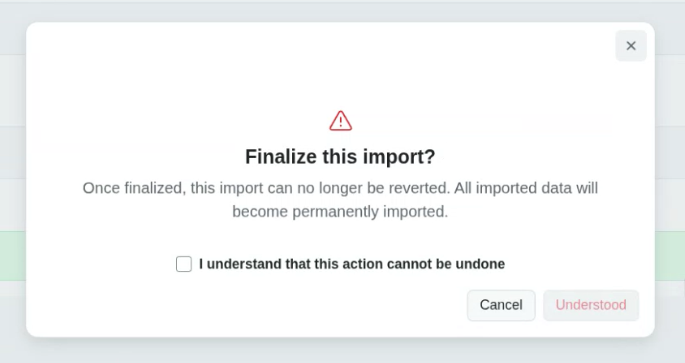

**Revert import**
- Removes all data created during the current import run
- Does not affect data from previous import runs

A confirmation warning will also be shown.

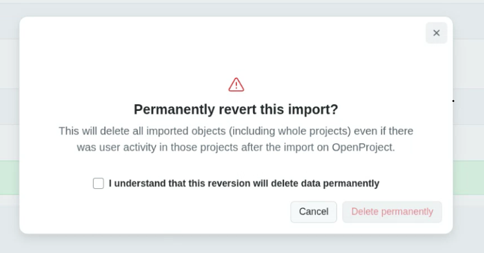

> [!NOTE]
> During review mode, any newly created users remain locked until the import is finalized.

### 2. API

Use the [OpenProject REST API](https://www.openproject.org/docs/api) to migrate data programmatically. This option provides full flexibility and supports most OpenProject entities, such as:

- Work packages
- Users
- Comments
- Attachments

> [!NOTE]
> The API-based approach requires technical expertise and scripting or integration development to map JIRA and Confluence data structures to OpenProject.

### 3. Excel synchronization

The [Excel synchronization integration](../../system-admin-guide/integrations/excel-synchronization) allows you to import and export tabular data between JIRA, Confluence, and OpenProject using spreadsheets.
This method is suitable for small- to medium-sized migrations and provides an opportunity to review and clean data manually before import.

### 4. Confluence → Markdown → Wiki

You can migrate Confluence content into OpenProject using Markdown export and manual import:

1. Use a Markdown export app such as [Markdown Exporter for Confluence](https://marketplace.atlassian.com/apps/1221351/markdown-exporter-for-confluence).
2. Copy and paste the exported Markdown into the OpenProject Wiki module.
3. Verify formatting and structure after import.
4. Upload attachments manually (these are not included in the Markdown export).

This approach preserves most layout elements and is recommended for documentation or knowledge base content.

> [!TIP]
>
> This approach is only suitable for very few wiki pages. For a comprehensive Confluence migration, consider using our recommended alternative: migrating your Confluence spaces to [XWiki](https://migration.xwiki.com/en/Alternatives/xwiki-vs-confluence ), our open source partner for advanced and large-scale wiki and knowledge-base migrations. XWiki provides a more complete and scalable path when moving extensive Confluence content. [Find out more](https://www.openproject.org/alternative-atlassian-jira-data-center/).

## Recommended migration workflow

### 1. Preparation

- Document your existing JIRA and Confluence configuration (projects, issue types, workflows, fields, spaces).
- Identify which data to migrate and which to archive.
- Clean up legacy data before starting.

### 2. Testing

- Set up a test instance of OpenProject.
- Migrate a small subset of data using one of the methods described above.
- Verify field mappings, attachments, and relationships.

### 3. Execution

- Perform the full migration after successful testing.
- Validate data integrity after import.
- Recreate workflows, permissions, and boards in OpenProject as required.

### 4. Post-migration

- Provide training to users.
- Archive or decommission the legacy systems if applicable.
