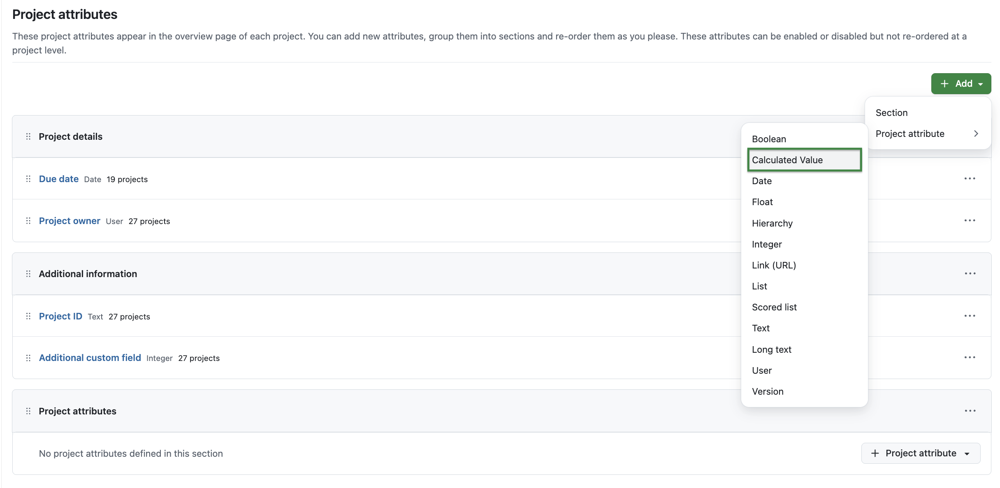
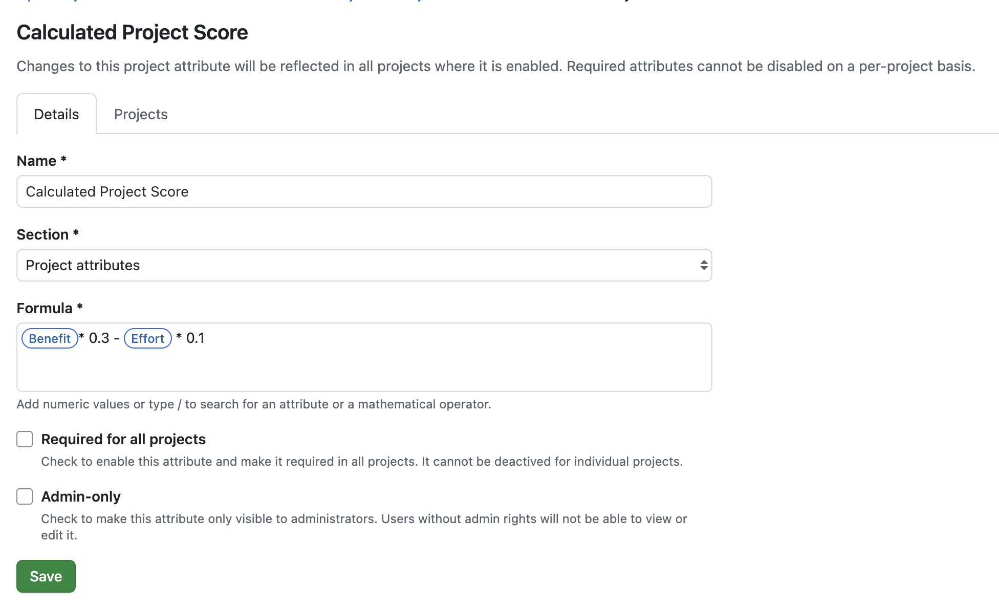
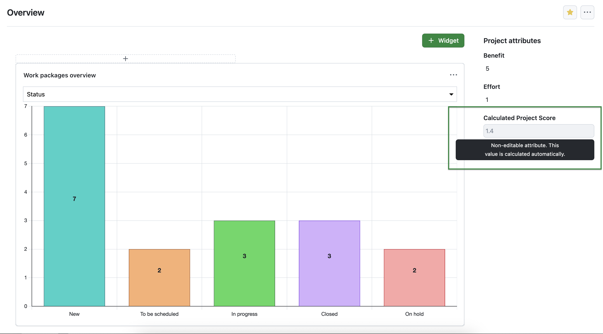
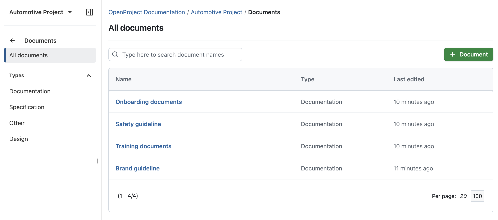
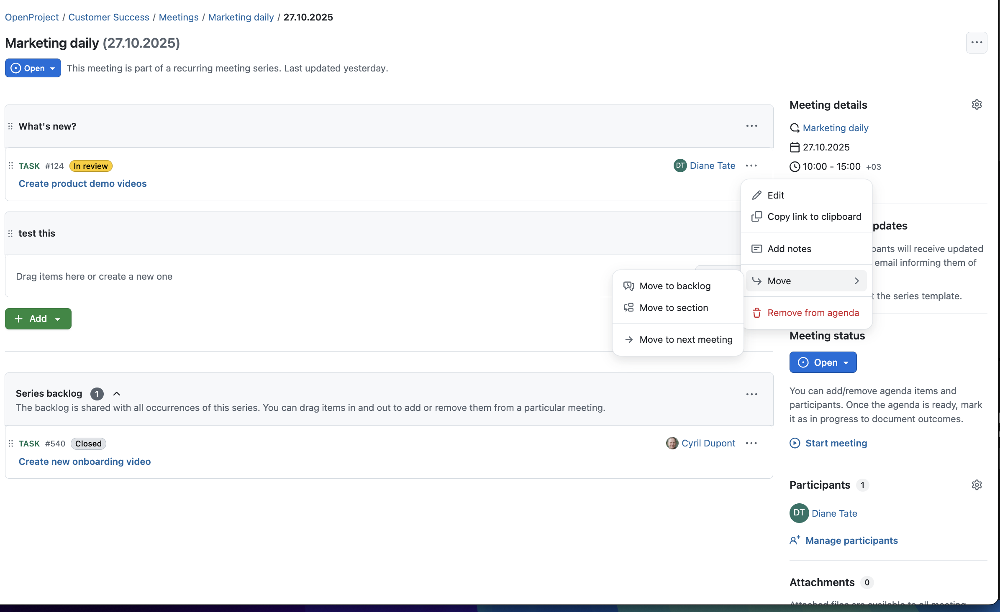

# OpenProject 16.6.0

Release date: 2025-11-05

We released [OpenProject 16.6.0](https://community.openproject.org/versions/1413). The release contains several bug fixes and we recommend updating to the newest version. In these Release Notes, we will give an overview of important feature changes. At the end, you will find a complete list of all changes and bug fixes.

## Important feature changes

Take a look at our release video showing the most important features introduced in OpenProject 16.6.0:

### Calculated values for project evaluation and scoring (Enterprise add-on)

OpenProject 16.6 introduces a new project attribute type: Calculated value. 

This attribute allows administrators to define formulas that automatically compute results based on existing numeric project attributes, such as *Integer* or *Float*. 

Calculated values can combine multiple attributes and constants using mathematical operators (+, –, ×, ÷) and parentheses to control the order of operations. The computed result is displayed directly on the project overview and in the project list, providing a transparent and consistent way to evaluate or score projects across the portfolio.

Here's an example of a calculated value called 'Calculated Project Score' with the following formula: Benefit ​* 0.3 - Effort * 0.1

>[!NOTE]
> Please note that this new project attribute is part of our [Enterprise add-ons in the Enterprise Professional plan](https://www.openproject.org/pricing/).

When enabled in a project, the calculated value can be displayed on the project overview page. It automatically updates whenever one of its source attributes (e.g., *Benefit* or *Effort* in this example) is changed.

### Performance updates

OpenProject 16.6 introduces several backend optimizations that significantly improve performance in large environments. [Database queries for collection endpoints in the API v3 have been optimized](https://community.openproject.org/wp/68457) to avoid unnecessary counting operations, and the [autocompleter for adding work package relations now requests only the data it actually needs](https://community.openproject.org/wp/68458).

These improvements reduce query load and shorten response times, especially for installations with thousands of projects and work packages.

### New index page for Documents module

With OpenProject 16.6, a new index page provides a structured overview of all documents within a project. The list is sorted by last edited, showing the latest changes first, and includes columns for Name, Type, and Last edited. Users can search documents via a quick text filter or narrow results by document type using the filter menu on the left. A new Create document button lets users quickly add new items, with Note set as the default type. The view automatically respects project permissions, ensuring that users only see documents they are allowed to access. On mobile, the list is optimized to show just the most relevant information — the document name and its last edited date.

While this is a small feature by itself, it marks the beginning of a major improvement of the Documents module, which will make managing and collaborating on documents in OpenProject much easier in the future.

### Possibility to change parent of a custom field item

Administrators can now change the parent of an item within a hierarchical custom field. This makes it easier to rearrange existing items without recreating them from scratch. 

To do so, administrators need to navigate to *Administration → Custom fields*, select a custom field type hierarchy and click on the *Items* tab. Then they click on the *More* icon and select *Change parent*. A dialog opens showing the current hierarchy tree. From there, administrators can search, select a new parent, and save the updated structure. The hierarchy is updated immediately after saving.

### Updated 'More' menu of meetings with a 'Add to section' option

In the Meetings module, the *More (three dots) menu* for agenda items has been improved to make it easier to move work packages between sections. Moderators can now directly move an item to another section without manually reordering it step by step. The new Move to section option opens a dialog where users can select the desired section — including the backlog — from a dropdown list. This streamlines meeting organization, especially for larger meetings with multiple sections and many related work packages.

### Editing of individual work package/project attributes allowed even if certain other attributes are invalid (eg. required field empty)

text

screenshot

### Work package type workflow table with a sticky header and sticky first column

text

screenshot

### Mini calendar re-added in the date picker of mobile web

text

screenshot

## Important technical updates

### Autoscaling

text

screenshot

<!--more-->

## Bug fixes and changes

<!-- Warning: Anything within the below lines will be automatically removed by the release script -->
<!-- BEGIN AUTOMATED SECTION -->

- Bugfix: Inconsistent position of search icon in search box \[[#42064](https://community.openproject.org/wp/42064)\]
- Bugfix: &quot;Stay logged in&quot; in German (and Spanish) truncated on login screen - not enough spacing \[[#45921](https://community.openproject.org/wp/45921)\]
- Bugfix: \[Work-Package\] Move work-package with an invalid user in a custom field \[[#59381](https://community.openproject.org/wp/59381)\]
- Bugfix: No hierarchy in hierarchy field during bulk edit \[[#61970](https://community.openproject.org/wp/61970)\]
- Bugfix: Project identifier cannot be updated if a required project attribute is created \[[#63668](https://community.openproject.org/wp/63668)\]
- Bugfix: Truncation of &quot;Tage&quot; (Days) in duration field when language=DE \[[#65227](https://community.openproject.org/wp/65227)\]
- Bugfix: Poor performance on a number of API endpoints (i.e. slow work package table) \[[#65718](https://community.openproject.org/wp/65718)\]
- Bugfix: Activity Module delivers error 404 in newly set up instances \[[#66444](https://community.openproject.org/wp/66444)\]
- Bugfix: Select All appears on the File Picker even when no checkboxes are shown \[[#66694](https://community.openproject.org/wp/66694)\]
- Bugfix: Sharepoint redirect URI throws an error mentioning OAuth2 \[[#67202](https://community.openproject.org/wp/67202)\]
- Bugfix: Confusing formulation in Nextcloud storage health report \[[#67419](https://community.openproject.org/wp/67419)\]
- Bugfix: When user saves form with missing data, focus is not set on field where data is missing \[[#67644](https://community.openproject.org/wp/67644)\]
- Bugfix: On mobile, list of names for mentions spills out of screen if some names are long \[[#67693](https://community.openproject.org/wp/67693)\]
- Bugfix: Clearing backlog doesn&#39;t remove the items \[[#67844](https://community.openproject.org/wp/67844)\]
- Bugfix: Error when creating a new work package after the previous one is opened in details view \[[#67980](https://community.openproject.org/wp/67980)\]
- Bugfix: Toggleable fieldsets do not toggle \[[#68031](https://community.openproject.org/wp/68031)\]
- Bugfix: workPackageValue:attribute macros don&#39;t work if custom field name contains &quot;.&quot; (dot) \[[#68125](https://community.openproject.org/wp/68125)\]
- Bugfix: When deep linking to a comment on mobile the comment is not fully scrolled into view \[[#68221](https://community.openproject.org/wp/68221)\]
- Bugfix: On small screens the lazy page might never load \[[#68252](https://community.openproject.org/wp/68252)\]
- Bugfix: Updating the activity anchor url without a page load does not highlight the relevant target element \[[#68262](https://community.openproject.org/wp/68262)\]
- Bugfix: user provided links are opened in a new tab, but it is not read out by screen reader \[[#68267](https://community.openproject.org/wp/68267)\]
- Bugfix: Filtering of past Meeting series is not working correctly \[[#68311](https://community.openproject.org/wp/68311)\]
- Bugfix: Version overview widgets don&#39;t have enough space \[[#68352](https://community.openproject.org/wp/68352)\]
- Bugfix: When switching to Automatic mode, &quot;Working days only&quot; is not set correctly \[[#68357](https://community.openproject.org/wp/68357)\]
- Bugfix: Unsaved changes are lost when sections are reordered \[[#68374](https://community.openproject.org/wp/68374)\]
- Bugfix: Unsaved changes are lost when dealing with outcomes \[[#68375](https://community.openproject.org/wp/68375)\]
- Bugfix: On work package creation, &quot;Working days only&quot; is not saved \[[#68380](https://community.openproject.org/wp/68380)\]
- Bugfix: Migration from 15.2 to 16.5 (probably earlier as well) broken \[[#68392](https://community.openproject.org/wp/68392)\]
- Bugfix: Incorrect dates displayed in date picker when switching to automatic mode \[[#68402](https://community.openproject.org/wp/68402)\]
- Bugfix: On Work Package Side View (via &quot;info&quot; ℹ️ icon) the lazy pages never load, only the first page is loaded \[[#68404](https://community.openproject.org/wp/68404)\]
- Bugfix: When deep linking after a large image comment, the highlighted comment is out of view \[[#68409](https://community.openproject.org/wp/68409)\]
- Bugfix: Base Amount Field: Error 500 on Empty Submission, Expected Behavior - Reset to Zero \[[#68428](https://community.openproject.org/wp/68428)\]
- Bugfix: Nothing happens except page reload when user clicks &#39;Show more&#39; on Meeting series index page \[[#68454](https://community.openproject.org/wp/68454)\]
- Bugfix: APIv3: Totals are counted, even if not selected \[[#68457](https://community.openproject.org/wp/68457)\]
- Bugfix: Parent WP goes to &quot;automatic&quot; when only one child remains after removing all others \[[#68465](https://community.openproject.org/wp/68465)\]
- Bugfix: Deleted work package cannot be removed from meeting agenda \[[#68488](https://community.openproject.org/wp/68488)\]
- Bugfix: APIv3: Missing eager load in /api/v3/projects \[[#68496](https://community.openproject.org/wp/68496)\]
- Bugfix: &quot;Close completed versions&quot; is not connected to the backend -&gt; 404 returned \[[#68502](https://community.openproject.org/wp/68502)\]
- Bugfix: Apiv3: Missing preload in /api/v3/time\_entries \[[#68513](https://community.openproject.org/wp/68513)\]
- Feature: Project attribute of type &quot;Calculated value&quot; \[[#50112](https://community.openproject.org/wp/50112)\]
- Feature: Change parent of a custom field item \[[#57828](https://community.openproject.org/wp/57828)\]
- Feature: Use hierarchical lists as project attributes \[[#59173](https://community.openproject.org/wp/59173)\]
- Feature: Primer Alpha::ToggleSwitch locale support \[[#62820](https://community.openproject.org/wp/62820)\]
- Feature: Allow editing of individual work package/project attributes even if certain other attributes are invalid (eg. required field empty) \[[#63550](https://community.openproject.org/wp/63550)\]
- Feature: SharePoint Storage Creation \[[#64176](https://community.openproject.org/wp/64176)\]
- Feature: SharePoint Storage Basic Functionality \[[#64177](https://community.openproject.org/wp/64177)\]
- Feature: SharePoint Storage AMPF support \[[#64178](https://community.openproject.org/wp/64178)\]
- Feature: Provide work package type workflow table with a sticky header and sticky first column \[[#64823](https://community.openproject.org/wp/64823)\]
- Feature: Add SharePoint documentation \[[#65553](https://community.openproject.org/wp/65553)\]
- Feature: Re-add the mini calendar in the date picker of mobile web \[[#66050](https://community.openproject.org/wp/66050)\]
- Feature: Add numeric values to custom field hierarchy items \[[#66408](https://community.openproject.org/wp/66408)\]
- Feature: Overview widget for Subitems \[[#66493](https://community.openproject.org/wp/66493)\]
- Feature: Automatically detect and apply OS theme in Login screen \[[#66594](https://community.openproject.org/wp/66594)\]
- Feature: Index page for documents module \[[#66595](https://community.openproject.org/wp/66595)\]
- Feature: Rename Nextcloud GroupFolder references to TeamFolder \[[#66722](https://community.openproject.org/wp/66722)\]
- Feature: Update &#39;More&#39; menu of meetings with a &#39;Add to section&#39; option \[[#67060](https://community.openproject.org/wp/67060)\]
- Feature: Highlight the meeting agenda item when the user gets to a meeting via a deep link  \[[#67276](https://community.openproject.org/wp/67276)\]
- Feature: Allow single selection variant for the (filterable) tree view \[[#67542](https://community.openproject.org/wp/67542)\]
- Feature: Assigned value of a custom field of type scored list in a work package does not display the score \[[#67594](https://community.openproject.org/wp/67594)\]
- Feature: Autoscaling \[[#67698](https://community.openproject.org/wp/67698)\]
- Feature: Limit number of subitems shown in the subitems widget \[[#67969](https://community.openproject.org/wp/67969)\]
- Feature: Autocompleter for available relation candidates should select necessary attributes from API \[[#68458](https://community.openproject.org/wp/68458)\]
- Feature: Allow SharePoint integration setup with more restrictive permissions \[[#58445](https://community.openproject.org/wp/58445)\]

<!-- END AUTOMATED SECTION -->
<!-- Warning: Anything above this line will be automatically removed by the release script -->

## Contributions

A very special thank you goes to Helmholtz-Zentrum Berlin, City of Cologne, Deutsche Bahn and ZenDiS for sponsoring released or upcoming features. Your support, alongside the efforts of our amazing Community, helps drive these innovations. Also a big thanks to our Community members for reporting bugs and helping us identify and provide fixes. Special thanks for reporting and finding bugs go to Sven Kunze, Stefan Weiberg, Александр Татаринцев, Gábor Alexovics, Alexander Aleschenko, Tobias Nowakow.

Last but not least, we are very grateful for our very engaged translation contributors on Crowdin, who translated quite a few OpenProject strings! This release we would like to particularly thank the following users:

- [Haura Nabila Rinaldi](https://crowdin.com/profile/hauranblr), for a great number of translations into Indonesian.
- [Samo](https://crowdin.com/profile/SamoE), for a great number of translations into Turkish.
- [Kuma Yamashita](https://crowdin.com/profile/dredgk), for a great number of translations into Japanese.

Would you like to help out with translations yourself? Then take a look at our [translation guide](../../contributions-guide/translate-openproject/) and find out exactly how you can contribute. It is very much appreciated!
