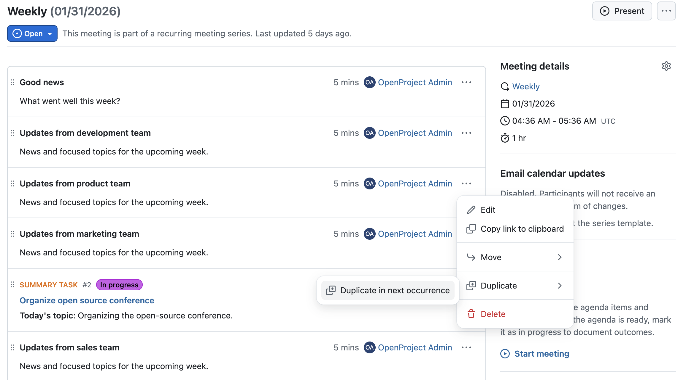

 # OpenProject 17.1.0

 Release date: 2026-02-11

 We released [OpenProject 17.1.0](https://community.openproject.org/versions/2237). The release contains several bug fixes and we recommend updating to the newest version. In these Release Notes, we will give an overview of important feature changes. At the end, you will find a complete list of all changes and bug fixes.

<!-- BEGIN CVE SECTION -->

<!-- END CVE SECTION -->
## Important feature changes

### Automated project initiation request with a guided wizard (Enterprise add-on)

OpenProject introduces a configurable wizard for project initiation requests. The wizard is available as an **Enterprise add-on in the Premium plan** and can be enabled per project template.

#### Configurable project initiation wizard

Administrators can configure a project initiation wizard to define how new project requests are submitted. This includes selecting which project attributes and sections are shown in the wizard, and which fields are required or optional.

The wizard guides users step by step through the initiation process using a fullscreen, three-column layout with section navigation, contextual help, and a progress indicator. Instead of completing required project attributes during project creation, users provide this information as part of the initiation request.

#### Create a project initiation request as a work package

When a project initiation request is submitted, OpenProject automatically creates a work package that represents the request and serves as its central tracking artifact.

The work package is created based on the wizard configuration, including work package type, status, and assignee. Assignment can be derived from a project attribute or a project role, such as a project owner. The work package contains links back to the wizard and can be processed using existing workflows.

#### Automatically generated project initiation artifact (PDF)

Upon submission of the project initiation request, a PDF artifact is automatically generated. The artifact contains all information entered in the wizard and is attached to the corresponding work package for documentation and audit purposes.

The artifact is updated automatically whenever the status of the project initiation request work package changes, ensuring that the documentation always reflects the current state.

#### Changed enforcement of required project attributes when using templates

When projects are created from templates with an enabled initiation wizard, required project attributes are no longer enforced during project creation. Instead, they are collected as part of the initiation request workflow. For projects created without templates, required attributes continue to be enforced during project creation.

>[!NOTE]
> The project initiation request workflow is particularly well suited for structured frameworks such as PM² or PMflex, while remaining flexible enough to be used independently of any specific methodology. Read this blog article for more information: https://www.openproject.org/blog/project-initiation-workflow-pm2/

### Updates for the Meetings module

The Meetings module received several improvements that extend how meeting results are documented, reused, and shared.

#### Add new or existing work packages as meeting outcomes

Users can now add work packages as meeting outcomes, allowing teams to turn meeting results into actionable follow-up items without leaving the meeting context. They can either:

- link an existing work package, or
- create a new work package as an outcome.

Each linked work package automatically shows a reference to the meeting in its Meetings tab, making the connection between the agenda item and the follow-up item explicit.

Since OpenProject 17.0 allows multiple outcomes per agenda item, it is now also possible to link multiple work packages to the same agenda item.

#### Show meeting participant responses in iCal subscriptions

Meeting participant responses are now handled more consistently across OpenProject and external calendars. Responses such as accepted, declined, or no response are visible directly in the meeting, making it easier to see the current participation status of all attendees.

In addition, participant responses are now included in iCal subscriptions. This allows calendar applications to display the response status of meeting participants and keep it in sync with the information shown in OpenProject.

#### Duplicate agenda items to the next recurring meeting occurrence

Users can now duplicate agenda items to the next occurrence of a recurring meeting. This makes it possible to carry over open topics or recurring discussion points without recreating them manually.

To duplicate an agenda item, users can select the corresponding option from the agenda item actions menu. The duplicated agenda item is added to the next meeting occurrence and can be edited independently.

### Release Attribute highlighting to Community

### Warning before opening external links in user-provided content (Enterprise add-on)

### Improved performance in work package Activity tab

## Important technical changes

<!-- Remove this section if empty, add to it in pull requests linking to tickets and provide information -->

<!--more-->

## Bug fixes and changes

<!-- Warning: Anything within the below lines will be automatically removed by the release script -->
<!-- BEGIN AUTOMATED SECTION -->

- Bugfix: Save button is not in its primary color \[[#44246](https://community.openproject.org/wp/44246)\]
- Bugfix: Loading spinner is unreadable on Time&amp;Costs module when in dark mode \[[#58458](https://community.openproject.org/wp/58458)\]
- Bugfix: Unexplicable &quot;The changes were retracted&quot; journal entries \[[#59360](https://community.openproject.org/wp/59360)\]
- Bugfix: Project selector does not read selected items in screenreader \[[#61405](https://community.openproject.org/wp/61405)\]
- Bugfix: Date is not displayed according to chosen format in an auto-generated subject \[[#63481](https://community.openproject.org/wp/63481)\]
- Bugfix: Dropdown cut off when opening to the top \[[#65102](https://community.openproject.org/wp/65102)\]
- Bugfix: Truncation of &quot;Tage&quot; (Days) in duration field when language=DE \[[#65227](https://community.openproject.org/wp/65227)\]
- Bugfix: Focus of a date input is lost in single mode date picker \[[#65415](https://community.openproject.org/wp/65415)\]
- Bugfix: Administration life cycle table header has a wrong height \[[#65634](https://community.openproject.org/wp/65634)\]
- Bugfix: Validation of essential OIDC claims causes server error when failing \[[#66289](https://community.openproject.org/wp/66289)\]
- Bugfix: Large amount of comments causes workpackage to freeze (missing lazy-loading and loading indicator for Activity tab) \[[#66552](https://community.openproject.org/wp/66552)\]
- Bugfix: Meeting email update is sent in sender&#39;s OP language \[[#67287](https://community.openproject.org/wp/67287)\]
- Bugfix: Fix accessibility issues in Angular templates detected by ESLint \[[#67399](https://community.openproject.org/wp/67399)\]
- Bugfix: BlockNote: Color for text not applied from the block side menu \[[#67507](https://community.openproject.org/wp/67507)\]
- Bugfix: BlockNote: searching for a non-existent work package results in placeholder string being saved in the editor \[[#67554](https://community.openproject.org/wp/67554)\]
- Bugfix: Checking off participants in a meeting does not keep scroll position \[[#67719](https://community.openproject.org/wp/67719)\]
- Bugfix: Error when creating a new work package after the previous one is opened in details view \[[#67980](https://community.openproject.org/wp/67980)\]
- Bugfix: Mobile web: When deep linking to a comment the comment is not fully scrolled into view \[[#68221](https://community.openproject.org/wp/68221)\]
- Bugfix: Updating the activity anchor URL without a page load does not highlight the relevant target element \[[#68262](https://community.openproject.org/wp/68262)\]
- Bugfix: Content spills out of weighted item list item container \[[#68347](https://community.openproject.org/wp/68347)\]
- Bugfix: DangerDialog text is unnecessarily convoluted \[[#68377](https://community.openproject.org/wp/68377)\]
- Bugfix: Unable to save meeting agenda name after using browser autocomplete \[[#68478](https://community.openproject.org/wp/68478)\]
- Bugfix: Confirmation dialog is shown even when no changes are made to the text \[[#68654](https://community.openproject.org/wp/68654)\]
- Bugfix: Project CF of type user does not display groups or placeholder users \[[#68702](https://community.openproject.org/wp/68702)\]
- Bugfix: User List in cost report is generated unsorted \[[#68714](https://community.openproject.org/wp/68714)\]
- Bugfix: Changing the filter on the activity tab with a large number of comments and slow network/compute lacks loading state while waiting for request completion \[[#68878](https://community.openproject.org/wp/68878)\]
- Bugfix: Label for the admin document types reflects &quot;priorities&quot; instead of &quot;types&quot; in it&#39;s messaging \[[#69304](https://community.openproject.org/wp/69304)\]
- Bugfix: Error duplicating task with relation \[[#69309](https://community.openproject.org/wp/69309)\]
- Bugfix: Infinite SAML Seeding Loop Causing Disk Space Exhaustion \[[#69339](https://community.openproject.org/wp/69339)\]
- Bugfix: Truncate the name in the project list \[[#69445](https://community.openproject.org/wp/69445)\]
- Bugfix: Timer cannot be started if log time modal has a mandatory field \[[#69483](https://community.openproject.org/wp/69483)\]
- Bugfix: Nexcloud returns 404 if OpenPorject app is not installed  \[[#69492](https://community.openproject.org/wp/69492)\]
- Bugfix: API key input field is centered \[[#69511](https://community.openproject.org/wp/69511)\]
- Bugfix: Pasting rich text into CKEditor crashes it \[[#69597](https://community.openproject.org/wp/69597)\]
- Bugfix: Error in PDF exports if font file storage is broken \[[#69625](https://community.openproject.org/wp/69625)\]
- Bugfix: Misleading text in Work Package meetings tab after mentioning WP in meeting outcome \[[#69646](https://community.openproject.org/wp/69646)\]
- Bugfix: Too many permissions required to fill out wizard \[[#69672](https://community.openproject.org/wp/69672)\]
- Bugfix: Button to open PIR should only be shown for users with Edit project attributes permission \[[#69723](https://community.openproject.org/wp/69723)\]
- Bugfix: &quot;Move to next meeting&quot; broken for past meetings \[[#69727](https://community.openproject.org/wp/69727)\]
- Bugfix: Can&#39;t move hierarchy element underneath an element with an &quot;&amp;&quot; symbol in its title \[[#69966](https://community.openproject.org/wp/69966)\]
- Bugfix: &quot;Show attachments in the files tab by default&quot; potentially overwrites the setting for existing project \[[#69991](https://community.openproject.org/wp/69991)\]
- Bugfix: project attributes have a border on mobile fields  \[[#70100](https://community.openproject.org/wp/70100)\]
- Bugfix: Fix accessibility errors found by ERB Lint \[[#70166](https://community.openproject.org/wp/70166)\]
- Bugfix: Wrong helptext for &quot;Allow remapping of existing users&quot; \[[#70389](https://community.openproject.org/wp/70389)\]
- Bugfix: Project status button is missing colors in the dropdown \[[#70458](https://community.openproject.org/wp/70458)\]
- Bugfix: Fix flickering in the Handling of 404 errors in AvatarWithFallback \[[#70460](https://community.openproject.org/wp/70460)\]
- Bugfix: On mobile, global search result box shows a lot of white space \[[#70497](https://community.openproject.org/wp/70497)\]
- Bugfix: Missing list items when using checkboxes in tables \[[#70537](https://community.openproject.org/wp/70537)\]
- Bugfix: Work package meetings tab only shows the last outcome \[[#70779](https://community.openproject.org/wp/70779)\]
- Bugfix: Calendar widget not visible with Firefox \[[#70792](https://community.openproject.org/wp/70792)\]
- Bugfix: SCIM &quot;name&quot; Attribute Rejection and Non‑Compliance With RFC 7643 \[[#70891](https://community.openproject.org/wp/70891)\]
- Bugfix: Cannot update email header/footer due to emission address being &#39;not a valid email address&#39; when mail\_from setting is pinned via env \[[#70906](https://community.openproject.org/wp/70906)\]
- Bugfix: API V3 allows reading/writing internal comments when the &quot;Enable internal comments&quot; project setting is disabled \[[#70979](https://community.openproject.org/wp/70979)\]
- Bugfix: Every user can be set as a presenter for an agenda item \[[#71100](https://community.openproject.org/wp/71100)\]
- Bugfix: External link warning page cut off on mobile \[[#71103](https://community.openproject.org/wp/71103)\]
- Feature: Empty state for meeting index pages \[[#59158](https://community.openproject.org/wp/59158)\]
- Feature: Work package meeting outcomes \[[#62093](https://community.openproject.org/wp/62093)\]
- Feature: Email notifications for meeting invites and updates of meetings are processed correctly by the group wares \[[#65040](https://community.openproject.org/wp/65040)\]
- Feature: Redesign the &quot;My Account / Access token&quot; page using Primer \[[#65411](https://community.openproject.org/wp/65411)\]
- Feature: Rename Nextcloud GroupFolder references to TeamFolder \[[#66722](https://community.openproject.org/wp/66722)\]
- Feature: Show shorts and weights of custom fields with hierarchical structure \[[#67594](https://community.openproject.org/wp/67594)\]
- Feature: Handle participation responses in incoming emails \[[#68453](https://community.openproject.org/wp/68453)\]
- Feature: Show document as separate tab on mobile \[[#68833](https://community.openproject.org/wp/68833)\]
- Feature: Non configurable project creation wizard \[[#68855](https://community.openproject.org/wp/68855)\]
- Feature: Configuration of project attributes to appear in the create wizard \[[#68858](https://community.openproject.org/wp/68858)\]
- Feature: Create work package to submit project initiation request \[[#68862](https://community.openproject.org/wp/68862)\]
- Feature: Templates define their own settings for the project wizard \[[#68943](https://community.openproject.org/wp/68943)\]
- Feature: PDF export of PM²/PMflex project initiation requests \[[#69001](https://community.openproject.org/wp/69001)\]
- Feature: Change enforcement of project attributes on creation for templates \[[#69034](https://community.openproject.org/wp/69034)\]
- Feature: On status update of the PIR work package, recreate the PDF \[[#69303](https://community.openproject.org/wp/69303)\]
- Feature: Primerise the Password Confirmation Dialog \[[#69354](https://community.openproject.org/wp/69354)\]
- Feature: &quot;X-icon&quot; above the project create form \[[#69356](https://community.openproject.org/wp/69356)\]
- Feature: Add the project name as PageHeader breadcrumb on the project initiation request \[[#69401](https://community.openproject.org/wp/69401)\]
- Feature: Button to open project creation wizard from overview \[[#69402](https://community.openproject.org/wp/69402)\]
- Feature: Add relative link to project initiation request from work package comment \[[#69403](https://community.openproject.org/wp/69403)\]
- Feature: Send out email when work package is created \[[#69414](https://community.openproject.org/wp/69414)\]
- Feature: Show breadcrumb with full project hierachy in Project Overview showing portfolios and programs \[[#69417](https://community.openproject.org/wp/69417)\]
- Feature: Allow duplicating/copy of agenda items to next meeting occurence \[[#69464](https://community.openproject.org/wp/69464)\]
- Feature: Primerize API settings form \[[#69702](https://community.openproject.org/wp/69702)\]
- Feature: Show participant response in Meeting UI \[[#69733](https://community.openproject.org/wp/69733)\]
- Feature: Responses before meeting was created should show up in iCal Feed \[[#69734](https://community.openproject.org/wp/69734)\]
- Feature: Allow searching for work package types and status whenever selecting work packages \[[#70191](https://community.openproject.org/wp/70191)\]
- Feature: Primerize Backlogs Admin \[[#70194](https://community.openproject.org/wp/70194)\]
- Feature: Capture external links in user-provided contents \[[#70234](https://community.openproject.org/wp/70234)\]
- Feature: Send email notifications to all participants when a participant is added or removed \[[#70607](https://community.openproject.org/wp/70607)\]

<!-- END AUTOMATED SECTION -->
<!-- Warning: Anything above this line will be automatically removed by the release script -->

## Contributions

A very special thank you goes to Helmholtz-Zentrum Berlin, City of Cologne, Deutsche Bahn and ZenDiS for sponsoring released or upcoming features. Your support, alongside the efforts of our amazing Community, helps drive these innovations. Also a big thanks to our Community members for reporting bugs and helping us identify and provide fixes. Special thanks for reporting and finding bugs go to Johannes Baumgarten, Lea Fuchs, Александр Татаринцев, Stefan Weiberg, and Natalie Stettner.

Last but not least, we are very grateful for our very engaged translation contributors on Crowdin, who translated quite a few OpenProject strings! This release we would like to particularly thank the following users:

- [stenberg.thomas](https://crowdin.com/profile/stenberg.thomas), for a great number of translations into Swedish.
- [natalianikolaieva1803](https://crowdin.com/profile/natalianikolaieva1803), for a great number of translations into Ukrainian.
- [Sharmin](https://crowdin.com/profile/sh.shokri.software.engineer), for a great number of translations into Persian.

Would you like to help out with translations yourself? Then take a look at our [translation guide](../../contributions-guide/translate-openproject/) and find out exactly how you can contribute. It is very much appreciated!
