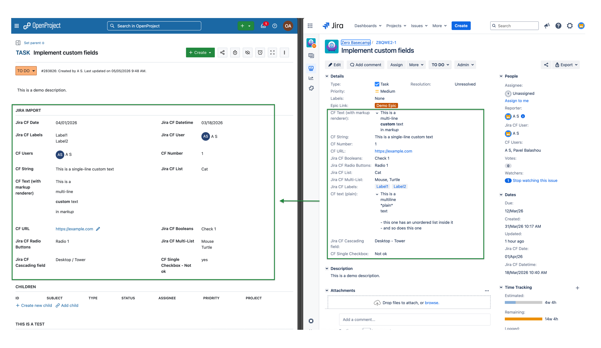
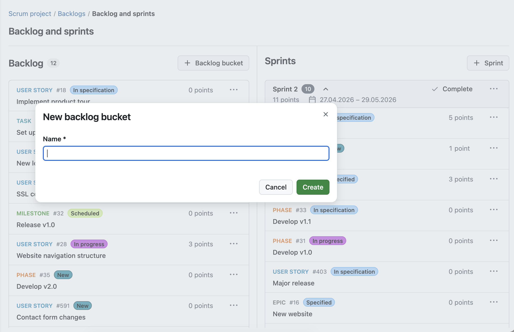
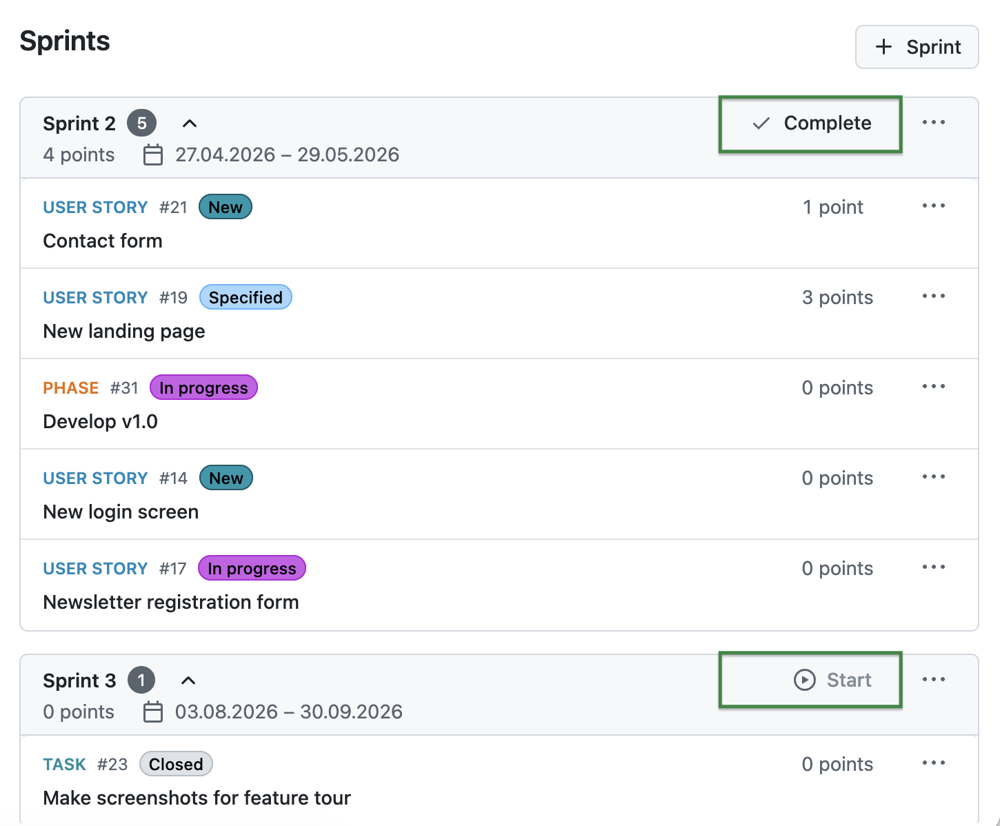
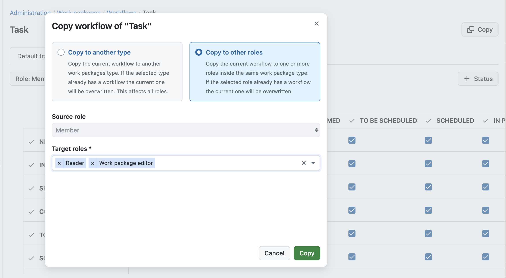
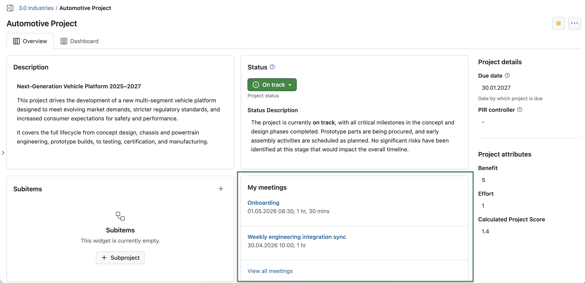

 # OpenProject 17.4.0

 Release date: 2026-04-23

 We released [OpenProject 17.4.0](https://community.openproject.org/versions/2267). The release contains several bug fixes and we recommend updating to the newest version. In these Release Notes, we will give an overview of important feature changes. At the end, you will find a complete list of all changes and bug fixes.

<!-- BEGIN CVE AUTOMATED SECTION -->

<!-- END CVE AUTOMATED SECTION -->

## Important feature changes

Take a look at our release video showing the most important features introduced in OpenProject 17.4.0:

### Support basic custom fields migration from Jira

With the release of OpenProject 17.4, the Jira Migrator is now available without a feature flag and can be used directly. While the feature is not yet fully complete and still in Beta, it is ready to be tested – preferably first in a non productive environment. We encourage users to try the Jira Migrator and share their feedback. 

> [!NOTE]
> If you would like to share anonymized data from your Jira Migrator usage to support our development team, please [reach out to us](https://www.openproject.org/contact/). We are happy to sign an NDA to ensure confidentiality.

It is now possible to migrate basic custom fields from Jira to OpenProject. This includes custom fields that have a corresponding field type in OpenProject, such as text, numbers, dates, and select lists. This helps transfer existing data and maintain a consistent work package structure after migration.

We will continue to expand support for additional custom field types in future releases to enable even more complete migrations.

### Backlog buckets in "Backlog and sprints" view

Backlog buckets are now available. They allow you to group work packages within the backlog into clearly structured lists. Each bucket can be named individually and helps organize large backlogs into manageable sections, making it easier to prioritize work packages and focus on specific groups.

Work packages can be moved between buckets, sorted within each bucket, and adjusted as priorities change.

### Backlog card draggable + one-click for side panel

Backlog cards are now fully draggable, making it easier to move work packages during backlog refinement and sprint planning. At the same time, you can still open a work package in the side panel with a single click to quickly view and edit details without losing context.

### Sprint Start and Complete buttons in the sprint header

You can now start and complete sprints directly from the sprint header by clicking the respective buttons. This makes these actions easier to access and provides a clearer overview of the sprint status.

> [!NOTE]
> Please note that these buttons represent actions you can take, such as starting or completing a sprint, and do not indicate the current sprint status.

### Workflow UX improvement: Apply workflow setting from one role to another role

You can now copy workflow settings from one role to other roles, using a dedicated dialog. This makes it easier to apply consistent workflows across roles and reduces manual configuration effort.

### New widget for upcoming meetings on Project Overview and Home page

A new "My meetings" widget shows your upcoming meetings directly on the Home and Project Overview pages. It displays the most relevant information at a glance, helping you stay on top of your schedule and quickly access upcoming meetings.

Please note that with this update, the Users widget on the Home page (showing newest registered users in the instance) has been removed and replaced by the new "My meetings" widget.

### Demo and trial projects: Updated default modules

The default modules enabled in demo and trial projects have been updated. Budgets and Calendars are now enabled by default in the Demo project. Meetings are now enabled by default in the Scrum project. Please note that for some of the newly enabled modules, example content may not yet be available.

## Important technical updates

### Expose project-based semantic work package identifier on the API

Project-based work package identifiers are now exposed via the API. With upcoming support for semantic identifiers such as `#ABC-123`, a new field `displayId` is available in the API. This field returns the correct identifier format, depending on how the instance is configured.

If you are building or maintaining an application using the OpenProject API V3, we recommend using `displayId` instead of `id` when displaying work package identifiers.

The `id` field will continue to return the internal database ID and should still be used for API requests such as filtering.

For more information on project-based work package identifiers in OpenProject, see the [Epic currently being developed by our team](https://community.openproject.org/wp/41855)

### Meetings and recurring meetings APIv3 endpoints

New APIv3 endpoints are now available for meetings and recurring meetings. These include support for managing agenda items, sections, and occurrences, enabling full access to meeting data via the API.

### Allow webhook secrets for GitHub and GitLab integrations

You can now configure webhook secrets for GitHub and GitLab integrations. This improves the security of incoming webhook requests.

<!--more-->

## Bug fixes and changes

<!-- Warning: Anything within the below lines will be automatically removed by the release script -->
<!-- BEGIN AUTOMATED SECTION -->

- Feature: Add meetings and recurring meetings APIv3 endpoints \[[#32280](https://community.openproject.org/wp/32280)\]
- Feature: Combine and redesign &quot;Notification settings&quot; and &quot;Email reminders&quot; pages in MyAccount area \[[#65404](https://community.openproject.org/wp/65404)\]
- Feature: Replace work package delete modal with a danger dialog \[[#67506](https://community.openproject.org/wp/67506)\]
- Feature: Workflow UX improvement: Apply workflow setting from one role to another role \[[#72383](https://community.openproject.org/wp/72383)\]
- Feature: Better UX for setting project identifiers during creation or update \[[#72855](https://community.openproject.org/wp/72855)\]
- Feature: Better UX for setting project identifiers during project copy \[[#72856](https://community.openproject.org/wp/72856)\]
- Feature: Backlog buckets in &quot;Backlog and sprints&quot; view \[[#73081](https://community.openproject.org/wp/73081)\]
- Feature: Sprint column, sort and group for work packages table \[[#73104](https://community.openproject.org/wp/73104)\]
- Feature: Support basic custom fields migration \[[#73147](https://community.openproject.org/wp/73147)\]
- Feature: Replace danger zones in authentication module with danger dialogs \[[#73355](https://community.openproject.org/wp/73355)\]
- Feature: Allow webhook secrets for GitHub and Gitlab integrations \[[#73387](https://community.openproject.org/wp/73387)\]
- Feature: Have a sprint start/complete button in the sprint header \[[#73402](https://community.openproject.org/wp/73402)\]
- Feature: Make password requirements settings more consistent and understandable \[[#73461](https://community.openproject.org/wp/73461)\]
- Feature: Backlog card draggable + one-click for side panel \[[#73473](https://community.openproject.org/wp/73473)\]
- Feature: Add menu separator before &quot;Log out&quot; in user menu \[[#73528](https://community.openproject.org/wp/73528)\]
- Feature: Show section selector in &quot;Move to next meeting&quot; and &quot;Duplicate in next meeting&quot; dialogs \[[#73559](https://community.openproject.org/wp/73559)\]
- Feature: Limited move options for work packages in sprint \[[#73563](https://community.openproject.org/wp/73563)\]
- Feature: Add widget for upcoming meetings on project overview and home page and remove users widget \[[#73684](https://community.openproject.org/wp/73684)\]
- Feature: Expose project-based semantic work package identifier on the API \[[#73735](https://community.openproject.org/wp/73735)\]
- Feature: Add canonical URL meta tags to Project and WP pages for crawler optimization \[[#73926](https://community.openproject.org/wp/73926)\]
- Feature: Multi-substring search in project/workspace selector \[[#74199](https://community.openproject.org/wp/74199)\]
- Bugfix: Toast not visible on mobile when page is scrolled down \[[#45673](https://community.openproject.org/wp/45673)\]
- Bugfix: Default configuration for Work packages assigned to me on My Page is wrong \[[#57633](https://community.openproject.org/wp/57633)\]
- Bugfix: List is scrollable even if there is only 1 item \[[#59732](https://community.openproject.org/wp/59732)\]
- Bugfix: Project selector does not read selected items in screenreader \[[#61405](https://community.openproject.org/wp/61405)\]
- Bugfix: Blank page and error 404 when calendar, board, team planner, role is deleted \[[#68573](https://community.openproject.org/wp/68573)\]
- Bugfix: User is redirected to Attribute help text admin after editing a help text from Project overview page \[[#69142](https://community.openproject.org/wp/69142)\]
- Bugfix: Clicking work package tabs triggers page reload and flickering \[[#69210](https://community.openproject.org/wp/69210)\]
- Bugfix: Infinite SAML Seeding Loop Causing Disk Space Exhaustion \[[#69339](https://community.openproject.org/wp/69339)\]
- Bugfix: Days label is cut off \[[#69504](https://community.openproject.org/wp/69504)\]
- Bugfix: Work package search input of other user visible \[[#69706](https://community.openproject.org/wp/69706)\]
- Bugfix: Deleted Nextcloud storage stays selected in the PIR template \[[#69767](https://community.openproject.org/wp/69767)\]
- Bugfix: Fix accessibility errors found by ERB Lint \[[#70166](https://community.openproject.org/wp/70166)\]
- Bugfix: Deep linking to a meeting outcome does not highlight it \[[#70319](https://community.openproject.org/wp/70319)\]
- Bugfix: Helm-Chart: Allow user to provide service specific annotations \[[#71055](https://community.openproject.org/wp/71055)\]
- Bugfix: External link capture not working in documents \[[#71111](https://community.openproject.org/wp/71111)\]
- Bugfix: Backup: include attachments checkbox cannot be checked \[[#71237](https://community.openproject.org/wp/71237)\]
- Bugfix: Connection error on successive navigation to and from a document \[[#71901](https://community.openproject.org/wp/71901)\]
- Bugfix: Impossible to search for archived projects, page reverts to active projects list on its own \[[#71971](https://community.openproject.org/wp/71971)\]
- Bugfix: User cannot create a WP with auto generated subject \[[#72207](https://community.openproject.org/wp/72207)\]
- Bugfix: Backlogs: Not able to navigate through the more menu with arrows \[[#72460](https://community.openproject.org/wp/72460)\]
- Bugfix: Click position is lost when activating an inline edit field \[[#72837](https://community.openproject.org/wp/72837)\]
- Bugfix: Incorrect confirmation message when deleting a OAuth token \[[#72958](https://community.openproject.org/wp/72958)\]
- Bugfix: Page loads twice after sprint creation \[[#73316](https://community.openproject.org/wp/73316)\]
- Bugfix: SCIM User API returns duplicate records \[[#73431](https://community.openproject.org/wp/73431)\]
- Bugfix: POST/PATCH/DELETE requests to APIv3 return unauthorized \[[#73499](https://community.openproject.org/wp/73499)\]
- Bugfix: FieldsetGroups are missing descriptions \[[#73501](https://community.openproject.org/wp/73501)\]
- Bugfix: Copy &amp; Paste Loses Formatting in Documents \[[#73669](https://community.openproject.org/wp/73669)\]
- Bugfix: Not possible to follow link custom field from work package list view \[[#73673](https://community.openproject.org/wp/73673)\]
- Bugfix: Make sharing options more understandable  \[[#73706](https://community.openproject.org/wp/73706)\]
- Bugfix: Doubled scrollbar on a Board \[[#73714](https://community.openproject.org/wp/73714)\]
- Bugfix: Pressing &quot;Load more&quot; in the backlog, then drag n dropping a work package will restore the original backlog list \[[#73731](https://community.openproject.org/wp/73731)\]
- Bugfix: &quot;Start sprint&quot; button remains active after browser back button \[[#73749](https://community.openproject.org/wp/73749)\]
- Bugfix: Work packages can be assigned to closed sprints \[[#73750](https://community.openproject.org/wp/73750)\]
- Bugfix: Sprints column scroll bar overlaps content \[[#73831](https://community.openproject.org/wp/73831)\]
- Bugfix: Projects filter does not work with project list export \[[#73841](https://community.openproject.org/wp/73841)\]
- Bugfix: 401 error does not help user during jira import. \[[#73844](https://community.openproject.org/wp/73844)\]
- Bugfix: Skip closed meetings when using &quot;Move to next&quot;/&quot;Duplicate in next&quot; for an agenda item \[[#73900](https://community.openproject.org/wp/73900)\]
- Bugfix: Onboarding tour breaks at Team planner if EE is missing \[[#73910](https://community.openproject.org/wp/73910)\]
- Bugfix: External links cause two blank tabs/windows \[[#73914](https://community.openproject.org/wp/73914)\]
- Bugfix: Browser title is truncated after 70 characters \[[#73986](https://community.openproject.org/wp/73986)\]
- Bugfix: Wrong timezone for timestamp of work package pdf export \[[#74117](https://community.openproject.org/wp/74117)\]
- Bugfix: Trial instance seeded recurring meeting template is in draft mode \[[#74150](https://community.openproject.org/wp/74150)\]
- Bugfix: Automatically converting project identifiers should not lead to usage of reserved keywords \[[#74161](https://community.openproject.org/wp/74161)\]
- Bugfix: Sprint Filter in work packages only loads 100 Sprints \[[#74166](https://community.openproject.org/wp/74166)\]
- Bugfix: Moving work packages after switching to semantic and back should not lead to errors \[[#74192](https://community.openproject.org/wp/74192)\]
- Bugfix: Backlog card drag preview has incorrect padding \[[#74195](https://community.openproject.org/wp/74195)\]
- Bugfix: Having &quot;Manage sprint items&quot; without &quot;Edit work packages&quot; fails to move work packages in backlogs \[[#74201](https://community.openproject.org/wp/74201)\]
- Bugfix: Users can execute custom actions despite conditions not applying \[[#74294](https://community.openproject.org/wp/74294)\]
- Bugfix: Cancel occurence action item is called &#39;Delete&#39; on My Meetings page \[[#74303](https://community.openproject.org/wp/74303)\]
- Bugfix: User cannot restore a cancelled occurrence if series has a deleted WP on the agenda \[[#74304](https://community.openproject.org/wp/74304)\]
- Feature: UX improvements for workflow configuration - quick wins \[[#71530](https://community.openproject.org/wp/71530)\]
- Feature: Provide project templates within new OpenProject instances \[[#72778](https://community.openproject.org/wp/72778)\]

<!-- END AUTOMATED SECTION -->
<!-- Warning: Anything above this line will be automatically removed by the release script -->

## Contributions

A very special thank you goes to Helmholtz-Zentrum Berlin, City of Cologne, Deutsche Bahn and ZenDiS for sponsoring released or upcoming features. Your support, alongside the efforts of our amazing Community, helps drive these innovations. Also a big thanks to our Community members for reporting bugs and helping us identify and provide fixes. Special thanks for reporting and finding bugs go to Andreas H., Madhu Reddy, and Anna Mund.

We also want to thank Community contributor [K. Uihlein](https://github.com/kuihlein) for updating our documentation of the OpenProject GitLab Integration. This is much appreciated.

Last but not least, we are very grateful for our very engaged translation contributors on Crowdin, who translated quite a few OpenProject strings! This release we would like to particularly thank the following users:

- [Samo](https://crowdin.com/profile/samoe), for a great number of translations into Turkish.
- [NCAA](https://crowdin.com/profile/ncaa), for a great number of translations into Danish.
- [Christophe Gesché](https://crowdin.com/profile/Moosh-be), for a great number of translations into French.

Would you like to help out with translations yourself? Then take a look at our [translation guide](../../contributions-guide/translate-openproject/) and find out exactly how you can contribute. It is very much appreciated!

