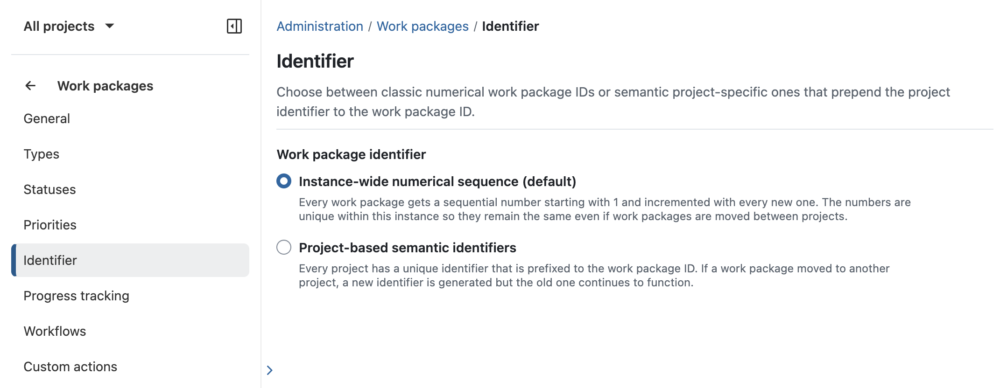
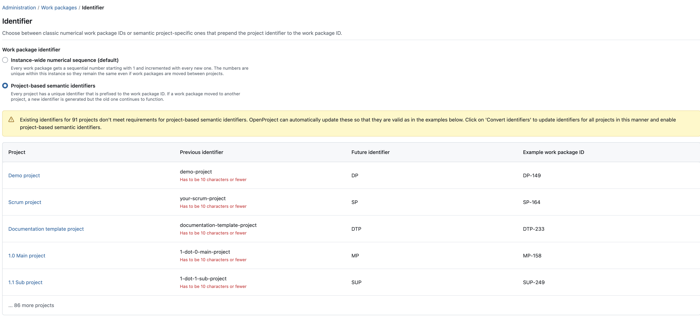
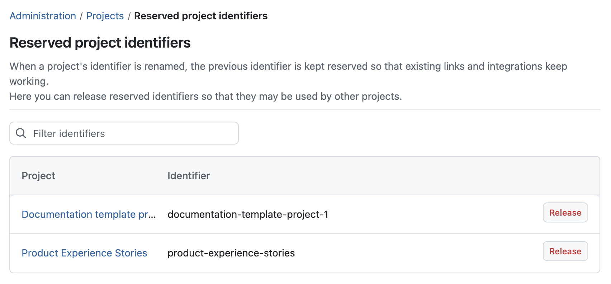
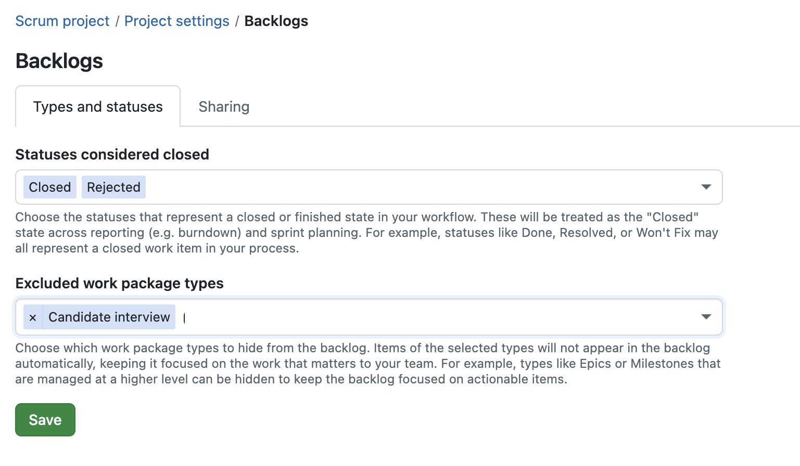
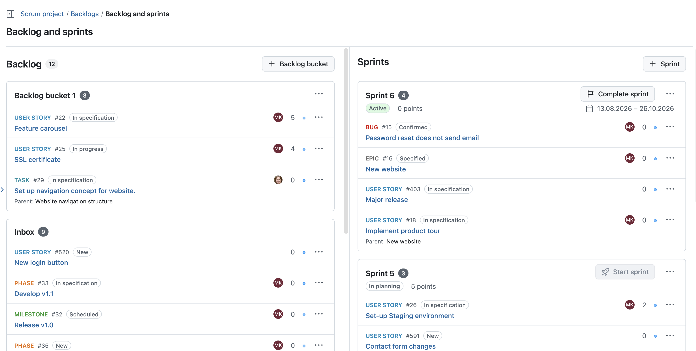
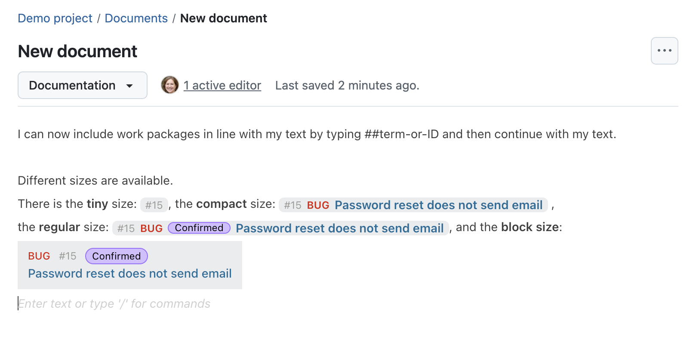
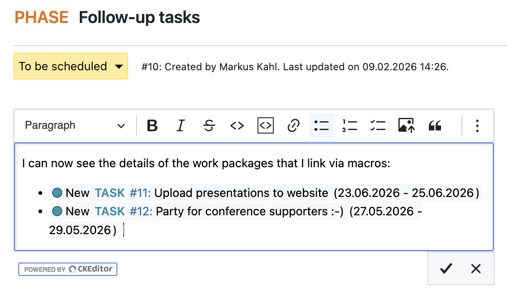
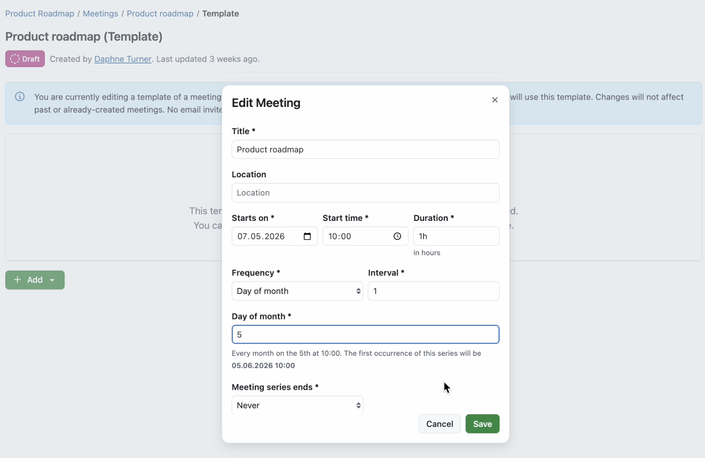
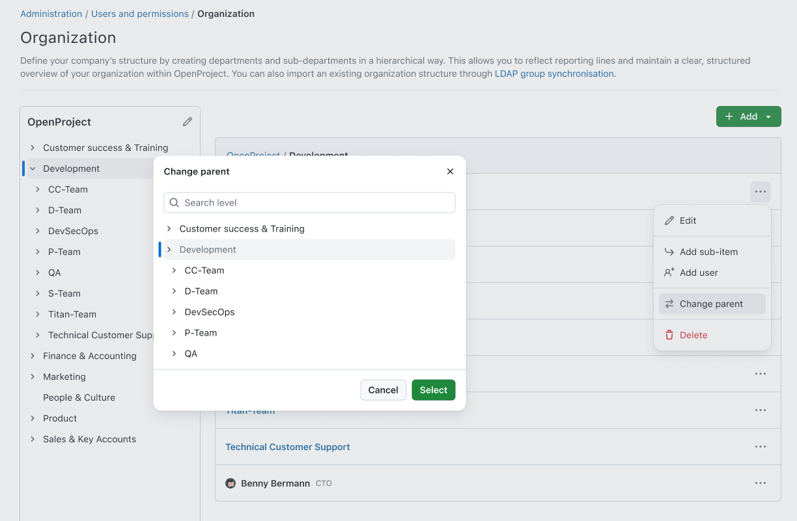
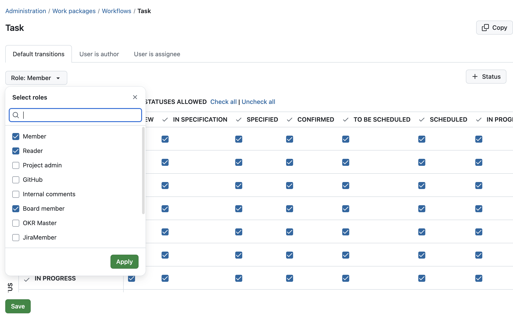

# OpenProject 17.5.0

Release date: 2026-06-10

We released [OpenProject 17.5.0](https://community.openproject.org/versions/2293). The release contains several bug fixes and we recommend updating to the newest version. In these Release Notes, we will give an overview of important feature changes. At the end, you will find a complete list of all changes and bug fixes.

## Important feature changes

### Project-based work package identifiers for clearer references and Jira migrations

OpenProject 17.5 introduces **optional project-based work package identifiers in Beta**. Administrators can choose between the **default numerical sequence** and **project-based IDs** for the entire OpenProject instance. 

> [!NOTE]
> The setting can be reverted later. Existing numerical IDs remain valid and continue to resolve to the same work packages throughout the application, including existing URLs, bookmarks, and references.

Project-based work package identifiers are especially useful for organizations migrating from Jira, as [existing Jira issue identifiers can now be preserved in OpenProject](#jira-migrator-support-for-jira-identifiers-due-dates-and-more). Beyond migrations, project-based IDs provide **shorter sequence numbers and clearer project context**, making it easier to recognize, reference, and share work packages across projects, emails, documents, chats, and integrations.

#### Switching between numerical and project-based IDs

Switching to project-based work package identifiers is an instance-wide administrative change that affects how work packages are referenced throughout OpenProject. Administrators should communicate the change to users before enabling it in production environments, as work package identifiers, URLs, and references will use the new format. OpenProject validates existing project identifiers and can automatically generate shorter, compatible identifiers where necessary.

> [!NOTE]
> Historical references remain functional when project identifiers change.

#### Support across URLs, searches, exports, and integrations

Even in Beta, project-based work package identifiers are supported across important areas of OpenProject, including URLs, searches, filters, exports, email notifications, APIs, and work package references in Documents and text editors.

Existing integrations such as GitHub and GitLab already support the new identifier format.

> [!NOTE]
> Project-based work package identifiers are still in Beta. While the feature is supported across important areas of OpenProject, **some areas may continue to display numerical identifiers until support for project-based identifiers is fully implemented**. In these cases, numerical identifiers remain fully functional and continue to resolve to the same work packages.

#### Releasing unused numerical identifiers

When switching from the default numerical sequence to project-based work package identifiers, previously reserved numerical identifiers can be released again if they are no longer needed. This helps administrators avoid unnecessary gaps and keep numerical identifiers available if they later revert to the default sequence.

> [!NOTE]
> Releasing an identifier cannot be undone. External links and integrations using it will stop resolving, and the name becomes available for any new project to claim.

### Jira Migrator support for Jira identifiers, due dates, and more

OpenProject 17.5 further improves the Jira Migrator that was [introduced in Beta with OpenProject 17.4](../17-4-0/#support-basic-custom-fields-migration-from-jira). Jira issue identifiers can now be preserved during migration when using [project-based work package identifiers](#project-based-work-package-identifiers-for-clearer-references-and-jira-migrations).

This helps organizations maintain existing references, naming conventions, and established workflows when transitioning from Jira to OpenProject. 

In addition to Jira identifiers, OpenProject 17.5 also adds support for migrating due dates, estimated hours, and remaining hours. [Read more about the Jira Migrator in our documentation](../../installation-and-operations/jira-migration/).

### Option to exclude work package types from Backlogs 

OpenProject 17.5 introduces more flexible backlog configuration by allowing project administrators to exclude specific work package types from Backlogs. This helps teams keep sprint planning and backlog refinement focused on actionable work items.

For example, higher-level planning items such as Epics or Milestones can now be excluded from backlog views while still remaining available elsewhere in the project. The configuration is available in the Backlogs project settings and can be customized per project.

OpenProject 17.5 also extends project-specific "done" status configuration to the Backlogs module. Work packages with statuses configured as done are now handled consistently across backlog views and sprint completion. For example, teams can treat development work as complete once testing is finished, even if documentation tasks remain open, allowing sprints to be completed without carrying over already finished development work.

[Read more about the OpenProject Backlogs module](../../system-admin-guide/backlogs/).

### Redesigned sprint views and work package cards

OpenProject 17.5 redesigns sprint headers, backlog containers, and work package cards in the Backlogs module to improve readability and usability during agile planning.

Sprint views now provide clearer visual hierarchy, more consistent actions, and improved visibility of important information such as parent work packages, story points, priorities, assignees, and sprint status. Work package cards have also been redesigned to make important work item details easier to scan during sprint planning and backlog refinement.

### Allow inline work package links within text paragraphs in the Documents module

OpenProject 17.5 makes it easier to reference work packages naturally within Documents, which use the BlockNote editor. Work package links can now be inserted directly inside text paragraphs instead of always appearing as separate blocks.

This allows teams to create more readable and structured documentation while still linking directly to relevant work packages. Inline work package links behave like regular inline elements and continue to open the referenced work package in a new tab.

[Read more about OpenProject's Documents module](../../user-guide/documents/).

### Expanded work package mentions in CKEditor

OpenProject 17.5 also improves work package references in CKEditor-based text fields such as work package descriptions, agenda items in meetings, and wiki pages.

Work package mentions using the `##` and `###` notation now expand directly inside the editor. Instead of displaying only the identifier, OpenProject now shows additional context such as the work package type, status, and subject **while still editing**.

This makes referenced work packages easier to recognize without leaving the editor.

### Monthly scheduling options for meeting series

OpenProject 17.5 adds more flexible scheduling options for recurring meetings. Meeting series can now repeat monthly based on patterns such as the first Monday or last Friday of a month.

This makes it easier to schedule recurring coordination meetings, steering committees, retrospectives, or review meetings that follow common organizational schedules.

### Debounce meeting emails to reduce email noise

OpenProject 17.5 improves meeting-related email behavior by reducing unnecessary update emails while meetings are actively edited.

Instead of sending an email for every small change, OpenProject now consolidates multiple meeting updates into fewer emails. Emails are only sent after no further changes have been made for one minute. This helps reduce inbox noise during collaborative meeting preparation and editing.

[Read more about OpenProject's Meetings module](../../user-guide/meetings/).

### Nested groups for organizational structures and inherited permissions

OpenProject 17.5 introduces nested groups to better represent organizational structures such as departments, teams, or business units.

Groups can now contain subgroups, allowing administrators to model hierarchies directly in OpenProject. Permissions and memberships can also be inherited from parent groups, making it easier to manage access rights consistently across larger organizations.

### Allow multi-selection of roles in workflow

OpenProject 17.5 improves workflow administration by allowing administrators to select and configure multiple roles at once in the workflow configuration. This makes it easier and faster to manage workflows across complex role setups and reduces repetitive configuration work for administrators.

## Important updates and breaking changes

### Sprint sharing moved to the Corporate plan

With OpenProject 17.5, sprint sharing across projects is now part of the Corporate plan. Existing sprint sharing configurations remain available after updating, but creating, modifying, or reactivating shared sprint configurations now requires the Corporate plan.

Sprint sharing was introduced to support scaled agile planning scenarios across multiple projects and teams. Moving the feature to the Corporate plan allows OpenProject to continue investing in advanced cross-project planning capabilities for larger organizational setups.

> [!NOTE]
> Existing sprint sharing configurations remain available after updating to OpenProject 17.5, including sprint sharing that was previously handled through shared versions in older OpenProject versions. Existing configurations continue to be migrated during upgrades. However, once sprint sharing is disabled, reactivating it requires the Corporate plan.

<!-- Remove this section if empty, add to it in pull requests linking to tickets and provide information -->

<!-- BEGIN SECURITY FIXES AUTOMATED SECTION -->

<!-- END SECURITY FIXES AUTOMATED SECTION -->
<!--more-->

## Bug fixes and changes

<!-- Warning: Anything within the below lines will be automatically removed by the release script -->
<!-- BEGIN AUTOMATED SECTION -->

- Feature: Track working hours and availabilities for each user in the system \[[#34911](https://community.openproject.org/wp/34911)\]
- Feature: Meeting series: Add monthly scheduling options \[[#61522](https://community.openproject.org/wp/61522)\]
- Feature: Debounce emails for meetings \[[#66645](https://community.openproject.org/wp/66645)\]
- Feature: Primerize Types form configuration page \[[#69524](https://community.openproject.org/wp/69524)\]
- Feature: Sprint goals \[[#71059](https://community.openproject.org/wp/71059)\]
- Feature: Exclude certain work package types from automated backlog (per project) \[[#71305](https://community.openproject.org/wp/71305)\]
- Feature: Administration setting for project-based work package identifiers \[[#71633](https://community.openproject.org/wp/71633)\]
- Feature: Background job for converting project-based semantic work package identifiers \[[#71645](https://community.openproject.org/wp/71645)\]
- Feature: Allow nested Groups to show a company org chart \[[#72224](https://community.openproject.org/wp/72224)\]
- Feature: Workflows UX improvement: Allow multi-selection of roles in workflow \[[#72242](https://community.openproject.org/wp/72242)\]
- Feature: Jira Migrator imports project-based semantic work item identifiers \[[#72427](https://community.openproject.org/wp/72427)\]
- Feature: Allow inline Work Package links within text paragraphs \[[#72817](https://community.openproject.org/wp/72817)\]
- Feature: Container header (Sprint/Bucket/Inbox) restyling \[[#72945](https://community.openproject.org/wp/72945)\]
- Feature: Restyled work package card in &quot;Backlogs and sprints&quot; view \[[#73089](https://community.openproject.org/wp/73089)\]
- Feature: Adapt creation of projects through the API for semantic identifiers \[[#73175](https://community.openproject.org/wp/73175)\]
- Feature: Define database model for project-based work package identifiers \[[#73315](https://community.openproject.org/wp/73315)\]
- Feature: Create work package links through # notation in documents / BlockNote \[[#73664](https://community.openproject.org/wp/73664)\]
- Feature: Adapt work package show view for project-based semantic work package identifiers \[[#73716](https://community.openproject.org/wp/73716)\]
- Feature: Adapt work package lists for project-based semantic work package identifiers \[[#73717](https://community.openproject.org/wp/73717)\]
- Feature: Adapt routes for project-based semantic work package identifiers \[[#73756](https://community.openproject.org/wp/73756)\]
- Feature: Search work packages by their identifier \[[#73761](https://community.openproject.org/wp/73761)\]
- Feature: Adapt email notifications for project-based work package identifiers \[[#73827](https://community.openproject.org/wp/73827)\]
- Feature: Create a WorkPackageCard component  \[[#73968](https://community.openproject.org/wp/73968)\]
- Feature: Extend the SubHeader component to support quick filter components \[[#73972](https://community.openproject.org/wp/73972)\]
- Feature: Adapt work package link blocks in BlockNote for project-based semantic work package identifiers \[[#74115](https://community.openproject.org/wp/74115)\]
- Feature: Adapt work package links in CKEditor for project-based semantic work package identifiers \[[#74116](https://community.openproject.org/wp/74116)\]
- Feature: Bring sprint sharing (SAFe) to corporate plan \[[#74147](https://community.openproject.org/wp/74147)\]
- Feature: Adapt GitHub and GitLab modules for semantic identifiers \[[#74364](https://community.openproject.org/wp/74364)\]
- Feature: Adapt work package PDF exports for semantic identifiers \[[#74366](https://community.openproject.org/wp/74366)\]
- Feature: Expand work package mentions (##, ###) macros inside CKEditor \[[#74641](https://community.openproject.org/wp/74641)\]
- Feature: Allow Custom Fields on UserQuery \[[#74758](https://community.openproject.org/wp/74758)\]
- Feature: Primerize users administration to allow all filters \[[#74763](https://community.openproject.org/wp/74763)\]
- Feature: Jira Migrator supports due date, estimated hours and remaining hours. \[[#74807](https://community.openproject.org/wp/74807)\]
- Feature: Add better progress indicator to identifier conversion page \[[#74903](https://community.openproject.org/wp/74903)\]
- Feature: Put &quot;Beta&quot; label on the setting for enabling semantic identifiers \[[#74975](https://community.openproject.org/wp/74975)\]
- Feature: Admin panel for releasing old classic project aliases \[[#74992](https://community.openproject.org/wp/74992)\]
- Bugfix: WP table configuration: overflow due to the very long CF label \[[#46005](https://community.openproject.org/wp/46005)\]
- Bugfix: Tooltip on Team planner not entirely visible  \[[#48223](https://community.openproject.org/wp/48223)\]
- Bugfix: Work package configuration dialog&#39;s highlighting tab has no space between radio buttons and labels \[[#64359](https://community.openproject.org/wp/64359)\]
- Bugfix: Misalignment of fields in Work estimates and progress when language=DE \[[#65738](https://community.openproject.org/wp/65738)\]
- Bugfix: Wrong calendar week in My time tracking \[[#68272](https://community.openproject.org/wp/68272)\]
- Bugfix: Asterisks on Project attributes displaced \[[#68633](https://community.openproject.org/wp/68633)\]
- Bugfix: Clicking work package tabs triggers page reload and flickering \[[#69210](https://community.openproject.org/wp/69210)\]
- Bugfix: Infinite SAML Seeding Loop Causing Disk Space Exhaustion \[[#69339](https://community.openproject.org/wp/69339)\]
- Bugfix: Mobile - Include project on WP list is missing spacing \[[#69451](https://community.openproject.org/wp/69451)\]
- Bugfix: Roles selectable as &quot;Role given to a non-admin user who creates a project&quot; that lack essential permissions \[[#69496](https://community.openproject.org/wp/69496)\]
- Bugfix: Fix accessibility errors found by ERB Lint \[[#70166](https://community.openproject.org/wp/70166)\]
- Bugfix: BlockNote: Drag and drop of table blocks broken \[[#71900](https://community.openproject.org/wp/71900)\]
- Bugfix: Connection error on successive navigation to and from a document \[[#71901](https://community.openproject.org/wp/71901)\]
- Bugfix: Impossible to search for archived projects, page reverts to active projects list on its own \[[#71971](https://community.openproject.org/wp/71971)\]
- Bugfix: Click position is lost when activating an inline edit field \[[#72837](https://community.openproject.org/wp/72837)\]
- Bugfix: Incorrect confirmation message when deleting a OAuth token \[[#72958](https://community.openproject.org/wp/72958)\]
- Bugfix: Role not created properly when unselecting all permissions \[[#73494](https://community.openproject.org/wp/73494)\]
- Bugfix: POST/PATCH/DELETE requests to APIv3 return unauthorized \[[#73499](https://community.openproject.org/wp/73499)\]
- Bugfix: Copy &amp; Paste Loses Formatting in Documents \[[#73669](https://community.openproject.org/wp/73669)\]
- Bugfix: Not possible to follow link custom field from work package list view \[[#73673](https://community.openproject.org/wp/73673)\]
- Bugfix: Doubled scrollbar on a Board \[[#73714](https://community.openproject.org/wp/73714)\]
- Bugfix: Jira migrator: &quot;An internal error has occurred&quot; \[[#73736](https://community.openproject.org/wp/73736)\]
- Bugfix: Nextcloud integration shows &quot;No connection to Nextcloud&quot; for folders that have &quot;&amp;&quot; in the name \[[#73855](https://community.openproject.org/wp/73855)\]
- Bugfix: Lists of work packages should sort correctly by semantic id \[[#74156](https://community.openproject.org/wp/74156)\]
- Bugfix: Automatically converting project identifiers should not lead to usage of reserved keywords \[[#74161](https://community.openproject.org/wp/74161)\]
- Bugfix: Moving work packages after switching to semantic and back should not lead to errors \[[#74192](https://community.openproject.org/wp/74192)\]
- Bugfix: Cancel occurence action item is called &#39;Delete&#39; on My Meetings page and Meeting index page &#39;Past&#39; tab \[[#74303](https://community.openproject.org/wp/74303)\]
- Bugfix: User cannot restore a cancelled occurrence if series has a deleted WP on the agenda \[[#74304](https://community.openproject.org/wp/74304)\]
- Bugfix: Show default section more clearly when using the section selector for a meeting with no sections \[[#74321](https://community.openproject.org/wp/74321)\]
- Bugfix: Inserting &quot;#&quot; inside text removes content after cursor \[[#74325](https://community.openproject.org/wp/74325)\]
- Bugfix: Сards converting to hash links on copy-paste and DnD \[[#74327](https://community.openproject.org/wp/74327)\]
- Bugfix: Type colors are not applied correctly at the beginning \[[#74330](https://community.openproject.org/wp/74330)\]
- Bugfix: Impossible to open work packages list from the sidebar after visiting team planner \[[#74331](https://community.openproject.org/wp/74331)\]
- Bugfix: Inconsistent contrast for type colors when switching themes \[[#74332](https://community.openproject.org/wp/74332)\]
- Bugfix: Dropdown option order changes depending on selected item \[[#74333](https://community.openproject.org/wp/74333)\]
- Bugfix: Inconsistent inline chip heights in text flow \[[#74341](https://community.openproject.org/wp/74341)\]
- Bugfix: User can only delete a past occurrence \[[#74363](https://community.openproject.org/wp/74363)\]
- Bugfix: Inline work package chip has no visual highlight when selected \[[#74385](https://community.openproject.org/wp/74385)\]
- Bugfix: Arrow-down selection for link work package block prevented by tooltip \[[#74393](https://community.openproject.org/wp/74393)\]
- Bugfix: Wrong cursor placement after inserting links to Work Packages in BlockNote \[[#74397](https://community.openproject.org/wp/74397)\]
- Bugfix: Copy/paste of a single block(chip) does not work \[[#74538](https://community.openproject.org/wp/74538)\]
- Bugfix: Roles select panel button should be &quot;Apply&quot; \[[#74560](https://community.openproject.org/wp/74560)\]
- Bugfix: Use memory more efficiently \[[#74579](https://community.openproject.org/wp/74579)\]
- Bugfix: After migration job is complete save button is visible and clicking it triggers a 404 \[[#74623](https://community.openproject.org/wp/74623)\]
- Bugfix: Improve size menu and remove L+XL blocks \[[#74651](https://community.openproject.org/wp/74651)\]
- Bugfix: Admin page for semantic IDs: grammatical issue \[[#74681](https://community.openproject.org/wp/74681)\]
- Bugfix: Semantic ids: semantic identifier mismatch for new-1 \[[#74692](https://community.openproject.org/wp/74692)\]
- Bugfix: Black font in dark mode on wp description \[[#74697](https://community.openproject.org/wp/74697)\]
- Bugfix: Admin page for semantic IDs: long ids cause overflow \[[#74730](https://community.openproject.org/wp/74730)\]
- Bugfix: Add upcoming/past filter to meetings index page filters \[[#74743](https://community.openproject.org/wp/74743)\]
- Bugfix: Numeric ID still in the URL of the link opened from the email notification \[[#74760](https://community.openproject.org/wp/74760)\]
- Bugfix: Numeric ID in the email notification after adding watchers \[[#74762](https://community.openproject.org/wp/74762)\]
- Bugfix: Closed work packages are still considered to be part of the bucket. \[[#74773](https://community.openproject.org/wp/74773)\]
- Bugfix: Redirect to /login is missing the URL query params \[[#74778](https://community.openproject.org/wp/74778)\]
- Bugfix: Inconsistent handling of &quot;Definition of Done&quot; \[[#74796](https://community.openproject.org/wp/74796)\]
- Bugfix: Spanish (ES) localization mixes formal and informal second-person forms \[[#74817](https://community.openproject.org/wp/74817)\]
- Bugfix: Numeric ID copied instead of semantic ID in &quot;Copy work package ID&quot; on Backlogs page \[[#74826](https://community.openproject.org/wp/74826)\]
- Bugfix: Search with ID doesn&#39;t work in work package table configuration if work package belongs to another project \[[#74830](https://community.openproject.org/wp/74830)\]
- Bugfix: Quick filters don&#39;t react good to medium screen sizes \[[#74832](https://community.openproject.org/wp/74832)\]
- Bugfix: Numeric ID in URL of the wp link when opened from search results \[[#74834](https://community.openproject.org/wp/74834)\]
- Bugfix: Semantic ID is not shown in search results in different places \[[#74844](https://community.openproject.org/wp/74844)\]
- Bugfix: Missing space between user avatar and name \[[#74853](https://community.openproject.org/wp/74853)\]
- Bugfix: Numeric ID instead of semantic one in the spent time calendar  \[[#74900](https://community.openproject.org/wp/74900)\]
- Bugfix: Numeric ID instead of semantic one on the Activity page \[[#74912](https://community.openproject.org/wp/74912)\]
- Bugfix: Numeric ID instead of semantic one in Roadmap \[[#74913](https://community.openproject.org/wp/74913)\]
- Bugfix: Numeric ID instead of semantic one in bulk edit work packages \[[#74926](https://community.openproject.org/wp/74926)\]
- Bugfix: Unable to change a parent on bulk edit of work packages with semantic ID  \[[#74927](https://community.openproject.org/wp/74927)\]
- Bugfix: Numeric ID instead of semantic one on the error message on bulk edit \[[#74928](https://community.openproject.org/wp/74928)\]
- Bugfix: Show type of field beside the attribute \[[#74931](https://community.openproject.org/wp/74931)\]
- Bugfix: Numeric ID instead of semantic one on the table of related work packages \[[#74942](https://community.openproject.org/wp/74942)\]
- Bugfix: Numeric ID instead of semantic one on the Time and costs report \[[#74943](https://community.openproject.org/wp/74943)\]
- Bugfix: Numeric ID instead of semantic one on the wp delete confirmation dialogue \[[#74944](https://community.openproject.org/wp/74944)\]
- Bugfix: All-numeric project identifiers are not properly handled in classic mode \[[#74993](https://community.openproject.org/wp/74993)\]
- Bugfix: Fix markdown generation in Hocuspocus and manual copy to clipboard \[[#75024](https://community.openproject.org/wp/75024)\]
- Bugfix: Imprecise error for unallowed IP when testing Jira connection \[[#75031](https://community.openproject.org/wp/75031)\]
- Bugfix: Imprecise error for SSL errors when testing Jira connection \[[#75032](https://community.openproject.org/wp/75032)\]
- Bugfix: Impossible to go back with single click from the user profile to the users list when a filter is added \[[#75179](https://community.openproject.org/wp/75179)\]
- Bugfix: Numeric ID visible in edit mode in links with #  \[[#75180](https://community.openproject.org/wp/75180)\]
- Bugfix: Backlogs: Missing space on mobile \[[#75188](https://community.openproject.org/wp/75188)\]
- Bugfix: No tooltip for priority on the wp cards on the backlogs \[[#75240](https://community.openproject.org/wp/75240)\]
- Bugfix: No &quot;Undisclosed&quot; mention for the parent work package on the wp card for a user without permissions to see the parent \[[#75241](https://community.openproject.org/wp/75241)\]
- Feature: Provide project templates within new OpenProject instances \[[#72778](https://community.openproject.org/wp/72778)\]

<!-- END AUTOMATED SECTION -->
<!-- Warning: Anything above this line will be automatically removed by the release script -->

## Contributions

A very special thank you goes to Helmholtz-Zentrum Berlin, City of Cologne, Deutsche Bahn and ZenDiS for sponsoring released or upcoming features. Your support, alongside the efforts of our amazing Community, helps drive these innovations. 

Also a big thanks to our Community members for reporting bugs and helping us identify and provide fixes. Special thanks for reporting and finding bugs go to Walid Ibrahim, billy kenne, and Agustín Dall'Alba.

Last but not least, we are very grateful for our very engaged translation contributors on Crowdin, who translated quite a few OpenProject strings! This release we would like to particularly thank the following users:

- [Đorđe Dželebdžić](https://crowdin.com/profile/djordje.dzelebdzic), for an outstanding number of translations into Serbian (Cyrillic).
- [tuananhhurc](https://crowdin.com/profile/ncaa), for a great number of translations into Vietnamese.

Would you like to help out with translations yourself? Then take a look at our [translation guide](../../contributions-guide/translate-openproject/) and find out exactly how you can contribute. It is very much appreciated!
