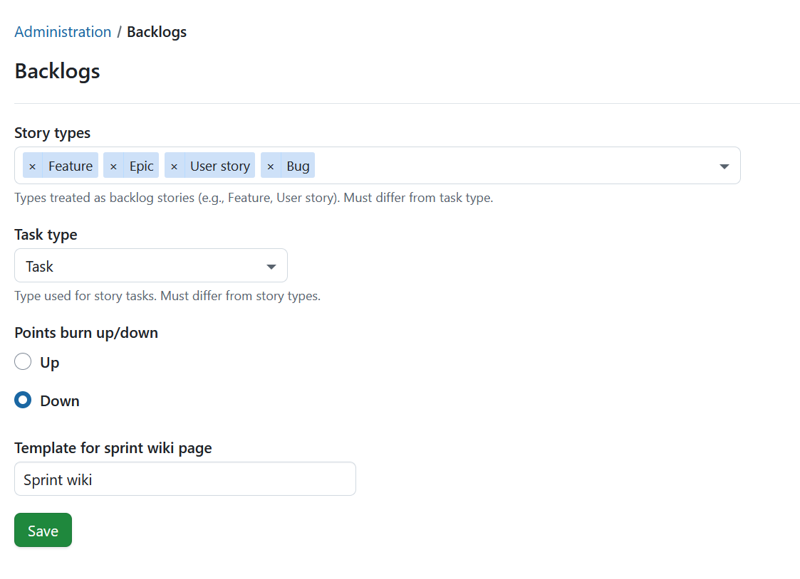
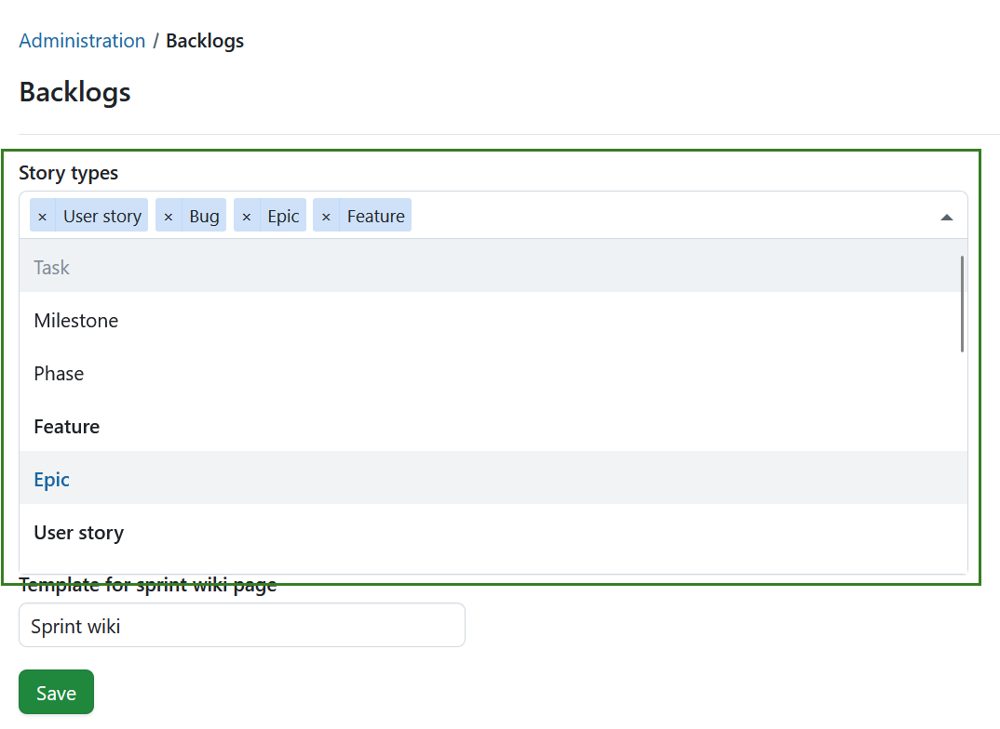
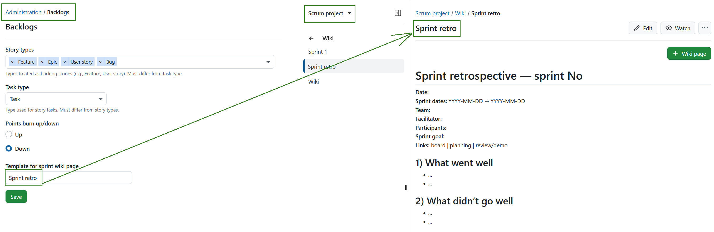
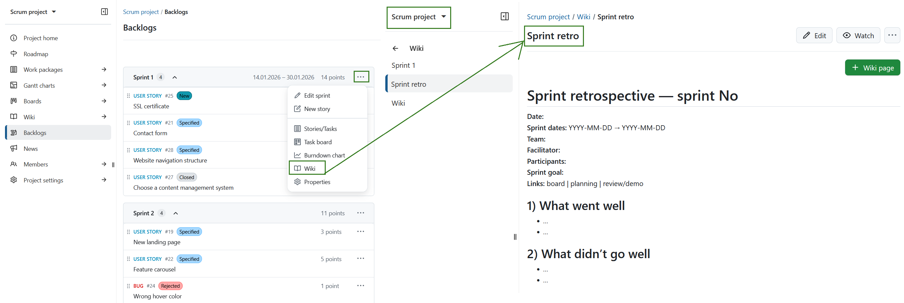

---
sidebar_navigation:
  title: Backlogs
  priority: 840
description: Configure backlogs in OpenProject.
keywords: configure backlogs, backlogs settings, story type, task type, burn chart, burnchart, burndown, burnup, sprint wiki, agile, scrum
---
# Backlogs configuration

Backlogs settings let you tailor OpenProject’s Scrum features to match how your team plans and tracks work. By configuring story and task types, burn charts, and sprint wiki templates, you can ensure your backlogs and boards show the right work items and support consistent sprint planning and documentation.

To configure Backlogs, navigate to *Administration* -> *Backlogs*.

Here you can:
- select work package types used as story and task types,
- choose how to display a burn chart (burn-up or burn-down),
- set a template for a sprint wiki page.

## Story and task types

In OpenProject, work packages can have different **types** (for example *User story*, *Task*, *Bug*, etc.). In the Backlogs settings, you define which of these work package types are used as **stories** and which type is used as **tasks** in the Backlogs module.

 - **Story types** are the work package types configured to be available in the **Backlogs** module. These types appear in backlogs versions, such as the product backlog, wish list, and sprint backlog (i.e., versions). Work packages of these types can be created, prioritized, and managed directly in Backlogs.
 - **Task type** is the work package type that appears on [task boards](../../user-guide/backlogs-scrum/taskboard/) and is used to manage day-to-day work, for example during stand-ups.

### Select story types

The currently selected story types are shown in the **Story types** field. Click the field to open and adjust the selection in the dropdown menu (multiple selections are possible).

### Select task type

The task type is configured in the same way as story types, but only one work package type can be selected. Click the **Task type** field and choose one work package type from the dropdown menu.

> [!NOTE]
> Work package types selected for Story types and Task types must be different. For example, a *User story* can be selected for a story type OR a task type, but not both at the same time. It will not be selectable for *Story types*, as long as it is selected as a *Task type*, and vice versa.

## Burn chart

Burn charts visualize sprint progress over time and help the team track whether they are on course to meet the sprint goal. In OpenProject you can choose which **burn chart** to display in Backlogs. 

You can select:

- **Burn-down chart**: shows how much work remains in the sprint.
- **Burn-up chart**: shows how much work has been completed and makes scope changes easier to spot.

## Sprint wiki
With OpenProject you can set a template for the [**sprint wiki page**](../../user-guide/backlogs-scrum/work-with-backlogs/#sprint-wiki) to standardize how your team documents each sprint. Using a sprint wiki template makes it easy to create consistent pages for sprint goals, planning notes, review outcomes, and retrospective action items.

For example, if you want to create a template page for all Sprint retros, follow these steps:

1. Assign a name to the *Template for sprint wiki page* field, e.g. "Sprint retro".

2. [Create a wiki page](../../user-guide/wiki/create-edit-wiki/#create-a-new-wiki-page) in the Wiki module of a project with the exact same name "Sprint retro". This is your sprint wiki template. Configure it to the needs of your team.

   

   

3. You can create a new sprint wiki page directly from the sprint drop-down menu in the Backlogs module. The new wiki page will be based on the template, so you can reuse the same structure for every sprint.

> [!TIP]
>
> If instead of creating a new wiki page you want to link a specific wiki page, you can assign a pre-defined wiki page to a [sprint version](../../user-guide/projects/project-settings/versions/). It can be assigned to multiple versions. This wiki page is maintained centrally, changing it will show changes for all linked versions. 
