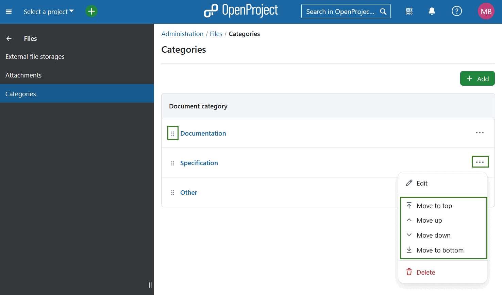
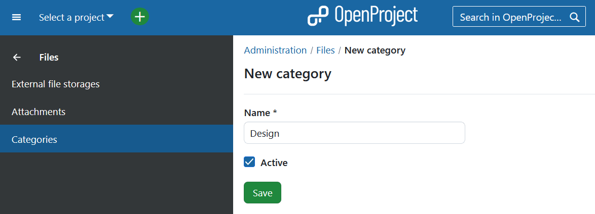
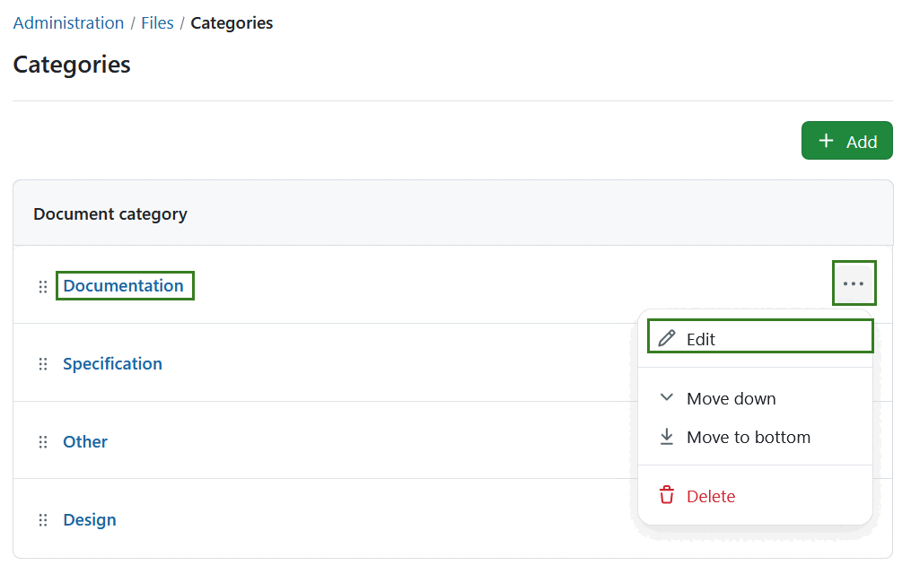

---
sidebar_navigation:
  title: Documents
  priority: 900
description: Documents module settings in OpenProject.
keywords: document category, document categories, documents, collaboration, category, categories
---
# Documents module settings

## Document types

> [!NOTE]
>
> Prior to OpenProject 17.0 document types were called *categories* and were configured under *Administration → Files → Categories*. 

To create or edit document categories in OpenProject, navigate to *Administration → Files → Categories*. Here, you will see all existing values. You can adjust the items within the list by using the options behind the **More (three dots)** menu on the right side. You can also rearrange the order by using the drag-and-drop handle on the left. 

### Create new document category

To create a new document category, select the **+ Add** button in the top right corner.

You can then enter a name activate it. Press the **Save** button to save your changes.

### Edit or remove document category

To **edit** an existing category, either click on the name directly or select the **Edit** option from the **More (three dots)** menu on the right end of the row.

To remove a document category, open the **More (three dots)** menu on the right end of the row and click on the **delete** icon.

## Real-time collaboration in documents