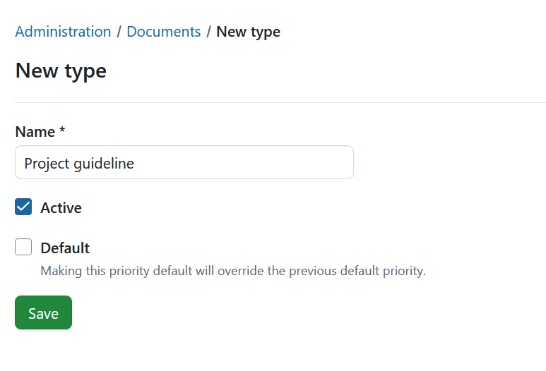
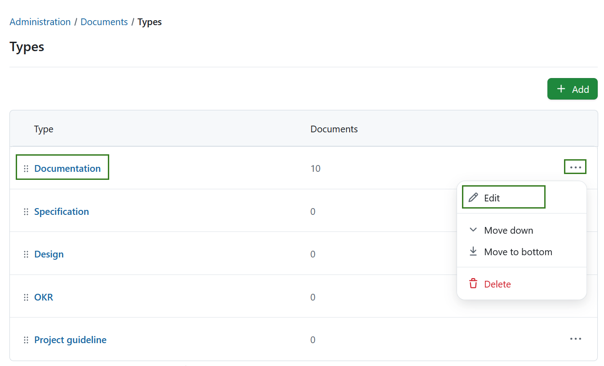

---
sidebar_navigation:
  title: Documents
  priority: 900
description: Documents module settings in OpenProject.
keywords: document category, document categories, documents, collaboration, category, categories, real-time collaboration, edit document
---
# Documents module settings

Intro text: this page shows the settings for Documents module in OpenProject administration.

## Document types

> [!NOTE]
>
> Prior to OpenProject 17.0 document types were called *categories* and were configured under *Administration → Files → Categories*. 

To create or edit document categories in OpenProject, navigate to *Administration → Documents*. Here, you will automatically see all existing document types. You can adjust the items within the list by using the options behind the **More (three dots)** menu on the right side. You can also rearrange the order by using the drag-and-drop handle on the left. 

### Create new document type

To create a new document type, select the **+ Add** button in the top right corner.

You can then name the new type, and activate it. You can optionally set this type to be the **Default** value. 
> [!NOTE]
> Making this type default will override the previous default priority.

Press the **Save** button to save your changes.

### Edit or remove document type

To **edit** an existing type, either click on the name directly or select the **Edit** option from the **More (three dots)** menu on the right end of the row.

To remove a document type, open the **More (three dots)** menu on the right end of the row and click on the **delete** icon.

## Real-time collaboration in documents