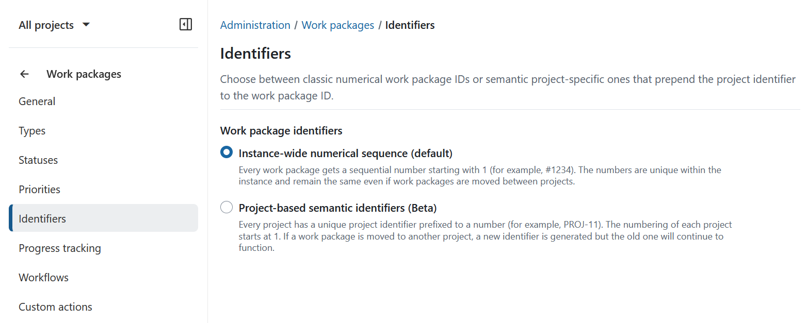
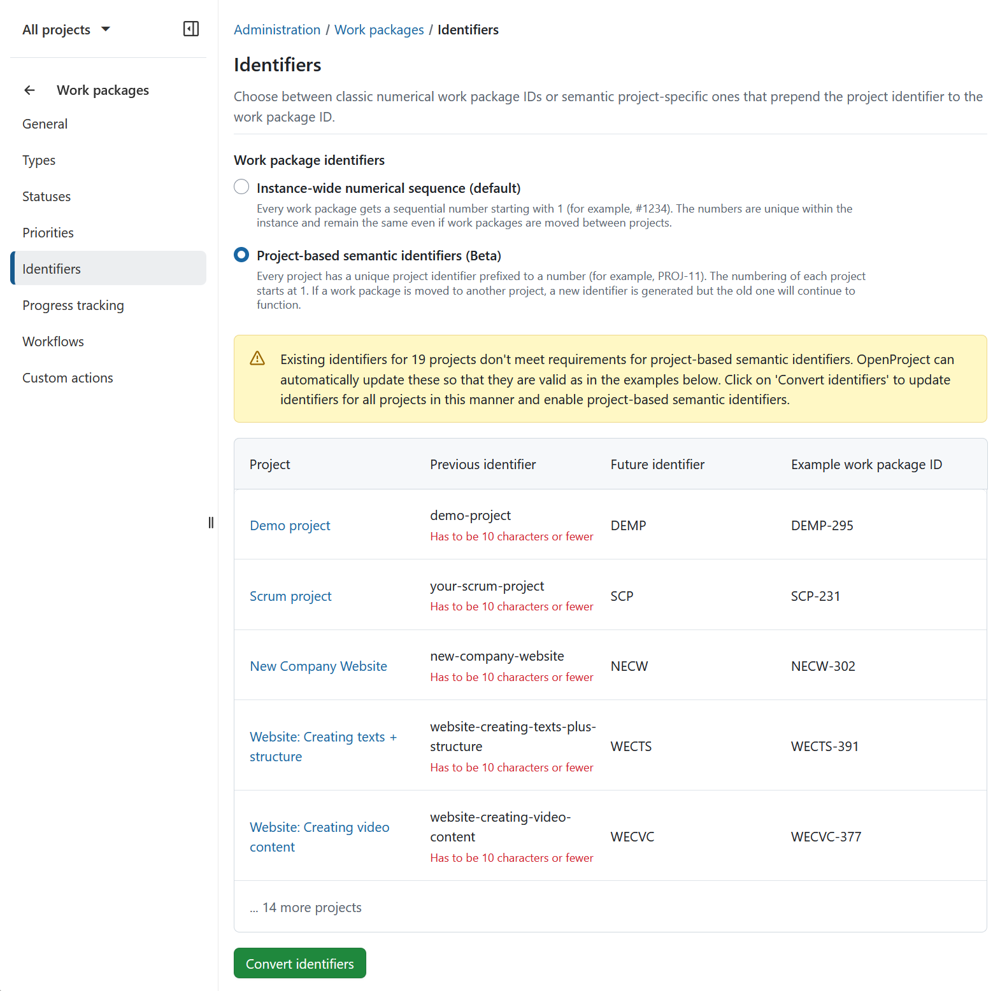
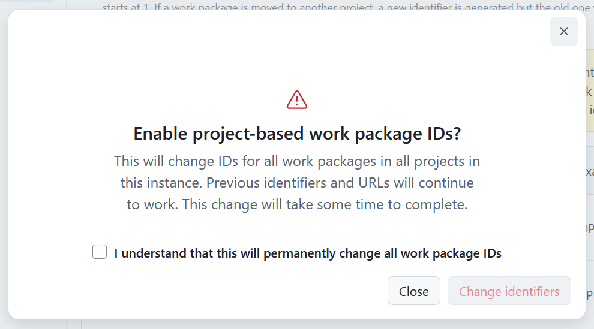
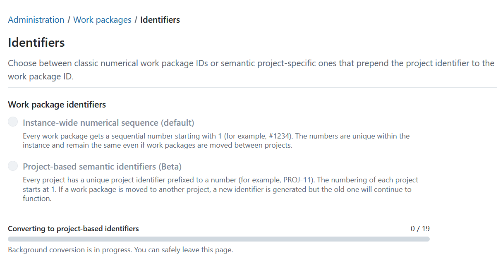
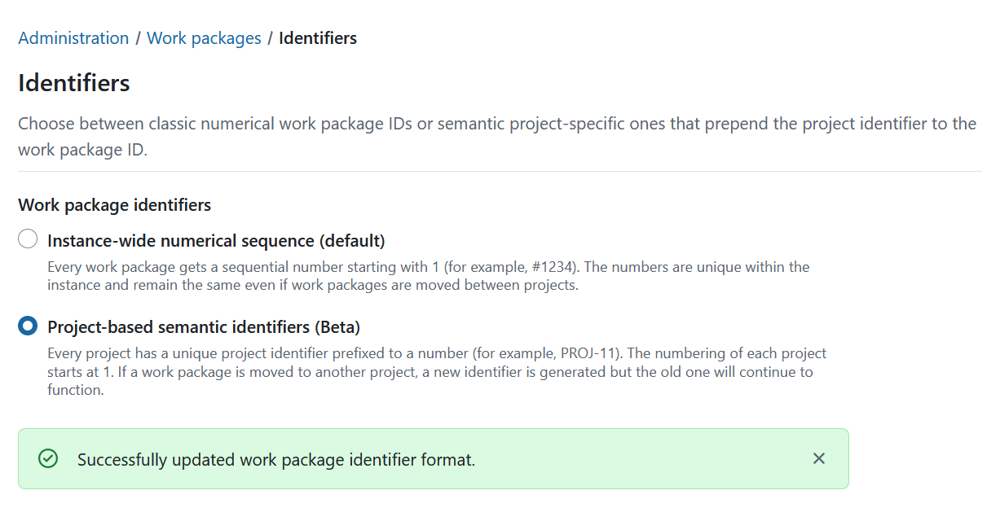

---

sidebar_navigation:
  title: Identifiers
  priority: 500
description: Manage Work package identifiers.
keywords: work package identifier, identifier, project-based identifier, numeric id, semantic id, numeric identifier, semantic identifier, jira migration
---

# Manage work package identifiers

Work package identifiers are used throughout OpenProject to uniquely reference work packages in URLs, notifications, exports, searches, integrations, and other parts of the application.

By default, OpenProject uses an instance-wide numerical sequence (for example, `#12345`). Starting with OpenProject 17.5, administrators can choose between instance-wide numerical identifiers and project-based identifiers. Project-based identifiers combine a project identifier with a sequential number, such as `PROJ-123`.

> [!NOTE]
> Project-based identifiers are currently available as a Beta feature (starting with OpenProject 17.5). If you notice any inconsistencies or unexpected behavior, we welcome your feedback.

## Overview

OpenProject supports two identifier modes:

| Mode                                       | Example    |
| ------------------------------------------ | ---------- |
| Instance-wide numerical sequence (default) | `#12345`   |
| Project-based identifiers (Beta)           | `PROJ-123` |

Project-based identifiers make it easier to identify the project a work package belongs to and can help organizations migrating from Jira preserve familiar issue references.

## Configure work package identifiers

To configure work package identifiers navigate to **Administration** → **Work packages** →  **Identifiers** and select the identifier mode for the instance:

- **Instance-wide numerical sequence (default)**
     Every work package receives a unique sequential number (for example, `#1234`). The identifier remains unchanged even if the work package is moved to another project.
- **Project-based semantic identifiers (Beta)**
    Every work package receives an identifier consisting of the project identifier and a sequential number (for example, `PROJ-11`). Numbering starts at 1 for each project. If a work package is moved to another project, it receives a new project-based identifier while previous identifiers continue to resolve correctly.

 

When enabling project-based identifiers, OpenProject validates existing project identifiers and identifies projects that require updates before the change can be applied.

Review the proposed changes and click **Convert identifiers** to continue.

You will then be asked to confirm the change. Select the confirmation checkbox and click **Change identifiers**.

The conversion process will start immediately. You can safely leave the page while the conversion is running. The process continues in the background until it is completed.

Once the conversion has finished, OpenProject displays a confirmation message. 

> [!NOTE]
> Historical references continue to work even if project identifiers change later.

The project-based identifier mode is not permanent. Administrators can switch between instance-wide numerical identifiers and project-based identifiers at any time.

## Effects of changing the identifier mode

Changing the identifier mode affects how work packages are displayed and referenced throughout OpenProject.

After enabling project-based identifiers, work packages will use the new identifier format throughout the application, including:

- URLs
- Work package references
- Context menus
- Search
- Filters
- Notifications
- Documents
- PDF exports
- Integrations
- API responses

Existing work package identifiers remain valid after the change. Previously assigned identifiers continue to resolve to the same work packages, including existing URLs, bookmarks and references.

> [!TIP]
> Before enabling project-based identifiers in a production environment, inform users about the change so they understand the new identifier format they will encounter.
> We also recommend implementing the switch outside of main working hours, to avoid any possible conflicts with ongoing user activity.

## Reserved project identifiers

When project identifiers are changed, OpenProject reserves previous identifiers to prevent conflicts and preserve existing references.

For more information, see the [Reserved project identifiers](https://www.openproject.org/docs/system-admin-guide/projects/reserved-project-identifiers/) documentation.
