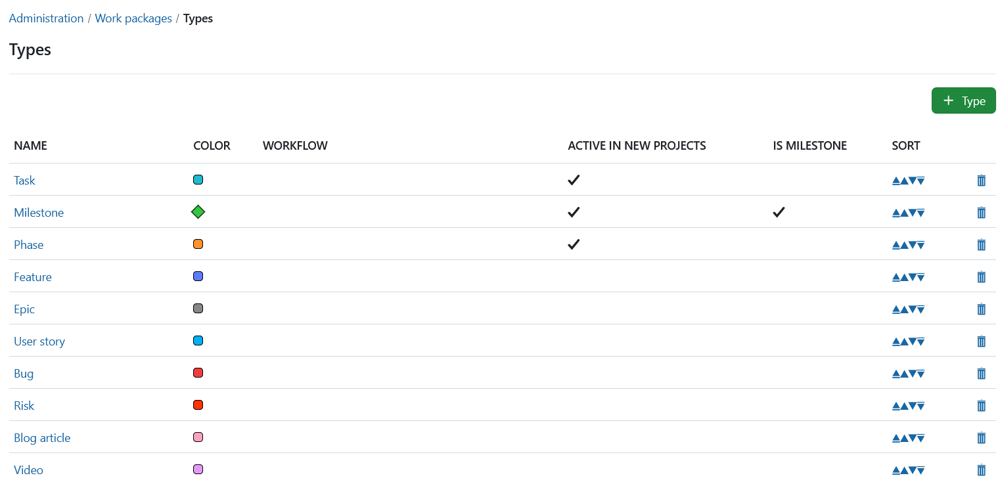
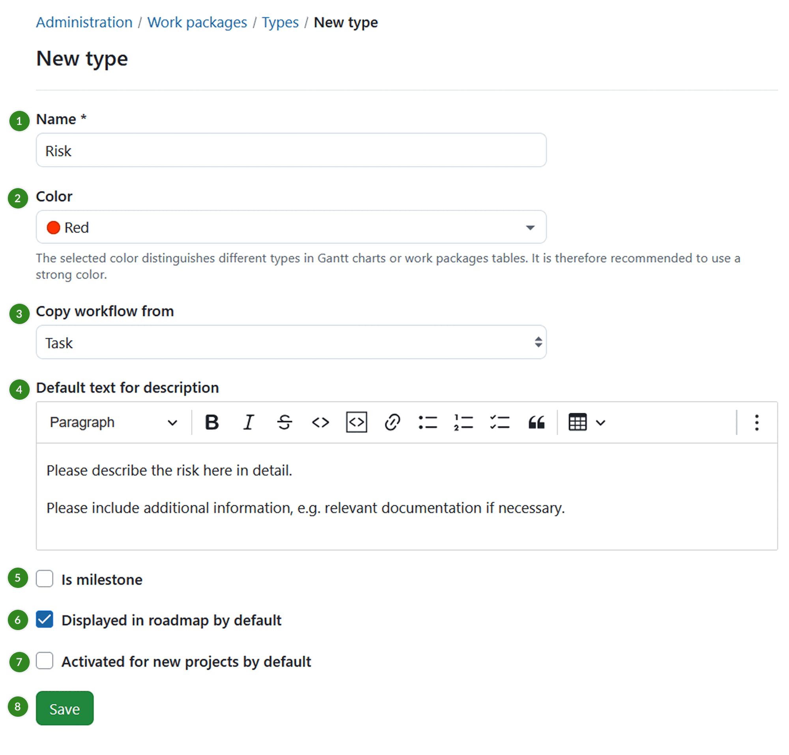
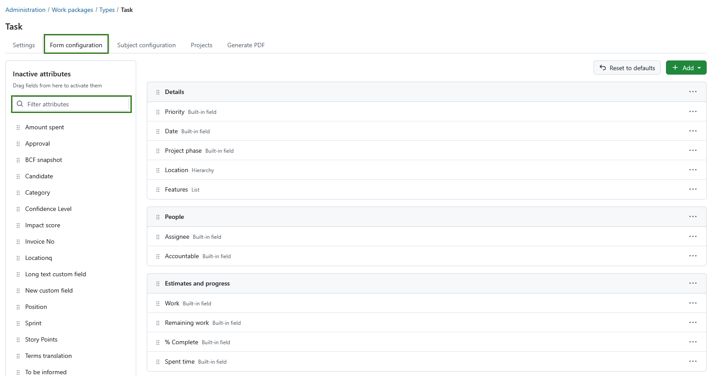
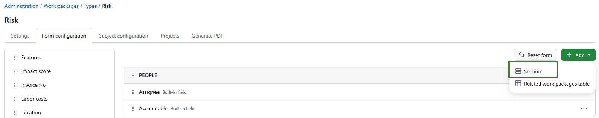
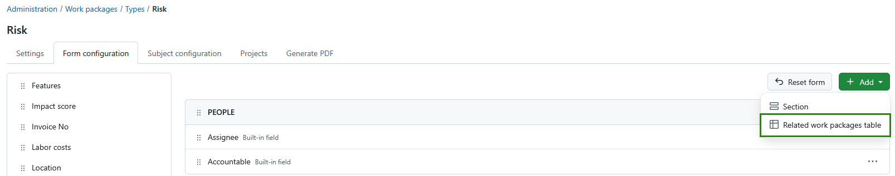
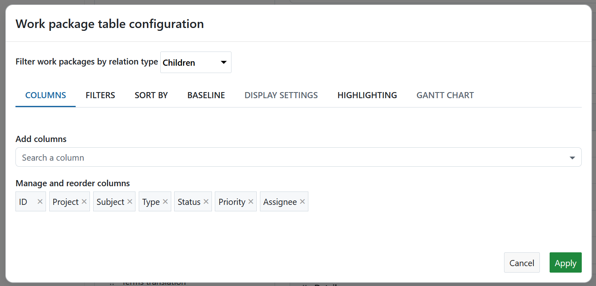
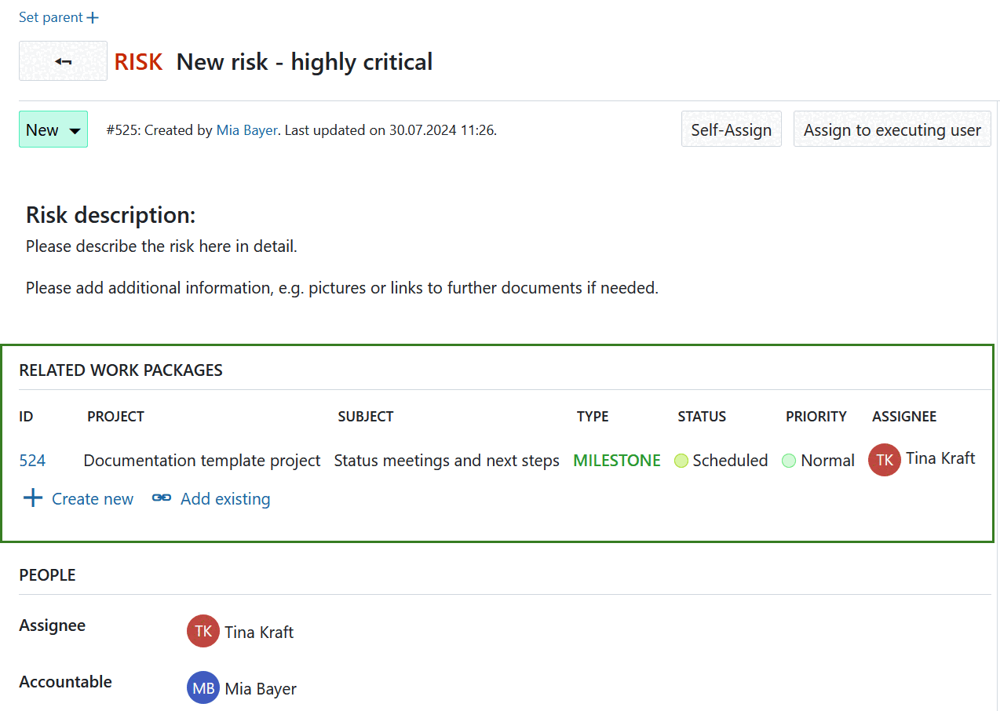
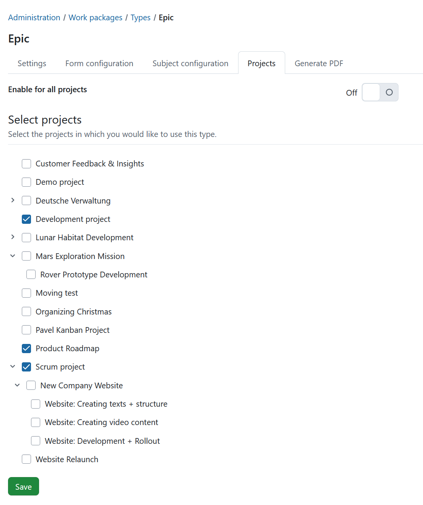
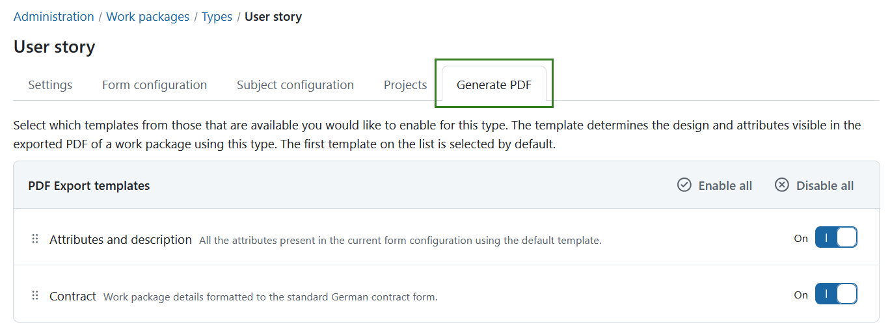

---
sidebar_navigation:
  title: Types
  priority: 800
description: Configure work package types in OpenProject.
keywords: work package types, work package form, related work package, work package table, relations, pdf export, automatic subject
---

# Manage work package types

In OpenProject, you can create and manage as many work package types as needed, such as Tasks, Bugs, Ideas, Risks, and Features.

To add or modify work package types, navigate to *Administration → Work packages → Types*.

Here, you will see a list of all existing work package types.

1. Click on a work package type name to **edit an existing type**.
2. Use the up and down arrows to **reorder work package types**. The type at the top of the list becomes the default and is automatically selected when creating a new work package.
3. Click the delete icon to **remove a work package type**.

## Create new work package type

Click the green **+ Type** button to add a new work package type in the system, e.g. Risk.

1. Give the new work package type a **name** that easily identifies what kind of work should be tracked.
2. Choose a **color** from the drop-down list which should be used for this work package type in the Gantt chart. You can configure new colors [here](../../colors).
3. You can **copy a [workflow](../work-package-workflows)** from an existing type.
4. You can enter **default text for the work package description field**, which always be shown when creating new work package from this type. This way, you can easily create work package templates, e.g. for risk management or bug tracking, that already contain certain required information in the description.
5. Choose whether the type should be a **milestone**, e.g. displayed as a milestone in the Gantt chart with the same start and finish date.
6. Choose whether the type should be displayed in the [roadmap](../../../user-guide/roadmap/) by default.
7. Select if the work package type should be **active in new projects by default**. This way work package types will not need to be [activated in the project settings](../../../user-guide/projects/project-settings/work-packages/#work-package-types) but will be available for every project.
8. Click the **Save** button to add the new type.

## Work package form configuration (Enterprise add-on)

You can customize the work package form for each work package type to display the attributes most relevant to your team's workflow. Attributes can be added, removed, and arranged within the form as needed.

In the Enterprise edition, you can also create and rename sections and add a related work packages table.

[feature: edit_attribute_groups ]

To configure the work package form for a type, navigate to **Administration → Work packages → Types**, select a type, and open the **Form configuration** tab.

The form preview on the right shows the attributes that are currently displayed when creating or editing work packages of this type. Attributes are organized into sections.

On the left side are all available attributes and [custom fields](../../custom-fields) that are not currently used in the form. You can filter them using the search field.

To customize the form:

- Add attributes and custom fields by dragging them from the left side into the desired section.
- Remove attributes from the form using the **(...)** menu next to the attribute.
- Reorder attributes and sections using drag and drop or the available move options from the **(...)** menu.
- Rename sections using the **(...)** menu.

> [!NOTE]
> If you use custom fields, remember that they must also be activated for the relevant projects before they can be used.

To add a new section, click **+ Add** and select **Section**. Enter a name for the section and then drag attributes into it.

To add a related work packages table, click **+ Add** and select **Related work packages table**.

If you want to restore the default form layout for this type, click **Reset form**. This resets the entire form configuration, including all sections and attribute assignments.

Changes are saved automatically. Users creating or editing a work package of this type will see the form exactly as configured.

Watch the following video to see how you can customize your work packages with custom fields and configure the work package forms:

<video src="https://openproject-docs.s3.eu-central-1.amazonaws.com/videos/OpenProject-Forms-and-Custom-Fields-1.mp4"></video>

## Add table of related work packages to a work package form (Enterprise add-on)

You can add a related work packages table to your work package form. Click the **+ Add** button and select **Related work packages table**.

[feature: work_package_query_relation_columns ]

You can configure which related work packages should be displayed in the table, for example child work packages or work packages with a specific relation type. You can also define how the table is filtered, grouped, sorted, and displayed. Configure the table in the same way as a regular [work package table](../../../user-guide/work-packages/work-package-table-configuration/).

When you have finished configuring the table, click **Apply** to add it to the form.

The related work packages table is then displayed directly in the work package form. It automatically shows work packages that match the configured relation and filters. Users can also create new related work packages directly from the table.

## Work package automatic subject configuration (Enterprise add-on)

[feature: work_package_subject_generation ]

Please refer to [this guide](automatic-subjects) for a detailed description of automatically generated work package subjects in OpenProject. 

## Activate work package types for projects

Under **Administration → Work packages → Types**, open the **Projects** tab to select for which projects a work package type should be activated.

The **Enabled for new projects by default** setting (which can be selected when creating or editing a work package type) only activates the type for newly created projects. It does not activate the type for existing projects.

For existing projects, work package types can also be activated manually in the [project settings](../../../user-guide/projects/project-settings). There, work package types can be enabled or disabled on a per-project basis.

To activate a work package type for all projects, enable the **Enable for all projects** switch.

If **Enable for all projects** is disabled, a list of projects is displayed. Select the projects for which the work package type should be available and click **Save**.

## Activate templates for PDF exports

Under the **Generate PDF** tab of  **Administration -> Work packages -> Types**, you can select which PDF export templates are available for this work package type.

The template determines the design and attributes visible in the exported PDF of a work package using this type. The first  template on the list is selected by default.

