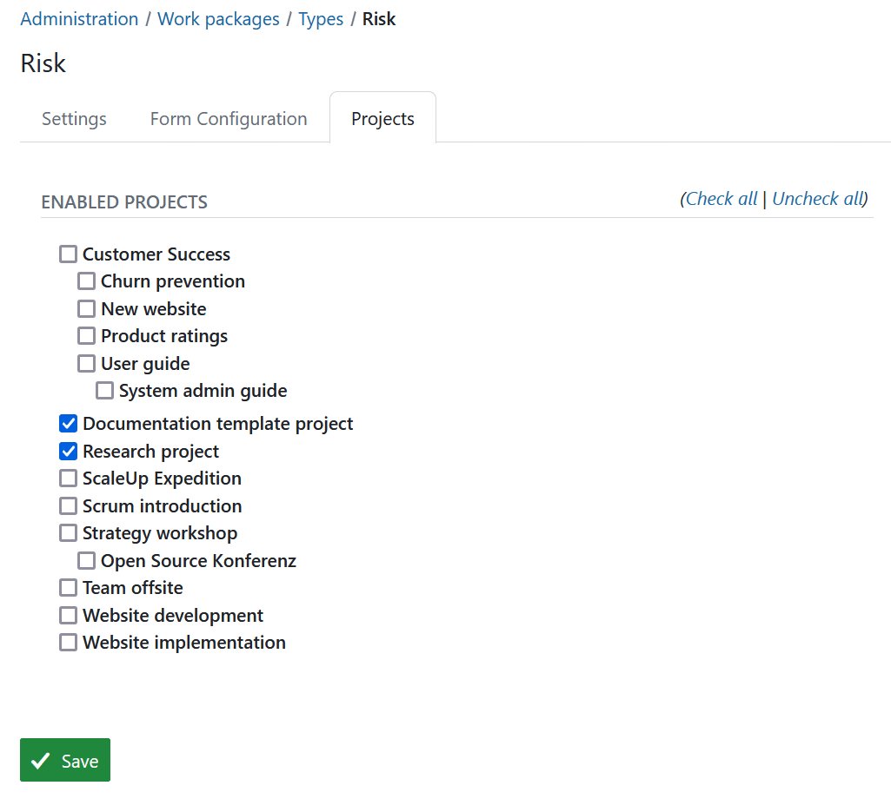

---
sidebar_navigation:
  title: Types
  priority: 980
description: Configure work package types in OpenProject.
keywords: work package types
---

# Manage work package types

In OpenProject, you can create and manage as many work package types as needed, such as Tasks, Bugs, Ideas, Risks, and Features.

To add or modify work package types, navigate to *Administration → Work packages → Types*.

Here, you will see a list of all existing work package types.

1. Click on a work package type name to **edit an existing type**.
2. Use the up and down arrows to **reorder work package types**. The type at the top of the list becomes the default and is automatically selected when creating a new work package.
3. Click the delete icon to **remove a work package type**.


## Create new work package type

Click the green **+ Type** button to add a new work package type in the system, e.g. Risk.

1. Give the new work package type a **name** that easily identifies what kind of work should be tracked.
2. Choose a **color** from the drop-down list which should be used for this work package type in the Gantt chart. You can configure new colors [here](../../colors).
3. You can **copy a [workflow](../work-package-workflows)** from an existing type.
4. You can enter a **default text for the work package description field**, which always be shown when creating new work package from this type. This way, you can easily create work package templates, e.g. for risk management or bug tracking which already contain certain required information in the description.
5. Choose whether the type should be a **milestone**, e.g. displayed as a milestone in the Gantt chart with the same start and finish date.
6. Choose whether the type should be displayed in the [roadmap](../../../user-guide/roadmap/) by default.
7. Select if the work package type should be **active in new projects by default**. This way work package types will not need to be [activated in the project settings](../../../user-guide/projects/project-settings/work-packages/#work-package-types) but will be available for every project.
8. Click the **Save** button to add the new type.


## Bug and task template runbook

Use this runbook to roll out consistent bug/task intake templates in a configuration-first way.
OpenProject applies the **type description** as the default description when a new work package of that type is created.
In fresh standard seeding, Task and Bug starter templates are provided by default.
For existing installations, use the rollout steps below to apply them.

### Copy/paste template for **Bug** type description

```md
## Summary
(One-sentence defect summary and impact)

## Environment
- Product/app version:
- Browser + version:
- OS/device + version:
- Project:

## Steps to reproduce
1.
2.
3.

## Expected behavior
(What should happen)

## Actual behavior
(What actually happens)

## Reproducibility
- [ ] Always
- [ ] Intermittent
- [ ] Could not reproduce reliably

## Evidence
(Logs, screenshots, links, crash IDs)

## Impact
- Severity:
- Priority:
- Affected users/workflow:
```

### Copy/paste template for **Task** type description

```md
## Summary
(What needs to be done)

## Goal / Expected outcome
(Definition of done)

## Scope
- In scope:
- Out of scope:

## Acceptance criteria
- [ ]
- [ ]

## Dependencies / Links
(Related work packages, docs, blockers)
```

### Rollout steps

1. Pilot in 1-2 projects first:
   1. Go to **Administration -> Work packages -> Types -> Bug** and paste the Bug template into **Description**.
   2. Repeat for **Task** with the Task template.
2. Validate in both creation paths:
   1. Global create (`/work_packages/new`)
   2. Project create (`/projects/:project_id/work_packages/new`)
3. Confirm behavior:
   1. Template is prefilled for new Bug/Task.
   2. Switching type replaces only untouched default text.
   3. User-edited descriptions are not overwritten on type switch.
4. Roll out globally to all projects using Bug/Task types.
5. Revisit after adoption and decide whether to add required custom fields for stricter intake.

### Project-specific variants

Type descriptions are global per type. If a specific project needs a different template (for example, extra iOS version/device fields), create a dedicated type variant such as **iOS Bug** and enable it only for that project under the type's **Projects** tab.

### Industry references

- [Google Chrome extension bug filing guidance](https://developer.chrome.com/docs/extensions/support/file-a-bug)
- [Mozilla Bugzilla bug-writing guidelines](https://bugzilla.mozilla.org/page.cgi?id=bug-writing.html)
- [Microsoft Azure DevOps bug work item guidance](https://learn.microsoft.com/en-us/azure/devops/boards/backlogs/manage-bugs)
- [GitLab issue/description templates](https://docs.gitlab.com/user/project/description_templates/)

## Work package form configuration (Enterprise add-on)

You can freely **configure the attributes shown** for each work package type to decide which attributes are shown in the form and how they are grouped.

> [!NOTE]
> Following parts of the Work package form configuration are an Enterprise add-on:
> 
>- **Add new attribute groups**
> - **Rename attribute groups**
> - **Add table of related work packages to a work package form**

[feature: edit_attribute_groups ]

To configure a type, first select the type from the list of types (see above) and select the tab **Form configuration**.

Active attributes shown in blue color on the left will be displayed in the work package form for this type.
You can then decide for each attribute which group it should be assigned to (using drag and drop or removing it by clicking the remove  icon). You can also rename attribute groups simply by clicking on their name or re-order attribute groups with drag and drop.

Inactive attributes shown in the grey color on the right. Attributes which have been removed are shown in the **Inactive** column on the right. This column also includes [custom fields](../../custom-fields) which have been created. The custom fields also can be added with drag and drop to the active form (the blue part on the left) to be displayed in the form.

> [!IMPORTANT]
>
> Starting with OpenProject 15.0, when adding new custom fields to a type through the  form configuration, the added custom fields will not automatically be enabled in all projects that have this work package type currently enabled.

To add additional group, click the **+ Group** button and select **Add attribute group**. Give the new group a name. You can then assign attributes (e.g. custom fields) via drag and drop. Note that adding attribute groups is only possible with the [OpenProject Enterprise on-premises](https://www.openproject.org/enterprise-edition/) and the [OpenProject Enterprise cloud](https://www.openproject.org/enterprise-edition/#hosting-options).

In case you made a mistake, click the **Reset to defaults** button to reset all settings to the original state.

Finally, **save** the settings to apply them.


If you then create a new work package of this type, the input form will have exactly these attributes selected in the form configuration.

In this case, all attributes in the blue area on the left are displayed under the corresponding attribute group.


Watch the following video to see how you can customize your work packages with custom fields and configure the work package forms:

<video src="https://openproject-docs.s3.eu-central-1.amazonaws.com/videos/OpenProject-Forms-and-Custom-Fields-1.mp4"></video>

## Add table of related work packages to a work package form (Enterprise add-on)

Also, you can add a table of related work packages to your work package form. Click the green **+ Group** button and choose **Add table of related work package** from the drop-down list.

[feature: work_package_query_relation_columns ]


Now, you can configure which related work packages should be included in your embedded list, e.g. child work packages or work packages related to this work package, and more. Then you can configure how the list should be filtered, grouped, etc. The configuration of the work package table can be done according to the [work package table configuration](../../../user-guide/work-packages/work-package-table-configuration/).

Click the green **Apply** button to add this work package list to your form.


The embedded related work package table in the work package form will look like this. Here, the work packages with the chosen relation will be shown automatically (based on the filtered criteria in the embedded list) or new work packages with this relation can be added.


## Work package automatic subject configuration (Enterprise add-on)

[feature: work_package_subject_generation ]

Please refer to [this guide](automatic-subjects) for a detailed description of automatically generated work packages subjects in OpenProject. 


## Activate work package types for projects

Under *Administration -> Work packages -> Types* on the tab **Projects** you can select for which projects this work package type should be activated.

The **Activated for new projects by default** setting in the Types will only activate this type for new projects. For existing projects, the type needs to be activated manually.
This can be also configured in the [project settings](../../../user-guide/projects/project-settings).



## Activate templates for PDF exports

Under the **Generate PDF** tab of  *Administration -> Work packages -> Types* you can select which templates from currently available ones should be enabled for the PDF export of this specific type. 

The template determines the design and attributes visible in the exported PDF of a work package using this type. The first  template on the list is selected by default.


