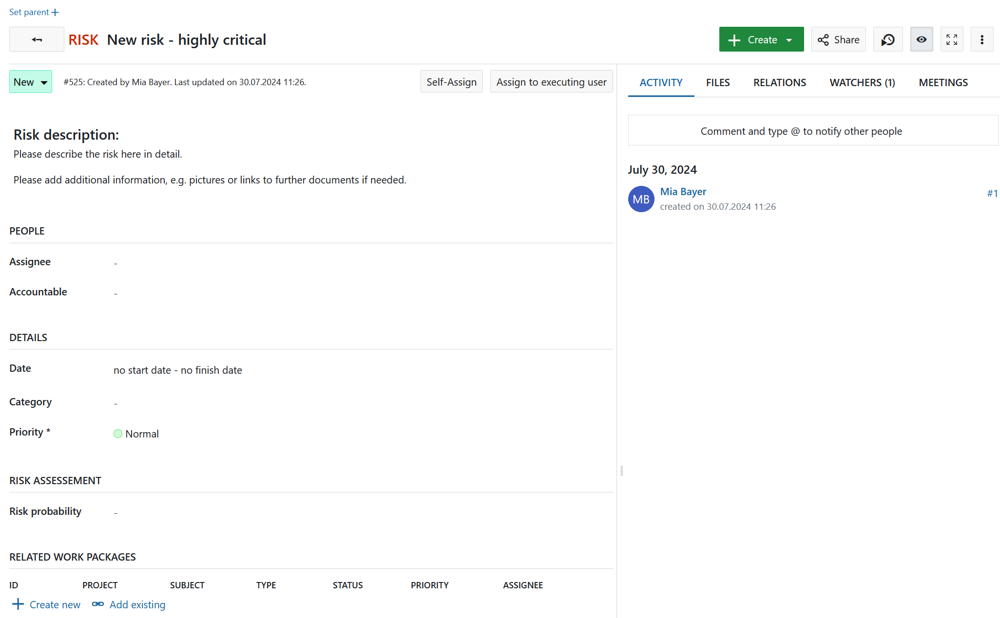

---
sidebar_navigation:
  title: Types
  priority: 800
description: Configure work package types in OpenProject.
keywords: work package types
---

# Manage work package types

In OpenProject, you can create and manage as many work package types as needed, such as Tasks, Bugs, Ideas, Risks, and Features.

To add or modify work package types, navigate to *Administration → Work packages → Types*.

Here, you will see a list of all existing work package types.

1. Click on a work package type name to **edit an existing type**.
2. Use the up and down arrows to **reorder work package types**. The type at the top of the list becomes the default and is automatically selected when creating a new work package.
3. Click the delete icon to **remove a work package type**.

## Create new work package type

Click the green **+ Type** button to add a new work package type in the system, e.g. Risk.

1. Give the new work package type a **name** that easily identifies what kind of work should be tracked.
2. Choose a **color** from the drop-down list which should be used for this work package type in the Gantt chart. You can configure new colors [here](../../colors).
3. You can **copy a [workflow](../work-package-workflows)** from an existing type.
4. You can enter a **default text for the work package description field**, which always be shown when creating new work package from this type. This way, you can easily create work package templates, e.g. for risk management or bug tracking which already contain certain required information in the description.
5. Choose whether the type should be a **milestone**, e.g. displayed as a milestone in the Gantt chart with the same start and finish date.
6. Choose whether the type should be displayed in the [roadmap](../../../user-guide/roadmap/) by default.
7. Select if the work package type should be **active in new projects by default**. This way work package types will not need to be [activated in the project settings](../../../user-guide/projects/project-settings/work-packages/#work-package-types) but will be available for every project.
8. Click the **Save** button to add the new type.

## Work package form configuration (Enterprise add-on)

You can freely **configure the attributes shown** for each work package type to decide which attributes are shown in the form and how they are grouped.

> [!NOTE]
> Following parts of the Work package form configuration are an Enterprise add-on:
> 
>- **Add new sections**
> - **Rename sections**
> - **Add related work packages table to a work package form**

[feature: edit_attribute_groups ]

To configure a type, first select the type from the list of types (see above) and select the tab **Form configuration**.

Active attributes shown on the right will be displayed in the work package form for this type.
You can then decide for each attribute which section it should be assigned to (using drag and drop or removing it by clicking **delete**). You can also rename sections simply by clicking on the menu **(...)** or re-order sections via the move options on the menu.

Inactive attributes are displayed on the left and can be filtered for using the search panel. Attributes which have been deleted are also shown in the **Inactive** column on the left. This column also includes [custom fields](../../custom-fields) which have been created. The custom fields can also be added using drag and drop to the right to be displayed in the form.

To add additional sections, click the **+ Add** button and select **Section**. Give it a name. You can then assign attributes (e.g. custom fields) via drag and drop. Note that adding sections is only possible with the [OpenProject Enterprise on-premises](https://www.openproject.org/enterprise-edition/) and the [OpenProject Enterprise cloud](https://www.openproject.org/enterprise-edition/#hosting-options).

In case you made a mistake, click the **Reset form** button to reset all settings to the original state.

Your configuration settings are automatically saved.

If you then create a new work package of this type, the input form will have exactly these attributes selected in the form configuration.

In this case, all attributes on the right are displayed under the corresponding attribute section.

Watch the following video to see how you can customize your work packages with custom fields and configure the work package forms:

<video src="https://openproject-docs.s3.eu-central-1.amazonaws.com/videos/OpenProject-Forms-and-Custom-Fields-1.mp4"></video>

## Add table of related work packages to a work package form (Enterprise add-on)

You can add a table of related work packages to your work package form. Click the green **+ Add** button and choose **Related work packages table** from the drop-down list.

[feature: work_package_query_relation_columns ]

You can then configure which related work packages should be included in your embedded list, e.g. child work packages or work packages related to this work package, and more. Then you can configure how the list should be filtered, grouped, etc. The configuration of the work package table can be done according to the [work package table configuration](../../../user-guide/work-packages/work-package-table-configuration/).

Click the green **Apply** button to add this work package list to your form.

The embedded related work package table in the work package form will look like this. Here, the work packages with the chosen relation will be shown automatically (based on the filtered criteria in the embedded list) or new work packages with this relation can be added.

## Work package automatic subject configuration (Enterprise add-on)

[feature: work_package_subject_generation ]

Please refer to [this guide](automatic-subjects) for a detailed description of automatically generated work packages subjects in OpenProject. 

## Activate work package types for projects

Under **Administration → Work packages → Types**, open the **Projects** tab to select for which projects a work package type should be activated.

The **Enabled for new projects by default** setting (which can be selected when creating or editing a work package type) only activates the type for newly created projects. It does not activate the type for existing projects.

For existing projects, work package types can also be activated manually in the [project settings](../../../user-guide/projects/project-settings). There, work package types can be enabled or disabled on a per-project basis.

To activate a work package type for all projects, enable the **Enable for all projects** switch.

If **Enable for all projects** is disabled, a list of projects is displayed. Select the projects for which the work package type should be available and click **Save**.

## Activate templates for PDF exports

Under the **Generate PDF** tab of  *Administration -> Work packages -> Types* you can select which templates from currently available ones should be enabled for the PDF export of this specific type. 

The template determines the design and attributes visible in the exported PDF of a work package using this type. The first  template on the list is selected by default.

