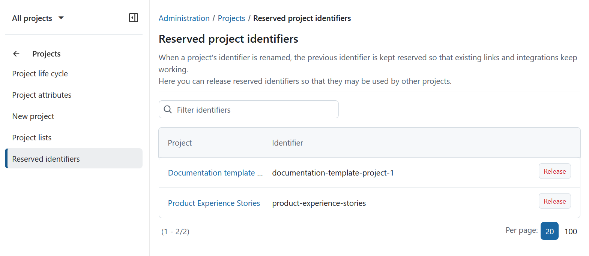
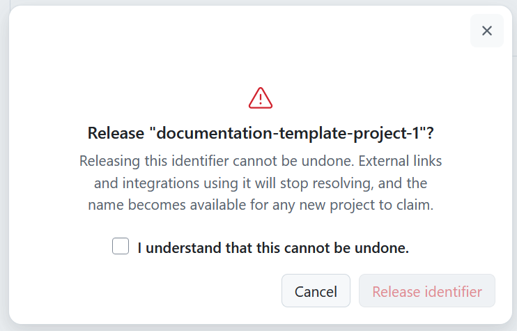

---
sidebar_navigation:
  title: Reserved identifiers 
  priority: 50
description: Manage reserved project identifiers and release identifiers that are no longer needed.
keywords: reserved identifier, reserved project identifier, project identifier, release identifier, identifier redirect, project rename
---

# Reserved project identifiers

When a project identifier is changed, OpenProject keeps the previous identifier reserved. This ensures that existing links, bookmarks, integrations, and references continue to work after the change.

For example, if a project's identifier changes from `OLDPROJ` to `OLDPROJECT`, both identifiers continue to resolve to the same project.

Reserved identifiers cannot be used by other projects. A project identifier that has been used before can only be reused by the same project unless it is explicitly released by an administrator.

## Release reserved project identifiers

If a reserved identifier is no longer needed, administrators can release it and make it available for use by other projects.

To release a reserved project identifier navigate to **Administration** → **Projects** → **Reserved identifiers**. You will see a list of reserved project identifiers, including the project name and the served identifier. 

A search field above the table can be used to filter the list. If no reserved identifiers exist, the table will be empty.

To release an identifier, click **Release** next to the corresponding entry.

OpenProject displays a confirmation dialog explaining the consequences of releasing the identifier.

Select the confirmation checkbox and click **Release identifier** to continue.

> [!WARNING]
> Releasing an identifier cannot be undone. Existing external links, bookmarks, integrations, and references that rely on the released identifier will no longer resolve. The identifier becomes available for any project to claim.

> [!TIP]
> Only release a reserved identifier when you are certain it is no longer needed. If there is any possibility that existing links, integrations, documentation, or user bookmarks still reference the identifier, it is usually safer to keep it reserved.
