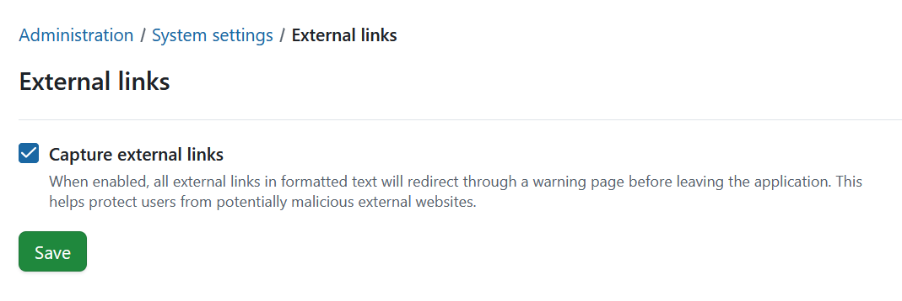
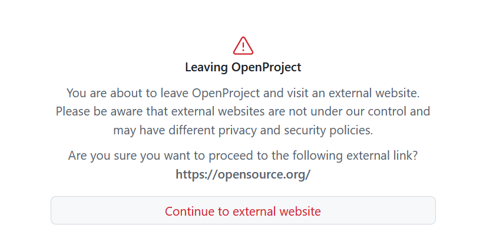

---
sidebar_navigation:
  title: External links
  priority: 950
description: External links settings in OpenProject.
keywords: external links, link, links, capture link, redirect, warning, external site, external website
---
# External links (Enterprise add-on)
[feature: capture_external_links ]

You can configure how OpenProject handles **external links** in formatted text (for example, project descriptions, comments, or wiki content). When enabled, external links will be intercepted and users will see a warning page before leaving the application. This helps reduce the risk of users unknowingly opening unsafe websites.

## Enable external link capture

To enable the Capture external links setting navigate to *Administration ->System settings -> External links* and check the **Capture external links**  option. Don't forget to save your changes. 

Once enabled, OpenProject will redirect external links in formatted text through a warning page.

## What is an external link?

Links are considered external if they:

- Are **not relative** (don’t point to the same server or application context), and
- Do **not start** with the configured **protocol** and **host name** of your OpenProject instance.
