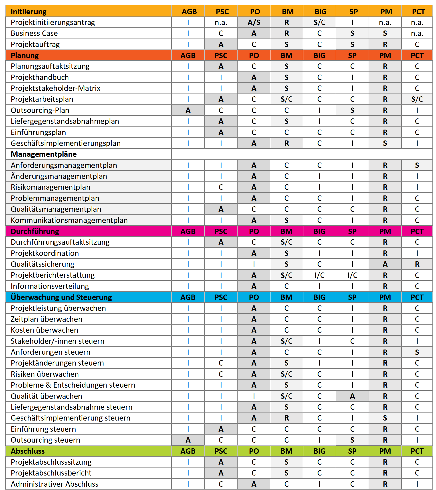
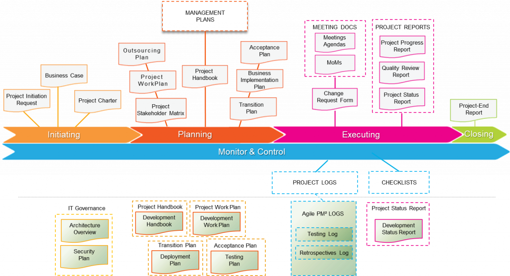

---
sidebar_navigation:
  title: PM² and PMflex project management with OpenProject
  priority: 600
description: Learn how to set up and configure OpenProject to support the PM²/PMflex methodology with OpenProject
keywords: pmflex, PM², PM2, 

---

# Implementing PM² and PMflex project management in OpenProject

OpenProject is a powerful project management tool that can adapt to a number of different frameworks and methodologies. Larger organizations who choose to implement the **Scaled Agile Framework (SAFe)** methodology can leverage the wide range of features and customizability that OpenProject offers to define, plan organize to deliver value to their end customers.

This guide contains the following sections:

| Section                                                 | Description |
| ------------------------------------------------------- | ----------- |
| [Structure and terminology](#structure-and-terminology) |             |
|                                                         |             |
|                                                         |             |
|                                                         |             |
|                                                         |             |
|                                                         |             |

## Structure and terminology

It is important to note that OpenProject terminology can vary somewhat form PM² and PMflex terminology:

| **PM² terminology** | **OpenProject terminology** |
| --- | --- |
|                     |                             |
|                     |                             |
|                     |                             |
|                     |                             |
|                     |                             |
|                     |                             |
|                     |                             |
|                     |                             |
|                     |                             |
|                     |                             |
|                     |                             |

* PM² Project Lifecycle
* PM² Artefacts
  * Business Case
  * 
* Issue log
* Decision log
* Risk log
* Work plan
* Roles
* Meetings

