# PM² Project Management Methodology 

The PM² Guide v3.1, December 2023

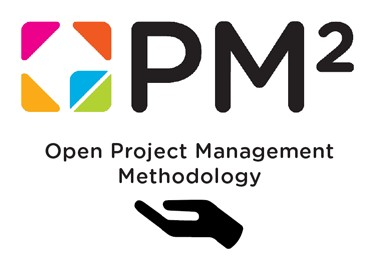

Reproduction and reuse is authorised provided the source is acknowledged.
Document licensed under CC BY 4.0 license (https://creativecommons.org/licenses/by/4.0/).
The Commission's reuse policy is implemented by Commission Decision 2011/833/EU of 12 December 2011 on the reuse of Commission documents (OJ L 330, 14.12.2011, p. 39 - https://eur-lex.europa.eu/eli/dec/2011/833/oj).

The PM² logo is the property of the European Union and may not be registered as a trademark or otherwise, nor used separately from these documents.

Neither the publication nor the logo can be used in a way which suggests endorsement of an external organisation by the European Union.

## 1 An Introduction to the PM² Guide 

### 1.1 Objectives

This guide sets out to provide an introduction to the PM² Project Management Methodology. It has been kept as lean as possible, while still providing enough information to allow for an effective understanding of the PM² Methodology as practitioners start to use it.

### 1.2 Intended Audience

- Entry-level Project Managers (PMs) and project teams wishing to learn more about project management and the PM² Methodology.
- Experienced Project Managers (PMs) and team members who wish to learn more about the PM² Methodology.
- Project teams that wish to start using the PM² Methodology in their projects.

**This guide provides:**

- a common vocabulary (glossary) which makes it easier for project teams to communicate and apply project management concepts
- best practices-it is up to the Project Managers (PMs) and project teams to choose the PM² practices that will bring most value to their projects
- links to PM² resources (online resources, Artefact templates and examples)
- an introduction to other PM² models, such as PM²-Agile, $\mathrm{PM}^{2}-\mathrm{PgM}$ (for Programme Management) and PM²-PfM (for Portfolio Management).

This guide can be read from beginning to end, to learn about the methodology, or it can be used as a reference, to help you as you practise PM².

### 1.3 About the PM² Methodology

PM² is a Project Management Methodology developed by the European Commission. Its purpose is to enable Project Managers (PMs) to deliver solutions and benefits to their organisations by effectively managing the entire lifecycle of their project. PM² has been created with the needs of European Union Institutions and projects in mind, however, the best practices described in PM² are applicable to projects in any organisation.
PM² is a light and easy-to-implement methodology which project teams can tailor to their specific needs. PM² is fully supported by a comprehensive training programme (including workshops and coaching sessions), online documentation and an active Community of Practice (currently only available within the European Commission and to a number of affiliate European Institutions).
PM² incorporates elements from a wide range of globally accepted project management best practices, captured in standards and methodologies. Its development has also been influenced by operational experience on various projects both within European Union Institutions and external bodies.

**The PM² Methodology provides:**

- a project governance structure
- process guidelines
- artefact templates
- guidelines for using the artefacts
- a set of effective mindsets.

**PM² improves the effectiveness of project management by:**

- improving communication and the dissemination of information
- clarifying expectations as early as possible in the project lifecycle
- defining the project lifecycle (from Initiating to Closing)
- providing guidelines for project planning
- introducing monitor and control activities
- proposing management activities and outputs (plans, meetings, decisions)
- providing a link to agile practices.

### 1.4 The Centre of Excellence in PM² (CoEPM²) 

The purpose of the Centre of Excellence in  PM² (CoEPM² is to provide the European Commission and European Union Institutions with high-quality project management infrastructure, support and consulting services. The CoEPM² supports the PM² Methodology internally, coordinates an inter-institutional Project Support Network, and promotes the wider adoption and use of PM² beyond the European Union Institutions through the Open PM² initiative and the Digital Europe Programme.

### 1.5 The Open PM² Initiative

Open PM² is a European Commission initiative, which brings the PM² Methodology and its benefits closer to its broader stakeholders and user community.

The Open PM² Initiative provides European Union institutions, contractors and public administrations, as well as broader stakeholders, with open access to the PM² publications and associated resources. Its goal is to enable increased effectiveness in the management of projects, programmes, and portfolios and thus to serve the objectives of the European Union and the needs of member states and citizens.

One common PM Methodology open to all EU Institutions, Member States, Contractors, and EU Citizens.
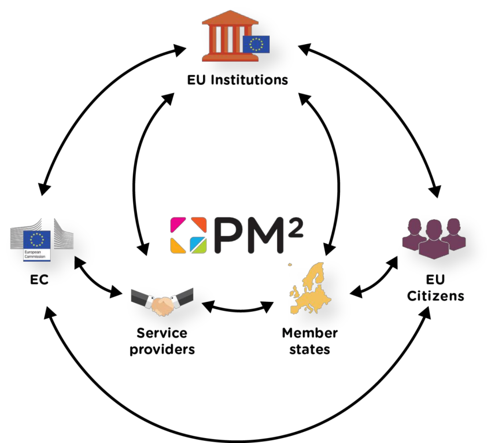

The Initiative also seeks to rectify mistakes of the past, when efforts were duplicated and divergent project management approaches were sponsored rather than promoting convergent approaches based on similarities and the common interest of the broader European community.

By opening PM², the Initiative aims to enhance project management competency within Europe, leading to increased project efficiency and success.

Opening PM² does this by:

- rationalising project management approaches across European Union Institutions and beyond
- establishing a common language and processes, resulting in effective project communication
- providing a common set of productive mindsets
- enabling transparency and visibility for cross-organisational project collaborations
- enabling better project management, leading to improved cost/effort efficiency
- enabling the improved monitor and control of European Union-funded projects and grants
- applying the European Commission decision of 12 December 2011 (2011/833/EU) on the reuse of Commission documents to promote accessibility and reuse.

#### 1.5.1 PM² Publications 

The Centre of Excellence in $\mathrm{PM}^{2}\left(\mathrm{CoEPM}^{2}\right)$ provides a central online location for all PM² information, and resources.

- PM² website https://pm2.europa.eu
- Contact https://pm2.europa.eu/contact-us en

You can also download directly all PM² Guides from the Publications Office of the European Union.

#### 1.5.2 Project Support Network

The PM² Project Support Network is an EU Institutions wide network of Local Project Support Offices (LPSOs) which are coordinated and supported by the Centre of Excellence in $\mathrm{PM}^{2}\left(\mathrm{CoEPM}^{2}\right)$. The PM² Project Support Network (PSN) aims to become a decentralised project management support network which provides guidance and support to PM² users on both the PM² Methodology and the effective use of project management tools \& techniques more broadly.

The Project Support Network:

- promotes the exchange and sharing of knowledge, experiences and best practices
- makes it possible to collect feedback to continuously improve and build on the PM² Methodology
- enables the Local Project Support Offices (LPSOs) to support each other as a community
- depends on the contributions of PM² champions (individuals and organisations).

## 2 Project Management 

This section introduces basic project management concepts and provides the context for a better understanding of the PM² Methodology.

### 2.1 About Projects

#### 2.1.1 What is a project?

A project is a temporary organisational structure set up to create a unique product or service (output) within certain constraints such as time, cost, and quality.

- Temporary means that the project has a well-defined start and end.
- Unique output means that the project's product or service has not been created before. It may be similar to another product, but there will always be a degree of uniqueness.
- A project's output may be a product (e.g. a new application) or a service (e.g. a consulting service, a conference or a training programme).
The project is defined, planned, and executed under certain external (or self-imposed) constraints. These can relate to scheduling, budgeting, quality, but also to the project's organisational environment (e.g. risk attitude, capabilities, available capacity, etc.).

| Temporary | Unique | Output | Constraints |
| :--: | :--: | :--: | :--: |
| Start \& End | Non routine | Product or Service | Scheduling, Budgeting, Quality... |

Fig 2.1 Key project characteristics
A successful project ends when its scope objective has been achieved and all deliverables have been produced and accepted by the organisation or person that requested the project (the client). The deliverables are then handed over to the client and the project team is disbanded.

Projects are different from normal day-to-day work (operations) and are best managed with a special temporary organisational structure in order to:

- define the project scope and its deliverables (products or services)
- create a business justification for the investment (by defining the project's value for the organisation, outlining the business context, listing alternative solutions, etc.)
- identify project stakeholders and define a project core team
- create the project plans to help guide and manage the project
- assign and coordinate project work to teams
- monitor and control the project daily (progress, changes, risks, issues, quality, etc.)
- hand over the deliverables and administratively close the project.
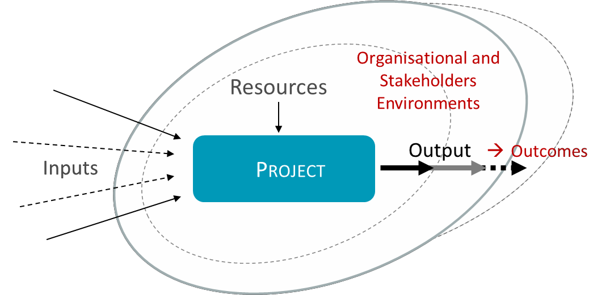

#### 2.1.2 Why we do projects 

Every project aims to introduce a new product/service or to improve an existing one. Achieving the goal is expected to bring about benefits to the organisation (e.g. a new organisation-wide document management system can increase productivity by introducing a new way of searching, reading and filing documents). A project can also be seen as a transformational process, which turns ideas into reality.

Projects may be carried out to maintain current business operations (e.g. sustain the current level of service), to transform business operations, or to improve the way of working so the organisation can be more efficient in the future.

Projects start for many different reasons:

- In response to a client request for a new product or service.
- In response to a market demand or opportunity for a new product or service.
- In response to a change in legislation or organisational needs.
- In response to an audit which outlines improvements that should be made.
- In response to a new product or service from a competitor.
- To make use of a new technology.
- To integrate processes in the light of the merger of two or more departments or organisations.
- To update an existing process.
- To relocate to new premises.
- To raise awareness on a topic.
- To provide a proof-of-concept.
- To migrate information to a new document management system.
- To improve an existing service.

#### 2.1.3 Project outputs, outcomes, benefits

Although project teams tend to focus their efforts on producing deliverables, it should be remembered that project deliverables are merely a means to an end. The real purpose of a project is to achieve given outcomes that will yield measurable benefits.

Therefore, it is important for everyone involved in managing and executing a project (managers and team members) to understand the relationship between project outputs, outcomes and benefits. They must be able to identify the outputs, outcomes and benefits of their projects. Without this understanding, the project participants can lose sight of the project's original purpose and produce deliverables, which are of little (or no) value to the organisation. Thus:

- Project outputs (deliverables) are products/services, which introduce something new (a change).
- The change results in an outcome.
- The benefits are the measurable improvements resulting from this outcome.

Note that project outcomes and benefits are often realised only after the project has closed.
The table below illustrates this with a simple example:

| Example of outputs, outcomes and benefits. |  |
| :-- | :-- |
| Project Output | Adoption of the PM ${ }^{2}$ Methodology within an organisation. |
| Project Outcomes | - Increased project quality.   - Improved visibility of project objectives, status and forecasts.   - Capability to have better control over contractor work and deliverables. |
| Project Benefits | - Project cost overruns decreased by 30\%   - Productivity increased by 30\%. |

### 2.2 About Project Management 

#### 2.2.1 What is Project Management?

Project Management can be described as the activities of planning, organising, securing, monitoring and managing the resources and work necessary to deliver specific project goals and objectives in an effective and efficient way.

The project management approach used should always be tailored to the needs of the project. When using PM², a Project Manager (PM) should use (and if needed after tailoring) only those parts that contribute to the effective management of their project.

#### 2.2.2 Project Documentation

Project documentation is a key activity in project management. It carries through from the start of a project to its completion. Project documentation:

- sharpens thinking by forcing people to put vague thoughts and plans into words
- crystallises planning
- defines the project scope for approval, ensuring that all project stakeholders and project team members share the same expectations on what is to be delivered and when
- provides all stakeholders with a clear picture of the project requirements
- facilitates communication with internal and external groups
- provides a baseline for monitoring and controlling a project's progress
- provides a record of important decisions
- provides the information required by official audits
- supports organisational memory and acts as a historical reference, which can be used to increase the chances of success of future projects.

Project documentation should of course, adhere to the quality standards of the organisation and the project regarding format, style, etc. However, above all, it should add value fulfilling its purpose and be clear and easy to understand.

#### 2.2.3 The Project Support Office (PSO)

A Project Support Office (PSO) is an organisational body (or entity) that provides services, which support project management. These can range from providing simple support functions to helping link projects to strategic goals. Not all organisations have a Project Support Office (PSO).A Project Support Office (PSO) can:

- offer administrative support, assistance and training to Project Managers (PMs) and other staff
- collect, analyse and report on project progress data and information
- assist with project scheduling, resource planning, coordination and Project Management Information System (PMIS) use
- maintain a central project repository (of Project Documents, Risks, Lessons Learned)
- coordinate configuration management and quality assurance activities
- monitor adherence to methodology guidelines and other organisational standards
- tailor the project management methodology to new best practices and help project teams implement the updated methodology effectively.

#### 2.2.4 Programme Management

A programme is a set of related projects and activities managed in a coordinated way to achieve strategic objectives and benefits that could not be obtained if they were managed individually. The projects within a programme all contribute to the common programme goals and are interdependent. In addition to projects, a programme often includes elements of related work (programme-level activities) outside the scope of its projects.

Programme management is different from multi-project management (managing many projects in parallel). Thus, while a Programme Manager ( PgM ) coordinates efforts between projects, s/he does not directly manage the individual projects.

#### 2.2.5 Project Portfolio Management

A project portfolio is a collection of projects, programmes and other activities, which are grouped together to allow better control over their financial and other resources and to facilitate their effective management

in terms of meeting strategic objectives. The projects or programmes in a portfolio are not necessarily inter-dependent on inter-related. From a strategic point of view, portfolios are higher-level components than programmes and projects. It is at the portfolio level that investment decisions are made, resources allocated, and priorities identified.

It is very important for people involved in project definition and management to understand the differences between-and specific management requirements of-projects, programmes and portfolios. They should also be able to define or position their work at the right level (i.e. know if their work would be better managed as a programme or a network of projects), while always being aware of the management and organisational context of their work (see Appendix D).
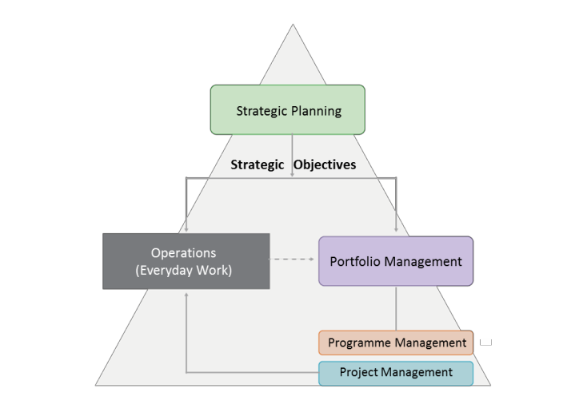

#### 2.2.6 Projects vs Operations 

Projects are temporary and should therefore have a definite start and end. A project should be considered complete when it is determined that its goals and objectives have been accomplished. Once this happens, the project team should be disbanded.

Operations, on the other hand, comprises the ongoing day-to-day activities undertaken by a permanent organisation to deliver services or products.

However, people often find themselves involved in so-called projects that have been going on for years, working with moving targets or a continuously expanded scope, which sometimes includes activities that should be classified as maintenance or operations. These are situations where the projects have been allowed to either become uncontrollable, or to move into operations (maintenance) mode.

In most projects, the operations period begins after the project's main products have been produced and accepted by the client.

How do you recognise that a project has slipped into operations mode?

- The main project deliverables have been produced and the client has accepted them.
- The main project output (deliverable) is in use.
- Support is provided to users.
- Maintenance activities are undertaken.
- Minor updates (improvements) are planned and implemented over time.

### 2.3 Project Environment 

#### 2.3.1 Project Organisation

It would be convenient to assume that all PM² Project Managers (PMs) operate within their organisations in a homogenous environment and with consistent levels of authority and responsibility. This is generally not the case, however.

There are typically several ways of organising projects within an organisation, which utilise one of the following structures or a combination of them.

**The Functional Structure**

In a functional organisational structure, project work is integrated into the work performed by the permanent organisation. Project members and other resources are borrowed from multiple sections of the functional organisation. The Project Manager (PM) tends to have limited authority and needs to involve senior management in the management of important project issues. Project work is often viewed as having lower priority than everyday work.

**The Projectized Structure**

On the other end of the spectrum, in a projectized organisation, there is only a basic permanent (functional) hierarchy, and all work is organised and performed within temporary project organisations. Project resources are brought together specifically for the purpose of a project and work more or less exclusively for the project. At the end of the project, resources are either reassigned to another project or returned to a resource pool.

**The Matrix Structure**

A matrix organisation is a blended organisational structure. Additional temporary project organisations are created alongside the functional hierarchy to achieve specific project goals and work. The role of the Project Manager (PM) is recognised as central and key to the project's success, and the Project Steering Committee (PSC) typically delegates enough authority and responsibility to the Project Manager (PM) and the Business Manager (BM) for them to manage the project and its resources. Matrix organisations can be further categorised as weak, balanced and strong matrix organisations, the difference being the level of authority and autonomy given to the project organisation.

#### 2.3.2 Developing Project Management Competences

Project management involves much more than creating schedules and budgets, and Project Managers (PMs) must have a wide range of technical and behavioural skills at their disposal.

To develop the competences required to manage projects effectively. Project Managers (PMs) need to:

- understand how projects are handled within the organisation (talk to colleagues)
- review any project methodologies, standards and frameworks that exist in the organisation
- follow a project management course (e.g. a course offered by a recognised PM² training provider)
- reflect on their project management-what is successful, what could be improved?
- become an active member of the PM² Community-participate in forum discussions and learn from questions asked by other Project Managers (PMs)
- talk to more experienced Project Managers (PMs) about how they run their projects.

It is up to the Project Manager (PM) to acquire these skills and invest in their project management skills set. Project management knowledge comes from study and practice, from discussing, sharing experiences and reflecting on what went well and what can be improved.

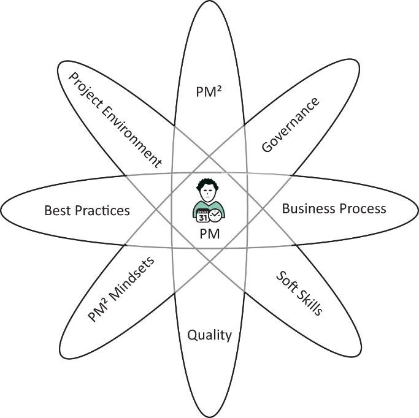

#### 2.3.3 Project Management Competences 

Project Managers (PMs) need to:

- understand the project management methodology used in their organisation (e.g. PM²)
- have the technical competences required to effectively manage the initiation, planning, execution, monitoring, controlling, and closing of a project.

On top of this, the role requires skills to work effectively with people and within the broader organisational context. These include the contextual and behavioural skills necessary to manage complex projects with diverse teams and stakeholder groups that have pluralistic and conflicting priorities.

Project Managers (PMs) thus also need to know/understand:

- how to communicate, lead, motivate, negotiate, solve problems and deal with issues, conduct meetings and workshops, report project status, etc.
- the business context and the general project environment (i.e. sociocultural, political, physical, etc.)
- organisational policies and standards (e.g. security, organisational architecture, audits, etc.)
- how the end-product or service will be maintained after it is delivered.

Additionally, subject-specific knowledge (e.g. IT, policy, etc.) is often relevant and useful to a Project Manager's (PM) role.

Most, if not all, of the above-mentioned points are also required of Business Managers (BM).
The table below lists the main competences for Projects Managers (PMs) and Business Managers (BMs):

| People Competences | Perspective Competences |
| :-- | :-- |
| - Self-reflection and self-management | - Strategy |
| - Personal integrity and reliability | - Governance, structures and processes |
| - Personal communication | - Compliance, standards and regulations |
| - Relationships and engagement | - Power and interest |
| - Leadership | - Change and transformation |
| - Teamwork | - Culture and values |
| - Conflict and crisis management |  |
| - Resourcefulness |  |
| - Negotiation |  |
| - Results orientation |  |

Source: IPMA-ICB (adapted)

The above competences may not necessarily be independent and each can have an impact on others. However, the filter that determines what is more important (e.g. self or common interest, time or quality, results or balance, etc.) lies in our values and ethics. Therefore, competences related to the appreciation of values and ethics have a prominent position compared to the rest because it is our ethical profile that guides us on how we should apply our competencies, and determines what we consider good or bad, right or wrong, in any given situation, decision and action.

Note that Project Managers (PMs) and Business Managers (BMs) should demonstrate these competencies effectively, consistently and appropriately to the given situation, while remaining aligned with organisational and professional values and ethics. The aim is to achieve the project goals by making (and acting on) the right decisions, at the right time, in the right way and for the right reasons. This can be a challenge for Project Managers (PMs), who often face tensions between making decisions based on goals and values, and meeting the needs of various stakeholders.

Such decisions and tensions become easier to manage when Project Managers (PMs) have developed an ethical disposition, which involves the balancing of goals and skills, personal integrity and moral virtue.

Although all virtues (logical and moral) affect all competences, the virtues of judgment, prudence and insightfulness are (comparatively) more related to demonstrating the perspective competencies, while the moral virtues of honesty, fairness, friendliness, generosity, temperance, courage, humour, and magnanimity and magnificence, are (comparatively) more related to demonstrating people competences (see Appendix F).

## 3 Overview of the PM² Methodology 

### 3.1 The House of PM²

The PM² Methodology is built on Project Management best practices and is supported by four pillars:

1. a project governance model (i.e. Roles \& Responsibilities)
2. a project lifecycle (i.e. Project Phases)
3. a set of processes (i.e. project management activities)
4. a set of project Artefacts (i.e. documentation templates and guidelines).

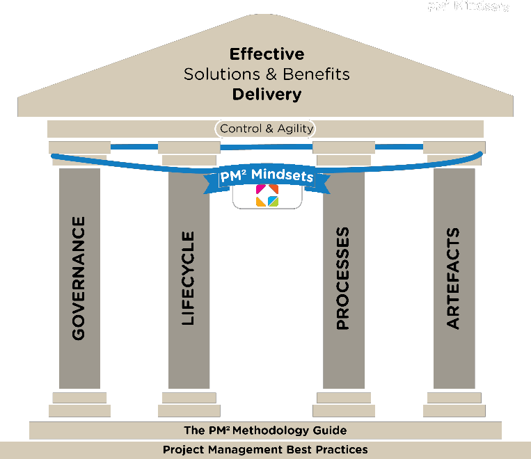

The spirit of the PM² Methodology is further defined by the PM² Mindsets, which provide the glue that holds together the PM² practices and provide a common set of beliefs and values for PM² project teams.

### 3.2 The PM² Lifecycle

The PM² project lifecycle has four sequential and non-overlapping phases with a different type of activity predominant in each phase (i.e. initiating activities are predominant in the Initiating Phase, etc.). However, while phase-related activities peak in terms of effort during a specific phase, activities of this type can also be executed during neighbouring phase(s) (e.g. planning activities are also repeated in the Executing Phase).

A project moves on to the next phase when the goals of its current phase have been deemed achieved as the results of a formal (or less formal) phase-exit review.
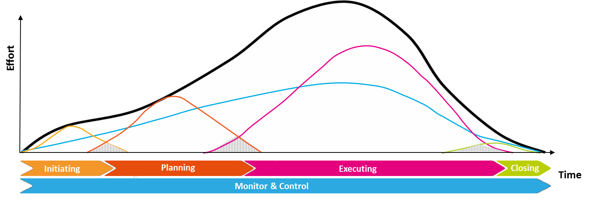

The focus of a project shifts from initiating and planning activities in the beginning to executing, monitoring and controlling activities in the middle and acceptance, transitioning and closing activities at the end.

Inexperienced project teams sometimes underestimate the importance of the work done in the initial project phases and start working on deliverables that are inadequately defined or planned. This results in the delivery of outputs, which are of poor quality and of little value to end-users. This is a common and costly mistake, which is often the root cause of overall project failure and the failure to realise the project's intended benefits. It is therefore important to invest adequate time during the Initiating Phase to define the desired outcomes by engaging a broad spectrum of stakeholders.

|  Project Phase | Description  |
| --- | --- |
|  1. Initiating | Define the desired outcomes. Create a Business Case. Define the project scope. Get the project off to a good start.  |
|  2. Planning | Assign the Project Core Team (PCT). Elaborate the project scope. Plan the work.  |
|  3. Executing | Coordinate the execution of project plans. Produce deliverables.  |
|  4. Closing | Coordinate formal acceptance of the project. Report on project performance. Capture Lessons Learned and post-project recommendations. Close the project administratively.  |

Monitor $\&$ Control

Oversee all project work and management activities over the duration of the project: monitor project performance, measure progress, manage changes, address risks and issues, identify corrective actions etc.

#### 3.2.1 Initiating Phase

The first phase of a PM² project is the Initiating Phase. During this phase, the people involved formulate the project's objective(s), ensure the project's alignment to the organisation's strategic objectives, undertake some initial planning to get the project off to a good start, and put together the information required to gain approval to continue to the Planning Phase. The main input of this phase is a (client) request to address a need, problem or opportunity.

The following activities are part of the Initiating Phase:

- Creation of the Project Initiation Request which contains information about the requestor, business needs and the desired project outcomes.
- Creation of the Business Case, which provides a business justification, defines the project's budgetary requirements, and outlines the business context, problem and project descriptions, alternative solutions, and a high-level roadmap.
- Creation of the Project Charter, which provides more details on the project definition in terms of scope, cost, time and risk. It also defines milestones, deliverables, project organisation, etc.

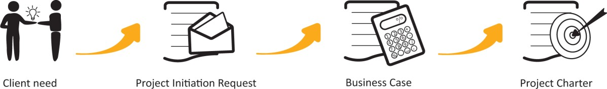

Fig 3.3 Overview of the Initiating Phase
The Business Case and Project Charter define the project's scope and direction. The Project Manager (PM) and the Project Core Team (PCT) reference and use both throughout the project.

At the end of the Initiating Phase, the Project Steering Committee (PSC) or other Appropriate Governance Body (AGB) reviews the above documents and decides whether to allow the project to move forward.

#### 3.2.2 Planning Phase 

The second phase of a PM² project is the Planning Phase. During the Planning Phase, the project's objective is developed into a specific and workable plan ready to be executed. The Project Work Plan specifies the project scope and appropriate approach, decides on a schedule for the tasks involved, estimates the necessary resources and develops the detail of the project plans. Several times during the Planning Phase, the Project Work Plan can be updated. Once agreed and finalised it is baselined and signed off.

The following activities are part of the Planning Phase:

- Running the Planning Kick-off Meeting to officially start the Planning Phase.
- Creating the Project Handbook, which defines the project's management approach.
- Developing the Project Work Plan (Work Breakdown, Effort and Costs, Schedule).
- Updating the Project Stakeholder Matrix, which identifies all project stakeholders.
- Creating other important plans such as the Communications Management Plan, the Transition Plan and the Business Implementation Plan.

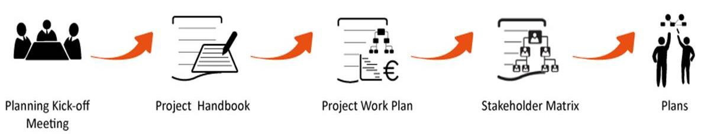

The Project Manager (PM) uses the outputs of the Planning Phase to request approval to move on to the Executing Phase. This decision to move on is taken by the Project Steering Committee (PSC).

#### 3.2.3 Executing Phase

The third phase of a PM² project is the Executing Phase. During the Executing Phase the project team produces the project deliverables (outputs) as outlined in the Project Work Plan. This is typically the stage of the project lifecycle that involves the most resources and requires the most monitoring.

The following activities are part of the Executing Phase:

- Running the Executing Kick-off Meeting.
- Distributing information based on the Communications Management Plan.
- Performing Quality Assurance (QA) activities as defined in the Quality Management Plan
- Coordinating project, work people and resources, and resolving conflicts and issues.
- Producing the project deliverables in accordance with the project plans.
- Handing over the deliverables as described in the Deliverables Acceptance Plan.

Once the project deliverables have been accepted by the Project Owner (PO), the Project Manager (PM) can request approval to move on to the Closing Phase. This decision to move on is taken by the Project Steering Committee (PSC).

#### 3.2.4 Closing Phase 

The final phase of a PM² project is the Closing Phase.
During a project's Closing Phase, the finished deliverables are officially transferred into the care, custody and control of the Project Owner (PO) and the project is administratively closed. Information on overall project performance and Lessons Learned is captured in the Project-End Report. The Project Manager (PM) ensures that the deliverables produced are accepted, all project documents are correctly filed and archived, and that all resources used by the project are formally released.

The following activities are part of the Closing Phase:

- Finalising all activities in order to formally close the project.
- Discussing the overall project experience and Lessons Learned with the project team.
- Documenting Lessons Learned and best practices for future projects.
- Closing the project administratively and archiving all project documents.

#### 3.2.5 Monitor \& Control

Monitor \& Control activities run throughout the project's lifecycle. During Monitor \& Control, all work is observed from the point of view of the Project Manager (PM). Monitoring is about measuring ongoing activities and assessing project performance against project plans. Controlling is about identifying and taking corrective action to address deviations from plans and to address issues and risks.

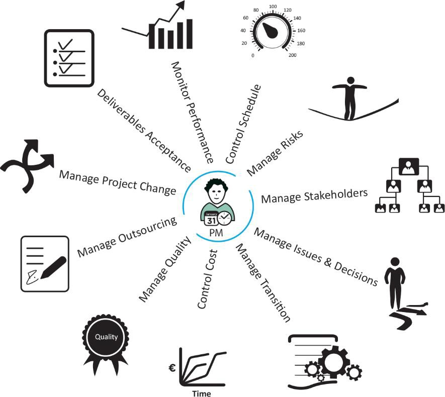

#### 3.2.6 Phase Gates and Approvals 

At the end of each phase, the project passes through a review and approval gate. This ensures that the project is reviewed by the appropriate people (i.e. the Project Manager (PM), Project Owner (PO), the Project Steering Committee (PSC) or other delegated role) before it moves on to the next phase. These checkpoints contribute to the overall project management quality and allow the project to proceed in a more controlled way.

**The three PM² phase gates are:**

- RfP (Ready for Planning): at the end of the Initiating Phase
- RfE (Ready for Executing): at the end of the Planning Phase
- RfC (Ready for Closing): at the end of the Executing Phase.

### 3.3 PM² Phase Drivers and Key Artefacts

Projects depend on people to define, plan and execute them. These project drivers change from phase to phase in a PM² project.

During the Initiating Phase, the Project Owner (PO) is the main driver, initiating the project and being accountable for all documentation.

In the Planning Phase, the main driver is the Project Manager (PM), who is responsible for coordinating the delivery of all project plans.

The carrying out of the Project Work Plan and creation of the project deliverables in the Executing Phase is driven by the Project Core Team (PCT).

Finally, the Closing Phase is driven by the stakeholders who evaluate the project's overall performance.

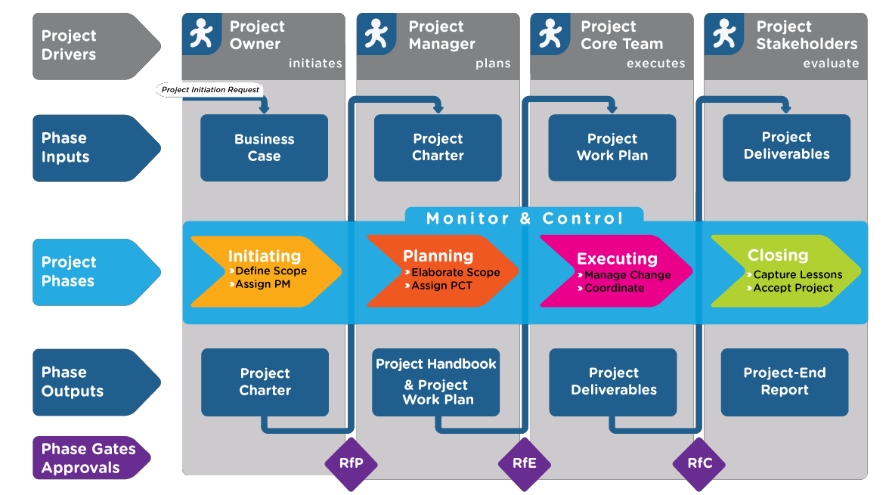

| Key Phase Input/Output | Description |
| :-- | :-- |
| Project Initiation Request | Formalises the commitment to explore a problem, need or   opportunity further and captures the context. |
| Business Case | Captures the reasoning behind the project, provides justification and   establishes the budgetary constraints. |
| Project Charter | Builds on the Business Case and defines the project scope, high-level   requirements and deliverables. |
| Project Handbook | Presents the project management objectives and overall management   approach. Documents the roles \& responsibilities. |
| Project Work Plan | Includes a breakdown of the work to be carried out, estimates of the   effort and costs involved, and the project schedule. |
| Project Deliverables | Lists the complete set of project deliverables as defined in the Project   Charter and Project Work Plan. |
| Project-End Report | Summarises the project experience, project performance and Lessons   Learned (successful project practices and potential pitfalls). |

### 3.4 What is a PM² Project 

Many PM² best practices can be applied to any type of project or work activity. However, to be able to apply the whole PM² Methodology, a project must have certain characteristics.

Thus, a PM² project:

- is (above all) a project (i.e. not operations, not a work activity, not a programme, etc.)
- has a duration of more than 4-5 weeks and involves more than 2-3 people
- runs within an organisation and can be subject to internal or external audits
- requires a clearly defined governance structure and clearly assigned roles and responsibilities
- requires approval of its budget and scope
- includes more than just construction/delivery activities
- includes transition and business implementation activities
- requires a certain level of documentation, transparency and reporting
- requires a certain level of control and traceability
- has a broad base of internal (and external) stakeholders
- may require the collaboration of several organisations or organisational units
- contributes to raising the organisation's project management maturity.

The number of the above characteristics, apparent in a project, drive the tailoring and customization that will have to be applied to the PM² methodology.

### 3.5 PM² Mindsets 

The PM² processes, artefacts, tools and techniques help project teams make decisions on trade-offs between a project's time, cost, scope and quality dimensions.

The PM² Mindsets are the attitudes and behaviours that help project teams focus on what is crucial to achieving their project's goals. They help project teams navigate the complexities of managing projects in organisations and make the PM² Methodology both more effective and complete.

Thus, Project Managers (PMs) and project teams that practise PM² :

1. Apply PM² best practices to manage their projects.
2. Remain mindful that project management methodologies are there to serve projects and not the other way around.
3. Maintain an outcomes orientation in relation to all projects and project management activities.
4. Are committed to delivering project results with maximum value rather than just following plans.
5. Foster a project culture of collaboration, clear communication and accountability.
6. Assign project roles to the most appropriate people for the benefit of the project.
7. Balance in the most productive way the often-conflicting project management "Ps" of product, purpose, process, plan, planet, people, pleasure/pain, participation, perception and politics.
8. Invest in developing technical and behavioural competences to become better project contributors.
9. Involve project stakeholders in the organisational change needed to maximise project benefits.
10. Share knowledge, actively manage Lessons Learned, and contribute to the improvement of project management within their organisations.
11. Draw inspiration from the PM² Guidelines on Ethics and Professional Virtues (see Appendix F).

To remain mindful of the PM² Mindsets, Project Managers (PMs) and project teams that practise PM² should ask themselves the following important Infrequently Asked Questions (IAQs):

- Do we know what we are doing? Tip: Develop a clear and shared project vision. Manage the project using a holistic approach and optimise the whole project, not just parts of it. Follow a process but stay Agile and try to regularly remind yourself why you are doing something.
- Do we know why we are doing it? Does anyone really care? Tip: Make sure your project matters. Understand its goals, value and impact, and how it relates to the organisational strategy. Define upfront what project success is and deliver maximum value and real benefits, not just outputs.
- Are the right people involved? Tip: People make projects work. The primary criterion for involving people and assigning project roles should be to serve the needs and objectives of the project, and not politics, friendship, functional hierarchy, proximity or convenience.
- Do we know who is doing what? Tip: Know what you should be doing, and make sure others know what they should be doing. Is it clear to everyone? Clearly define and understand roles, responsibilities and accountabilities.
- Deliver at any cost or risk? Tip: Show respect for people's work and organisational funds and avoid high-risk behaviour and tactics. Always keep in mind that it is not just about the end result - how you get there also matters. Manage your projects based on positive values and principles.
- Is this important? Tip: Everything is NOT equally important. Identify, and agree on, the project's Critical Success Criteria (CSC), Minimum Viable Product (MVP), and Critical Success Factors (CSFs), and allocate effort and attention both tactically and strategically for the benefit of both the project and project management goals.
- Is this a task for "them" or for "us"? Tip: Make sure that client and provider groups work as one team towards a common goal. Real teamwork really works; so foster clear, effective and frequent communication.
- Should I be involved? Tip: Contribute from any position. Be proud of the skills, value and positive attitude you bring to the project. Help everyone who needs to be involved get involved. Promote and facilitate the contributions of all stakeholders.

- Have we improved? Tip: Commit to ongoing self- and organisational improvement by gathering and sharing knowledge. Project teams should reflect on how they can become more effective and adjust their behaviour accordingly.
- Is there life after the project? Tip: The product (or service) lifecycle has just begun! Make sure you have contributed to its success.

The PM² Mindsets are the glue that holds the PM² processes and practices together. They provide a common set of beliefs and values for all PM² practitioners.

The PM² Mindsets:

- help project teams navigate through the complexities of project realities.
- help project teams (re)position project management goals in a wider organisational context.
- remind project teams what is important for project success.
- are useful reminders of effective attitudes and behaviours.

### 3.6 Tailoring and Customisation 

To ensure that the PM² Methodology effectively serves an organisation's and a project's needs, some level of tailoring or/and customisation may be required.

Tailoring refers to changing specific parts of the methodology, such as process steps, the content of artefacts, the distribution of responsibilities amongst the various roles, etc. Organisations do this to adapt the methodology to the specific needs of their structure and culture, and to align the methodology to organisational processes, policies, etc.

Tailoring makes more sense at the organisation/departmental level, but some tailoring can also take place at the project level, based, for instance, on the complexity, size or type of a project. In addition to any tailoring, further customisation may also be required at the project level to reflect the project's specific management needs. Examples of such customisations are the definition of decision thresholds for escalation, risk tolerances based on the risk appetite of the stakeholders, etc.

All tailoring and customisations should be documented in the Project Handbook.
The following guidelines should be considered when tailoring or customising the PM² Methodology:

- First, understand the purpose and value of the methodology element to be tailored, and then proceed with its tailoring.
- Avoid simplifying the methodology by eliminating whole chunks (e.g. a phase, a role, an activity or an artefact), but rather scale down (or up) the scope of that element.
- Balance the level of control a project needs against the extra effort such control requires.
- Eliminate waste (lean approach) but remain aligned with the spirit of the PM² Methodology as this is reflected by its four pillars and mindsets.
- Remember that the methodology was designed as an integrated whole, so avoid unnecessary deviations.

### 3.7 PM² and Agile Management

PM² recognises the complex and uncertain nature of many types of project and the positive contribution of the Agile way of thinking to their effective management.

Agile approaches meet various challenges, which often grow with the size of the organisations in which they are applied. These challenges may include coordination between Agile and non-Agile teams, compliance with various organisational governance and audit requirements, and organisational architecture and interoperability constraints.

**What is Agile?**

Agile is an approach to managing projects based on a specific set of principles and practices, which promote adaptive planning, evolutionary development, early incremental delivery and continuous improvement. It encourages rapid and flexible responses to change.

Agile takes into account the inherent uncertainty of the project environment and creates an organisation that is highly adaptive. It uses short feedback loops to allow for rapid responses to changes in product requirements and for ongoing improvements to processes.

Agile's key characteristics are:

- a focus on delivering value early on and frequently throughout a project
- decisions made based on what is known
- close cooperation among all parties involved
- continuous stakeholder involvement at all levels
- involving team members in planning
- incremental development with short cycles
- scope management through the continuous (re)prioritisation of tasks
- embracing change, continuous learning and improvement
- just enough documentation and control.

PM² provides a structure that helps Agile teams achieve the desired agility while still accommodating tight procurement and audit requirements, good coordination with programme and portfolio levels, and collaboration with other projects, contractors, other organisational units and external organisations (see Appendix D).

## 4 Project Organisation and Roles 

### 4.1 Project Stakeholders

Project stakeholders are people (or groups) who can affect, be affected by, or believe to be affected by the activities carried out during a project's lifecycle and/or by its output(s) and outcome(s). Stakeholders can be directly involved in a project's work, members of other internal organisations or external to the organisation (e.g. contractors, suppliers, users or the general public).

The number of stakeholders depends on the complexity and scope of a project. However, the more people the project has an impact on, the more likely it is that it will affect people who have some power or influence over the project. Given that stakeholders can be useful supporters of the project or may choose to block it, the effective management and involvement of them is crucial for its success.

### 4.2 Project Organisation: Layers and Roles

The diagram below provides an overview of the layers and main roles in project organisation from a project management point of view.
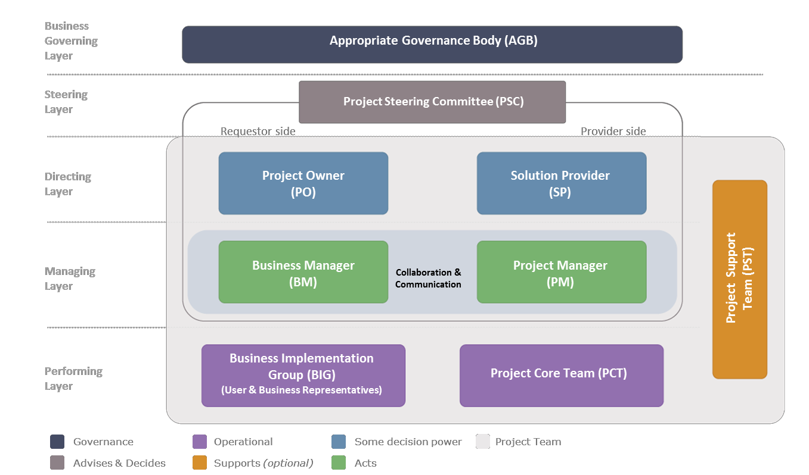

Note that there is only one project team, which is composed of the people assuming the roles defined in the Performing, Managing and Directing layers. For the project to succeed, these people need to work together as a team.

**Business Governing Layer**

The Business Governing Layer determines the vision and strategy for the organisation as a whole. It consists of one or more management committees operating at a high or the highest management level. It is here that priorities are defined, investment decisions are made, and resources are allocated.

**Steering Layer**

The Steering Layer provides general project direction and guidance. It keeps the project focused on its objectives. It reports to the Appropriate Governance Body (AGB). The Steering Layer is composed of the roles defined in the Directing and Management Layers plus other optional roles.

**Directing Layer**

The Directing Layer champions the project and owns its Business Case. It mobilises the necessary resources and monitors the project's performance in order to realise the project's objectives. The Directing Layer comprises the roles of Project Owner (PO) and Solution Provider (SP).

**Managing Layer** 

The Managing Layer focuses on day-to-day project management. It organises, monitors and controls work to produce the intended deliverables and implement them in the business organisation. Members of the Managing Layer report to the Directing Layer. The Managing Layer comprises the roles of Business Manager (BM) and Project Manager (PM). It is of utmost importance for the success of the project that there is close collaboration and good communication between these two roles.

**Performing Layer**

The Performing Layer carries out the project work. It produces the deliverables and implements them in the business organisation. Members of the Performing Layer report to the Managing Layer. The Performing Layer comprises the roles of the Business Implementation Group (BIG) and the Project Core Team (PCT).

### 4.3 Appropriate Governance Body (AGB)

The Appropriate Governance Body (AGB) is the entity responsible for the strategic planning and portfolio management. In terms of projects, this is the body with the authority to approve a project, agree its stated objective and release the funding required to implement it. As a key decision-making body, this role comprises members from the requestor and provider side of the project.

**Responsibilities**:

- Defines the corporate and business domain strategy.
- Agrees to and implements a portfolio management framework to achieve the strategic objectives.
- Identifies, evaluates and authorises programmes and projects for implementation.
- Monitors and controls portfolio delivery performance.
- Optimises and manages portfolio resources and benefits.

### 4.4 Project Steering Committee (PSC)

The Project Steering Committee (PSC) comprises at least the four roles in the Managing and Directing Layers, providing a balanced mix of requestor- and provider-side representatives. Other roles can also participate as per the project's needs.
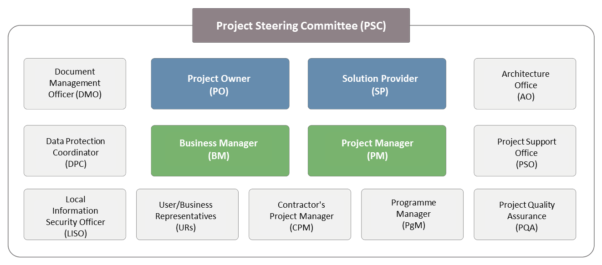

The Project Steering Committee (PSC) is chaired by the Project Owner (PO) and is the key decision-making and issue-resolution body for the project. Any significant decisions that may affect the project or the team's ability to deliver on the objectives will be escalated to the Project Steering Committee (PSC). Approval of key documents, resolution of important project issues or significant change requests will be discussed and decided upon here.

**Responsibilities:** 

- Champions the project and raises awareness of it at a senior level.
- Guides and promotes the successful execution of the project at a strategic level, keeping the project focused on its objectives.
- Ensures adherence to the organisation's policies and rules (e.g. IT governance, data protection, information security, document management, etc.).
- Provides high-level monitoring and control of the project.
- Authorises transition between Phases unless this is performed by the Appropriate Governance Body (AGB).
- Authorises deviations and scope changes with a high project impact and has the final say on decisions.
- Deals with escalated issues and conflicts.
- Approves key project artefacts (e.g. Project Charter, Project Work Plan).

**Optional Project Steering Committee (PSC) members:**

People with other roles can also participate in the Project Steering Committee (PSC) as per the project's needs. Some indicative roles are listed in the table below.

| Roles | Description |
| :-- | :-- |
| User Representative (UR) | Represents the interests of the project's users, ensuring that   project deliverables are fit-for-purpose. |
| Contractor's Project Manager (CPM) | Responsible for the outsourced parts of the project. |
| Architecture Office (AO) | Plays an advisory role on architectural aspects of IT projects. |
| Project Support Office (PSO) | Administers Project Steering Committee (PSC) meetings and   project documentation. Produces consolidated reports for   large projects. |
| Project Quality Assurance (PQA) | Responsible for quality assurance and auditing. |
| Document Management Officer (DMO) | Ensures the coherent implementation of document   management roles. |
| Data Protection Coordinator (DPC) | Consults and advises on data protection issues. |
| Local Information Security Officer (LISO) | Consults and advises on security issues. |

### 4.5 Project Owner (PO)

The Project Owner (PO) is the client of the project, and as such sets the business objectives and ensures that project outcomes are in line with business objectives and priorities. As the key Directing Layer role from the requestor side, the Project Owner (PO) is accountable for the overall project's success, and later becomes the owner of the project's outputs (product or service).

**Responsibilities:**

- Acts as the project champion, promoting the project's success.
- Chairs the Project Steering Committee (PSC).
- Provides leadership and strategic direction to the Business Manager (BM) and Project Manager (PM).
- Sets the business objectives and accepts the Business Case for the project.
- Owns the business risks and ensures that project outcomes are in line with business objectives and priorities.
- Mobilises the resources necessary for the project, in accordance with the agreed budget.
- Regularly monitors project progress.
- Coordinates the resolution of escalated issues and conflicts.
- Drives organisational change and monitors proper evolution and change implementation.
- Approves key project artefacts (Business Case, Project Charter, Project Handbook, Work Plan, Deliverables Acceptance Plan, Transition Plan, Business Implementation Plan).

4.6 Solution Provider (SP)

The Solution Provider (SP) assumes overall accountability for project deliverables and represents the interests of those who design, manage and implement (or outsource) the project's deliverables.

As the key Directing Layer role from the provider side, the Solution Provider (SP) usually has a management position in the functional hierarchy of the organisation undertaking the project, and therefore often works with the Project Owner (PO) in defining the project's business objectives.

**Responsibilities:** 

- Assumes overall accountability for the project deliverables and services requested by the Project Owner (PO).
- Mobilises the required resources from the provider side and appoints the Project Manager (PM).
- Approves the objectives of any outsourced activities and deliverables and becomes accountable for the contractor's performance.

### 4.7 Business Manager (BM)

The Business Manager (BM) represents the Project Owner (PO) on a daily basis within the project and helps in defining the project's business objectives via the Project Initiation Request, Business Case and Business Implementation Plan. The Business Manager (BM) collaborates closely with the Project Manager (PM) and coordinates client-side activities and roles (e.g. user and business representatives), ensuring that the project's deliverables fulfil the business and user needs.

**Responsibilities**:

- Guarantees cooperation and an efficient communication channel with the Project Manager (PM).
- Coordinates the Business Implementation Group (BIG) and acts as a liaison between the User Representatives (URs) and the provider organisation.
- Ensures that the products delivered by the project fulfil the user's needs.
- Manages the activities on the business side of the project and ensures that the required business resources are made available.
- Decides on the best way to introduce business change or re-engineering actions, when needed.
- Ensures that the business organisation is ready to accommodate the project's deliverables when they are made available by the Solution Provider (SP).
- Leads the implementation of the business changes within the user community.
- Coordinates the schedule and delivery of any user training (and production of related material).

### 4.8 Project Manager (PM)

The Project Manager (PM) oversees the project on a daily basis and is responsible for delivering highquality results within the identified objectives and constraints, ensuring the effective use of the allocated resources. More widely, the Project Manager's (PM) responsibility also includes risk and issue management, project communication and stakeholder management.

**Responsibilities**:

- Executes the project plans as approved by the Project Steering Committee (PSC).
- Coordinates the Project Core Team (PCT), ensuring the effective use of the allocated resources.
- Ensures that project objectives are achieved within the identified constraints, taking preventive or corrective measures where necessary.
- Manages stakeholder expectations.
- Oversees the creation of all management artefacts (except the Project Initiation Request, Business Case and Business Implementation Plan) and secures approval from the Project Owner (PO) or the Project Steering Committee (PSC).
- Ensures the controlled evolution, of products delivered, through proper change management.
- Performs risk management activities for project-related risks.
- Monitors project status and reports to the Project Steering Committee (PSC) on project progress at regular predefined intervals.
- Escalates unresolvable project issues to the Project Steering Committee (PSC).
- Liaises between the Directing and Performing Layers of the project.

### 4.9 Business Implementation Group (BIG) 

The Business Implementation Group (BIG) sits on the requestor side and consists of representatives of business and user groups. Coordinated by the Business Manager (BM), it is responsible for planning and implementing the business changes that need to be made for the organisation to effectively integrate the project deliverables into its everyday work.

**Responsibilities**:

- Analyses the impact of the project's implementation on ongoing operations, existing business processes, staff and organisational culture.
- Participates in the design and updating of affected business processes.
- Prepares the affected business area for the upcoming change.
- Advises the Business Manager (BM) on the organisation's readiness for change.
- Embeds the project deliverables into business operations and implements the organisational change activities that fall within the project's scope.

**User Representatives (URs)**

User Representatives (URs) represent the interests of the project's end-users and are part of the Business Implementation Group (BIG). It is important to designate User Representatives (URs) and involve them throughout the project, keep them up to date with developments and provide them with a sense of ownership. User Representatives (URs) help define project requirements and validate them at regular intervals, ensuring that the final deliverables are fit for the business purpose.

**Responsibilities**:

- Help define the business needs and requirements.
- Ensure that the project specifications and deliverables meet the needs of all users.
- Review the project specification and acceptance criteria on behalf of the users.
- Communicate and prioritise user opinions in the Project Steering Committee (PSC) and ensure that these opinions are taken into consideration when decisions are made whether or not to implement a proposed change.
- Participate in demonstrations and pilot phases as needed.
- Perform user acceptance tests.
- Sign off on user-related documents (requirements document, deliverable acceptance testing, etc.).
- Guarantee business stability during the transition towards the new operational state.

### 4.10 Project Core Team (PCT)

The Project Core Team (PCT) comprises the specialist roles responsible for creating the project deliverables. Its composition and structure depend on the project size and type (e.g. IT project, policy development project, etc.) and is defined by the Project Manager (PM) based on the project's needs.

Coordinated by the Project Manager (PM), the Project Core Team (PCT):

- Participates in developing the project scope and planning project activities.
- Carries out project activities based on the Project Work Plan and schedule.
- Produces project deliverables.
- Provides the Project Manager (PM) with information on the progress of activities.
- Participates in project meetings as needed and helps resolve issues.
- Participates in the Project-End Review Meeting during the collection of Lessons Learned.

Aside from the specialist roles that create the project deliverables, there are two specific Project Core Team (PCT) roles that deserve to be discussed in more detail from a project management point of view: the Contractor's Project Manager (CPM) and the Project Manager Assistant (PMA).

**Contractor's Project Manager (CPM)**

The Contractor's Project Manager (CPM) leads the contractor's staff working on the project, planning controlling and reporting on the production of outsourced deliverables. Working closely with the Project Manager (PM), the Contractor's Project Manager (CPM) ensures that all work is carried out on time and to the agreed standards, guaranteeing the successful completion and delivery of subcontracted activities.

**Project Management Assistant (PMA)** 

For large projects, the Project Manager (PM) might find it useful to delegate some management tasks to an assistant. This Project Management Assistant (PMA) can work on a range of coordination and supportive tasks as assigned by the Project Manager (PM), and acts as the Project Manager's (PM) backup in meetings, etc. However, the Project Manager (PM) remains the person responsible for all project management tasks and deliverables.

The Project Management Assistant (PMA) may also be part of a Project Support Team (PST) and assigned to the project.

### 4.11 Project Support Team (PST)

The Project Support Team (PST) is an optional role that consists of the people responsible for providing support to the project. Its composition and structure depend on the needs of the project. The Project Support Team (PST) is often composed of representatives from various horizontal services or units.

**Responsibilities**:

- Provides administrative support to the project.
- Defines requirements for reporting and communication.
- Administers Project Steering Committee (PSC) meetings and drafts related reports.
- Supports the Project Manager (PM) in planning, monitoring and controlling the project.
- Advises on project management tools and administrative services.
- Manages the project documentation (versioning, archiving, etc.).

**Project Support Office (PSO)**

The Project Support Office (PSO), also called Project Management Office or Project Office, is an optional structure that can provide services to project teams such as the application of the methodology and use of the artefacts, information systems, governance, logistics and various support.

**Project Quality Assurance (PQA)**

Assigned by the Project Steering Committee (PSC) and working independently of the Project Manager (PM), the Project Quality Assurance (PQA) ensures the high quality of the project and its deliverables, by reviewing processes and artefacts, identifying non-conformities with the set quality standards and recommending corrective actions. This is an optional role in an organisation, reporting directly to the Project Steering Committee (PSC), and may take the form of either a group or individual staff member.

**Other**

Depending on the project's nature and characteristics, the Project Support Team (PST) can be further extended and include representatives from other departments/units, e.g. Legal, Procurement, Data Protection, etc.

### 4.12 RAM (RASCI) - Documenting Responsibility Assignments 

The Responsibility Assignment Matrix (RAM) is a way of representing and clarifying the roles and responsibilities for a given activity. The RAM is also known as a RASCI table (pronounced rasky), which stands for:

| RASCI | Description |  |
| :-- | :-- | :-- |
| **R** | Responsible | Does the work. Others can be asked to assist in a supporting role. There is just   one responsible person for any given task. |
| **A** | Accountable | Ultimately answerable for the correct and thorough completion of the work.   There is just one accountable person for any given task. |
| **S** | Supports | As part of a team, roles with a support function work with the person   responsible. The support role helps complete the task. |
| **C** | Consulted | Those whose opinions are requested and with whom there is two-way   communication. The consulted role does not help complete the task. |
| **I** | Informed | Those who are kept informed of progress. |

Stakeholders should be reminded of their roles and responsibilities during the project. This Open PM² guide includes a RAM (RASCI) table for each artefact in the Initiating, Planning and Closing Phases and for each of the activities in the Executing Phase and in Monitor \& Control (see Appendix E).

Example: The RAM for the Standard PM² roles involved in creating the Business Case document.

| RAM (RASCI) | AGB | PSC | PO | BM | BIG | SP | PM | PCT |
| :-- | :--: | :--: | :--: | :--: | :--: | :--: | :--: | :--: |
| Business Case | I | C | A | R | C | S | S | n.a. |

**Notes:**

- Accountable: The Project Owner (PO) is accountable (S/he provide adequate resources).
- Responsible: The Business Manager (BM) is responsible for creating the Business Case.
- Supports: The Solution Provider (SP) and the Project Manager (PM) work with the Business Manager (BM) to develop the Business Case. The final responsibility, however, lies with the Business Manager (BM).
- Consulted: The Project Steering Committee (PSC) and User Representatives (URs) are consulted.
- Informed: The Appropriate Governance Body (AGB) will be informed about the outputs or status of the task (it will be provided with information).

## 5 Initiating Phase 

The first phase of a PM² project is the Initiating Phase. It begins with the identification of a need, problem or opportunity, and ends with the establishment of the plans and processes needed to take the project forward. Proper project initiation is critical for successful project planning and execution. It involves defining project objectives and constraints, and receiving formal organisational sponsorship for the project.
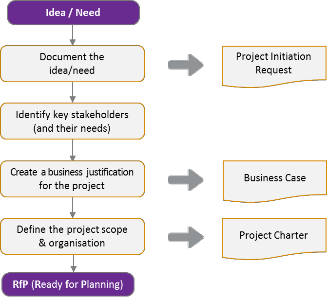

Three key project artefacts are created during the Initiating Phase: the Project Initiation Request, the Business Case and the Project Charter. Some of the Project Logs are also set up (i.e. Risk Log, Issue Log, Decision Log) while the Change Log is typically set up during the Planning Phase.
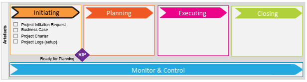

### 5.1 Initiating Meeting

This is an informal meeting, usually between the project initiator and the Project Owner (PO), and others who could potentially contribute to the creation of the Initiating Phase documents. The goal of this meeting is to introduce any pre-project information and discuss the next steps.

The result of this meeting is a better understanding of the context of the (future) project, as well as a decision to move forward with the creation of the Project Initiation Request. Documentation and lessons learned from previous similar projects can also be used as input to this meeting.

### 5.2 Project Initiation Request

The Project Initiation Request is a project's starting point and formalises its initiation. By creating a Project Initiation Request, the project initiator ensures that the current context/situation (i.e. problem, need or opportunity) and the project's desired outcomes are formally captured and can be used as a basis for further exploration and elaboration.

The Project Initiation Request contains basic information about the estimated effort and cost of undertaking the project as well as the timeframe for its completion and the type of delivery. Specifically, the document describes the impact the project is expected to bring and summarises the success criteria against which it will be evaluated. Additionally, the Project Initiation Request outlines the project's relevance to the organisation's strategic direction and highlights the key assumptions, constraints and risks as assessed at this stage.

|  Key Participants | Description  |
| --- | --- |
|  Initiator | Anyone can introduce a Project Initiation Request.  |
|  Project Owner (PO) | The main beneficiary of the project's outputs usually nominates a Project
Owner (PO).  |
|  Solution Provider (SP) | The organisational unit that will carry out the project work nominates a
Solution Provider (SP).  |
|  Approver | Depending on the project, the Project Owner (PO) or a higher-level
Appropriate Governance Body (AGB) can accept the Project Initiation
Request and authorise work on a more elaborate Business Case.  |

**Input**

- A problem, a need or an opportunity expressed by the initiator.

**Guidelines**

- Note that though anyone can initiate a Project Initiation Request, in many cases the Project Owner (PO) delegates its creation to the Business Manager (BM).
- Know your audience: Depending on the project size and the organisation's approval process, approval can be informal (i.e. the Project Owner (PO) accepts it), or formal (i.e. an Appropriate Governance Body (AGB) reviews and approves it).
- Ensure all the relevant information is included, but at this point limit details to high-level information-finer points will be added in the form of the Business Case and other Project artefacts.

**Steps (for a project's initiation)**

1. The Project Initiation Request is drafted.
2. The Project Initiation Request is submitted for approval to the relevant Governing or Steering Level role.
3. Once the Project Initiation Request is approved, the project is defined in more detail with a preliminary project scope description in the Business Case and further elaborated in the Project Charter.
4. The Solution Provider (SP) assigns the Project Manager (PM) and the Project Core Team (PCT). The Project Manager (PM) is typically assigned after the Business Case is approved (or at the latest before the completion of the Project Charter), while the Project Core Team (PCT) is typically assigned before the Planning Kick-off Meeting.

The lifecycle of the Project Initiating Request ends with the creation of the Business Case and Project Charter. All the information included in the Project Initiation Request is copied over, updated and further elaborated in these two documents, which remain "live" until the end of the project.

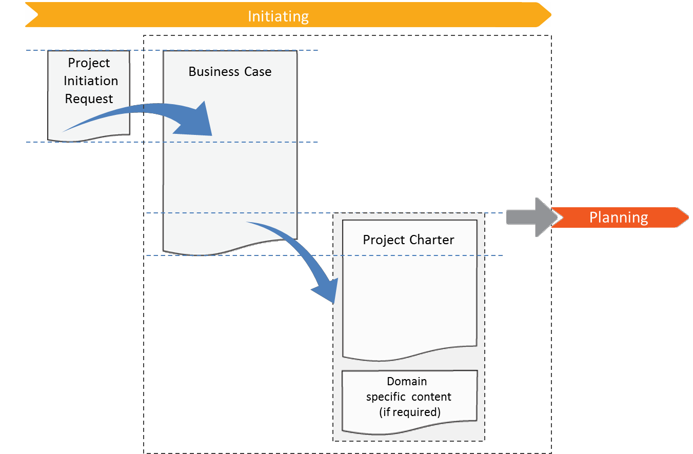

| RAM (RASCI) | AGB | PSC | PO | BM | BIG | SP | PM | PCT |
| :-- | :--: | :--: | :--: | :--: | :--: | :--: | :--: | :--: |
| Project Initiation Request | I | n.a. | A/S | R | S/C | I | n.a. | n.a. |

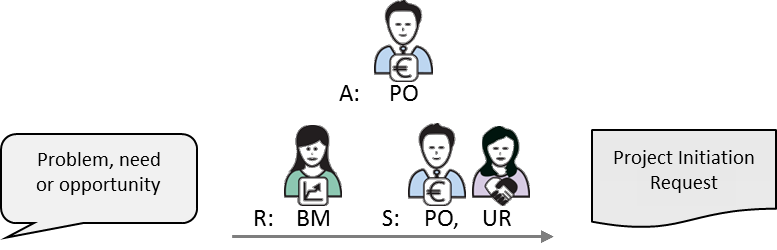

**Outputs** 

- Project Initiation Request

### 5.3 Business Case 

The purpose of the Business Case is to capture the reasoning behind the project, to describe the project's alignment with the organisation's strategic objectives, to provide a justification for the investment in time and effort, and to set out the budgetary needs. For larger strategic projects, the Business Case may also include an assessment of impact and risks along with a more detailed cost-benefit analysis.

The Business Case provides decision-makers with the information they need to determine whether the project is worth doing. The Business Case is a living document and therefore should be re-examined at critical project milestones to check that the expected benefits are still achievable, the costs/schedule fall within the budget/timeline, and the project is still relevant to the organisation and should be continued.

| Key Participants | Description |
| :-- | :-- |
| Project Owner (PO) | Accountable for the Business Case. |
| Business Manager (BM) | Creates the Business Case, supported by the Solution Provider (SP) and   the Project Manager (PM) (if known). |
| Other project stakeholders | Consulted in defining the project's Business Case |
| Approver | A preliminary Project Steering Committee (PSC) or a higher-level   Appropriate Governance Body (AGB) |

**Inputs**

- Project Initiation Request

**Guidelines**

- Note that the form and depth of analysis required for this artefact depends on the level of investment required for the project.
- Consider several solutions that fulfil this business need and recommend one of these.
- Describe the overall approach to how the project will be executed (project strategy).
- Identify measurable criteria that will be used to determine the success of the project.
- For projects carried out under contract (e.g. as a result of a bid award), create the Business Case based on the Request for Proposal, the response to this request, and the contract itself.

**Steps**

1. The Business Manager (BM) drafts the Business Case based on the information captured in the Project Initiation Request. The main project aspects to be analysed and presented are:

- the project's justification and impact
- the project's positioning in the overall organisational strategy
- an assessment of Strengths, Weaknesses, Opportunities and Threats (SWOT Analysis) of several solutions, one of which is proposed for implementation
- a cost benefit analysis, per identified solution, detailed to the extend required
- synergies and interdependencies with other projects and initiatives
- high-level project roadmap, including major milestones.

2. The Project Owner (PO) evaluates the Business Case and decides to approve or reject it.
3. The Project Owner (PO) sends the Business Case to the Appropriate Governance Body (AGB) if needed for corporate approval.

| RAM (RASCI) | AGB | PSC | PO | BM | BIG | SP | PM | PCT |
| :-- | :--: | :--: | :--: | :--: | :--: | :--: | :--: | :--: |
| Business Case | I | C | A | R | C | S | S | n.a. |

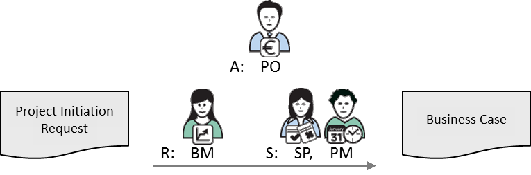

| Related Artefacts | Initiating | Planning | Executing | Monitor \& Control | Closing |
| :-- | :--: | :--: | :--: | :--: | :--: |
| Benefits Management | Business Case | Business Implementation Plan | Project Reports | Business Implementation Checklist | Project-End Report |

**Outputs** 

- Business Case

### 5.4 Project Charter 

The Project Charter provides a basis for the more detailed project planning. It defines the project's objectives (i.e. scope, time, cost, quality), high-level requirements, risks and constraints, as well as the project milestones and deliverable(s).

The charter is a key element of the project approval process (along with the Business Case). It includes the what, how and when fundamentals of the project and provides a baseline against which progress can be measured. Although the Project Charter can be initiated by the Business Manager (BM), it is ultimately the responsibility of the Project Manager (PM) to complete it and submit it for approval.

| Key Participants | Description |
| :-- | :-- |
| Project Manager (PM) | Develops the Project Charter. Should be assisted by the Business Manager   (BM) and the Solution Provider (SP). |
| Project Owner (PO) | Reviews and approves the Project Charter. |
| Decision-making Body | The Appropriate Governance Body (AGB) provides the corporate-level   approval of the Project Charter. |

**Inputs**

- Project Initiation Request
- Business Case

**Guidelines**

- The Project Charter should be brief so that it can be sent to project stakeholders as soon as possible, and so that it is easy for them to review and understand.
- Avoid presenting detailed requirements. Instead present high-level needs and features.
- Detailed requirements may be captured in other artefacts (e.g. in a Requirements Document), or in an appendix to the Project Charter to be elaborated during the planning phase.
- Ensure that input from all concerned project stakeholders is considered.
- Ensure that once created, the Project Charter is updated and distributed as required.

**Steps**

1. The Business Manager (BM) will first consult the main project stakeholders and takes part in drafting the Project Charter.
2. The Project Manager (PM) is responsible for delivering the document.
3. The main project stakeholders review the Project Charter and the Project Steering Committee (PSC) accepts it.
4. The Project Owner (PO) sends the Business Case and Project Charter to the appropriate decision-making body for additional approval, if needed.
5. The appropriate decision-making body evaluates and accepts or rejects the Project Charter.

| RAM (RASCI) | AGB | PSC | PO | BM | BIG | SP | PM | PCT |
| :-- | :--: | :--: | :--: | :--: | :--: | :--: | :--: | :--: |
| Project Charter | I | A | C | S | C | S | R | C |

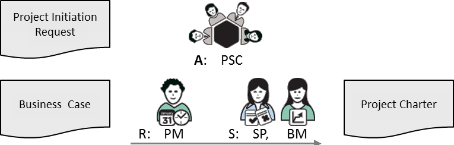

| Related Artefacts | Initiating | Planning | Executing | Monitor \& Control | Closing |
| :-- | :--: | :--: | :--: | :--: | :--: |
| Scope Management | Business Case | Project Work Plan | Change Requests Project Reports | Project Logs | Project-End Report |

**Outputs**

- Project Charter

### 5.5 Phase Gate RfP (Ready for Planning) 

This is the first phase gate. A review and approval are recommended before the project can formally move to the next phase. The Project Manager (PM) assesses whether the project is ready to commence the Planning Phase and seeks approval of the Business Case and Project Charter from the Project Steering Committee (PSC). If the Business Case or Project Charter is not approved, the project proceeds directly to the Closing Phase for Lessons Learned and archiving.
PM² provides a template Phase Exit Review Checklist for each phase that can be used by the Project Manager (PM) to guide the assessment, alongside a review of the phase's specific goals.

## 6 Planning Phase 

The second phase of a PM² project is the Planning Phase. It begins with the Planning Kick-off Meeting and ends once all project plans have been developed and baselined, and an appropriate management and implementation approach has been established. Most of a project's artefacts are created during the Planning Phase.

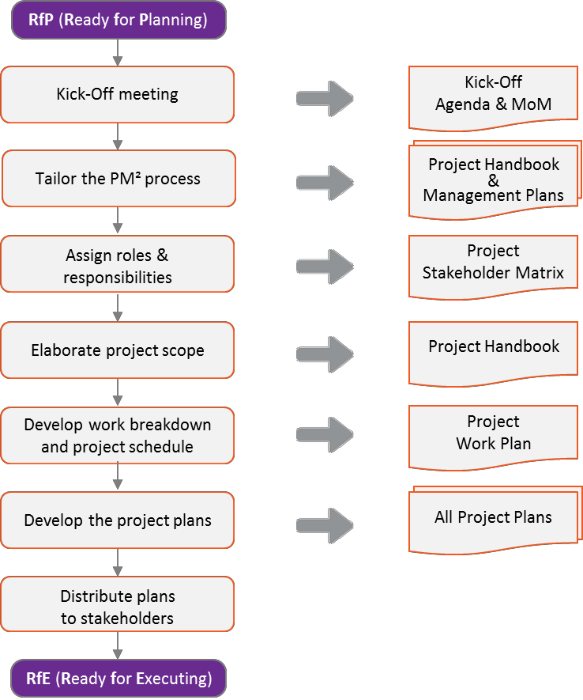

| Artefact Type | Description |
| :--: | :--: |
| Management Plans (standard) | These plans define the various processes to be used (e.g. for Risk Management). PM² provides Management Plan templates along with guidelines on how to tailor and customise them to the project's context and needs. |
| Project Plans (specific) | These plans are specific to the project (e.g. the Project Work Plan) and are built according to the project needs and the team's analysis and experience. PM² provides templates and guidelines for these plans. |
| Other   (domain specific) | These artefacts are specific to the project domain (e.g. system models for IT projects). PM² does not provide templates for these artefacts. |

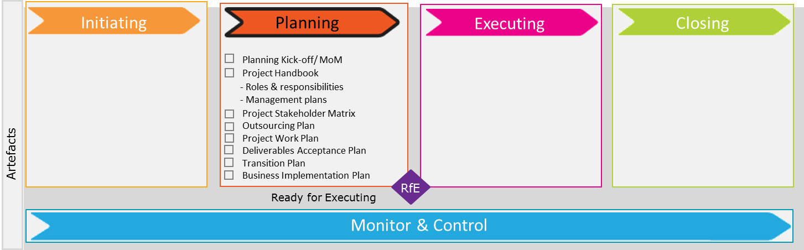

### 6.1 Planning Kick-off Meeting 

The Planning Phase starts with an official Planning Kick-off Meeting, the aim of which is to:

- ensure that everyone understands the project scope
- clarify the expectations of all key project stakeholders
- identify project risks
- discuss the project plans.

At this early stage, past experiences, and especially Lessons Learned from previous similar projects, will significantly help the project team.

This Planning Kick-off Meeting should be planned and run effectively as it is critical that the project goals are well understood. PM² provides templates for the Meeting Agenda and the Minutes of Meeting (MoM).

| Key Participants | Description |
| :-- | :-- |
| Project Manager (PM) | Organises the meeting. |
| Project Core Team (PCT)   Business Implementation Group (BIG)   User Representatives (URs)   Solution Provider (SP)   Project Owner (PO)   Business Manager (BM) | Required participants. |
| Project Manager Assistant (PMA)   Project Support Office (PSO) | Required to attend (if part of the project). |
| Other project roles or stakeholders | Optional participation (as per the project's needs). |

**Inputs**

- Business Case
- Project Charter

**Steps**

Before the Planning Kick-off Meeting:

1. Plan the meeting.
2. Draft the Meeting Agenda clearly indicating the points to be discussed.
3. Send out the Meeting Agenda in advance.
4. Ensure the attendance of required participants.
5. Address any logistical needs and prepare documentation or hand-outs for the meeting.

During the Planning Kick-off Meeting:

1. Introduce the meeting participants.
2. Ensure a minute-taker is identified to make notes identifying action items. These will be compiled and sent to participants after the meeting.
3. Walk the participants through the Project Charter so they understand the project scope.
4. Outline the goals, expectations and activities of the Planning Phase and discuss the planning timeline.
5. Describe and discuss the project roles and responsibilities.
6. Discuss the project timeline.
7. Discuss the overall approach to the project. This discussion can be a brainstorming session within the limits set by the Project Charter.
8. Discuss the project plans needed for the project. The final set of required project plans will be documented in the Project Handbook.
9. Discuss risks, constraints and assumptions.
10. Discuss or present any project supporting tools (with input from the Project Support Office, PSO).
11. Allow time for any other business (questions \& answers).
12. Summarise the discussion (decisions, actions and risks).
13. Communicate the next steps.

After the Planning Kick-off Meeting:

1. Distribute the Minutes of Meeting (MoM) to the appropriate stakeholders (as identified in the Project Charter).
2. The Minutes of Meeting (MoM) should include a summary of project issues raised, risks identified, decisions taken and changes proposed. note that the issues, risks, decisions and project changes should also be recorded in the relevant logs.

| RAM (RASCI) | AGB | PSC | PO | BM | BIG | SP | PM | PCT |
| :-- | :--: | :--: | :--: | :--: | :--: | :--: | :--: | :--: |
| Planning Kick-off Meeting | I | A | C | S | C | C | R | C |

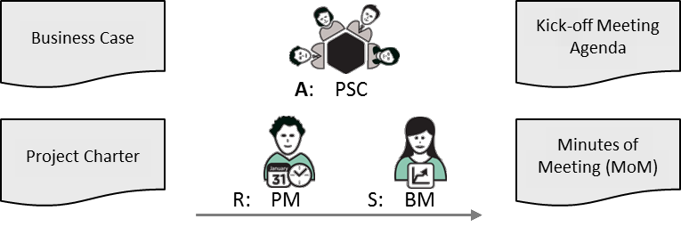

**Outputs** 

- Kick-off Meeting Agenda
- Minutes of Meeting (MoM)

### 6.2 Project Handbook

The Project Handbook summarises the project objectives and documents the selected approach for achieving the project goals. It documents the Critical Success Factors (CSFs), defines the key controlling processes, the conflict resolution and escalation procedure, policies and rules, and the project mindsets.

The Project Handbook also documents the project governance roles and their responsibilities, and defines the plans necessary for managing the project as well as any methodology-tailoring decisions. The project goals and scope (found in the Initiating Phase documents) are key inputs to this artefact.

The Project Handbook is an important reference document for all project members and stakeholders, and along with the Project Work Plan, is the basis on which the project is managed and executed.

|  Key Participants | Description  |
| --- | --- |
|  Project Manager (PM) | Prepares the Project Handbook.  |
|  Business Manager (BM) | Involved in defining the document's key elements.  |
|  Other project stakeholders | Review the Project Handbook.  |
|  Project Core Team (PCT) | Consulted in developing the document.  |

**Inputs**

- Business Case and Project Charter
- Planning Kick-off Minutes of Meeting (MoM)

**Guidelines**

- Use the minutes from the Planning Kick-off Meeting as a basis for defining the Project Handbook.
- The Project Handbook should be kept up-to-date throughout the life of the project.
- All Project Management Plans should be considered part of the Project Handbook.
- During the Closing Phase, the Project Handbook is an important point of reference for the ProjectEnd Review Meeting and should be properly archived.

**Steps**

1. Find documentation from similar projects and identify possible reusable components-this could reduce the effort, cost and time required.
2. Summarise the project objectives, dependencies, constraints, assumptions and list stakeholders.
3. Identify Critical Success Factors (CSFs) and define important project management objectives.
4. Discuss possible/necessary customisations and/or tailoring of the PM² Methodology.
5. Outline the selected delivery approach and its lifecycle (including project-specific stages).
6. Define the specific project management rules that will be applied to the project (agree on the rules of conduct that will facilitate the better management and execution of the project).
7. Define a conflict resolution and escalation procedure for the project.
8. Highlight the main project controlling processes, such as change/risk/quality management.
9. Define the selected progress tracking and reporting approach.
10. Determine which artefacts (i.e. plans, reports or other documents) are necessary for the project.
11. Document the roles involved in the project along with their respective responsibilities.

| RAM (RASCI) | AGB | PSC | PO | BM | BIG | SP | PM | PCT |
| :-- | :--: | :--: | :--: | :--: | :--: | :--: | :--: | :--: |
| Project Handbook | I | I | A | S | C | I | R | C |

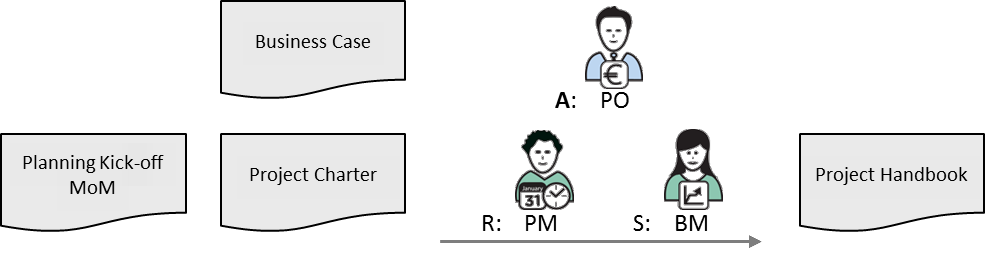

**Outputs** 

- Project Handbook

#### 6.2.1 Project Roles \& Responsibilities

The main purpose of the Project Roles \& Responsibilities section of the Project Handbook is to document the roles and responsibilities for the project. Any deviations from the standard PM² Roles \& Responsibilities should be justified and documented, and any new roles defined with their responsibilities clearly described. Based on this, the Project Stakeholder Matrix can be tailored to the project and named people assigned to all project roles (preliminary information is taken from the Project Charter).

#### 6.2.2 Project Management Plans

PM² suggests several Project Management Plans (artefacts) which outline the various project management processes. These plans identify how an organisation manages relatively standard processes. These plans are the:

1. Requirements Management Plan
2. Project Change Management Plan
3. Risk Management Plan
4. Quality Management Plan
5. Issue Management Plan
6. Communications Management Plan

Depending on the organisation and the project, different levels of documentation detail may be required. When sufficient, a brief definition of each management process or plan can be provided in the Project Handbook. When a more extensive and detailed description is needed, separate management plans can be instituted based on the PM² templates and guidelines provided.

#### 6.2.3 Project-Specific Plans

PM² defines a set of recommended project plans, which can be used for any type of project and provides templates and guidelines for each. However, in contrast to the standard Management Plans, which only require light customisation and tailoring, the Project-Specific Plans usually require more effort because their content is specific to the project.

The optimal level of detail included in Project-Specific Plans depends on the type, size and complexity of the project, the project management context and environment, and the experience and competences of the project team.

All Project-Specific Plans to be used in a project should be listed in the Project Handbook.

#### 6.2.4 Domain-Specific Artefacts 

These plans are specific to the project domain (i.e. the project type) and are very often an integral part of the project planning and the overall project documentation. No templates are provided by PM².

However, the artefacts should still be identified and listed in the Project Handbook, as they are part of the project's planning-phase outputs. Examples of domain-specific artefacts include system designs (for IT projects), architectural layouts (for renovation/moving projects) and laws/policies (for policy projects).

6.2.5 Other

Escalation Procedure: An escalation procedure and tolerances should be defined (and tailored) in the Project Handbook. This should be referenced by the Management Plans to ensure that a consistent approach is applied.

The purpose of the escalation procedure is to provide an agreed and effective way for escalating issues and decisions when this is required. For example, it documents how important issues can be raised to a higher level of management for resolution. This ensures that the appropriate level of management is involved (or at least informed) if an issue cannot be resolved at a lower level.

Resource Needs: The Project Handbook must also define how the resources (people and equipment) allocated to the project will be used to serve the project's best interests.

As the work to be done becomes clearer, the skills needed to perform the work will also have to be recorded in the Project Handbook. A Training Plan can be annexed to the Project Handbook if personnel need to be trained in missing skills. If more people with these skills need to be hired, the hiring process must be described in the same section of the Handbook. Finally, the way resources will be released at the end of the project (or when their work is complete) must also be formalised here.

### 6.3 Project Stakeholder Matrix

The Project Stakeholder Matrix lists all (key) project stakeholders and their contact details and clearly states their role(s) in the project. It may also include a classification or categorisation of each stakeholder. The information captured in the Project Stakeholder Matrix should be tailored to the project's needs.

| Key Participants | Description |
| :-- | :-- |
| Project Manager (PM) | Prepares the Project Stakeholder Matrix. |
| Business Manager (BM) | Assists the Project Manager (PM), particularly with the identification of   stakeholders on the client side. |
| Other project stakeholders | Consulted on the identification of stakeholders. |

**Inputs**

- Business Case and Project Charter
- Planning Kick-off Minutes of Meeting (MoM)

**Guidelines**

PM² provides a Project Stakeholder Matrix template. The template includes the standard project roles organised into the following groups:

- Teams-e.g. Project Steering Committee (PSC).
- Roles-e.g. Project Owner (PO), Solution Provider (SP), User Representatives (URs).
- Support-e.g. Project Support Office (PSO), Project Manager Assistant (PMA).
- Operational roles-e.g. user, business analyst.
- Other domain-specific-e.g. architect.

Note: Be careful to respect all applicable regulations on privacy and personal data rights when establishing and handling the Project Stakeholder Matrix.

**Steps** 

1. Using the project's organisational structure, identify everyone who will have a role in the project.
2. Assign each person a specific role for the duration of the project, based on the PM² standard Roles \& Responsibilities.

| RAM (RASCI) | AGB | PSC | PO | BM | BIG | SP | PM | PCT |
| :-- | :--: | :--: | :--: | :--: | :--: | :--: | :--: | :--: |
| Matrix | I | I | A | S | C | I | R | C |

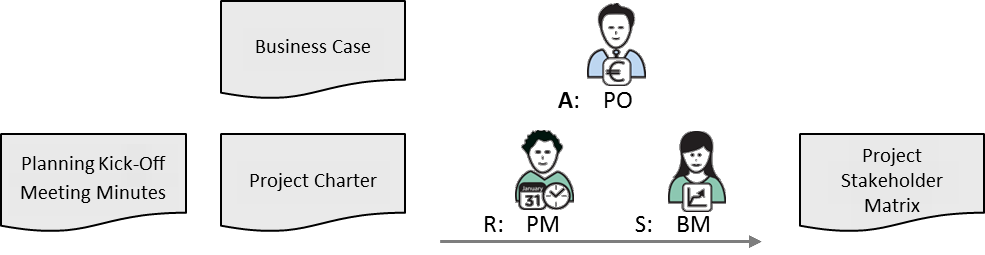

| Related Artefacts | Initiating | Planning | Executing | Monitor \& Control | Closing |
| :--: | :--: | :--: | :--: | :--: | :--: |
| Stakeholder   Management | Business Case   Project Charter | Project Handbook   Outsourcing Plan   Communications   Management Plan | Project   Reports | Project Logs   Stakeholders   Checklist | Project-End   Report |

**Outputs**

- Project Stakeholder Matrix

### 6.4 Project Work Plan 

The Project Work Plan further elaborates the project scope and identifies and organises the project work and deliverables needed to achieve the project goals. It establishes a basis on which to estimate the project's duration, calculate the required resources, and schedule the work. Once the tasks are scheduled, the Project Work Plan is used as a basis for monitoring progress and controlling the project. The Project Work Plan should be baselined but also kept up-to-date during the life of the project and capture all project related work as identified during planning phase or emerged during the executing phase (e.g. risks, issues, corrective actions etc.)

| Key Participants | Description |
| :-- | :-- |
| Project Manager (PM) | Coordinates all activities in the development of the Project Work Plan. |
| Project Core Team (PCT) | Assists the Project Manager (PM). |
| Project Support Office (PSO) | May provide technical advice (e.g. for scheduling). |

**Inputs**

- Business Case and Project Charter

**Steps**

The Project Work Plan is composed of three parts:

1. Develop the Work Breakdown: This provides a hierarchical breakdown (subdivision) of all the work that must be done to meet the needs of the customer. Outlining the tasks enables an estimation of their effort and cost requirements.
2. Develop the Effort \& Cost Estimates: These outline expectations of the resources needed and the time required to complete each project task, within the constraints of resource availability and capabilities. The effort and duration estimates are used to create the project schedule and budget.
3. Develop the Project Schedule: This identifies dependencies between tasks, pinpointing their start and end dates, which is then used to establish the overall project duration.

| RAM (RASCI) | AGB | PSC | PO | BM | BIG | SP | PM | PCT |
| :--: | :--: | :--: | :--: | :--: | :--: | :--: | :--: | :--: |
| Project Work Plan | I | A | C | S/C | C | C | R | S/C |

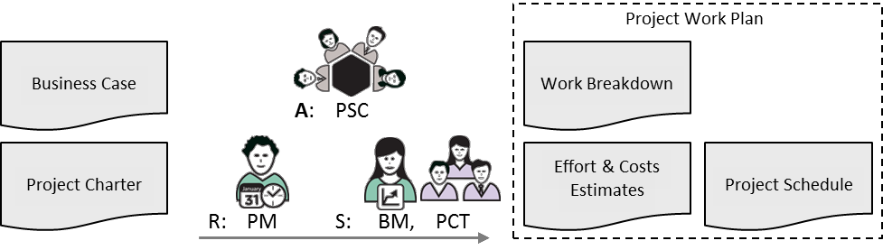

| Related Artefacts | Initiating | Planning | Executing | Monitor \& Control | Closing |
| :--: | :--: | :--: | :--: | :--: | :--: |
| Schedule and Cost   Management | Business Case \&   Project Charter | Project Work Plan.   (Work Breakdown, Effor   \& Costs, Schedule) | Project   Reports | Project Work Plan   Project Logs | Project-End   Report |

**Outputs**

- Project Work Plan

#### 6.4.1 Work Breakdown 

The objective of this section of the Project Work Plan is to break the project down into smaller and more manageable components such as deliverables, work packages, activities and tasks. The breakdown has multiple levels, each with progressively more detailed deliverables and work. Taken together, these define the project output(s) and the work involved in producing them (see Appendix C).

**Inputs**

- Business Case and Project Charter
- Project Requirements

**Outputs**

- Work Breakdown (part of the Project Work Plan)

#### 6.4.2 Effort \& Cost Estimates

The objective of this section of the Project Work Plan is to estimate the effort needed for each project task identified in the Work Breakdown based on resource availability and capabilities. After a task is assigned to a resource (or to a resource profile) it also becomes possible to calculate its cost. The estimates will be an input for the creation of the schedule (see Appendix C).

**Inputs**

- Project Work Plan (Work Breakdown)

**Outputs**

- Effort \& Cost Estimates (part of the Project Work Plan)

6.4.3 Project Schedule

The objective of this section of the Project Work Plan is to document the dependencies between tasks, pinpoint their start and end dates, and work out the overall project duration. Detailed scheduling can be done for the entire project upfront, or alternatively, worked out (in adequate detail) only for some early parts of the Executing Phase, and then progressively developed in full detail. The Project Manager (PM) uses the schedule to authorise, coordinate and accept project work, and to monitor overall progress (see Appendix C).

**Inputs**

- Project Charter
- Project Work Plan (Work Breakdown, Effort \& Cost Estimates)

**Outputs**

- Project Schedule (part of the Project Work Plan)

### 6.5 Outsourcing Plan 

The Outsourcing Plan defines the what and how for any outsourced products or services. It outlines the scope of products and/or services to be purchased or contracted, identifies the outsourcing strategies that will be used, and defines the relevant responsibilities for the full outsourcing lifecycle. Note that the present plan should be compliant with the relevant organisational rules and procedures.

| Participants | Description |
| :-- | :-- |
| Project Manager (PM) | Prepares the Outsourcing Plan. |
| Solution Provider (SP) | Reviews the plan. |

**Inputs**

- Business Case and Project Charter
- Project Work Plan
- Project Handbook
- Relevant organisational procurement rules and procedures

**Steps**

1. Identify the deliverables and activities that need to be outsourced, along with the timeframe within which the outsourcing should take place.
2. Decide who can interface with the contractors and who is responsible for signing the contract. Note that there might be organisation-level rules on contracting to be followed.
3. List the evaluation criteria for contractors. This ensures that a contractor is selected on the basis of pre-set criteria and that no single person or group influences the decision. The criteria could include the following: capability, previous experience in similar projects, anything else of relevance.
4. Identify any constraints that may affect the outsourcing process (an organisation's pre-existing agreements or preferred suppliers may require the project team to work with specific suppliers or contractors).
5. Identify the method(s) by which new products may be obtained (i.e. lease/purchase, tendering process). Factors like time/capacity constraints may also influence the choice of method.
6. Identify the people within the organisation who must approve purchases.
7. Provide a timeline for all the contracted activities and deliverables. This will ensure that the contractor is committed to having resources available to meet the pre-agreed timeline.
8. Identify any documentation deliverables expected from the contractors (e.g. manuals, etc.).

| RAM (RASCI) | AGB | PSC | PO | BM | BIG | SP | PM | PCT |
| :-- | :--: | :--: | :--: | :--: | :--: | :--: | :--: | :--: |
| Outsourcing Plan | A | C | C | C | I | S | R | I |

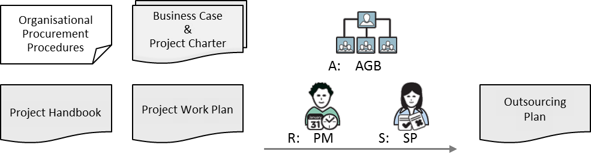

| Related Artefacts | Initiating | Planning | Executing | Monitor \& Control | Closing |
| :--: | :--: | :--: | :--: | :--: | :--: |
| Outsourcing Management | Project   Charter | Project Handbook   Outsourcing Plan | Project Reports | Project Logs | Project-End   Report |

**Outputs**

- Outsourcing Plan

### 6.6 Deliverables Acceptance Plan 

Deliverables acceptance planning aims to increase the likelihood that deliverables will be accepted by the client side and that the resources involved in the acceptance will be used in an efficient way.

The Deliverables Acceptance Plan documents the agreed criteria and approach for deliverables acceptance. It also documents the relevant responsibilities, including all activities and effort required, as well as the timing and capability requirements for this so that the project's deliverable(s) can be formally accepted by the client based on objective criteria and predefined timelines.

| Key Participants | Description |
| :-- | :-- |
| Project Steering Committee (PSC) | Approves the Deliverables Acceptance Plan. |
| Project Manager (PM) | Prepares the Deliverables Acceptance Plan. May be supported by   other roles such as the Project Quality Assurance (PQA), the Project   Support Office (PSO), and other project stakeholders. |
| Business Manager (BM) | Reviews and validates the deliverables acceptance requirements,   activities and associated metrics. |

**Inputs**

- Project Charter and Requirements Documents
- Project Handbook
- Project Work Plan
- Requirements Management Plan
- Quality Management Plan

**Guidelines**

- Ensure that there is no duplication of information contained in other plans (the Requirements Management Plan, Quality Management Plan, etc.). Align the deliverables acceptance process with the requirements validation activities as well as with other testing and quality control activities.
- Ensure that all project deliverables are accounted for including any support material (user manuals, etc.).
- Note that deliverables acceptance activities may not happen (only) at the end of the Executing Phase, but can follow the project's delivery schedule.
- Include the deliverables acceptance activities (and resources required) in the Project Work Plan.
- The guidelines set out in the Deliverables Acceptance Plan template can be used to help tailor a deliverables acceptance process for any given project.

**Steps**

1. Define the overall acceptance approach and schedule, as well as the tools to be used.
2. Define the acceptance criteria and tolerances for the project deliverables and define the activities needed to achieve their validation.
3. Define the process and timeline for dealing with non-acceptance (or partial acceptance).
4. Define the level of formality of the acceptance process (e.g. whether a signed Deliverables Acceptance Note is required, etc.).
5. Define clear roles and responsibilities for the acceptance of each deliverable:

- Determine who is responsible for the activities leading up to the acceptance of the deliverable.
- Determine who is responsible for providing the necessary resources.
- Identify the stakeholders who will validate the deliverable and define the specific knowledge and skills they require.
- Identify the person/group responsible for the final acceptance of the deliverable.

6. Tailor the Deliverables Acceptance Checklist based on the acceptance activities defined.
7. In the case of outsourced work, the Deliverable Acceptance Process should be documented in the contract.
8. Ensure that the Deliverables Acceptance Plan is communicated to the relevant project stakeholders

| RAM/RASCI | AGB | PSC | PO | BM | BIG | SP | PM | PCT |
| :-- | :--: | :--: | :--: | :--: | :--: | :--: | :--: | :--: |
| Deliverables Acceptance Plan | I | A | C | S | I | C | R | C |

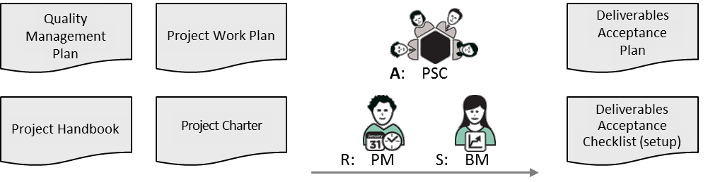

| Related Artefacts | Initiating | Planning | Executing | Monitor \& Control | Closing |
| :--: | :--: | :--: | :--: | :--: | :--: |
| Acceptance Management | Project   Charter | Deliverables   Acceptance Plan | Deliverables   Acceptance   Note | Deliverables   Acceptance Checklist   Decision Log | Project-   End   Report |

**Outputs** 

- Deliverables Acceptance Plan
- Deliverables Acceptance Checklist (setup

### 6.7 Transition Plan 

The Transition Plan defines the goals, prerequisites, activities and responsibilities associated with transitioning from the old (pre-project) to the new (post-project) state. It seeks to minimise the impact of any disruptions on the business during the transition period, and to facilitate the roll-out of project outputs in a smooth and timely fashion, allowing them to be used efficiently and with no serious transition issues.

A successful transition is an important prerequisite for achieving the planned project benefits. All transition activities become part of the Project Work Plan and are scheduled and controlled as part of the overall project.

| Key Participants | Description |
| :-- | :-- |
| Project Manager (PM) | Prepares the Transition Plan. |
| Project Core Team (PCT) | Consulted in the plan's preparation. |
| Other project stakeholders | Review and approve the Transition Plan. |

**Inputs**

- Business Case and Project Charter
- Project Work Plan
- Project Change Management Plan
- Business Implementation Plan

**Steps**

1. Identify the roles and responsibilities linked to all aspects of the transition process.
2. Document what must be completed before the transition can start and finish.
3. Determine whether any changes need to be made to the physical (or virtual) environments within which the project outputs will be released.
4. Identify possible business interruptions and ensure that they are communicated to all affected stakeholders in a timely fashion.
5. Determine the coordination.
6. Determine the needs between various stakeholders (e.g. clients, users, etc.).
7. Ensure that operational support and maintenance needs are defined.
8. Define and schedule the transfer of responsibility for the deliverables from the Solution Provider (SP) to the Project Owner (PO)
9. Ensure that a formal announcement of the start and end of the transition is planned.
10. Include all transition activities in the Project Work Plan.
11. Ensure that the Transition Plan is communicated to the relevant project stakeholders.

| RAM/RASCI | AGB | PSC | PO | BM | BIG | SP | PM | PCT |
| :-- | :--: | :--: | :--: | :--: | :--: | :--: | :--: | :--: |
| Transition Plan | I | A | C | C | C | C | R | C |

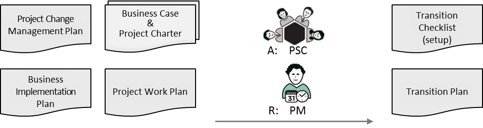

| Related Artefacts | Initiating | Planning | Executing | Monitor \& Control | Closing |
| :--: | :--: | :--: | :--: | :--: | :--: |
| Implementation   Management | Project   Charter | Business Implementation Plan   Transition Plan Project Work Plan | Project   Reports | Transition Checklist   Business Implementation Checklist | Project-End Report |

**Outputs**

- Transition Plan
- Transition Checklist (setup)

### 6.8 Business Implementation Plan 

The Business Implementation Plan aims to increase the likelihood of achieving the project's desired outcomes and benefits. It documents an assessment of the project's impact on the organisation's processes, culture and people and outlines the change-management and communications activities that need to take place to ensure that the project outputs are effectively integrated into the organisation's environment.

Depending on the organisation, the business implementation activities can be performed as part of the same project or as a separate one. These activities become part of the Project Work Plan and are scheduled and controlled as part of the overall project.

| Key Participants | Description |
| :-- | :-- |
| Business Manager (BM) | Prepares the Business Implementation Plan. |
| Project Manager (PM) | Assists the Business Manager (BM). Updates the Project Work   Plan to include all business implementation activities that fall   within the scope and timeframe of the project. |
| Business Implementation Group   (BIG) and other project stakeholders | Consulted during the impact analysis and involved in the business   implementation activities. |
| Project Owner (PO) | Reviews and approves the Business Implementation Plan. |

**Inputs**

- Business Case and Project Charter
- Project Handbook and Project Work Plan
- Transition Plan
- Quality Management Plan

**Steps**

1. Understand the pre- and post-project states and analyse the project's impact on the organisation's processes, people and culture.
2. Plan any redesigning or updating of affected business processes.
3. Develop a communication strategy and define the necessary change-management activities.
4. Identify possible sources of resistance to the desired change(s), analyse the attitude of key stakeholders and plan their involvement in change-management activities.
5. Determine the training needs of the people in the organisation.
6. Include all project-related business implementation activities in the overall Project Work Plan
7. Identify the change implementation (and change sustaining) activities to be carried out by the organisation after the project ends, possibly as future/follow-up projects.

| RAM (RASCI) | AGB | PSC | PO | BM | BIG | SP | PM | PCT |
| :--: | :--: | :--: | :--: | :--: | :--: | :--: | :--: | :--: |
| Business Implementation Plan | I | I | A | R | C | I | S | I |

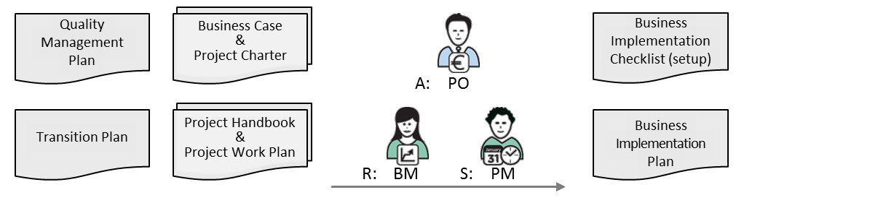

| Related Artefacts | Initiating | Planning | Executing | Monitor \& Control | Closing |
| :--: | :--: | :--: | :--: | :--: | :--: |
| Implementation   Management | Project   Charter | Business   Implementation Plan   Transition Plan   Project Work Plan | Project   Reports | Transition Checklist   Business Implementation   Checklist | Project-End Report   (Post-Project   Recommendations) |

**Outputs** 

- Business Implementation Plan
- Business Implementation Checklist (setup)

### 6.9 Phase Gate: RfE (Ready for Executing)

This is the second phase gate. A review and approval are recommended before the project can formally move to the next phase. The Project Manager (PM) uses the outputs of the Planning Phase to assess whether the goals of this phase have been achieved, and then requests approval from the Project Steering Committee (PSC) to move on to the Executing Phase.

If major deviations from the approved Business Case and/or Project Charter are identified, then the Project Steering Committee (PSC) must receive an additional approval from the Appropriate Governance Body (AGB) before the project can move on to the Executing Phase.

PM² provides a template Phase Exit Review Checklist for each phase that can be used by the Project Manager (PM) to guide the assessment, alongside a review of the phase's specific goals.

## 7 Executing Phase 

The third phase of a PM² project is the Executing Phase. During this phase, the project deliverables are produced and the requestor organisation prepares for their introduction. The Executing Phase begins with a Kick-off Meeting and ends with the acceptance (final or provisional-as per the Deliverables Acceptance Plan) by the requestor side.
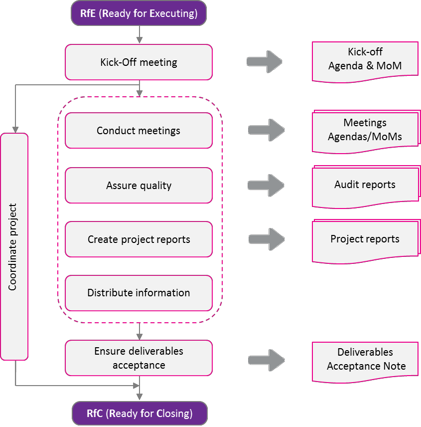

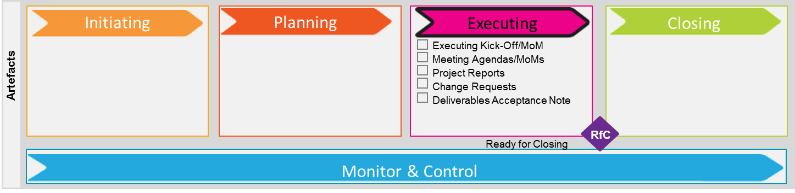

### 7.1 Executing Kick-off Meeting 

The Executing Phase starts with the Executing Kick-off Meeting. This meeting ensures that the whole Project Team is aware of the project's key elements and rules.

| Key Participants | Description |
| :-- | :-- |
| Project Manager (PM) | Organises the meeting. |
| Project Core Team (PCT) | Required participants. |
| Project Manager Assistant (PMA) \& Project   Support Office (PSO) | Required to attend (if they are part of the project). |
| Other project roles or stakeholders | Optional participation (as per the project's needs). |

**Inputs**

- Business Case and Project Charter
- Project Handbook
- Project Work Plan
- All project plans and logs
- Any requirements documents

**Steps**

Before the Executing Kick-off Meeting:

1. Plan the meeting.
2. Draft the Meeting Agenda clearly indicating the main points to be discussed.
3. Send out the Meeting Agenda in advance.
4. Ensure the attendance of the required participants.
5. Address any logistical needs and prepare documentation or hand-outs for the meeting.

During the Executing Kick-off Meeting:

1. Ensure that someone is designated to take the Minutes of Meeting (MoM), including action points.
2. Present the Project Handbook and the Project Work Plan with the appropriate level of detail.
3. Present the Communications Management Plan.
4. Agree on the conflict resolution process and present the escalation procedure.
5. Present the Project Stakeholder Matrix.
6. Present the Risk Management, Issue Management and Project Change Management processes as well as the Quality Assurance \& Control activities.
7. Clarify the expectations of the Project Core Team (PCT).
8. Agree on the team's ground rules

After the Executing Kick-off Meeting:

1. Send out the Minutes of Meeting (MoM) to the relevant stakeholders. The minutes should include a summary of project issues raised, risks identified, decisions taken and changes proposed. Note that the issues, risks, decisions and project changes should also be recorded in the relevant logs.

| RAM (RASCI) | AGB | PSC | PO | BM | BIG | SP | PM | PCT |
| :--: | :--: | :--: | :--: | :--: | :--: | :--: | :--: | :--: |
| Executing Kick-off Meeting | I | A | C | S/C | C | C | R | C |

 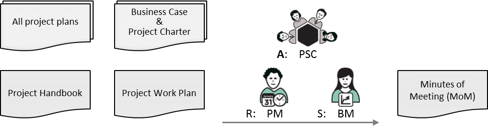
**Outputs**

- Minutes of Meeting (MoM)

### 7.2 Project Coordination 

The objective of project coordination is to facilitate the project's progress by continuously providing information to the Project Core Team (PCT) and supporting the completion of assigned work.

Project coordination includes allocating project resources to activities, performing regular quality checks of interim results, maintaining ongoing communication with all project team members, and keeping everyone involved in the project motivated through leadership, negotiations, conflict resolution and the application of appropriate Human Resource management techniques.

| Key Participants | Description |
| :-- | :-- |
| Project Manager (PM) | Coordinates all project activities. |
| Project Manager Assistant (PMA) | Assists the Project Manager (PM). |
| Business Manager (BM) | Can support (or contribute to) project coordination   depending on the context of the project. |

**Inputs**

- Project Handbook
- Project Work Plan

Note: Project coordination begins officially with the initiation of the project and ends with its closing. However, the intensity of project coordination peaks during the Executing Phase.

**Steps**

1. Manage and direct project activities and stakeholders.
2. Assign tasks to the Project Core Team (PCT) and coordinate their execution as per the Project Work Plan.
3. Provide information to the Project Core Team (PCT) as required for the progress of project.
4. Verify the completion of tasks and accept interim work deliverables in line with predefined acceptance criteria.
5. Provide leadership and motivate the project team.
6. Manage project team dynamics.
7. Use negotiations, conflict resolution, and people management techniques to ensure smooth collaboration among team members and the effective progress of project work.

| RAM (RASCI) | AGB | PSC | PO | BM | BIG | SP | PM | PCT |
| :-- | :--: | :--: | :--: | :--: | :--: | :--: | :--: | :--: |
| Project Coordination | I | I | A | S | I | I | R | I |

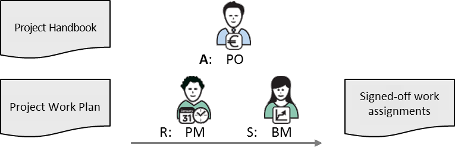

**Outputs**

- Signed off work assignments

### 7.3 Quality Assurance 

Quality Assurance is the activity of gathering evidence that proves the project work is following high-quality standards, methodologies and best practices. It seeks to allow us to be confident that the project will satisfy the desired scope and quality requirements within the project constraints.

Quality Assurance activities include determining whether appropriate project controls are in place, confirming that they are being implemented and assessing their effectiveness.

Quality Assurance activities are documented in the Quality Management Plan. These can be performed by the Project Manager (PM), the Project Quality Assurance (PQA) role, or other project roles such as the Project Core Team (PCT), the Business Manager (BM) or the Solution Provider (SP). External audits undertaken by entities outside the project can also be defined.

| Key Participants | Description |
| :-- | :-- |
| Project Manager (PM) | Accountable for carrying out all Quality Assurance activities. |
| Project Quality Assurance (PQA) | Establishes Quality Assurance standards and reviews project outputs   and deliverables. |
| Project Core Team (PCT) | Adheres to the project's Quality Assurance standards. |

**Inputs**

- Quality Management Plan
- Project Work Plan

**Guidelines**

- These Quality Assurance activities must be part of the Project Work Plan.
- The Project Core Team (PCT) must provide evidence of adherence to the quality assurance standards and procedures.

| RAM (RASCI) | AGB | PSC | PO | BM | BIG | SP | PM | PCT |
| :--: | :--: | :--: | :--: | :--: | :--: | :--: | :--: | :--: |
| Quality Assurance | I | I | I | S | C | I | A | R |

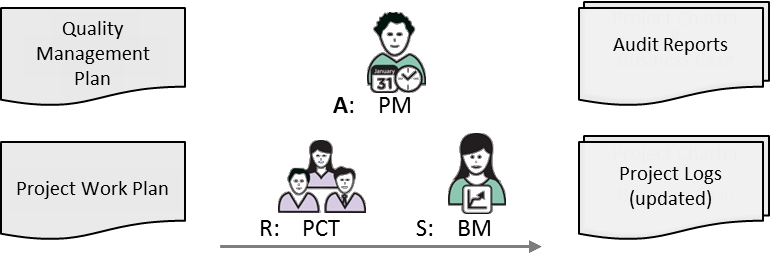

| Related Artefacts | Initiating | Planning | Executing | Monitor \& Control | Closing |
| :--: | :--: | :--: | :--: | :--: | :--: |
| Quality Management | Project Charter | Quality Management Plan | Quality Review Reports Audit Reports | Quality Review Checklist   Project Logs   Phase-Exit Review Checklist | Project-End Report   Project Acceptance Note |

**Outputs**

- Audit Reports
- Project Logs (updated)
- Quality Review Report

### 7.4 Project Reporting 

The purpose of Project Reports is to communicate consolidated information concerning project performance to the appropriate stakeholders. Project reports typically provide information on scope, schedule, effort/cost and quality, as well as information related to the status of risks, issues, project changes and outsourcing. This information should be presented to the various stakeholders in the appropriate form (e.g. text or charts) and with the appropriate level of detail, as defined in the Communications Management Plan.

Project Reports may also contain agreed project indicators and metrics for evaluating progress. The reports are formally presented and discussed during the various project meetings, and disseminated via the information distribution activities described in the Communications Management Plan.

| Key Participants | Description |
| :-- | :-- |
| Project Manager (PM) | Responsible for all Project Reports (except external audit reports). |
| Other project stakeholders | Review the reports. |

**Inputs**

- Project Handbook
- Project Work Plan
- Communications Management Plan
- Project Logs
- Project Checklists
- Outputs of the Monitor Project Performance activity

**Guidelines**

- Project Reports are an output of project monitoring and an important input for project control and decision-making. They are also an input into the Project-End Review and are an important way of capturing historical information. They should therefore be properly archived during the Closing Phase.
- Project Reports should be tailored to the project's needs, given that they exist to serve the information and communication needs of the project stakeholders.

**Steps**

1. List all reports to be used in the project in the Project Handbook, or more specifically in the Communications Management Plan. PM² provides templates for Status and Progress Reports.
2. Make sure the report templates used are fit for purpose.
3. Ensure the reports' content, level of detail and format are well thought out and appropriate for the intended audience (stakeholders).
4. If needed, create Ad Hoc reports to address specific reporting needs (e.g. in case of a project crisis).

| RAM (RASCI) | AGB | PSC | PO | BM | BIG | SP | PM | PCT |
| :-- | :--: | :--: | :--: | :--: | :--: | :--: | :--: | :--: |
| Project Reporting | I | I | A | S/C | I/C | I/C | R | C |

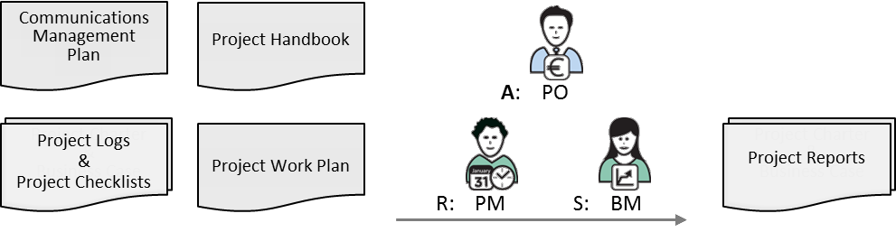

The following are examples of PM² reports:

- Project Status Report
- Project Progress Report
- Quality Review Report
- Contractor Status Report
- Custom or Ad Hoc Reports

**Project Status Report** 

The Project Status Report is produced by the Project Manager (PM) and is regularly submitted to the Project Steering Committee (PSC) and other stakeholders as per the Communications Management Plan.

It should provide a summary of the project's performance (rather than detailed task-level information). It should include tracking information on costs, scheduling, scope/changes, risks and issues, report on the status of important milestones for the current reporting period and provide forecasts for future reporting periods.

**Project Progress Report**

The Project Progress Report gives a high-level overview of the project and its status. It includes a project overview (project stakeholders, milestones and deliverables, project plan, budget, and costs) and additional project details (scope changes, major risks/issues and actions taken, achievements).

If a project is a multi-annual project and its overall vision/scope has not changed, the Project Progress Report can be used to secure project approval for the following year. However, if the project's vision/scope has changed, an updated Project Charter should be submitted.

**Quality Review Report**

The Project Manager (PM) produces a Quality Review Report after evaluating the results of qualityassurance activities and the effectiveness of the project's quality-management process for all aspects of the project (scope, time, cost, quality, project organisation, communication, risks, contracts, client satisfaction, etc.).

The Quality Review Report should give an overview of the status of all project quality-management activities and present the main quality assurance and control results, non-conformities, opportunities for improvement, recommendations and remediation/improvement actions, and their impact and status. It should also report on the status of important project configuration activities (assurance and control). The main input to the Quality Review Report is the Quality Review Checklist.

**Contractor Status Report**

The Contractor Status Report is filled out by the contractor (if there is one) and should be submitted to the Project Manager (PM) in accordance with the agreed schedule. The report presents the project status for the current reporting period and provides forecasts for future reporting periods along with information on any new risks, disputes and issues. The Project Manager (PM) should include a summary of the Contractor Status Reports in the Project Status Report.

**Custom or Ad Hoc Reports**

Reports should serve the project's needs. If it is decided that a custom report is needed, this should be defined during the Planning Phase and documented in the Project Handbook. Custom reports can be domain-specific (e.g. IT-related) or project-specific (i.e. related to the particularities of the project organisation or the project management approach).
Similarly, if a specific communication/reporting need arises during the project, an Ad-Hoc Report can be produced to address this need.

**Outputs**

- Project Status Report
- Project Progress Report
- Quality Review Report
- Contractor Status Report
- Custom or Ad Hoc Reports

### 7.5 Information Distribution 

Information distribution refers to the methods used to keep project stakeholders informed about relevant project details through the regular distribution of project reports, as per the Communications Management Plan and project stakeholder needs.

| Key Participants | Description |
| :-- | :-- |
| Project Support Office (PSO) | Manages internal communication and assists in activities such as   document change control, baselining of plans, etc. |
| Project Manager (PM) | Ensures that the Project Core Team (PCT) has all the necessary   information to carry out its tasks. |
| Other project stakeholders | Kept informed about the project, and in turn keep the project team   informed about external factors that might influence the project. |

**Inputs**

- Communications Management Plan
- Project Work Plan
- Project Reports and Project Logs
- Minutes of Meetings (MoMs)

**Guidelines**

- Relevant information resulting from the execution of project plans should be communicated to appropriate parties at the right time and in the appropriate format.
- If meetings are used to distribute information, ensure they are frequent enough to serve the communication needs of the project stakeholders.
- Keep stakeholders informed by sending them regular Status and Progress Reports that chart project progress against the baseline schedule and budget.

**Steps**

1. Carry out the tasks detailed in the Communications Management Plan.
2. Inform stakeholders about updates to the Project Work Plan.
3. Communicate any changes/updates to any key project documents and logs.
4. Send out the Project Reports as per the Communications Management Plan.

| RAM (RASCI) | AGB | PSC | PO | BM | BIG | SP | PM | PCT |
| :--: | :--: | :--: | :--: | :--: | :--: | :--: | :--: | :--: |
| Information Distribution | I | I | A | C | I | I | R | C |

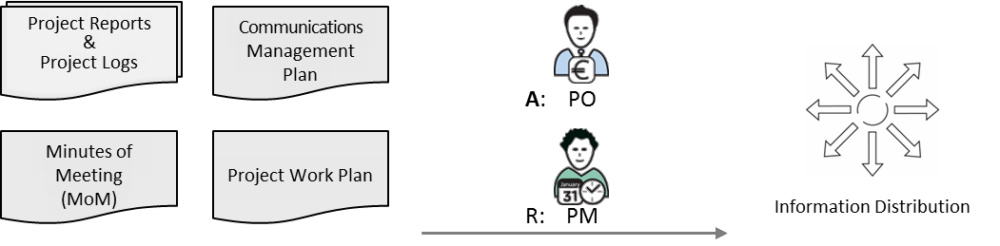

### 7.6 Phase Gate: RfC (Ready for Closing) 

This is the third and final phase gate. A review and approval are recommended before the project can move to the next phase. The Project Manager (PM) assesses whether all the goals of the Executing Phase have been achieved, verifies that all planned activities have been carried out, that all requirements have been met, and that the project's outputs have been fully delivered. The Project Manager (PM) is also responsible for ensuring that the Project Owner (PO) accepts the deliverables (at least provisionally), finalises the transition and makes the outputs available to the end-users.

Once all the above conditions have been met, the Project Steering Committee (PSC) can authorise the Project Manager (PM) to move the project to the Closing Phase.
PM² provides a template Phase Exit Review Checklist for each phase that can be used by the Project Manager (PM) to guide the assessment, alongside a review of the phase's specific goals.

## 8 Closing Phase 

The final phase of a PM² project is the Closing Phase. The Closing Phase starts with the Project-End Review Meeting and ends with the Project Owner's (PO) final approval, which marks the project's administrative closure. During the Closing Phase, the project's activities are completed, the project's final state is documented, and the finished deliverables are officially transferred to the Project Owner (PO).
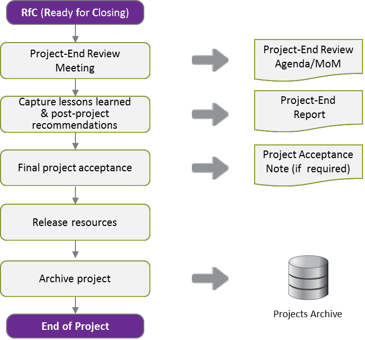

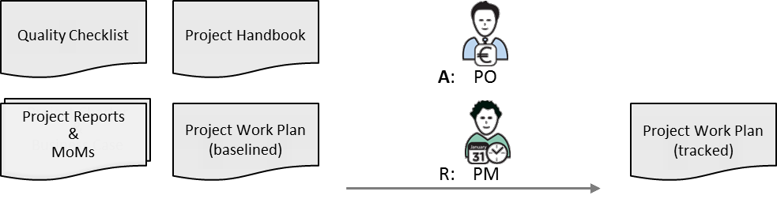

**Project-End Review Meeting**

- The Closing Phase starts with an official Project-End Review Meeting.
- Project performance is discussed, team and contractor performance are evaluated, and Lessons Learned are captured.

**Project-End Report**

- The Project-End Report is created after the Project-End Review Meeting.
- The report documents Best Practices, pitfalls and solutions to problems encountered for use as a knowledge base for future projects.

**Administrative Closure**

- The Project Manager (PM) ensures that the project is approved and accepted by the relevant stakeholders. The finished deliverables are transferred into the care, custody and control of the Project Owner (PO) and the requestor/client organisation.
- All documentation and records are reviewed, organised and securely archived with the help of the Project Support Office (PSO). Resources are released and the project is closed.

### 8.1 Project-End Review Meeting 

The Project-End Review Meeting launches the Closing Phase of the project after the Executing Phase is deemed complete. The goal of this meeting is to ensure that project members discuss their experience of the project so that Lessons Learned and best practices can be captured. Also in this meeting team and contractor performance are evaluated, and ideas and recommendations for post-project work are discussed.

| Key Participants | Description |
| :-- | :-- |
| Project Manager (PM) | Organises the meeting. |
| Project Core Team (PCT) | Attendance is required. |
| Project Owner (PO) | Attendance is required. |
| Project Quality Assurance (PQA) | Should attend. |
| Business Manager (BM) | Represents the business side and the stakeholders. |
| Other stakeholders | Contributions from other supporting or optional roles may   also be valuable. |

**Inputs**

- Business Case and Project Charter
- Project Handbook and Project Work Plan
- All Project Plans (particularly the Transition \& Business Implementation Plans)
- Relevant Project Reports and Logs

**Steps**

Before the Project-End Review Meeting:

1. Plan the meeting and set the Meeting Agenda with the points to be discussed.
2. Send out the Meeting Agenda in advance.
3. Address logistical needs and prepare documentation or hand-outs for the meeting.
4. Make sure participants will be present and fully prepared.

During the Project-End Review Meeting:

1. The Project Owner (PO) will normally express the organisation's appreciation to the whole project team and key project stakeholders.
2. Ensure someone is designated to take the Minutes of Meeting (MoM).
3. Present project statistics and data on performance and achievements.
4. Discuss the overall project experience.
5. Discuss problems and challenges faced during project and the way in which they were addressed.
6. Discuss Lessons Learned and Best Practices that may be useful for future projects.

After the Project-End Review Meeting:

1. Compile Lessons Learned and Post-Project Recommendations.
2. Produce the Project-End Report.
3. Communicate the results of the meeting to the relevant stakeholders.

| RAM (RASCI) | AGB | PSC | PO | BM | BIG | SP | PM | PCT |
| :--: | :--: | :--: | :--: | :--: | :--: | :--: | :--: | :--: |
| Project-End Review Meeting | I | A | C | S | C | C | R | C |

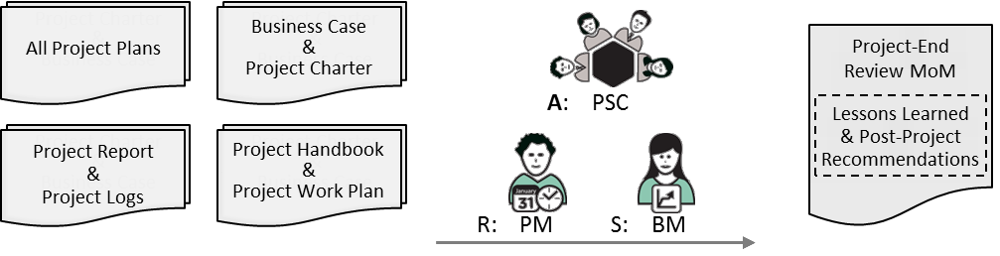

**Outputs**

- Project-End Review Meeting Minutes

### 8.2 Lessons Learned and Post-Project Recommendations 

The purpose of formal Lessons Learned and Post-Project Recommendations is to make it possible for project teams and the permanent organisation at large to benefit from the experience acquired during the project. It is also important to capture ideas and recommendations for post-project work relating to the operation of the product/service delivered, such as extensions, maintenance and ideas for follow-up projects.

Note: Improvement opportunities and Post-Project Recommendations should be captured in some form as they come up during the project. Otherwise, particularly in longer projects, the ideas might get lost by the time the project reaches the Closing Phase.

There are many benefits to formalising Lessons Learned and Post-Project Recommendations. When project team members share their perspectives and provide feedback it provides useful insights that, the requestor/client side can use to manage post-project activities more effectively.

| Key Participants | Description |
| :-- | :-- |
| Project Manager (PM) | Organises the gathering of Lessons Learned. |
| Project Core Team (PCT) | Contributes experiences and perspectives. |
| Business Manager (BM) | Represents the requestor's point of view. |
| Other project stakeholders | As required. |

Because all projects are different, the Lessons Learned process cannot be generic. However, projects have common aspects, which can be discussed: project definition and planning (scope, deliverables, resources, etc.), project communication, project documentation, change control, risk/issue management, decisionmaking, successes, mistakes and failures, team dynamics, and overall project performance.

**Guidelines**:

- The Lessons Learned session should be a part of the Project-End Review Meeting (though separate sessions could be organised at the end of project phases or major milestones).
- It may be preferable to have the Lessons Learned session facilitated by someone who has not been intimately involved in the project, allowing the Project Manager (PM) to contribute as a participant.
- The discussion should be structured (using project phases, categories of activities, etc. as the organisational principle) to cover every aspect of the project.
- Use a structured approach to collecting lessons learned from a broader group of stakeholders via questionnaires, or structured interviews.
- Improvement ideas should be organised into groups to help the team better visualise the appropriate next steps required to implement them.
- In some cases, it could make sense to address the Lessons Learned over multiple sessions, each devoted to a different topic (technical issues, business implementation, etc.).
- The Project Steering Committee (PSC) should be invited to the Lessons Learned session(s) as this will allow its members to transfer the Lessons Learned to other projects.

| RAM (RASCI) | AGB | PSC | PO | BM | BIG | SP | PM | PCT |
| :-- | :--: | :--: | :--: | :--: | :--: | :--: | :--: | :--: |
| Lessons Learned and   Post-project Recommendations | I | A | C | S | C | C | R | C |

**Outputs**

- Project-End Report

### 8.3 Project-End Report 

Following the Project-End Review Meeting, the overall experience of the project is summarised in a report that documents best practices, Lessons Learned, pitfalls and solutions to problems. The report should be used as a knowledge base for future projects.

| Key Participants | Description |
| :-- | :-- |
| Project Manager (PM) | Writes the report. |
| Project Quality Assurance (PQA) | Provides input and assistance. |
| Project Core Team (PCT) | Provides input and assistance. |

**Inputs**

- Project-End Review Meeting Minutes (MoM)
- Other useful information can be found in:
- Minutes of Meetings (MoMs) of various project meetings
- Project Reports
- Quality Assurance and Quality Control outputs

**Guidelines**

- Though written by the Project Manager (PM), the help of relevant stakeholders should be sought to produce a well-rounded and comprehensive assessment of the project.
- The report should address each of the following subjects:
- Project effectiveness.
- Cost, Schedule, Scope and Quality Management.
- Risk Management.
- Issue Management.
- Project Change Management.
- Communications Management.
- Human resources and stakeholder management.
- Deliverables Acceptance.
- Business Implementation and Project Transition.
- The performance of the Project Core Team (PCT) and participating organisation.
- Best Practices and Lessons Learned.
- Post-Project Recommendations.
- This document should be part of a central project repository or knowledge database describing project experiences, best practices and common pitfalls.

| RAM (RASCI) | AGB | PSC | PO | BM | BIG | SP | PM | PCT |
| :-- | :--: | :--: | :--: | :--: | :--: | :--: | :--: | :--: |
| Project-End Report | I | A | C | S | C | C | R | C |

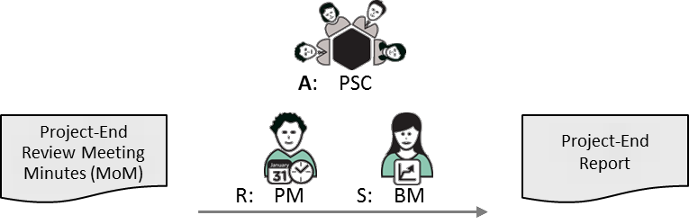

| Related Artefacts | Initiating | Planning | Executing | Monitor \& Control | Closing |
| :--: | :--: | :--: | :--: | :--: | :--: |
| Communications   Management |  | Communications \& Quality Management Plan | Project   Reports | Project Checklists   Project Logs | Project-End Report |

**Outputs**

- Project-End Report

### 8.4 Administrative Closure 

The Project Manager (PM) ensures that all project deliverables have been accepted by the relevant stakeholders and, with the help of the Project Support Office (PSO), that all project documentation and records are up-to-date, reviewed, organised and securely archived. The Project Team is now officially dissolved and all resources are released.

The project is officially closed once all Closing Phase activities are completed and the Project Owner (PO) has approved the project. Formal project closure brings project mode to an end and allows operations mode to commence.

| Key Participants | Description |
| :-- | :-- |
| Project Manager (PM) | Oversees all closure activities and the release of project resources. |
| Other project stakeholders | Approve and accept the project. |
| Project Support Office (PSO) | Assists in reviewing, organising and archiving all project   documentation. |
| Project Owner (PO) | Has final approval of the project. |

**Inputs**

- Project Handbook
- Project Work Plan
- Quality Management Plan
- All other project plans and documents

**Steps**

1. Ensure that all documentation and records are reviewed, organised and archived.
2. Release all resources.
3. Ensure that the project is approved and accepted by the project stakeholders.
4. Ensure that the Project Owner (PO) gives final project approval and closes the project.
5. Verify that all contractual obligations have been fulfilled.

| RAM (RASCI) | AGB | PSC | PO | BM | BIG | SP | PM | PCT |
| :--: | :--: | :--: | :--: | :--: | :--: | :--: | :--: | :--: |
| Administrative Closure | I | C | A | C | I | C | R | I |

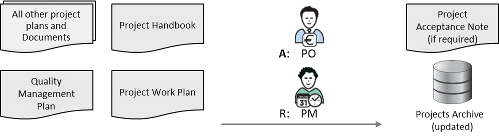

**Outputs**

- Projects Archive (updated)
- Project Acceptance Note (if required)

## 9 Monitor \& Control 

Monitor \& Control activities run throughout the duration of the project, but peak during the Executing Phase. All project management processes are executed as part of the Monitor \& Control process group.

The Monitor \& Control activities are carried out based on the processes described in the Project Management Plans developed during the Planning Phase. The effective execution of these processes is ultimately the responsibility of the Project Manager (PM).

**Manage**

- Execute all management processes defined in the Project Management Plans, and manage the outsourcing, transition, business implementation and deliverables acceptance activities as per the relevant Project Specific Plans.

**Monitor**

- Monitor project activities and overall project performance.
- Track the project performance against the baseline in order to facilitate reporting and controlling.

**Control**

- Devise, plan, propose and implement corrective actions to address existing or potential performance risks or issues, while updating the relevant project plans and logs.

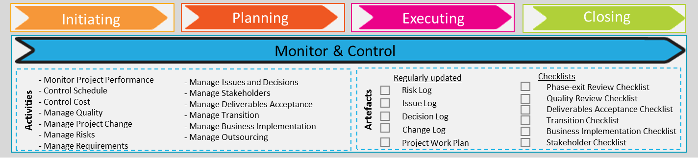

Monitor \& Control artefacts comprise the Project Work Plan as well as a range of Project Logs and Checklists.

The Project Logs are regularly updated as new information becomes available (e.g. new issues can arise and new information can be added to the Issue Log).

There are several Checklists that can be used to help the Project Manager (PM) control the project better.

PM² provides the following Checklists:

- Phase-exit Review Checklist
- Quality Review Checklist
- Deliverables Acceptance Checklist
- Transition Checklist
- Stakeholders Checklist
- Business Implementation Checklist

### 9.1 Monitor Project Performance 

The purpose of project performance monitoring is to collect information about the state of the project's progress and overall health. The Project Manager (PM) tracks the project dimensions of scope, schedule, cost and quality, monitors risks, issues and project change, and forecasts their evolution for the purpose of reporting the overall project progress.

This information is then distributed to relevant stakeholders as per the Communications Management Plan.

| Key Participants | Description |
| :-- | :-- |
| Project Manager (PM) | Undertakes all project monitoring activities. |
| Project Core Team (PCT) | Contributes information on project progress. |

**Inputs**

- Project Handbook
- Project Work Plan
- Project Logs (Risk Log, Issue Log, Decision Log, Project Change Log)
- Quality Checklist
- Minutes of Meetings (MoMs)
- Input from the Contractor's Project Manager (CPM), if applicable

**Steps**

1. Use the baselined Project Work Plan as a reference for monitoring project performance.
2. Regularly exchange information about the project's current status and next steps with the Project Core Team (PCT) at formal and informal meetings.
3. Gather information on, and monitor the progress of:

- Tasks-i.e. the status of critical and next critical path tasks.
- Key outputs-i.e. completed and verified deliverables, and milestones achieved as planned.
- Resource utilisation-i.e. resources used as planned and costs as budgeted.
- Logs-i.e. the status and evolution of risks and issues, changes and decisions.
- People-i.e. team morale, stakeholder engagement, overall project dynamics and productivity.

| RAM (RASCI) | AGB | PSC | PO | BM | BIG | SP | PM | PCT |
| :--: | :--: | :--: | :--: | :--: | :--: | :--: | :--: | :--: |
| Monitor Project Performance | I | I | A | C | C | I | R | C |

**Outputs**

- Project Work Plan (tracked)

### 9.2 Control Schedule 

The purpose of schedule control is to ensure that project tasks are carried out as scheduled and that project deadlines are met. The Project Manager (PM) regularly monitors the schedule and tracks the difference between planned, actual and forecast activities/deadlines.

Approved project changes (e.g. addition of new tasks or changes to the required effort or start/end dates of existing ones) that have an impact on the overall project schedule are incorporated into the Project Work Plan (updated schedule). If the schedule is at risk or considerable delays are foreseen (beyond the predefined thresholds), the Project Steering Committee (PSC) needs to be informed and corrective actions must be devised, agreed and implemented. If this happens, affected project stakeholders should also be notified.

| Key Participants | Description |
| :-- | :-- |
| Project Manager (PM) | Monitors and controls the work schedule. |
| Project Core Team (PCT) | Works to keep to the baselined schedule and quality standards.   Reports on the status of their work, periodically or upon request. |

**Inputs**

- Project Handbook
- Project Work Plan
- Change Log (and other relevant Project Logs)
- Minutes of Meetings (MoMs) and Project Reports from previous reporting periods

**Steps**

1. Track the evolution of project tasks as per the approach defined in the Project Handbook.
2. Update the project schedule to reflect actual task status.
3. Review the Project Work Plan on a regular basis to identify potential sources of delays.
4. Track project changes, issues and risks, and monitor their impact on the project schedule.
5. Devise, agree and implement corrective actions if the schedule status has significant (or critical) deviations from the planned schedule.
6. Inform all affected project stakeholders about changes to the project schedule and/or tasks.

| RAM (RASCI) | AGB | PSC | PO | BM | BIG | SP | PM | PCT |
| :-- | :--: | :--: | :--: | :--: | :--: | :--: | :--: | :--: |
| Control Schedule | I | I | A | C | C | I | R | C |

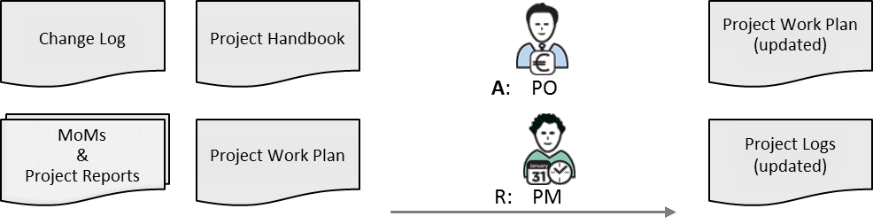

| Related Artefacts | Initiating | Planning | Executing | Monitor \& Control | Closing |
| :--: | :--: | :--: | :--: | :--: | :--: |
| Schedule Management | Project Charter | Project Handbook Project Work Plan | Project Reports | Project Work Plan | Project-End Report |

**Outputs**

- Project Work Plan (updated)
- Project Logs (updated)

### 9.3 Control Cost 

The purpose of cost control is to manage the project costs so that they conform to the cost/effort baseline and overall project budget constraints. The Project Manager (PM) regularly monitors the budget and tracks the difference between budgeted, actual and expected costs.

If the project budget is at risk, the Project Steering Committee (PSC) needs to be informed and corrective actions must be devised, agreed and implemented. If considerable cost overruns are foreseen, these need to be justified, reported to and approved by the Project Owner (PO) or the Appropriate Governance Body (AGB).
Note: The project budget must have been approved by the Project Owner (PO) at the beginning of the project.

| Key Participants | Description |
| :-- | :-- |
| Project Manager (PM) | Monitors and controls the budget. |
| Project Owner (PO) | Owns and approves the budgeted costs. |

**Inputs**

- Project Handbook
- Project Work Plan
- Outsourcing Plan (if applicable)
- Change Log (and other relevant Project Logs)
- Minutes of Meetings (MoMs) and Project Reports from previous reporting periods

**Steps**

1. Track the project's effort/overall budget consumption as per the approach defined in the Project Handbook.
2. Regularly review the project budget with the Project Owner (PO).
3. Evaluate and communicate any differences between budgeted and actual project costs, securing approval for significant differences from the Project Owner (PO).
4. Devise and plan the implementation of corrective actions that will bring the budget back on track.
5. If the project budget needs to be considerably revised, this must be justified and documented (e.g. in the Project Progress Report). Formal approval from the Appropriate Governance Body (AGB) is required before the affected plans can be re-baselined.
6. If there is an impact on the project schedule, risks or quality, this must be reviewed and approved by the Project Owner (PO) and communicated to any affected project stakeholders.

| RAM (RASCI) | AGB | PSC | PO | BM | BIG | SP | PM | PCT |
| :-- | :--: | :--: | :--: | :--: | :--: | :--: | :--: | :--: |
| Control Cost | I | I | A | C | C | I | R | C |

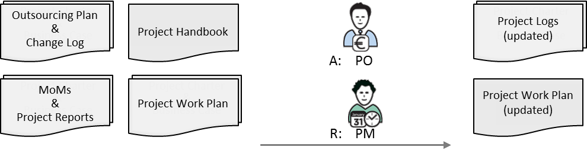

| Related Artefacts | Initiating | Planning | Executing | Monitor \& Control | Closing |
| :--: | :--: | :--: | :--: | :--: | :--: |
| Cost Management | Business Case   Project Charter | Project Handbook   Project Work Plan | Project Reports | Project Work Plan   Project Logs | Project-End   Report |

**Outputs**

- Project Work Plan (updated)
- Project Logs (updated)

### 9.4 Manage Stakeholders 

Managing project stakeholders is a critical project management activity that begins in the Initiating Phase of the project, when project expectations and requirements are identified, and ends in the Closing Phase, when stakeholders' overall project experience and satisfaction are recorded.

Responsibility for this activity belongs to the Project Manager (PM). However, all members of the Project Steering Committee (PSC) should also be involved, in particular the Business Manager (BM) who should help manage stakeholders on the requestor side (e.g. users).

| Key Participants | Description |
| :-- | :-- |
| Project Manager (PM) | Manages project stakeholders. |
| Business Manager (BM) | Assists the Project Manager (PM) in this activity. |

**Inputs**

- Project Handbook
- Project Stakeholder Matrix
- Communications Management Plan
- Deliverables Acceptance and Transition Plans
- Business Implementation Plan

**Steps**

1. Analyse the expectations, attitudes, level of interest and influence of key project stakeholders. Beware of stakeholders who are less than enthusiastic or opposed to the project.
2. Devise communication and management strategies that encourage stakeholders to get involved and contribute.
3. Continually monitor stakeholder reactions or changing attitudes and manage accordingly. A oneoff analysis exercise is not enough, especially for longer-term and/or complex projects. Use the Stakeholders Checklist to identify specific actions to be taken at specific moments in the project.
4. Ensure that any planned stakeholder management activities are time-bound and focused. Keep in mind that the contribution/involvement of various stakeholders may be different in each project phase.
5. Align the Communications Management Plan with Stakeholder Management needs, particularly in the areas of project acceptance, transition, and business implementation.

| RAM (RASCI) | AGB | PSC | PO | BM | BIG | SP | PM | PCT |
| :-- | :--: | :--: | :--: | :--: | :--: | :--: | :--: | :--: |
| Manage Stakeholders | I | I | A | S/C | I | C | R | I |

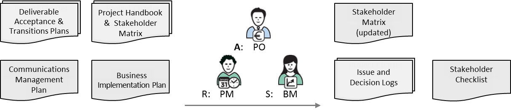

| Related Artefacts | Initiating | Planning | Executing | Monitor \& Control | Closing |
| :--: | :--: | :--: | :--: | :--: | :--: |
| Stakeholder   Management | Business Case   Project Charter | Project Stakeholder   Matrix   Communications   Management Plan | Project   Reports | Project Logs   Stakeholders Checklist | Project-End   Report |

Outputs

- Project Stakeholder Matrix (updated)
- Issue and Decision Logs (updated)
- Stakeholders Checklist

### 9.5 Manage Requirements

Requirements management is the process of gathering, documenting and validating requirements and managing their implementation and change. It is a process that runs throughout the project lifecycle and relates to other project management processes, such as quality and change management.

The Requirements Management Process can be tailored and customised to a project's needs. It can be documented either in a Requirements Management Plan or in the Project Handbook. Separate requirements documents are used to specify, categorise and prioritise the requirements. These can be standalone documents or an annex to the Project Charter.

|  Key Participants | Description  |
| --- | --- |
|  Project Manager (PM) | Undertakes the requirements management process.  |
|  Business Manager (BM) | Provides information required to draft the requirements and
approves them.  |
|  User Representatives (URs) | Participate in the gathering and validation of the requirements.  |
|  Business Analyst (BA) (member
of the Project Core Team, PCT) | Responsible for many of the requirements management activities
(e.g. requirements documentation, specification, etc.).  |

**Inputs**

- Project Initiation Request, Business Case and Project Charter
- Requirements Management Plan
- Project Stakeholder Matrix

**Guidelines**

- A requirement is a capability that a product or service must have in order to satisfy a stakeholder's need(s).
- High-level requirements may also be referred to as business requirements, and are usually initially specified in the Project Initiation Request, the Business Case and the Project Charter.
- Adding further detail to the requirements produces lower-level requirements. These can be described in a variety of formats (e.g. text, use cases or user stories, models, business processes, sketches or graphics, etc.) and are documented in various requirements artefacts.
- The agreed and approved requirements of all stakeholders constitute the project's baseline scope.
- Any change to the baselined requirements should be made in accordance with the change management process described in the Change Management Plan.
- For each identified requirement, there should be a corresponding test to validate its acceptance. The test should be documented in the appropriate document (Deliverable Acceptance Plan, Deliverable Acceptance Checklist or Quality Review Checklist).
- Requirements should describe the need not the solution-non-ambiguous terms should be used and technology- or solution-oriented statements should be avoided.
- Even if requirements have been gathered before the project starts, it is still the responsibility of the Project Manager (PM) to ensure they are managed properly.

**Steps**

1. Specify the requirements: Together with the project stakeholders, gather the project requirements and document them clearly in the Requirements Artefacts. Structure them by adding relevant metadata.
2. Evaluate the requirements: The project team assesses the feasibility, consistency and completeness of the requirements, and estimates the effort/costs needed to implement them. The Project Manager (PM) balances the list of requirements against project constraints (budget, time, etc.) and makes a proposal to the project stakeholders.
3. Approve the requirements: The Project Manager (PM) and key stakeholders-such as the Project Owner (PO) or Business Manager (BM)—negotiate and agree on the requirements for the project.
4. Monitor the implementation of requirements: The Project Manager (PM) continuously monitors the Project Core Team's (PCT) implementation of the requirements, adds new requirements and changes existing ones when needed.
5. Validate the implemented requirements: When the requirements are implemented, User Representatives (URs) assess if the solution satisfies the initial business need. Formal acceptance of the project deliverables should comply with the Deliverables Acceptance process.

| RAM (RASCI) | AGB | PSC | PO | BM | BIG | SP | PM | PCT |
| :-- | :--: | :--: | :--: | :--: | :--: | :--: | :--: | :--: |
| Manage Requirements | I | I | A | C | C | I | R | S |

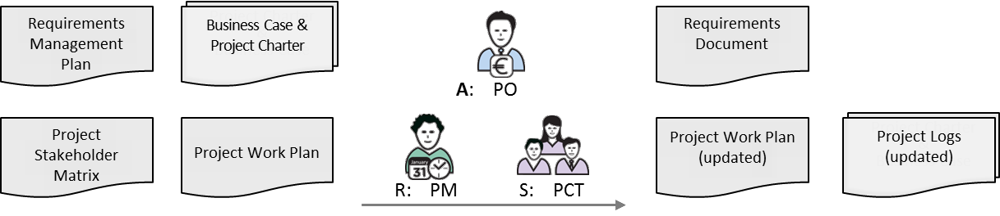

| Related Artefacts | Initiating | Planning | Executing | Monitor \& Control | Closing |
| :--: | :--: | :--: | :--: | :--: | :--: |
| Requirements   Management | Project Initiation   Request   Project Charter | Requirements   Management Plan   Deliverables Acceptance   Plan   Project Stakeholder   Matrix | Change   Requests | Requirements   Document   Project Work Plan   Project Logs | Project-End   Report |

**Outputs**

- Requirements Document
- Change Log (updated)
- Project Work Plan (updated)

### 9.6 Manage Project Change

Project change management defines the activities related to identifying, documenting, assessing, prioritising, approving, planning and controlling project changes, as well as communicating them to all relevant stakeholders. Changes can be requested (or identified and raised) throughout the project lifecycle by any project stakeholder.

The Project Change Management Process can be tailored and customised to a project's needs and can be documented either in a Project Change Management Plan or in the Project Handbook. A Change Log is used to document, monitor and control all project changes (see Appendix B). This makes it easier to track the changes and communicate them to the Project Owner (PO) and/or the Project Steering Committee (PSC) for approval.

|  Key Participants | Description  |
| --- | --- |
|  Project Manager (PM) | Monitors and controls the project changes.  |
|  Project Owner (PO) and/or
Project Steering Committee (PSC) | Approves or rejects the project changes.  |
|  Project Core Team (PCT) | Involved in analysing the requested project changes (estimating
the effort required to implement the changes).  |
|  Stakeholders | Informed about the approved project changes. May introduce
new project changes.  |

**Inputs**

- Business Case and Project Charter
- Project Change Management Process
- Project Work Plan
- Communications Management Plan
- Relevant logs (e.g. the Issue Log for managing changes related to issue resolution)

**Steps**

1. Identify the change: The purpose of this step is to identify and document change requests. The Project Manager (PM) ensures that a Change Request is appropriately documented (i.e. via a Change Request Form and in the Change Log).
2. Assess the change and recommend action: The purpose of this step is to a) assess whether this request is indeed a project change, b) consider the impact of not implementing the proposed change, c) estimate the size of the identified change based on its impact on the project objectives, schedule, cost and effort, and d) prioritise the implementation of the change request in relation to other change requests.
3. Approve the change: The purpose of this step is to reach a decision regarding the approval of the change based on the project's escalation procedure (i.e. the change must be reviewed by the appropriate decision-makers within the Managing/Directing/Steering Layers as defined by the project's Governance Model). There are four possible decisions: approve, reject, postpone or merge the change request. The decision details are documented in the Change Log and communicated to the requestor.
4. Implement the change: For approved or merged changes, the Project Manager (PM) should incorporate all related actions into the Project Work Plan and update the related documentation and logs (i.e. Risk, Issue, Change and Decision Logs and other plans).
5. Control the change: The purpose of this step is to monitor and control project changes so they can be easily communicated to the various project layers for approval or status updates. The Project Manager (PM) collects information on any project changes and related actions and controls the status of each change management activity.

All stakeholders affected by the project changes should be informed and the Change Log should be kept up-to-date.

| RAM (RASCI) | AGB | PSC | PO | BM | BIG | SP | PM | PCT |
| :-- | :--: | :--: | :--: | :--: | :--: | :--: | :--: | :--: |
| Manage Project Change | I | C | A | S | I | I | R | C |

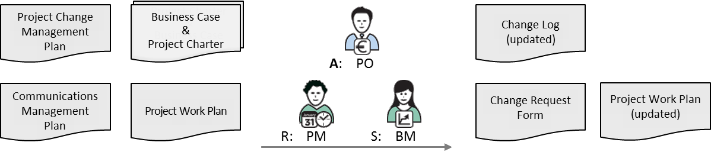

| Related Artefacts | Initiating | Planning | Executing | Monitor \& Control | Closing |
| :-- | :--: | :--: | :--: | :--: | :--: |
| Project Change Management | Project Charter | Project Change Management Plan | Change Request Project Reports | Change Log   Project Work Plan | Project-End  Report |

**Outputs** 

- Change Request Form
- Change Log (updated)
- Project Work Plan (updated)

### 9.7 Manage Risk 

Risk management is a systematic ongoing process for identifying, assessing and managing risks so that they conform to the organisation's accepted risk attitude. Risk management improves the project team's confidence by proactively managing any potential event that might have a positive or negative impact on project objectives.

The Risk Management Process can be tailored and customised to a project's needs and can be documented either in a Risk Management Plan or in the Project Handbook. A Risk Log is used to document and communicate the risks and relevant risk-response actions and responsibilities (see Appendix B).

| Key Participants | Description |
| :-- | :-- |
| Project Manager (PM) | Monitors and controls the risks. |
| Other project stakeholders | Informed of the critical risks. |
| Project Core Team (PCT) | Involved in identifying and responding to risks. |
| Project Steering Committee (PSC) | Monitors projects with high levels of risk exposure. |
| Other stakeholders | Identify and communicate risks in their areas of expertise. |

**Inputs**

- Business Case and Project Charter
- Risk Management Process
- Risk Log

**Steps**

1. Identify risks: The purpose of this step is to identify and document the risks that can have impact on the project's objectives. Note that new risks may arise at any point during the project and should be added to the Risk Log for further analysis/action.
2. Carry out a risk assessment: The purpose of this step is to assess the likelihood of each risk and the severity of its impact on project objectives. This assessment is necessary before any risk response can be planned. Medium to high level risks are dealt with at a higher priority level.
3. Develop a risk-response strategy: The purpose of this step is to choose the best possible strategy to meet an identified risk and to plan actions necessary to implement this strategy.
4. Control risk-response activities: The purpose of this step is to monitor and control the implementation of risk-response activities and to revise/update the Risk Log based on a regular reassessment.
5. Record: Update the Project Work Plan with clear risk-response tasks whenever deemed necessary.
6. Report: Regularly inform the Project Steering Committee (PSC) about risk-related activities.

| RAM (RASCI) | AGB | PSC | PO | BM | BIG | SP | PM | PCT |
| :-- | :--: | :--: | :--: | :--: | :--: | :--: | :--: | :--: |
| Manage Risks | I | C | A | S/C | C | I | R | C |

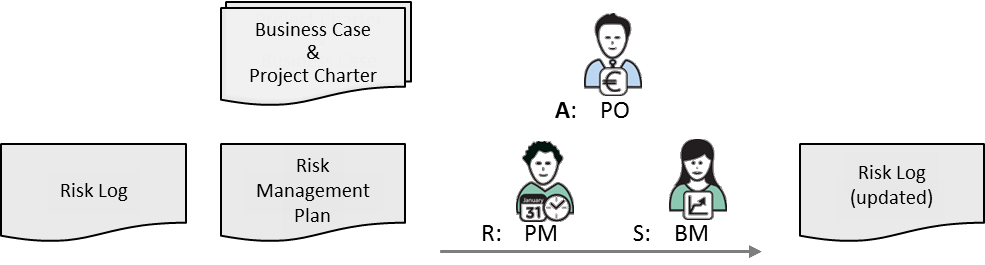

| Related Artefacts | Initiating | Planning | Executing | Monitor \& Control | Closing |
| :--: | :--: | :--: | :--: | :--: | :--: |
| Risk   Management | Project   Charter | Risk Management Plan | Project Reports | Project Logs   Project Work Plan | Project-End Report |

**Outputs**

- Risk Log (updated)

### 9.8 Manage Issues and Decisions 

The Project Manager (PM) manages project issues and decisions. Issues are identified, evaluated and assigned for resolution to relevant project stakeholders as per the Issue Management process, which can be documented in either an Issue Management Plan or the Project Handbook. The Issue Log is used to manage project issues, while the Decision Log is used to document all relevant decisions (see Appendix B). Decisions may be implemented by the Project Manager (PM) or escalated to the Project Steering Committee (PSC), depending on their importance. Note that issues and decisions are often linked to the resolution of other log items (e.g. risks, changes).

| Key Participants | Description |
| :-- | :-- |
| Project Manager (PM) | Monitors issues and decides how to manage them. |
| Project Core Team (PCT) | Reviews proposed action plan, takes action to resolve pending issues. |
| Other project stakeholders | Informed about important issues and make critical and important   decisions. |

**Inputs**

- Issue Management Process
- Project Logs
- Minutes of Meetings (MoMs)

**Steps** (managing project issues):

1. Ensure that issue management activities are carried out as per the Issues Management Process.
2. Identify issues and add them to the Issue Log.
3. Escalate the largest/highest-impact issues to the Project Steering Committee (PSC) or follow the defined escalation procedure and thresholds.
4. If the size or number of issues/actions is significant, update the Project Work Plan with major issue management activities.
5. Monitor and control the resolution of issues.
6. Update the Issue Log regularly with new issues as they arise. Close resolved issues.
7. Regularly report on issue status to project stakeholders (as per the Communications Plan).

**Steps (managing decisions):**

1. Document decisions taken during the project (particularly during the Executing Phase).
2. Link decisions to the resolution of other log items (e.g. risks, issues and changes).
3. The Project Manager (PM) regularly reports on the status of decisions to project stakeholders.

| RAM (RASCI) | AGB | PSC | PO | BM | BIG | SP | PM | PCT |
| :-- | :--: | :--: | :--: | :--: | :--: | :--: | :--: | :--: |
| Manage Issues and Decisions | I | I | A | S | C | I | R | C |

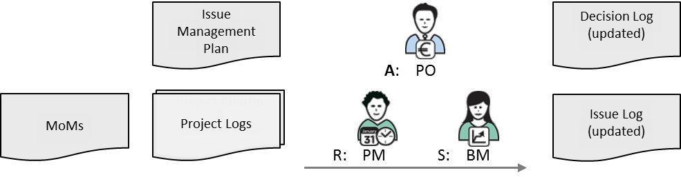

| Related Artefacts | Initiating | Planning | Executing | Monitor \& Control | Closing |
| :--: | :--: | :--: | :--: | :--: | :--: |
| Issue Management |  | Issue Management Plan | Project Reports | Project Logs   Project Work Plan | Project-End Report |

**Outputs**

- Issue Log (updated)
- Decision Log (updated)

### 9.9 Manage Quality 

Project quality management aims to ensure that the project will achieve the expected results in the most efficient way and that deliverables will be accepted by the relevant stakeholders. It involves overseeing all the activities needed to maintain a desired level of excellence. This includes performing quality planning, quality assurance, quality control and quality improvement throughout the project until the Closing Phase and the final acceptance of the project. Configuration management helps project stakeholders manage project artefacts and deliverables effectively by providing a single reliable reference to these artefacts and deliverables, thereby ensuring that the correct versions are delivered to the project requestor/client.

The Project Manager (PM) must ensure that the objectives, approach, requirements, activities, metrics and responsibilities of the quality management process are clearly defined and documented in the Quality Management Plan.

| Key Participants | Description |
| :-- | :-- |
| Project Manager (PM) | Ensures that all quality controls are carried out as planned. |
| Project Quality Assurance (PQA) | Reviews project quality. |
| Project Core Team (PCT) | Assists with Quality Control. |

**Inputs**

- Project Handbook
- Project Work Plan
- Quality Management Plan
- Deliverables Acceptance Plan

**Steps**

1. Define and reach agreement on project quality characteristics that take into consideration project needs, constraints and the cost of quality, following a cost/benefit analysis.
2. Plan and perform quality assurance and control activities.
3. Verify that the configuration management procedure is being followed.
4. Actively involve the whole project team and relevant stakeholders.
5. Identify any non-conformity, analyse the root cause, and implement corrective actions.
6. Identify opportunities to improve the quality of both the process and the deliverables.
7. Ensure deliverables are accepted by the relevant stakeholders in line with predefined and documented deliverables acceptance criteria and the agreed acceptance process.

| RAM (RASCI) | AGB | PSC | PO | BM | BIG | SP | PM | PCT |
| :--: | :--: | :--: | :--: | :--: | :--: | :--: | :--: | :--: |
| Manage Quality | I | I | I | S/C | C | A | R | C |

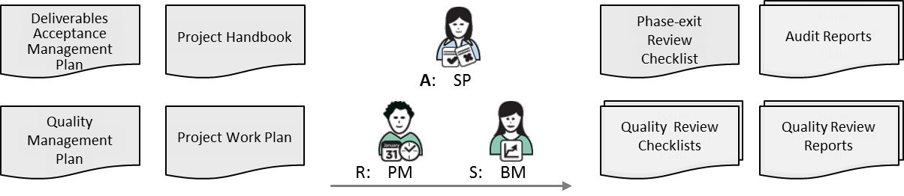

### 

| Related Artefacts | Initiating | Planning | Executing | Monitor \& Control | Closing |
| :--: | :--: | :--: | :--: | :--: | :--: |
| Quality Management | Project   Charter | Quality   Management   Plan | Quality Review   Reports   Audit Reports | Quality Review Checklist   Phase-exit Review   Checklist   Project Logs | Project-End Report   Project Acceptance   Note |

**Outputs**

- Quality Review Checklist
- Phase-exit Review Checklist
- Quality Review Reports
- Audit Reports

### 9.10 Manage Deliverables Acceptance 

A project may produce one or more deliverables. Each of these deliverables must be formally accepted. Deliverables acceptance management ensures that these deliverables meet the predefined objectives and criteria outlined in the Deliverables Acceptance Plan, so the project requestor can formally accept them.

Note that final project acceptance takes place in the Closing Phase.

| Key Participants | Description |
| :-- | :-- |
| Project Manager (PM) | Undertakes deliverables acceptance management. |
| Project Quality Assurance (PQA) | Assists the Project Manager (PM) and performs most of the quality   controls. |
| Project Steering Committee (PSC) | Provides the general project acceptance strategy. |
| Project Owner (PO) | Provides final acceptance of the project's deliverables. |

**Inputs**

- Deliverables Acceptance Plan
- Project Work Plan
- Quality Management Plan
- Outsourcing Plan (if applicable)

**Steps**

1. The Project Manager (PM) ensures that the acceptance procedures and guidelines are applied and the necessary environments (space, infrastructure, tools, etc.), materials and information are provided for the acceptance process to take place.
2. The Project Steering Committee (PSC) approves the application of the documented acceptance strategy and acceptance schedule.
3. The project deliverables are accepted if the acceptance activities (as described in the Deliverables Acceptance Plan) are carried out within a pre-specified tolerance range. Note that project deliverables can be conditionally accepted, even with a set of known defects or issues, if these are documented and if there is a plan in place for addressing them.
4. The Business Manager (BM) provides (qualified) resources to support the users' acceptance of the deliverables.
5. The Project Manager (PM) ensures that supporting deliverables (such as documentation) are supplied in addition to the main deliverables (taking an Information System as an example, such deliverables could include end-user support material, a User Manual, an Operations Manual, training materials, release notes, etc.).
6. The Project Owner (PO) formally accepts the project's deliverables.

Note: When domain-specific (e.g. technical) documentation is delivered for acceptance, it needs to be reviewed by a subject matter expert/representative.

For example:

- A stakeholder with business knowledge representing the business organisation-e.g. a User Representative (UR)-should review a User Manual.
- A stakeholder from the support and maintenance organisation should review an Operations Manual.
- A stakeholder from the organisation responsible for training should review training materials.
- A stakeholder from the service operations organisation should review release notes.

| RAM (RASCI) | AGB | PSC | PO | BM | BIG | SP | PM | PCT |
| :-- | :--: | :--: | :--: | :--: | :--: | :--: | :--: | :--: |
| Manage Deliverables Acceptance | I | I | A | S | C | C | R | C |

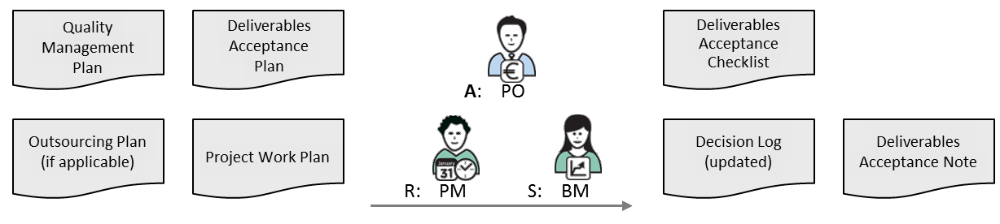

| Related Artefacts | Initiating | Planning | Executing | Monitor \& Control | Closing |
| :--: | :--: | :--: | :--: | :--: | :--: |
| Acceptance  Management | Project  Charter | Deliverables Acceptance Plan | Deliverables Acceptance Note | Deliverables Acceptance Checklist Decision Log | Project-End Report |

**Outputs** 

- Deliverables Acceptance Checklist
- Decision Log
- Deliverables Acceptance Note

### 9.11 Manage Transition 

Transition management ensures a controlled and smooth transition from the old state to the new state in which the new product/service developed by the project is put in place. It includes the management of any relevant communication activities and requires close cooperation between the Project Manager (PM) and the Business Manager (BM) to ensure the correct transfer of project deliverables to the client organisation.

| Key Participants | Description |
| :-- | :-- |
| Project Manager (PM) | Monitors and controls the transition. |
| Quality Assurance (PQA) | Can also be involved if necessary. |
| Other project stakeholders | Informed about progress and contribute as appropriate. |
| Project Owner (PO) | Provisionally accepts the product before the transition is complete. |

**Inputs**

- Transition Plan
- Project Work Plan
- Communications Management Plan
- Deliverables Acceptance Plan
- Business Implementation Plan

**Steps**

1. Ensure that the project acceptance criteria are met (and hence that all requirements are met and the deliverables are fully operational).
2. Ensure that the Transition Plan is carried out effectively. If there is no separate Transition Plan, the Project Manager (PM) needs to:

- Identify the various roles and stakeholders responsible for the transition process.
- Identify what must be achieved before the transition can be considered complete.
- If applicable, ensure that data backups and rollback scenarios are prepared.
- Ensure that business implementation activities are carried out and user training is delivered.
- Ensure that the delivery of the project's outputs is coordinated, communicated and accepted.
- Ensure that all maintenance and support activities begin as planned (if applicable).
- Ensure that all relevant documentation and other materials are handed over.

3. Ensure that the Project Owner (PO) has provisionally accepted the deliverables before the transition is complete.
4. Ensure that the ownership of, and responsibility for, project deliverables is transferred to the Project Owner (PO).
5. Ensure that the relevant acceptance document(s) are completed.

| RAM (RASCI) | AGB | PSC | PO | BM | BIG | SP | PM | PCT |
| :-- | :--: | :--: | :--: | :--: | :--: | :--: | :--: | :--: |
| Manage Transition | I | A | C | C | C | C | R | C |

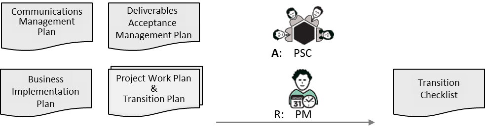

| Related Artefacts | Initiating | Planning | Executing | Monitor \& Control | Closing |
| :--: | :--: | :--: | :--: | :--: | :--: |
| Implementation   Management | Project   Charter | Transition Plan | Project Reports | Transition Checklist Sign-off Documents | Project-End Report |

**Outputs**

- Transition Checklist.
- Any other records/reports planned for this activity.
- Any acceptance documents (subject to contractual agreements).

### 9.12 Manage Business Implementation 

The effective execution of all business implementation activities is critical for smooth operations, even after the project's outputs have been delivered to the stakeholder/user community. Business implementation activities are thus complementary to transition activities.

Note that business implementation activities will almost always be required long after the project has ended, so it is good practice to also define post-project change activities. The implementation of these activities is the responsibility of the permanent organisation and they are usually carried out as part of ongoing operations or future projects.

| Key Participants | Description |
| :-- | :-- |
| Business Manager (BM) | Manages the business implementation activities. |
| Project Manager (PM) | Assists the Business Manager (BM) in this activity. Updates the Project   Work Plan with any activity changes or progress information. |

**Inputs**

- Business Implementation Plan
- Project Handbook
- Project Work Plan
- Transition Plan

**Steps**

1. Ensure that the Business Implementation Plan is complete and realistic.
2. Ensure that all business implementation activities within the scope of the project are included in the Project Work Plan (i.e. are defined and scheduled, with the resources they require estimated).
3. Focus on the project business implementation activities, that is, those activities that will be implemented during the project's duration and clearly fall under the project's budget and control.
4. Manage the execution of all (project) business implementation activities:

- Redesign, adapt or update any affected business processes.
- Implement the communication activities defined in the Business Implementation Plan.
- Implement the planned organisational change management activities.
- Ensure that all training activities are completed.
- Manage business continuity plans for business-critical systems.

5. Report on the status of business implementation activities, including any changes.

| RAM (RASCI) | AGB | PSC | PO | BM | BIG | SP | PM | PCT |
| :-- | :--: | :--: | :--: | :--: | :--: | :--: | :--: | :--: |
| Manage Business Implementation | I | I | A | R | C | I | S | I |

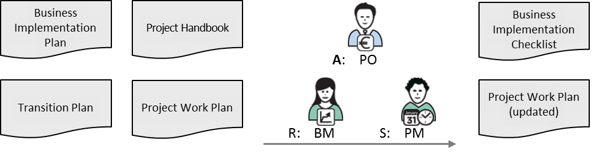

| Related Artefacts | Initiating | Planning | Executing | Monitor \& Control | Closing |
| :--: | :--: | :--: | :--: | :--: | :--: |
| Implementation   Management |  | Business   Implementation Plan   Transition Plan | Project   Reports | Project Work Plan   Business Implementation   Checklist | Project-End Report   (Post-project   Recommendations) |

**Outputs**

- Business Implementation Checklist
- Project Work Plan (updated)

### 9.13 Manage Outsourcing 

The Project Manager (PM) manages the delivery of all products and/or services that have been outsourced. This work is undertaken in conjunction with the relevant procurement groups and the Contractor's Project Manager (CPM) in order to ensure that the contractor effectively manages the outsourced work and delivers according to the time, cost and quality expectations defined in the Outsourcing Plan.

| Key Participants | Description |
| :-- | :-- |
| Project Manager (PM) | Manages the contractor(s). |
| Contractor's Project Manager (CPM) | Delivers an acceptable quality of services as defined/requested. |
| Project Quality Assurance (PQA) | Performs most of the quality controls. |

**Inputs**

- Outsourcing Plan
- Business Case and Project Charter
- Project Work Plan

**Steps**

1. The Project Steering Committee (PSC) ensures that the contractor is chosen according to the organisation's processes and standards and to the criteria defined for the project.
2. The Project Steering Committee (PSC) ensures that all contracts clearly define the expectations of both parties.
3. The Project Manager (PM) ensures that the working methods detailed in the project's Outsourcing Plan are applied.
4. The Project Manager (PM) monitors costs and schedules.
5. The Contractor's Project Manager (CPM) reports on the project's status and progress to the Project Manager (PM) and, if necessary, the Project Steering Committee (PSC).
6. The Project Manager (PM) manages changes to the outsourced work.
7. The Project Manager (PM) and/or Project Steering Committee (PSC) validate interim and final deliverables and/or milestones based on agreed criteria and as defined in the Outsourcing Plan.
8. The Project Manager (PM) ensures that the required formal approval is received on time and in accordance with organisational standards.

| RAM (RASCI) | AGB | PSC | PO | BM | BIG | SP | PM | PCT |
| :--: | :--: | :--: | :--: | :--: | :--: | :--: | :--: | :--: |
| Manage Outsourcing | A | C | C | C | I | S | R | I |

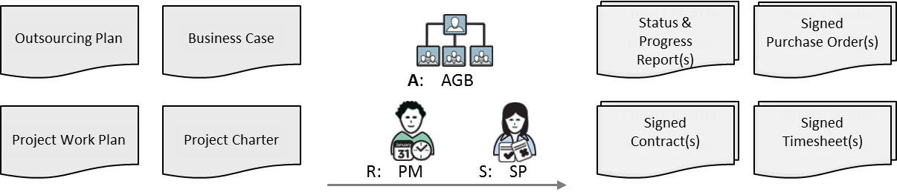

| Related Artefacts | Initiating | Planning | Executing | Monitor \& Control | Closing |
| :--: | :--: | :--: | :--: | :--: | :--: |
| Outsourcing Management |  | Project Handbook   Outsourcing Plan   Deliverables   Acceptance Plan | Project   Reports | Outsourcing   Management artefacts | Project-End   Report |

**Outputs**

- Status and progress report(s)
- Signed contract(s)
- Signed purchase order(s)
- Signed timesheet(s)

## Appendix B: Project Management Plans and Logs 

### B. 1 Requirements Management Plan

The Requirements Management Plan defines and documents the requirements management approach, process steps and responsibilities, as well as tools, techniques and artefacts that will be used. Note that requirements themselves are documented and managed in separate artefact(s) (e.g. requirements matrix).

Effective requirements management is a critical success factor for projects, as requirements are the starting point for all project work, and principally affect the project risk, duration and budget.

Requirements are traditionally defined in detail early in the project lifecycle. However, depending on the type, scope and chosen project strategy, the requirements management process may need to accommodate a more agile definition and elaboration of requirements, thereby allowing for frequent and less formal requirements management cycles.

The Requirements Management Plan can be tailored and customised to the project's needs. In the absence of a more specialised role, the Project Manager (PM) is responsible for executing the process from project initiation until all requirements have been implemented and validated.

| Key Participants | Description |
| :-- | :-- |
| Project Manager (PM) | Prepares this artefact. |
| Business Manager (BM) | Consulted for the tailoring and elaboration of this artefact. |

**Inputs**

- Project Charter
- Project Handbook
- Project Stakeholder Matrix

**Steps**

1. Check if a requirements management process already exists at the organisational level.
2. Tailor the Requirements Management Plan to the project's needs. Create it as a standalone document or as a section within the Project Handbook.
3. Define what a requirement is, and what the possible states of its lifecycle are.
4. Ensure that the requirements management process is aligned with the change management process, and that requirement changes are traced to the project's deliverables and activities.
5. Define the roles and responsibilities for each process step. Define clearly who is responsible for approving and validating the implementation of new requirements.
6. Define the tools and techniques that will be used to identify, evaluate, prioritise and manage requirements (e.g. brainstorming sessions, prototyping, MoSCoW, etc.).
7. Define the possible formats of representation of requirements for the project (e.g. text, use cases, diagrams, user stories, etc.)
8. Define the artefacts and repositories used for the documentation and management of the requirements (e.g. specification document or requirements traceability matrix).
9. Define the requirements validation process and make sure it is aligned with the overall deliverables acceptance process.
10. Ensure that the requirements management process is communicated to the project stakeholders.

| RAM (RASCI) |  | AGB | PSC | PO | BM | BIG | SP | PM | PCT |
| :--: | :--: | :--: | :--: | :--: | :--: | :--: | :--: | :--: | :--: |
| Requirements Management Plan |  | I | I | A | C | C | I | R | S |

| Related Artefacts | Initiating | Planning |  | Executing |  | Monitor \& Control |  | Closing |
| :--: | :--: | :--: | :--: | :--: | :--: | :--: | :--: | :--: |
| Requirements   Management | Project Charter | Project Handbook   Requirements   Management Plan   Deliverables   Acceptance Plan |  | Change   Requests | Requirements Document(s)   Project Work Plan   Project Logs |  | Project-End Report |  |

**Artefact** 

- Requirements Management Plan

### B. 2 Project Change Management Plan

The Project Change Management Plan defines and documents the change process for a project. It defines the activities, roles and responsibilities related to identifying, documenting, assessing, approving, prioritising, implementing, controlling, and communicating requested project changes.

Project change management brings transparency, accountability and traceability to all project changes implemented after the project scope and project plans have been baselined. The escalation procedure ensures that changes with a significant impact on project performance are properly assessed and approved by the appropriate level of authority. The Project Change Log is used to document requested changes and trace all related decisions and planned actions.

| Key Participants | Description |
| :-- | :-- |
| Project Manager (PM) | Prepares the Project Change Management Plan. |
| Project Owner (PO) | Approves the Project Change Management Plan. |
| Business Manager (BM) | Consulted for the elaboration of this artefact. |

**Inputs**

- Business Case and Project Charter
- Project Handbook
- Project Work Plan

**Steps**

1. Check if there is a pre-existing project change management process at the organisational level.
2. Tailor the Project Change Management Plan to the project's needs (e.g. define different steps depending on the type of change, its urgency or impact). Create it as a standalone document or as a section within the Project Handbook.
3. Ensure that there is no duplication of information contained in other management plans or the Project Handbook (e.g. the escalation procedure).
4. Define what is considered to be a change for the project, as well as the possible types of changes.
5. Define the artefacts and the tools and techniques that will be used to identify and assess changes (e.g. the Change Request Form or the Project Change Log).
6. Define who is responsible for approving changes at the various impact levels, and how this decision is communicated to the rest of the team.
7. Tailor the Change Log (if needed) and customise it to reflect any customisations of the Project Change Management Plan (e.g. scales of urgency, change impact and priority).
8. Describe the change monitoring and control activities, their frequency and supporting tools and techniques, e.g. review of changes at a predefined frequency based on the Change Log.
9. Ensure that the change management process is communicated to the project team and stakeholders.

| RAM (RASCI) |  | AGB | PSC | PO | BM | BIG | SP | PM | PCT |
| :--: | :--: | :--: | :--: | :--: | :--: | :--: | :--: | :--: | :--: |
| Project Change Management Plan |  | I | I | A | C | I | I | R | I |

| Related Artefacts | Initiating | Planning | Executing | Monitor \& Control | Closing |
| :--: | :--: | :--: | :--: | :--: | :--: |
| Project Change Management | Project   Charter | Project Handbook Project Change Management Plan | Project Reports Change Requests | Change Log   Project Logs   Project Work Plan | Project-End Report |

**Artefact**

- Project Change Management Plan
- Change Log (setup)

### B. 3 Risk Management Plan 

The Risk Management Plan defines and documents the Risk Management Process for a project. It describes how risks will be identified and assessed, what tools and techniques can be used, what the evaluation scales and tolerances are, the relevant roles and responsibilities, how often risks need to be revisited, etc. The Risk Management Plan also defines the risk monitoring and escalation process as well as the structure of the Risk Log, which is used to document and communicate the risks and their response actions.

Risk management brings visibility to risks and accountability as to how they are handled, and ensures that project risks are proactively dealt with and regularly monitored and controlled.

| Key Participants | Description |
| :-- | :-- |
| Project Manager (PM) | Prepares the Risk Management Plan. |
| Business Manager (BM) | Consulted for the elaboration of this artefact. |
| Project Owner (PO) | Approves the Risk Management Plan. |

**Inputs**

- Business Case and Project Charter
- Project Handbook
- Project Work Plan

**Steps**

1. Check if there is a pre-existing risk management process at the organisational level.
2. Tailor the Risk Management Plan to the project's needs (e.g. delete/add steps or activities, expand on or change the activities' description or related responsibilities, etc.). Create it as a standalone document or as a section within the Project Handbook.
3. Ensure that there is no duplication of information contained in other management plans or the Project Handbook (e.g. the escalation procedure).
4. Define the tools and techniques that will be used to identify, assess and monitor risks (e.g. brainstorming, Risks Database, Risk Breakdown Structure, Likelihood-Impact Matrix, Decision Tree Analysis, the Risk Log, etc.).
5. Customise the scales used for assessing risks (i.e. likelihood, impact and overall risk level).
6. Determine (with the involvement of key stakeholders) the project's risk appetite (the amount of risk that stakeholders are prepared to accept).
7. Decide on how frequently the Risk Log should be reassessed, considering both project and organisational conditions and policies.
8. Specify the escalation and communication procedures for risks that need special attention (i.e. which project stakeholders need to be informed if critical risks are triggered).
9. Identify the applicable risk response strategies both for identified threats and opportunities (i.e. avoid, transfer/share, reduce, accept or exploit, enhance, share and accept respectively).
10. Determine the level of detail with which risk response actions should be described in the Risk Log (e.g. action description, action owner, planned effort, etc.). Note that activities that need considerable effort should be included in the Project Work Plan.
11. Ensure that the risk management process is communicated to the project team and stakeholders.

| RAM (RASCI) | AGB | PSC | PO | BM | BIG | SP | PM | PCT |
| :--: | :--: | :--: | :--: | :--: | :--: | :--: | :--: | :--: |
| Risk Management Plan | I | C | A | C | I | I | R | I |

| Related Artefacts | Initiating | Planning | Executing | Monitor \& Control | Closing |
| :--: | :--: | :--: | :--: | :--: | :--: |
| Risk Management | Project   Charter | Project Handbook Risk Management Plan | Project   Reports | Risk Log   Project Logs | Project-End Report |

**Artefact**

- Risk Management Plan
- Risk Log

### B. 4 Issue Management Plan 

The Issue Management Plan defines and documents the activities, roles and responsibilities related to identifying, assessing, assigning, resolving and controlling project issues. Issues are defined as unplanned project-related events that require a project management action.

The issue management process helps the Project Manager (PM) to assess and act upon issues that have a potential impact on project scope, time, cost, quality, risk or stakeholder satisfaction. Related decisions can be logged in a Decision Log, which brings visibility to decisions and accountability as to how and by whom they are taken, and to whom they should be communicated.

An Issue Log is used to document the identification, evaluation and assignment of issues and to trace all key decisions and planned actions. It also helps keep track of who is responsible for solving specific issues by a certain deadline. It brings visibility and accountability as to how issues are acted upon, and ensures that they are properly managed and resolved.

| Key Participants | Description |
| :-- | :-- |
| Project Manager (PM) | Prepares the Issue Management Plan. |
| Business Manager (BM) | Consulted for the elaboration of this artefact. |

**Inputs**

- Project Charter
- Project Handbook
- Project Work Plan

**Steps**

1. Check if there is a pre-existing issue management process at the organisational level.
2. Tailor the Issue Management Plan to the project's needs. Create it as a standalone document or as a section within the Project Handbook.
3. Ensure that there is no duplication of information contained in other management plans or the Project Handbook (e.g. the escalation procedure).
4. Define what will be considered an issue for the project and customise the possible issue categories relevant to the project.
5. Define all artefacts, tools and techniques that will be used to identify, assess, assign, resolve and monitor issues (e.g. the Issue Log, root cause analysis, etc.).
6. Specify how new issues can be identified and their status communicated, and when new and open issues (and pending decisions) can be discussed (e.g. in project Status Meetings).
7. Customise the Issue Log to reflect any changes to the scales of urgency, impact and priority.
8. Define which issues (depending on their category, urgency and impact) can be handled at the (Project) Management Layer and which ones need to be escalated.
9. Describe the issue control activities, their frequency, and supporting tools and techniques (e.g. a review of issues in project Status Meetings based on the Issue Log or Project Status Reports).
10. Define how issues will be linked to their source, to related decisions, actions, risks and changes.
11. Specify the procedure for updating the Lessons Learned after an issue is resolved.
12. Ensure that the issue management process is communicated to the project team and stakeholders.

| RAM/RASCI | AGB | PSC | PO | BM | BIG | SP | PM | PCT |
| :-- | :--: | :--: | :--: | :--: | :--: | :--: | :--: | :--: |
| Issue Management Plan | I | I | A | C | C | I | R | C |

| Related Artefacts | Initiating | Planning | Executing | Monitor \& Control | Closing |
| :--: | :--: | :--: | :--: | :--: | :--: |
| Issue Management | Project   Charter | Project Handbook   Issue Management Plan | Project   Reports | Issue Log   Decision Log | Project-End Report |

**Artefact**

- Issue Management Plan
- Issue Log
- Decision Log

### B. 5 Quality Management Plan 

The Quality Management Plan defines and documents the project's quality requirements, the quality management approach, process and responsibilities. It also outlines the quality assurance and control activities undertaken throughout the project.

Planning and executing quality assurance and control activities may be seen as a significant investment of time and effort, and therefore the desired balance between the planned quality, cost, time and risk should be carefully evaluated and considered. Appropriate quality metrics should be defined and later used to evaluate the project management quality. All quality-related activities should be well designed and planned.

A configuration management procedure is also documented in the Quality Management Plan. Configuration management helps project teams handle project artefacts and deliverables effectively (i.e. to ensure that the correct versions are delivered, to prevent unauthorised changes and to provide artefact traceability).

| Key Participants | Description |
| :-- | :-- |
| Project Manager (PM) | Prepares the Quality Management Plan. May also be supported by other   roles such as the Project Quality Assurance (PQA), Project Support Office   (PSO) and other project stakeholders. |
| Business Manager (BM) | Reviews and validates the quality requirements, quality assurance and   control activities, and the associated metrics. |

**Inputs**

- Project Charter
- Project Handbook
- Project Work Plan

**Steps**

1. Check if there is a pre-existing quality management process at the organisational level.
2. Tailor the Quality Management Plan to the project's needs. Create it as a standalone document or as a section within the Project Handbook.
3. Determine the quality management objectives and characteristics by reviewing project deliverables, success criteria, approach and other specific requirements (e.g. security requirements) as described in the Project Charter and Project Handbook.
4. Ensure that there is no duplication of information contained in other management plans or the Project Handbook (e.g. the escalation procedure).
5. Define approval criteria for phase exit reviews or for other key project management milestones.
6. Define all artefacts, and the tools and techniques that will be used for quality planning and quality assurance and control (e.g. the Quality Review Checklist).
7. Determine the quality assurance and control activities and define their frequency and timetable. Additionally, design metrics and acceptance tolerances for evaluating these activities.
8. Determine if a Project Quality Assurance (PQA) role (or other independent entity) is required to carry out quality assurance activities.
9. Define the roles and responsibilities for the quality process and ensure that these roles are agreed by and communicated to all stakeholders involved.
10. Review the quality characteristics with relevant stakeholders. Ask them to suggest quality assurance and control activities specifically for the project.
11. Define the quality and configuration procedures and records which show that quality and configuration management activities have been carried out as planned.
12. Tailor the Quality Review Checklist based on the quality control activities defined for the project.
13. Ensure that quality assurance and control activities are traceable back to specific work activities in the Project Work Plan.
14. Ensure that the document's reviewers and approver are clearly identified.
15. Present the planned activities and timetable to the Project Steering Committee (PSC) for approval.
16. Communicate the approved plan to the project team and relevant stakeholders.

**Guidelines (specific for configuration management)** 

- Review the configuration management process set out in the Quality Management Plan and tailor it to the project's needs (e.g. delete or add steps or activities, expand on or change the activities' description, related responsibilities, etc.).
- Define what will be considered to be a configuration item based on project deliverables and artefacts, and identify the attributes of such items.
- Identify who is responsible for changes to the configuration items and for maintaining and controlling their versions and releases.
- Define the artefacts and the tools and techniques that will be used to manage the configuration items.
- Depending on the project's complexity, a configuration management log can be used to control changes to the configuration items.
- Describe the naming conventions to be used in project documentation, folders and emails.
- Define the structure of project folders and the procedures and rights related to reviewing, changing or updating any project artefacts. Ensure that restricted access and confidentiality rules are correctly implemented.
- Define any procedures related to creating copies of project data, retention periods, storage devices and sanitisation/deletion of data (if required).
- Ensure that the configuration management procedure is communicated to the project team.
- Key information on configuration management may also be summarised in the Project Handbook.

| RAM (RASCI) |  | AGB | PSC | PO | BM | BIG | SP | PM | PCT |
| :--: | :--: | :--: | :--: | :--: | :--: | :--: | :--: | :--: | :--: |
| Quality Management Plan |  | I | A | C | C | C | C | R | C |

| Related Artefacts | Initiating | Planning | Executing | Monitor \& Control | Closing |
| :--: | :--: | :--: | :--: | :--: | :--: |
| Quality Management | Project   Charter | Project Handbook   Quality   Management Plan | Quality Review   Reports   Audit Reports | Quality Review Checklist Project Logs Phase-exit Review Checklist | Project-End Report   Project Acceptance   Note |

**Artefact**

- Quality Management Plan
- Quality Review Checklist
- Phase-exit Review Checklist

### B. 6 Communications Management Plan 

The Communications Management Plan helps to ensure that all project stakeholders have the information they need to perform their roles throughout the project. Planning and executing project communication activities is essential for project success.

The Communications Management Plan defines and documents communication activities, their goals, content, format, frequency and audience. It also defines how to communicate project status and the assignment of activities to the various stakeholders and includes a communication strategy for each key stakeholder, based on their interests, expectations and influence in the project.

| Key Participants | Description |
| :-- | :-- |
| Project Manager (PM) | Prepares the Communication Management Plan. |
| Business Manager (BM) | Provides input and assists in its creation. |

**Inputs**

- Project Charter
- Project Handbook
- Project Stakeholder Matrix
- Project Work Plan

**Steps**

1. Review the guidelines set out in the Communications Management Plan template to get a better understanding of how to tailor and customise it .
2. Ensure that there is no duplication of communication activities described in other management plans such as the Quality Management Plan, the Risk Management Plan, etc.
3. If certain processes are already described in the Project Handbook (e.g. the escalation process), reference them to avoid duplication and simply document any changes.
4. Identify project stakeholder groups based on the Project Stakeholder Matrix.
5. When determining the strategy for each communication activity, consider the interests and influence of both internal and external organisations to the project.
6. For each target group, determine what information needs to be communicated, and the purpose of the communication.
7. Define all artefacts (e.g. Project Reports) and other means to collect, analyse and distribute project information and manage stakeholders' expectations.
8. Determine the frequency of the communication activities, their format and the media to be used for the communications (e.g. reports, presentations, meetings, emails, calls).
9. Determine who will be responsible for each communication activity and describe the expected results.
10. Ensure that the communication management plan is communicated to the project stakeholders.

| RAM (RASCI) |  | AGB | PSC | PO | BM | BIG | SP | PM | PCT |
| :--: | :--: | :--: | :--: | :--: | :--: | :--: | :--: | :--: | :--: |
| Communications Management Plan |  | I | I | A | S | C | I | R | C |

| Related Artefacts | Initiating | Planning |  | Executing |  | Monitor \& Control |  | Closing |
| :--: | :--: | :--: | :--: | :--: | :--: | :--: | :--: | :--: |
| Communications   Management | Project   Charter | Project Stakeholder   Matrix   Communications   Management Plan |  | Project   Reports |  | Project Logs |  | Project-End   Report |

**Artefact**

- Communications Management Plan

### B. 7 Change Log 

| Change Identification and Description |  |
| :--: | :--: |
| ID | The change identifier. |
| Category | Categorises the change. |
| Title | A short title for the requested change. |
| Description | A more detailed description of the requested change and the impact of not implementing the change. |
| Status | The status of the change can be any of the following:   Submitted: This is the initial status. Use this while the requested change is still being specified.   Assessing: Use this status to initiate an assessment.   Waiting for approval: Use this to initiate approval. Before applying this status, ensure that the investigation is complete, and the estimates shown are correct.   Approved: This status is set once the change has been approved, as proposed, or modified   Rejected: This status is set if the change was rejected.   Postponed: This status is set if the change is postponed indefinitely.   Merged: This status indicates that the change has been merged into some other change, so it is no longer being actively handled. Merging is common when there are many changes.   Implemented: This status indicates that the work implementing this change has been incorporated into the Project Work Plan. |
| Requested by | The name of the person requesting the change. |
| Date Identified (or Submission Date) | The initial submission date of the change request. |
| Change Assessment and Action Description |  |
| Action Details (effort \& responsible) | Description of the recommended action, including steps, deliverables, timescale, resources and effort involved. |
| Size | The effort required to implement the change.   The possible values are:   5=Very high, 4=High, 3=Medium, 2=Low, 1=Very low |
| Priority | A numerical value denoting the agreed priority of the change. The possible values are:   5=Very high, 4=High, 3=Medium, 2=Low, 1=Very low |
| Target Delivery Date | The target date for the change to be delivered. |
| Change Approval |  |
| Escalation | Escalation to the Directing or Steering layer is needed? (Yes or No). |
| Decision | The decision taken. |
| Decided by | Person or committee that denied or approved the change. |
| Decision Date | Date on which the decision was made. |
| Change Implementation |  |
| Actual Delivery Date | The date on which the change was actually delivered. |
| Traceability and Comments | The ID(s) of the tasks (in the Project Work Plan) that implement the change, and/or the IDs of related issues, risks or decisions. Also include any additional information/comments related to the change. |

### B. 8 Risk Log 

| Risk Identification and Description |  |
| :--: | :--: |
| ID | The risk identifier. |
| Category | Risk category related to the area affected by the risk (e.g. business, IT, people \& organisation, external or legal). |
| Title | A short title for the risk. |
| Description | A structured formulation of the opportunity or threat in the form of (route) Cause - Risk -Effect, along with potential risk inter-dependencies. |
| Status | The risk status can be any of the following:   Proposed: This is the initial status. Use this while the risk is still being specified.   Assessing: Use this status to initiate an assessment.   Waiting for Approval: Use this to request approval. Before applying this status, make sure the assessment is complete and the estimates are reliable.   Approved: This status is set once the risk possibility has been accepted.   Rejected: This status is set if the risk was rejected as not relevant.   Closed: This status is set once the risk has been managed (e.g. mitigation |
| Identified by | The person who identified the risk. |
| Identification date | The date on which the risk was identified. |
| Risk Assessment |  |
| Likelihood (L) | A numerical value denoting the estimate of the probability that the risk will occur. The possible values are:   5=Very high, 4=High, 3=Medium, 2=Low, 1=Very low |
| Impact (I) | A numerical value denoting the severity of the risk's impact (should it occur). The possible values are:   5=Very high, 4=High, 3=Medium, 2=Low, 1=Very low |
| Risk Level (RL) | The risk level is the product of the likelihood and impact (RL=L*I). |
| Risk owner | The person accountable for managing and monitoring the risk. |
| Escalation | Whether or not the risk is to be escalated to the Directing or Steering Layers (Yes or No). |
| Risk Response |  |
| Risk response Strategy | Strategies for negative risks (threats):   Avoid, Reduce, Accept, Transfer/Share   Strategies for positive risks (opportunities):   -Exploit, Enhance, Accept, Share |
| Action details (effort \& responsible) | Description of the action(s) to be taken, including its objective, scope, deliverables, and the person responsible and estimated effort needed. |
| Target date | The date on which the action is expected to be implemented. |
| Traceability/Comments | The ID(s) of the tasks (in the Project Work Plan) that implement the risk response actions, and/or the IDs of related changes, issues, or decisions (log entries). Also include any additional information/comments related to the risk. |

### B. 9 Issue Log 

| Issue Identification and Description |  |
| :--: | :--: |
| ID | The issue identifier. |
| Category | Issue category related to the area affected by the issue (e.g. business, IT, people \& organisation, external or legal). |
| Title | Short title for the issue. |
| Description | A description of the issue and its impact. |
| Status | The issue status can be any of the following:   Open: The issue has been identified and requires attention and, if possible, a resolution.   Postponed: This status is set if resolving the issue is postponed due to other priorities.   Resolved: This status indicates that all necessary actions are completed, and the issue is resolved.   Closed: This status indicates that all work is completed and verified. The issue can then be marked as closed. |
| Identified by | The name of the person who identified the issue. |
| Identification date | The date on which the issue was raised. |
| Issue Assessment and Action Description |  |
| Action details (effort \& responsible) | Description of the recommended action to be taken, and the steps, deliverables, timescale, resources, and effort involved. |
| Urgency | A numerical value denoting how urgent the issue is. The possible values are: 5=Very high, 4=High, 3=Medium, 2=Low, 1=Very low |
| Impact | A numerical value denoting the issue's impact. The possible values are: 5=Very high, 4=High, 3=Medium, 2=Low, 1=Very low |
| Size | Issue size represents the effort needed to resolve the issue.   The possible values are:   5=Very high, 4=High, 3=Medium, 2=Low, 1=Very low |
| Target date | The date on which the issue is expected to be resolved. |
| Issue owner | The person accountable for resolving the issue. |
| Escalation | Whether or not the issue is to be escalated to the Directing or Steering Layers (Yes or No). |
| Traceability/Comments | The ID(s) of the tasks (in the Project Work Plan) that implement the issue actions, and/or the IDs of related changes, risks or decisions (Log entries). Also include any additional information/comments related to the issue. |

### B. 10 Decision Log 

| Decision Identification and Description |  |
| :-- | :-- |
| ID | The decision identifier. |
| Category | Decision category related to the area affected by the decision (e.g. business,   IT, people \& organisation, external or legal). |
| Title | Short title for the decision. |
| Description | A description of the decision's details and impact, if applicable. |
| Identified by | The name of the person who identified the need for a decision. |
| People present | Log the names of those present when then decision was made. Reference   can be made to the relevant Minutes of Meeting (MoM) if appropriate. |
| Comments | The IDs of related Change, Risk or Issue Log entries and any additional   information related to the decision. |
| Ownership |  |
| Decision owner | The person accountable for the decision. |
| Decision date | Date on which the decision was taken. |
| Escalation | Whether or not the decision is to be escalated to the Directing or Steering   Layers (Yes or No). |
| Decision Implementation |  |
| Date of Application | The date on which the decision is applicable. |
| Decision communicated   to: | The group, teams, and other audiences to whom the decision should be   communicated. |

## Appendix C: Project Management Tools \& Techniques 

This section introduces a number of commonly used Project Management Tools \& Techniques useful for dealing with various project management challenges. Each Tool \& Technique is summarised in a few paragraphs providing a simple and high-level overview of that tool or technique.

Note that the set of tools presented is not an exhaustive list of Project Management Tools \& Techniques available. Relevant sources for further reading and exploration are also presented at the end of this section.

### C. 1 PESTEL Analysis

The PESTEL Analysis is used to understand how the environment might impact a project or an objective. PESTEL stands for: Political, Economic, Social, Technological, Environmental and Legal. A PESTEL analysis helps identify the external factors that influence an organisation, and therefore, could have an impact on the objectives, planning or execution of projects.

This type of analysis is particularly important in the context of business justification and risk management and will feed the process of designing a plan comprehensive enough to identify and tackle potential risk scenarios (threats/opportunities) arising from outside the organisation or project.

### C. 2 Make or Buy Analysis

A Make or Buy Analysis helps the organisation to take an informed decision about what to outsource and what not to outsource. Portfolio managers and project sponsors are often faced with the dilemma to make or buy, considering the availability and skills of resources at hand.

The various factors to be considered for a Make or Buy Analysis include cost comparison, technology and business processes, supplier-related information and support systems.

Potential reasons for a make decision include cost effectiveness, intellectual property concerns, quality control issues or supplier unreliability issues. Potential reasons for buy decision include cost considerations, lack of technical expertise, suppliers' technical experience and/or insufficient in-house resources.

### C. 3 Stakeholder Interest/Influence Matrix (SIIM)

This technique is used to facilitate and document the analysis of the interest and influence of each stakeholder in the project. It is of utmost importance to know the stakeholders and their relevance for the project in order to identify project champions and possible detractors. As the document makes reference to people within your organisation, care should be used to keep the information confidential.

Interest indicates the level of interest a stakeholder has for the project. Interest is measured as the degree of enthusiasm displayed by the stakeholder in support of the project. Stakeholders can be positive, neutral or negative towards the project.

Influence indicates the power the stakeholder has over the planning and implementation of activities. The higher a stakeholder's power of decision, the higher their influence. Most often the person(s) who can make decisions on project funding and/or resources has a high influence.

### C. 4 Risk Likelihood/Impact Matrix

The Risk Likelihood/Impact Matrix (sometimes called the Likelihood-Impact Matrix or Risk Matrix) is used in the qualitative assessment of risks, after the project risks have been identified. The matrix is designed as a tool to supplement the risk log or risk register.

The Risk Likelihood/Impact Matrix is based on two criteria: the likelihood that a risk will materialise and the potential impact caused by the risk event. Most commonly five bands are used for each of the dimensions of the matrix: 1=Very low, 2=Low, 3=Medium, 4=High, 5=Very high.

The two factors are then combined by multiplying their values, resulting in the Risk Level. Measured on a relative scale from 1 to 25 , the Risk Level will trigger different risk response strategies.

The cells of the matrix are painted in different colours to indicate the criticality of the risk, typically Green for low-level risks (risk level <=2), Yellow for medium-level risks (risk level between 3 and 16), and Red for high-level risks (risk level >=20).

Based on the risk appetite of the organisation, adequate risk-response strategies can be developed for each identified risk.

### C. 5 Work Breakdown Structure (WBS) 

A Work Breakdown Structure (WBS) is a hierarchical division of the project into smaller work components that can be used to assign work or to estimate effort and cost. A well-made Work Breakdown Structure (WBS) should be easy to understand, be complete, and should facilitate progress monitoring during execution. Commonly used techniques include breaking down the project by phases or stages, deliverables or outputs, by work packages, or based on the organisation, its departments and business units.

The Work Breakdown Structure (WBS) constitutes a good basis for the Project Manager (PM) in assigning different responsibilities to team members. Each task in the structure can then be further defined: work can be estimated, risks and dependencies can be identified, and resources can be mobilised.

### C. 6 Deliverables Breakdown Structure (DBS)

A Deliverables Breakdown Structure (DBS) is an essential part of Product Based Planning. It can be used to identify and document the deliverables of a project (both project deliverables and project management deliverables) and their interdependencies. This results in a hierarchical tree of deliverables and subdeliverables (physical, functional or conceptual) that make up the entire project, which helps the project team to identify the full set of deliverables that comprise the project.

A Deliverables Breakdown Structure (DBS) is similar to a Work Breakdown Structure (WBS) but is used at a different step in the planning process. The former can precede the latter and identifies the desired outputs (deliverables) which are then used in the creation of the Work Breakdown Structure (WBS)—identification of tasks and activities required to deliver these outputs.

You could say that the Deliverables Breakdown Structure (DBS) defines what the project will produce (as a whole and as parts), and the Work Breakdown Structure (WBS) defines the work needed to produce them.

### C. 7 Effort and Cost Estimates

The Effort and Cost Estimates technique derives from the Work Breakdown Structure (WBS): each work item (task) is estimated in terms of effort and cost. Effort is typically measured in person days or person months. This work is done in close cooperation with the task owners or other experts within the Project Core Team (PCT), to ensure more precise estimates and buy-in from the team members in charge of executing the work.

A high-quality Work Breakdown Structure (WBS) forms the basis for high-quality estimates.

### C. 8 Three-Point Estimates

The Three-Point Estimate is commonly used, in conjunctions with Network Diagrams, to provide a weighted average of activity duration or cost. It is primarily a quantitative risk assessment technique that makes use of a stochastic approach rather than a deterministic one (e.g. single point estimates). The expected duration/cost and standard deviation of a project's duration or cost is calculated based on three data points, namely an optimistic estimate of duration or cost, a most likely estimate and a pessimistic estimate. These estimates are then weighed to provide a weighted average of the effort, cost or duration.

In addition, these estimates can be used to calculate a standard deviation, to estimate confidence levels of the weighted average per activity, and to build simple statistical models of a task's time and cost. This method can be applied to forecast and mitigate risk and to assign buffers/contingencies to tasks. Nowadays, numerous Project Management Software, can perform automated calculation of the above through modelling and simulation (e.g. by using the Beta-PERT distribution).

Involving experts increases the accuracy of the three-point estimates and reduces the degree of uncertainty of the project.

### C. 9 Decision Trees

The decision tree is a visual decision support tool, consisting of nodes and branches that helps us describe possible alternatives (paths) by representing choices, and events with different likelihood of occurrence. It uses three types of nodes: (a) Decision nodes (represented by squares) (b) Chance nodes (represented by circles) and (c) End nodes (represented by triangles).

In decision tree analysis (primarily being performed during project risk management), the decision tree is principally used in conjunction with the Expected Monetary Value (EMV) where we compute the EMV of

each alternative (branch) and thus select the most favourable one. The decision tree analysis can also be performed by creating a stochastically determined structure and then simulate the outcomes (e.g. through Monte Carlo simulation), in order to derive to probability-based decisions.

### C. 10 Project Scheduling 

Project Scheduling aims to identify dependencies between tasks, to assign resources for each task, to identify task start and end dates, and to work out the overall project duration.

Scheduling can be done for the entire project upfront or for portions thereof, such as individual stages or iterations. Different scheduling methods and representations can be used: a list of dates/deadlines, a milestone plan, bar charts, network diagrams and linked bar charts (Gantt charts), all of which can be seen complementary to each other.

Once approved, the project schedule is baselined and any further change to the schedule needs to follow the change management process and the corresponding governance arrangements.

### C. 11 Resource Levelling

Resource Levelling is a technique used to analyse the unbalanced use of project resources and to resolve conflicts related to resource allocation (i.e. human resources, material or equipment).

Resource Levelling focuses on an efficient/optimal resource allocation in order for the project to be completed within the defined timeline. Project Managers (PMs) analyse dependencies between projects or activities to ensure that activities can be executed in a timely manner. Considering the identified constraints, Resource Levelling can be performed. Resource Levelling can for example require the delay of specific tasks until resources are available, via resource reallocation.

### C. 12 Gantt Charts

A Gantt Chart is a common project management tool used to represent the schedule, phases and activities of a project in a single visual (generally a type of horizontal bar chart). It focuses on project sequence, duration, dependencies and status in a manner that is easy to understand.

A Gantt Chart represents the order in which activities need to be carried out and provides an overview of the progress that has been achieved at any point in time. A Gantt Chart is used to communicate a project schedule in a visual way but is also used to show progress made and current schedule status by adding percent-complete shadings and a vertical "today" line. The main strength of this technique is the ability to clearly display the status of each activity at a glance.

### C. 13 Critical Path Method (CPM)

The Critical Path Method (CPM) is a modelling technique that uses a mathematically based algorithm to calculate the total duration of a project. It calculates the longest necessary path (i.e. the longest unavoidable duration) of planned activities from beginning to the end of the project, otherwise known as the critical path of the project. This technique helps to understand which activities have a critical influence on the overall duration of the project.

Since the critical path represents the longest necessary path of activities, it also represents the shortest possible duration of the project to completion. Based on this information, activities can be prioritised in order to shorten the duration of the critical path by pruning the critical path activities, performing more activities in parallel or adding more resources.

### C. 14 Critical Chain Method (CCM)

The Critical Chain Method (CCM) is a modelling technique used to plan and schedule a set of activities or projects. It is similar to the Critical Path Method (CPM), but takes into account resources and their levelling, as well as the behaviour of the Project Manager (PM) when estimating the duration of project activities.

The technique is based on the observation that activity time estimates for projects are close to double the time required to complete the activities. Reasons that lead to a delay can include not taking advantage of the early finish of an activity, pacing of the team members to fill the time available for the completion of a task, waiting until the last moment to really focus on the task at hand, etc.

The Critical Chain Method (CCM) assumes that a Project Manager's (PM) estimates of duration for activities are padded, and immediately proceeds to reduce them. Additional buffers (project buffer, feeding buffer, resource buffer) are then added to account for the reduction in project estimates.

### C. 15 Earned Value Management (EVM) 

Earned Value Management (EVM) is a technique used to monitor and control the performance of projects, providing an objective view of performance based on the project financials. Both cost and value are measured in terms of cost units (e.g. person days or euro). Earned Value Management (EVM) provides relatively objective metrics-or key performance indicators (KPIs)-to proactively manage project performance. Some indicators reflect on progress made so far, or deviations from the plan from a cost or work value point of view, while other indicators focus on forecasting total budget deviation, or on the productivity levels required to complete the project on schedule.

The principal metrics being used are the Planned Value (PV), also known as Budgeted Cost of Work Scheduled (BCWS), the Actual Cost (AC), also known as Actual Cost of Work Performed (AVWP) and the Earned Value, also known as Budgeted Cost of Work Performed (BCWP). Through the combination of the above metrics we can have various KPIs, e.g. Schedule Variance (SV) and Schedule performance Index (SPI), Cost Variance (CV) and Cost Performance Index (CPI) or even more advanced ones for forecasting future project performance, like the Estimate at Completion (EAC), the Estimate to Complete (ETC) and the To Complete Performance Index (TCPI).

### C. 16 Pareto Analysis

The Pareto Analysis is a formal technique to identify those issues that cause the majority of problems in a project. The Pareto principle states that generally 80% of the effects come from 20% of the causes (e.g. 80% of costs may be attributed to 20% of activities or 80% of risk effects may arise from just 20% of identified risks).
By focusing on these top issues (the 20%), the Pareto Analysis can be useful for risk or quality management as it helps to focus on those risks or quality issues with the highest impact on a project, therefore facilitating the prioritisation of necessary mitigation or contingency actions.

### C. 17 Lessons Learned

Capturing Lessons Learned is a way of identifying areas for development/improvement within a project for the purpose of helping similar projects avoid certain pitfalls in the future. Information that can be captured includes Lessons Learned from the management of risks, quality issues, outsourcing or contractor issues, change requests, etc.

The project team can capture ideas through brainstorming sessions, reviewing project reports and logs, sending project questionnaires, etc., during the lifecycle of the project. The Project Manager (PM) will group and prioritise Lessons Learned in order to understand key potential improvement areas.

To avoid making the same mistakes twice, Lessons Learned should be shared with other project managers. In some cases, Lessons Learned can lead to process improvements, enhanced checklists and templates, or more effective training courses.

## Appendix D: PM² Extensions \& Considerations 

### D. 1 Agile, Programme, and Portfolio Management

#### D.1.1 PM² and Agile Management

PM² recognises the complex and uncertain nature of many types of projects and the positive contribution of the Agile way of thinking to their effective management.

Agile approaches face various challenges, which grow with the size of the organisations in which they are applied. In the case of many organisations, these challenges include coordination between Agile and nonAgile teams, compliance with various organisational governance and audit requirements, and organisational architecture and interoperability constraints.
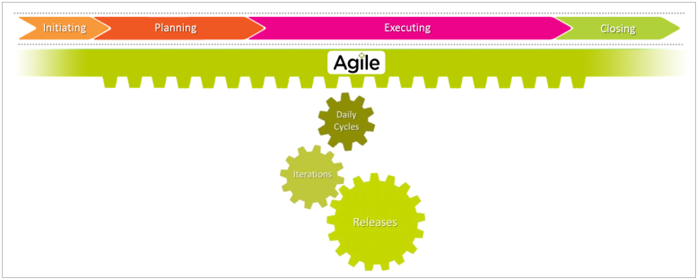

The Agile extension to PM² incorporates Agile into the overall PM² framework and creates the foundations for moving towards increased project management and organisational agility. It helps project teams achieve the desired level of agility while accommodating tight procurement and audit requirements, coordination with the programme and portfolio levels, and collaboration with other projects, contractors, other organisational units and even external organisations.

**The Agile extension to PM² provides (for IT projects):**

- Agile roles \& responsibilities (as an extension to the PM² governance).
- integration with the overall PM² project lifecycle.
- a set of suggested Agile PM² Artefacts (as an extension to the PM² Artefacts).

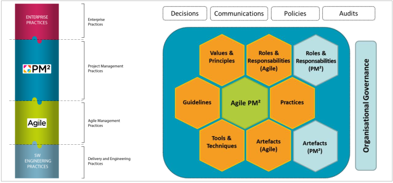

Documenting the work planned and performed by the Agile teams is critical to increasing transparency and coordination between the different layers of the PM² project organisation (i.e. between the Directing, Managing and Performing layers).

A set of artefacts supports the use of Agile PM². These artefacts capture and document information related to the management approach, to specific (implementation) activities, milestones, issues and progress reporting. These artefacts are grouped in three categories: Agile-Specific Artefacts, Coordination \& Reporting Artefacts, and Project Governance Artefacts.
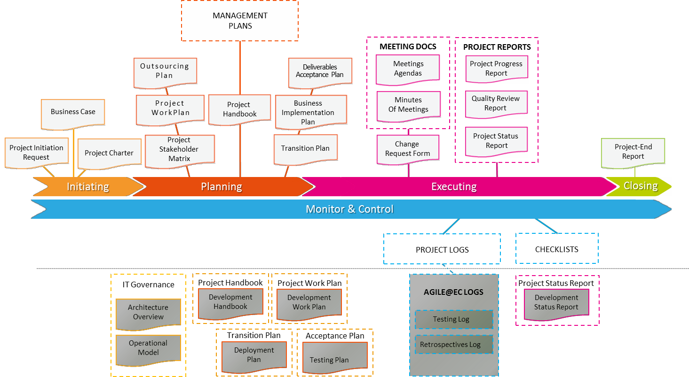

#### D.1.2 PM² Programme Management (PgM²) 

A programme is a collection of projects aimed towards a common goal which are managed in a coordinated way to obtain benefits and control that could not be obtained from managing them individually.

Programmes may also include work outside the scope of the discrete projects in the programme. Programme management is the process of applying knowledge, skills, and actions to a programme to achieve its objectives and benefits.

The programme management layer interacts with the project management layer in that it initiates and coordinates the projects within the programme. The programme itself is initiated from the portfolio management layer within the organisation.
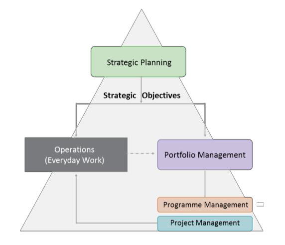

**Programme Lifecycle** 

A programme has a defined start and end during which all programme activities are performed, and the projects are delivered. The PM² programme lifecycle has four phases, which are similar but distinct to the PM² project lifecycle: The Initiating Phase, the Planning Phase, the Executing Phase and the Closing Phase. Throughout the whole life of the programme Monitor \& Control activities are performed.

The Executing Phase can also contain several Stages, each one being linked to a major achievement in terms of programme outcomes, which enables the realisation of the benefits.

The typical programme management activities performed during each phase go hand-in-hand with a number of programme artefacts.
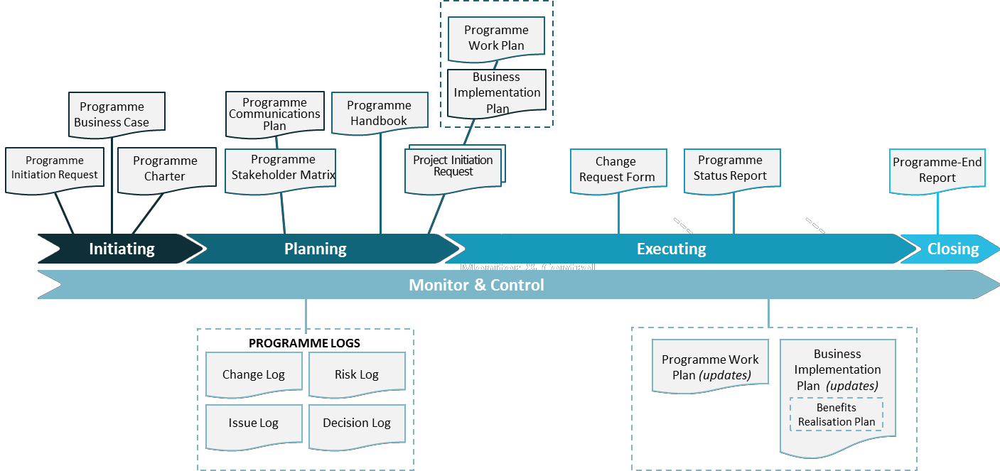

**Programme Organisation**

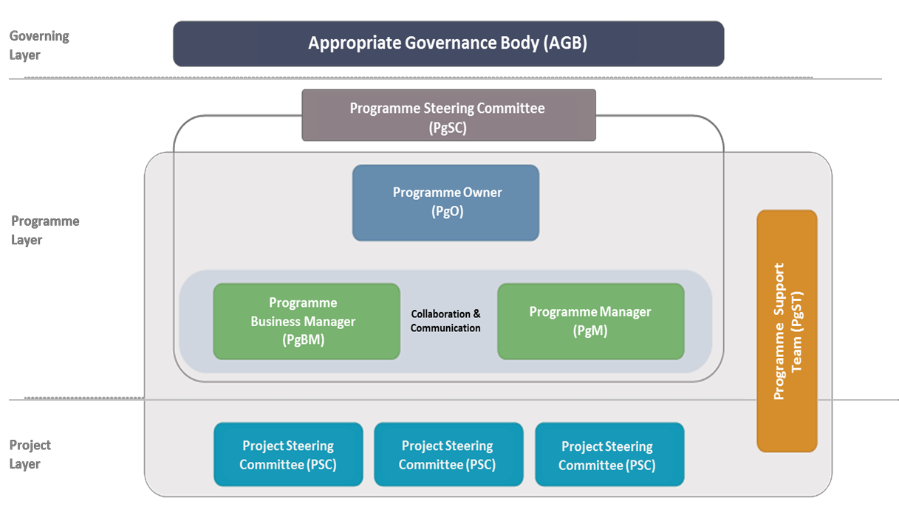

The Programme Owner (PgO) is accountable for the programme's success, whereas the day-to-day management of the programme is delegated to the Programme Manager (PgM), whose focus is to achieve the programme outcomes.

The Programme Business Manager (PgBM) represents the Programme Owner (PgO) on a daily basis within the programme and collaborates closely with the Programme Manager (PgM). The focus of this role is to realise the programme benefits, enabled by the programme outcomes.

The Programme Steering Committee (PgSC) comprises the Programme Owner (PgO), Programme Business Manager (PgBM) and Programme Manager (PgM). Other expert roles can participate as needed. The Programme Steering Committee (PgSC) is responsible for realising the programme's objectives and benefits.

A programme can also have a temporary Programme Support Team (PgST) to provide administrative assistance to the programme and its component projects.

#### D.1.3 PM² and Portfolio Management 

A Project Portfolio is a collection of projects, programmes and other activities which are grouped together to facilitate better control over their financial resources and to support their effective management in terms of meeting strategic objectives. The projects or programmes in the portfolio are not necessarily related or inter-dependent. From a strategic point of view, portfolios are higher-level structures than programmes and projects. It is at the portfolio level that investment decisions are made, priorities are identified, and resources are allocated.

It is very important for people involved in project definition and management to understand the differences between, and specific management requirements of, projects, programmes and portfolios. They should also be able to define or position their work at the right level (i.e. know if their work would be better managed as a programme or a network of projects), while always being aware of the management and organisational context of their work.

The PM² Portfolio management process encompasses a range of activities, which are organised in four groups.

##### 1. Portfolio Framework Definition

Defines the way the organisation will address portfolio management by delineating the portfolio structure, the governance bodies and their responsibilities, together with the necessary processes.

##### 2. Portfolio Composition

Is the process containing the activities to evaluate portfolio candidates, make investment decisions and allocate resources. These are activities that are regularly performed depending on the needs of the organisation.

##### 3. Portfolio Realisation

Is the continuous process in which the authorised programmes and projects are managed towards realising their objectives. Although programmes and projects are temporary endeavours, the portfolio activities are performed continuously until the portfolio is closed.

##### 4. Stakeholder Management \& Communication

Is the continuous process of analysing and interacting with the different stakeholders to ensure their effective involvement in the composition and realisation of the portfolio's objectives.
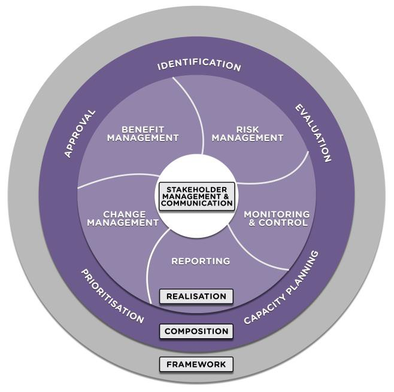

The Portfolio Composition process feeds the continuous processes of Portfolio Realisation with new portfolio components (i.e. programmes or projects), the progress and results of which are communicated by executing the Portfolio Communication \& Stakeholder Management process. The characteristics and governance of the portfolio, as well as the activities of the portfolio management processes and the artefacts produced are defined by the Portfolio Framework.

An overarching view of the organisational management of portfolios, programmes and projects is illustrated in the following diagram.
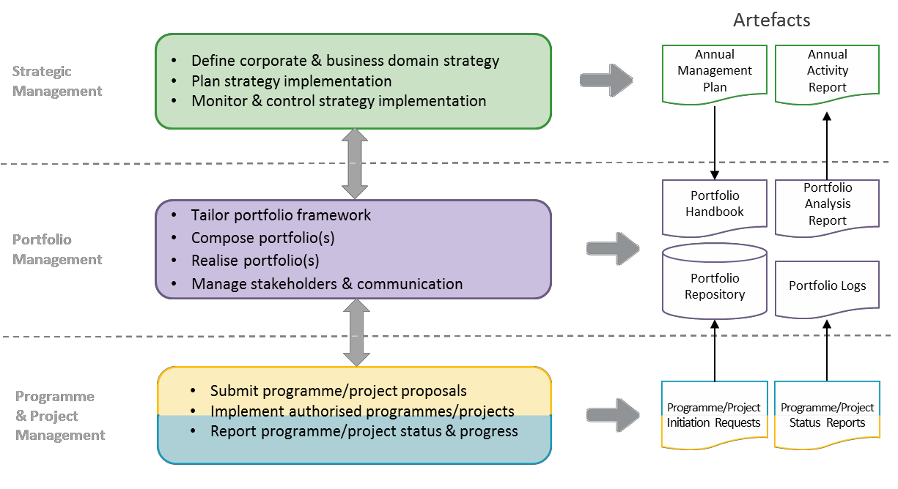

The Governance Structure of the PM² Portfolio Management is shown below.
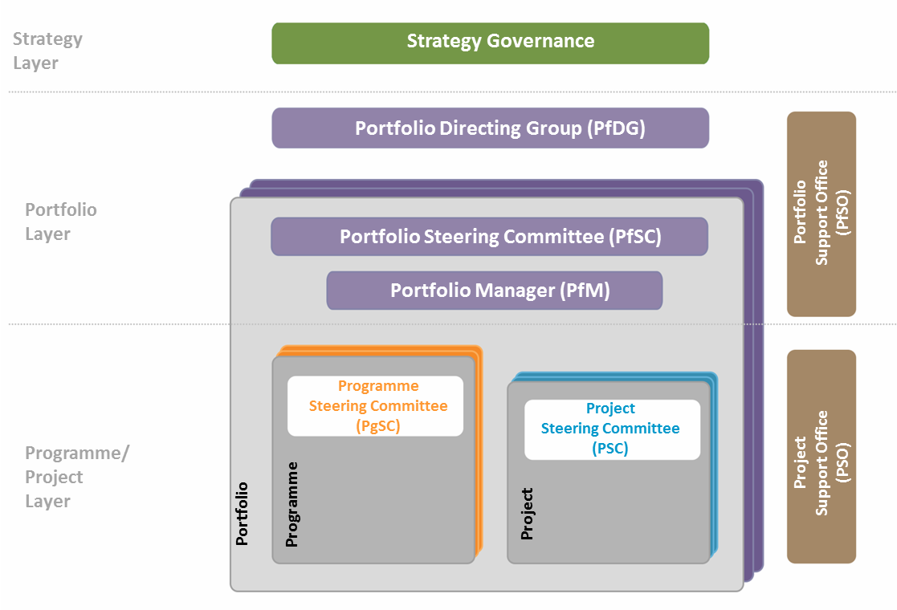

### D. 2 Considerations in PM²: Sustainability, Data Protection, IT Security, UX 

The following sections present project management considerations which are more pertinent to specific domains. For instance, considerations for Data Protection, IT Security, and UX are more critical in the context of IT projects delivering digital solutions, while sustainability considerations are much more central to engineering or construction projects. Still all those aspects remain relevant across diverse project domains.

#### D.2.1 Sustainability Considerations in Project Management

The concept of sustainability has evolved from a noble aspiration to an imperative for organisations and projects. In recognition of its profound global significance, the European Commission has been at the forefront of initiatives to foster a sustainable economy. The European Green Deal underscores the need for an economic system that nurtures growth while safeguarding our planet and improving the lives of citizens and future generations.

Sustainability encompasses more than just environmental stewardship; it encompasses the intricate interplay between economic, environmental, and social well-being. It calls for a holistic approach that goes beyond mitigating harm and instead focuses on creating lasting positive impacts on the world we inhabit.

As organisations and projects seek to incorporate sustainability into their core, sustainability considerations become a major factor in the way public and private organisations define, approve, plan, and manage projects, and their results.

As a result, project management practices should inspire and empower organisations, project managers, and project teams, to understand what sustainability in the context of projects is, but also to equip them with the practical and actionable guidelines and tools that will enable them to seamlessly integrate sustainability into their project management, fostering a more sustainable, prosperous future for all.

#### D.2.2 Data Protection Considerations in Project Management

The European Union's General Data Protection Regulation (GDPR) stands as a significant framework for safeguarding personal data and the privacy rights of individuals. It establishes principles of data protection, emphasizing fairness, transparency, and accountability in data processing.

To attain data protection by design and by default, organisations and project teams must prioritise adherence to fundamental Data Protection principles. These encompass the critical aspects of Lawfulness, Fairness, and Transparency, Accuracy, Purpose Limitation, Data Minimization, Storage Limitation, and Data Security, including Integrity and Confidentiality.

In essence, these principles mandate that all personal data be processed in a manner that is both legal and equitable, with transparency toward the data subject. This entails acquiring explicit consent, diligently informing data subjects about data processing activities, and ensuring fairness throughout data treatment. Personal data collection is confined to precise, legitimate purposes, preventing any usage beyond the original data collection scope. Likewise, data collection and processing are restricted to the minimum necessary for the intended purposes, preventing unwarranted data accumulation and preserving data relevance. Furthermore, personal data must be maintained for accuracy and updated when necessary, guarding against the usage of outdated or erroneous data. The storage of personal data should not exceed the period required for its original purpose, averting indefinite data retention and facilitating timely data deletion when no longer necessary. Lastly, stringent data security measures are essential, encompassing protection against unauthorized access, disclosure, alterations, or destruction, safeguarding both the integrity and confidentiality of the data.

As project teams grapple with the intricacies of data protection and privacy regulations, they require practical, actionable guidelines and tools so that they can ensure that data protection becomes an inherent consideration of projects, aligning with legal requirements and ethical standards regarding the handling of personal data.

#### D.2.3 IT Security Considerations in Project Management

The European Commission's IT Security Policy, coupled with its IT Security Risk Management Methodology (ITSRM ${ }^{3}$ ), forms a robust framework that can help organisations safeguard digital assets and preserve their integrity.

IT security management comprises a set of practices and measures centered around assuring three fundamental dimensions: confidentiality, which involves keeping data accessible only to authorized users; integrity, ensuring that data is not altered without authorization; and availability, guaranteeing that data remains accessible and functional when needed. It addresses a range of potential threats, such as accidents, errors, deliberate attacks, and natural events, all of which are considered as risks. The primary objective is to reduce the likelihood and impact of these risk, maintaining them at an acceptable level while ensuring that the cost of their management do not outweigh benefits.

IT security measures should be tailored to align with the specific threats faced by digital solutions and be in compliance with organisational policies and regulations, typically describing a three-tiered model, comprising risk management, compliance reviews, and internal security audits.

A security-oriented risk management approach starts in the conceptualisation of digital solutions, and subsequently in the Initiating Phase of the relevant projects, and continues until their closing of those projects, but also continues throughout the entire lifecycle of the produced digital solutions. Thus, IT security considerations should be integrated from the outset into the project priorities and workplan.

However, most organisations, project managers and project teams struggle with the complexities of managing IT security and therefore should be educated on the processes, tools and artefacts that will help seamlessly integrate IT security management into project initiation, planning, and execution, fostering a resilient, secure digital environment.

#### D.2.4 UX Considerations in Project Management 

The role of user experience (UX) in increasing the value of digital solutions is increasingly appreciated. UX, which concentrates on user interactions with products, services, and processes, plays a pivotal part in shaping user experiences that resonate with their requirements and desires.

UX is not merely about interface design; it extends to optimising the complete user experience within Digital Solutions, services, and processes. This approach revolves around the central role of users, diminishing uncertainty, enhancing mutual comprehension, and fostering empathetic partnerships.

The inclusion of UX considerations (e.g. design thinking) for the Digital solution, in the project priorities and workplan makes the project outputs user-focused. It empowers project teams to bridge the gap between assumptions and experimentation.

## Appendix E: Additional Resources 

### E. 1 PM² Artefacts \& Activities Summary Tables and Diagrams

RAM (RASCI)—Responsible, Accountable, Supports, Consulted, Informed

| Initiating | AGB | PSC | PO | BM | BIG | SP | PM | PCT |
| :--: | :--: | :--: | :--: | :--: | :--: | :--: | :--: | :--: |
| Project Initiation Request | I | n.a. | A/S | R | S/C | I | n.a. | n.a. |
| Business Case | I | C | A | R | C | S | S | n.a. |
| Project Charter | I | A | C | S | C | S | R | C |
| Planning | AGB | PSC | PO | BM | BIG | SP | PM | PCT |
| Planning Kick-off Meeting | I | A | C | S | C | C | R | C |
| Project Handbook | I | I | A | S | C | I | R | C |
| Project Stakeholder Matrix | I | I | A | S | C | I | R | C |
| Project Work Plan | I | A | C | S/C | C | C | R | S/C |
| Outsourcing Plan | A | C | C | C | I | S | R | I |
| Deliverables Acceptance Plan | I | A | C | S | I | C | R | C |
| Transition Plan | I | A | C | C | C | C | R | C |
| Business Implementation Plan | I | I | A | R | C | I | S | I |
| Management Plans |  |  |  |  |  |  |  |  |
| Requirements Management Plan | I | I | A | C | C | I | R | S |
| Project Change Management Plan | I | I | A | C | I | I | R | I |
| Risk Management Plan | I | C | A | C | I | I | R | I |
| Issue Management Plan | I | I | A | C | C | I | R | C |
| Quality Management Plan | I | A | C | C | C | C | R | C |
| Communications Management Plan | I | I | A | S | C | I | R | C |
| Executing | AGB | PSC | PO | BM | BIG | SP | PM | PCT |
| Executing Kick-off Meeting | I | A | C | S/C | C | C | R | C |
| Project Coordination | I | I | A | S | I | I | R | I |
| Quality Assurance | I | I | I | S | C | I | A | R |
| Project Reporting | I | I | A | S/C | I/C | I/C | R | C |
| Information Distribution | I | I | A | C | I | I | R | C |
| Monitor \& Control | AGB | PSC | PO | BM | BIG | SP | PM | PCT |
| Monitor Project Performance | I | I | A | C | C | I | R | C |
| Control Schedule | I | I | A | C | C | I | R | C |
| Control Cost | I | I | A | C | C | I | R | C |
| Manage Stakeholders | I | I | A | S/C | I | C | R | I |
| Manage Requirements | I | I | A | C | C | I | R | S |
| Manage Project Changes | I | C | A | S | I | I | R | C |
| Manage Risks | I | C | A | S/C | C | I | R | C |
| Manage Issues \& Decisions | I | I | A | S | C | I | R | C |
| Manage Quality | I | I | I | S/C | C | A | R | C |
| Manage Deliverables Acceptance | I | I | A | S | C | C | R | C |
| Manage Business Implementation | I | I | A | R | C | I | S | I |
| Manage Transition | I | A | C | C | C | C | R | C |
| Manage Outsourcing | A | C | C | C | I | S | R | I |
| Closing | AGB | PSC | PO | BM | BIG | SP | PM | PCT |
| Project-End Review Meeting | I | A | C | S | C | C | R | C |
| Project-End Report | I | A | C | S | C | C | R | C |
| Administrative Closure | I | C | A | C | I | C | R | I |
| AGB (Appropriate Governance Body) |  |  | BIG (Business Implementation Group) |  |  |  |  |  |
| PSC (Project Steering Committee) |  |  | SP (Solution Provider) |  |  |  |  |  |
| PO (Project Owner) |  |  | PM (Project Manager) |  |  |  |  |  |
| BM (Business Manager) |  |  | PCT (Project Core team) |  |  |  |  |  |

## Appendix E: Additional Resources

**The PM³ Artefacts Landscape**

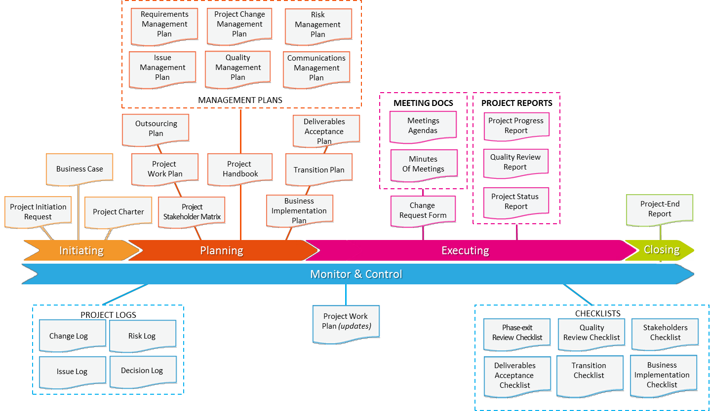

**Overview of PM² Activities & Artefacts**

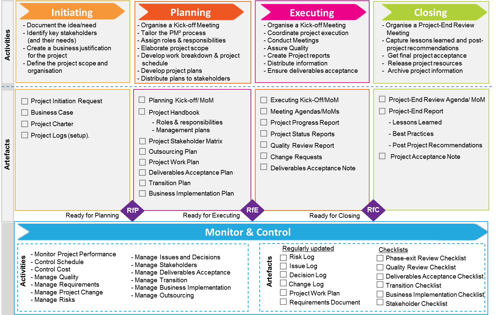

### E. 2 Getting Started with PM² - Quick Start Tips 

The purpose of this quick start guide is to help you get started with applying PM². Naturally, you will want to start by learning more about the PM² Methodology and review the available PM² material. Keep in mind, however, that you don't have to become an expert before you can start applying the basics of PM² in your projects. All you need is a brief introduction to the PM² Methodology and then you can continue by following the six Quick Start steps:

#### 1. Define the Project Governance and Create a Business Case -> Business Case

- Set up the Project Steering Committee (PSC).
- Provide the justification for the project, capture the business requirements and establish its budgetary constraints.

#### 2. Identify stakeholders and create the Project Charter -> Project Charter

- Define the project scope.
- Identify the stakeholders who should contribute to the Project Charter.
- Capture the high-level requirements, assumptions and constraints.
- Decide on a project approach and estimate required resources, costs and timing.

#### 3. Set up the Project Logs -> Issue Log, Risk Log, Change Log, Decision Log

- Set up the Risk Log, Issue Log, Decision Log and Change Log. These will be used to document the management of risks, issues and changes to project scope.

#### 4. Kick-off the Project Planning with a Meeting -> Planning Kick off, Meeting/MoMs

- Invite all necessary participants to the planning meeting.
- Go over the Project Charter and ensure a common understanding.
- Communicate the next steps for the planning of the project.

#### 5. Tailor the Project Management approach -> Project Handbook

- Decide which planning documents to use and how they should be tailored.
- Define rules, assign team responsibilities and define a conflict-resolution process.
- Identify all stakeholders who require information during the project.

#### 6. Create the Project Work Plan -> Project Work Plan

- Break down the work that needs to be done into smaller and more manageable pieces (create the Work Breakdown).
- Estimate the effort and cost for each piece of work.
- Establish the detailed budgetary and resource requirements.
- Create a work schedule (identify dependencies, assign resources and dates).

### E. 3 Useful Online Resources 

The Centre of Excellence in $\mathrm{PM}^{2}\left(\mathrm{CoEPM}^{2}\right)$ provides a central location for downloading all PM² information, publications, translations, etc. To study PM² in more detail you can download and review the free PM² Methodology Guide and artefact templates, and explore the online resources:

- PM² Website: https://pm2.europa.eu/downloads en
- EU Bookshop: https://op.europa.eu/en
- PM² on EU Academy: https://ec.europa.eu/newsroom/login?univers=informatics

Follow the eLearning modules on the:

- Essentials of PM² : https://academy.europa.eu/courses/pm-c1-pm-essentials-project-managementmethodology
- PM²-Agile: https://academy.europa.eu/courses/pm-a1-pm-agile-essentials

Join the Open PM² Community on Join-up:
https://joinup.ec.europa.eu/collection/open-pm2-project-management-methodology
Sign-up to our newsletter: https://ec.europa.eu/newsroom/login?univers=informatics

## Appendix E: Additional Resources

## Appendix F: Ethics and Conduct 

### F. PM² Code of Professional Conduct

Many organisations provide a code of ethics and conduct that members are required to respect. The purpose is to help people navigate through the complexities of professional reality and remind them which attitudes and behaviours are aligned with a commonly accepted set of professional values.

Conduct means personal behaviour based on moral principles. Professionalism is the skill, good judgment, and polite behaviour that is expected from a person who is trained to do a job well. This section provides a useful reminder of the key principles that PM² practitioners (and project team members) should be aware of and respect.

- INDEPENDENCE: staff conduct, and decision-making should be determined by the need to serve the common good and public interest, and never by any other interests whether private or as a result of, for example, political pressure.
- IMPARTIALITY: staff members should be unbiased in any decisions they are called upon to make.
- OBJECTIVITY: any conclusions drawn by staff as part of the project work should be balanced and based on a thorough analysis of the facts and legal background.
- LOYALTY: loyalty towards the organisation is essential for maintaining its independence and achieving its objectives. It is also necessary for the functioning of each service.

Putting these principles into practice requires:

- CIRCUMSPECTION: which is about stopping and reflecting on the possible consequences and implications of potential actions, showing a degree of moderation and a sense of proportion and propriety.
- RESPONSIBILITY: which is about carrying out those tasks entrusted to you as dutifully as possible and looking for solutions when difficulties are encountered. It is also important to know and respect the legal obligations and administrative rules and procedures in force.

The key principles can be summarised as INTEGRITY, which means consistently adhering to ethical principles and making sound decisions based on them.

In addition to the aforementioned code of ethics, every practitioner of the PM² Project Management Methodology should act based on the following values:

- LAWFULNESS and ACCOUNTABILITY: act in accordance with the law and hold yourself accountable for decisions and acts.
- FAIRNESS: fairness is our duty to make decisions impartially and objectively, and free from selfinterest, prejudice and favouritism.
- NON-DISCRIMINATION and EQUAL TREATMENT: respect the principle of non-discrimination and, in particular, guarantee equal treatment for members of the public irrespective of nationality, gender, racial or ethnic origin, religion or beliefs, disability, age or sexual orientation.
- PROPORTIONALITY and CONSISTENCY: ensure that measures taken are proportional to the aim pursued and be consistent in your behaviour.
- RESPECT and LEADERSHIP: exercise the power of your position with responsibility and promote ethical principles and professional conduct by leadership and example.
- HONESTY and OPENESS: declare any private interests and openly provide reasons for any decision.
- TEAMWORK and CONFLICT RESOLUTON: work together to achieve common goals by finding solutions through better mutual understanding.
- POLITENESS and CLEAR COMMUNICATION: engage colleagues by showing respect and encouraging efficiency through clarity of instructions.

### F. 2 Personal and Professional Virtues 

Virtues are strengths (or excellence) of the person who possesses them and refer to the ideal management of our attitude, behaviour and actions that drive personal and professional performance. Virtues are expressed in a specific context as the healthy mean between the extremes of excess and deficiency, which, however, is not universal, but subjective, and as such will vary between individuals and their respective circumstances. This healthy mean should be determined by good judgment.

Virtues are developed through practice. Their application helps us discover the right principles of conduct, to know what we ought to do in a given situation. Acting in a virtuous way enables us to raise the effectiveness and efficiency of our performance as a means to serve our personal, professional, as well as our higher and more inclusive goals.

The virtue of prudence (practical wisdom) refers to our ability to carefully consider how we can achieve our goal. Prudence is characterised as an executive disposition because its outcome is something to be executed. It can be examined on two levels: the level of purpose (our ability to set worthy goals) and the level of deliberation (our ability to carefully consider the course and the means of our actions so as to achieve the desired goals).

Judgment refers to our ability to assess what is true and what is not. Judgment forms our perception about things around us. Therefore, it strongly affects our prudence, which in turn determines our actions. When there is a deficiency in our Judgment (e.g. due to emotional factors or past experiences), we may consider as true something that is not and vice-versa (e.g. consider an act as fair when it is unfair).

It is through intuitive insight that the mind grasps the principles of conduct that may point the way toward success and happiness. The virtue of insightfulness refers to our ability to perceive things correctly, to examine circumstances accurately, to understand the relationships between things, to analyse and synthesise. It determines our capacity to learn or know what is the right thing to do and what is not, and to transfer this knowledge to various contexts in order to contribute to our wellbeing.

The virtue of courage refers to the management of risk taking and is described as the productive mean between cowardice (a deficiency) and audacity or fearlessness (an excess). A courageous person pursues (not necessarily without fear) the right goals, for the right reasons, in the right way, at the right time and for the right amount of time. Therefore, a person who is courageous acts and endures whatever is logically required for the attainment of a worthy goal. Courage (which always involves a risk) is a necessary means for the further development of one's capacities.

The virtue of honour refers to our disposition to seek honours and rewards from others. This virtue is defined as the mean between lack of ambition (seeking less honours and rewards than are deserved or having no desire for honours) and over-ambitiousness (an excessive desire for honours or seeking more honours and rewards than are deserved).

Honesty refers to our ability to tell the truth about ourselves and demonstrate to others who we really are, without denying or exaggerating our qualities. This virtue is the mean between self-deprecation (deficiency) and boastfulness (excess).

The virtue of fairness (or Justice) in general is attained through the application of all other virtues. However, there is a particular type of fairness that refers to our disposition to fairly distribute benefits and damages to those who deserve them, either between others and ourselves or amongst others. Fairness is the mother of all virtues, and for one to be truly fair all virtues must be fully developed ("Fairness is superior to all virtues and excellent" - Aristotle).

The virtue of generosity refers to the management of things that have value (e.g. time, money, knowledge, information and other assets). It is defined as the productive mean between stinginess (deficiency) and wastefulness (excess). Generosity ensures that the valuable assets we possess, such as our knowledge, are shared with the right person, at the right time, in the right quantity and in the right way, so as to be used productively. Generosity is determined not only by our willingness and ability to give (e.g. to use and share our knowledge), but also by whether our giving is in harmony with the long-term interests of the people involved, and in accordance to the other moral virtues. One should follow the guidance of reason, as generosity is something that needs to be exercised with wisdom if it is to promote one's own good and that of others.

The virtue of friendliness refers to the management of our amicability in our interactions with others. It is defined as the mean between rudeness (deficiency) and obsequiousness (excess). A rude person enjoys conflict, without taking into consideration whether it displeases or embarrasses others, whereas an obsequious person demonstrates servitude and is mostly interested in being likeable to others, avoiding conflict even at great personal cost.

The virtue of humour is described as the mean between boorishness (deficiency) and buffoonery (excess) The boorish person does not enjoy humour, might even be unduly upset or annoyed by it. On the other hand, the buffoon is someone who enjoys humour in excess, expresses it in an unproductive way, with inappropriate timing or frequency, possibly causing annoyance to others.

The virtue of calmness refers to the management of anger. It is the mean between spiritlessness (deficiency) and irritability (excess). Spiritlessness refers to the lack of anger, while irritability refers to the excess of anger in its duration, intensity and frequency. The calm person desires to remain calm and not get carried away by passion or rage, but to always act within reasonable limits.

The virtue of temperance refers to the management of our desires and is the mean between insensibility (deficiency) and intemperance (excess). A temperate person is one who desires moderately and reasonably all those pleasures that promote health and wellness.

The virtue of magnificence is similar to generosity, but it refers to the management of large assets. It is defined as the mean between paltriness (deficiency) and vulgarity (excess). Paltriness prevails when someone contributes to an important cause with a miserly disposition. On the contrary, vulgarity is displayed when someone contributes excessively, much more than is required or expected.

The virtue of magnanimity is similar to honour, but it refers to the management of high honours and rewards. It is defined as the mean between meekness (deficiency) and vanity (excess). A meek person believes that they do not deserve great honours when they actually do deserve them, whereas a vain person believes that they deserve great honours when they actually do not deserve them. The magnanimous (magnum=great) consider they deserve the greatest goods (wealth, influence, prestige, distinctions, etc.) when they do indeed deserve them.

All virtues are required for the application of professional competences, however, the intellectual virtues of judgment, prudence and insightfulness need to be transversally applied for their development. The following table shows the strongest relations of moral virtues to key professional competencies.

|  Competence | Key Virtues  |
| --- | --- |
|  Leadership | All  |
|  Relationships and engagement | Fairness, Friendliness, Generosity, Honesty, Humour,   Temperance  |
|  Self-reflection and-self management | Calmness, Courage, Friendliness, Honesty, Honour, Temperance  |
|  Change and transformation | Calmness, Courage, Friendliness, Generosity  |
|  Personal communication | Calmness, Friendliness, Generosity, Humour  |
|  Resourcefulness | Fairness, Friendliness, Generosity, Honesty, Honour  |
|  Results orientation | Honour, Generosity, Magnanimity, Magnificence  |
|  Teamwork | Calmness, Courage, Fairness, Friendliness, Generosity, Honour,   Magnificence  |
|  Negotiation | Courage, Fairness, Friendliness, Generosity, Honesty, Honour  |
|  Conflict and crisis management | Calmness, Fairness, Friendliness, Generosity  |
|  Personal integrity and reliability | Calmness, Courage, Fairness, Friendliness, Honour, Temperance  |
|  Culture and values management | All virtues  |
