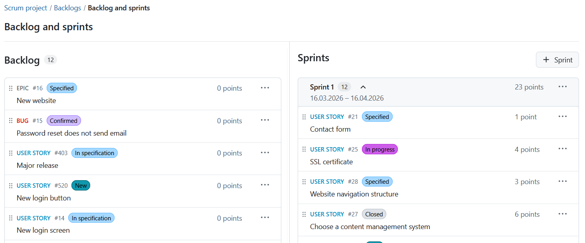
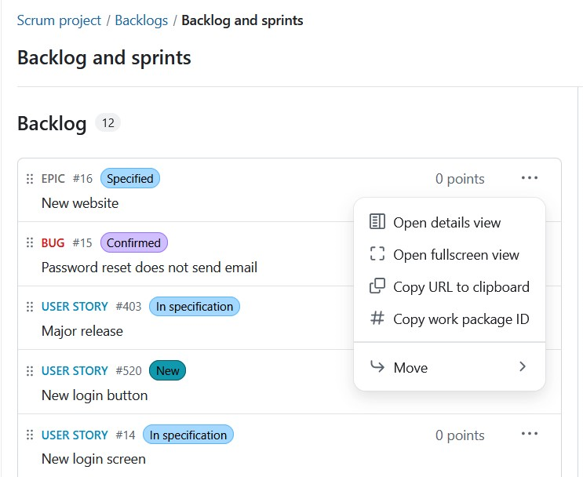
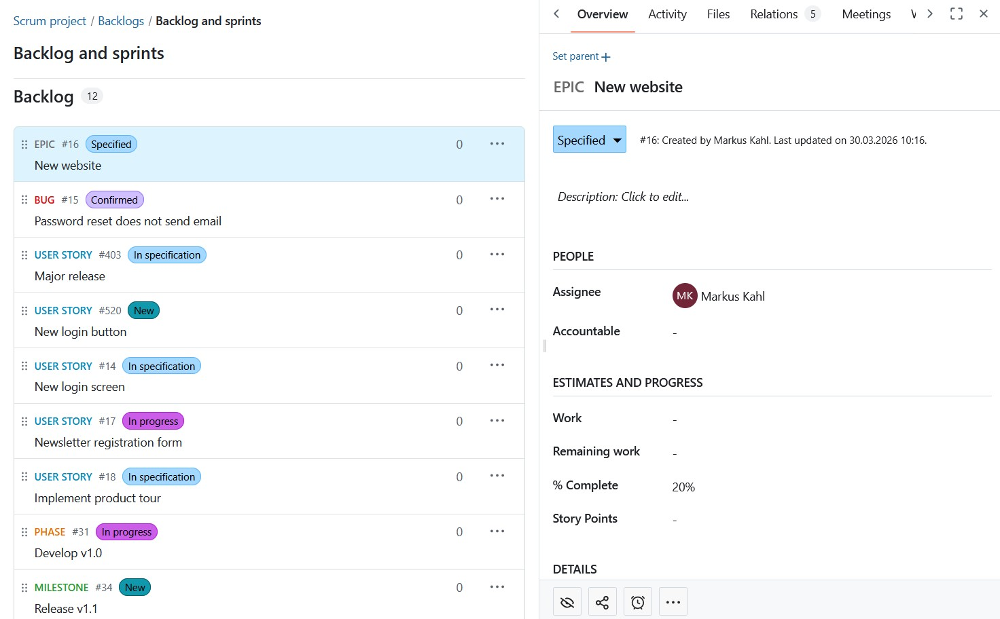
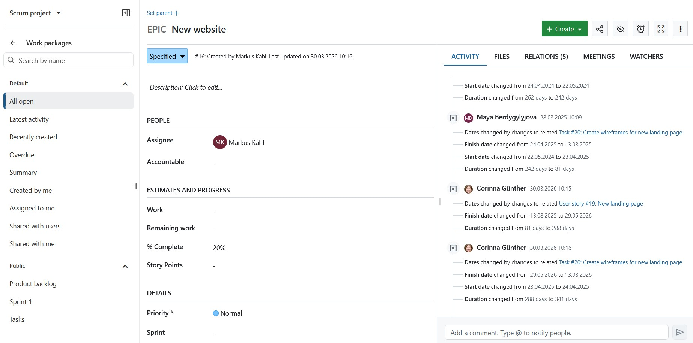
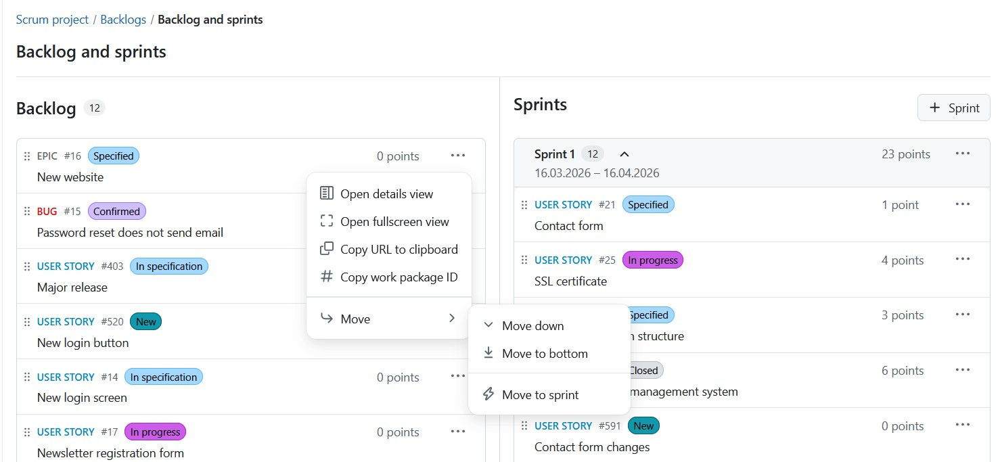
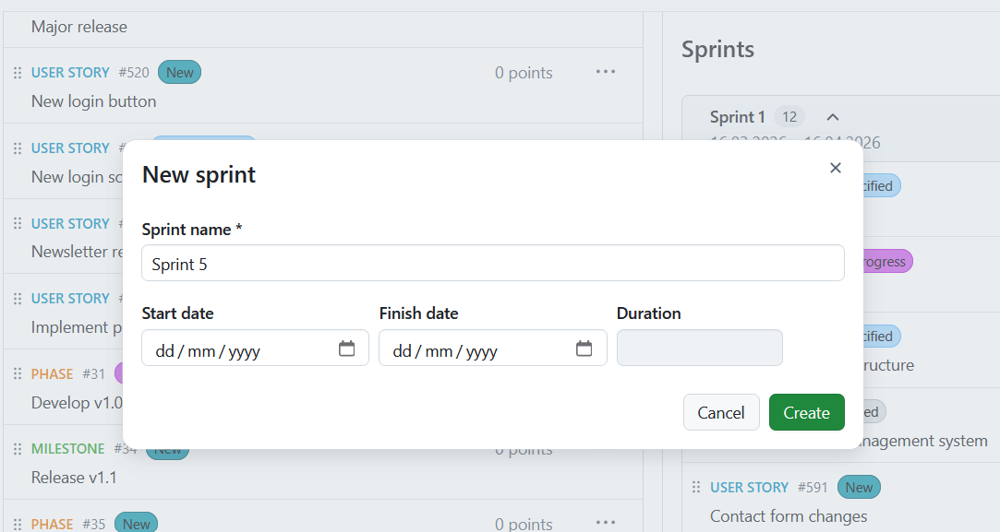
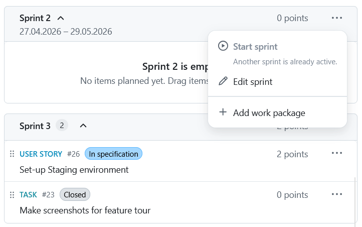
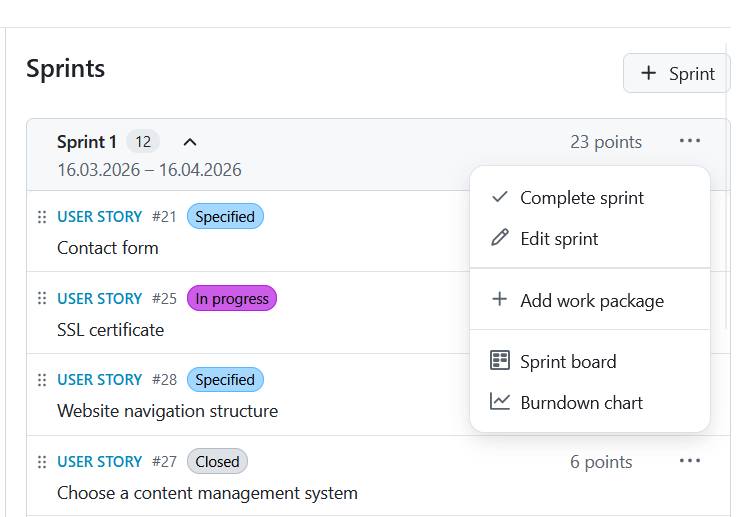
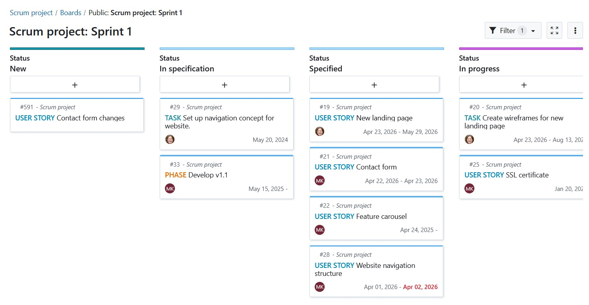

---
sidebar_navigation:
  title: Backlogs (Scrum)
  priority: 850
description: Support your Scrum methodology with Backlogs
keywords: backlogs, scrum
---

# Backlog and sprints

> [!Note]
>
> The "Backlogs" module is continuously evolving and will undergo further changes in upcoming versions. We will keep updating the documentation over time to reflect these changes.

Working in agile project teams is becoming increasingly important and with OpenProject , it is easier than ever.

OpenProject supports your work with the Agile and Scrum methodology by providing a variety of improved functionalities. You can now create and manage sprints, record and prioritize user stories in the sprint and backlog, use sprint boards or burndown-charts, print story cards, and much more. For more information, please refer to the OpenProject [agile and scrum features](https://www.openproject.org/collaboration-software-features/agile-project-management/) page.

A **Backlog** is defined as a plugin that allows to use the backlogs feature in OpenProject. In order to use backlogs in a project, the backlogs module has to be activated in the project settings of a project.

Please note that this user guide does not represent an introduction into scrum methodology, but merely explains the scrum-related functionalities and user instructions in OpenProject.

### **Managing the backlog**

The Backlog is automatically populated based on the number of work packages existing in a project and that are not yet in sprints. When you add a work package to a sprint, or close it, the work package will no longer be visible in the backlog. 

When there are too many items in the Backlog, a **Show more** **items** button in the middle appears. This compacts the middle section so that you always see the top and the bottom of the backlog. 

From the backlog menu, you can access more work package actions like the **details view** or **fullscreen view**. These options exist for you to choose how much information (about the backlog item) you'd like to be displayed. The URL can be copied to clipboard as well as the work package ID.

With the **Move** menu, you can order items according to your preference.

### **Creating and managing sprints**

A **Sprint** is a planned and time-boxed period in which a scrum team completes a defined set of tasks. 

Sprints are new objects no longer linked to versions (as was the case with previous OpenProject versions). They are buckets where work packages can be manually added or removed from the Backlog via a drag-and-drop icon.

To create a sprint, you need to click on the **+ sprint button**. This opens up a form for you to fill in details about the sprint name, start date and completion date. The duration is automatically calculated, after which you click on the **create** button. 

The naming of sprints are by default number based: Sprint 1, Sprint 2, but these can be edited according to your team's work rhythm.

Your sprint is set in motion by clicking on the **Start sprint** button. 

> [!NOTE]
>
> This button becomes invisible when another sprint is active.

Your active sprint can be easily managed through the menu options. 

### **Working with sprint boards**

Sprint boards are especially helpful for teams to track and visualize progress from the onset. When you click on **start sprint** within the Backlog, a dedicated sprint board is automatically created and you are forwarded to the active sprint board. 

The boards are named in this pattern: [Project name: Sprint name]. As an example: **[Scrum project: Sprint 1].**

The sprint board inherits project permissions automatically which means, it is accessible to all project members by default.

> [!NOTE]
>
> The sprint board and burndown chart are only visible on the menu when a sprint is active.
