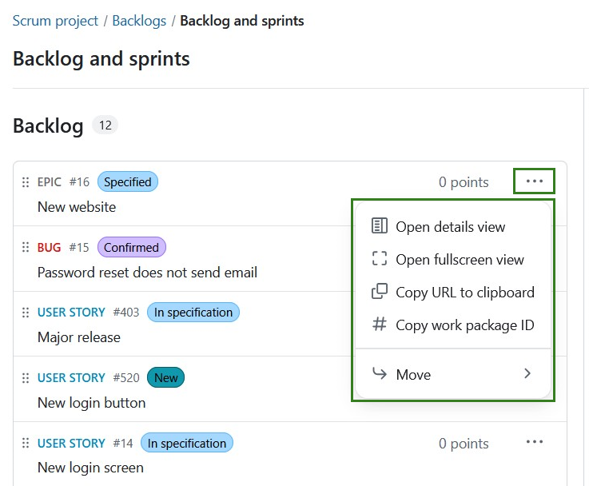
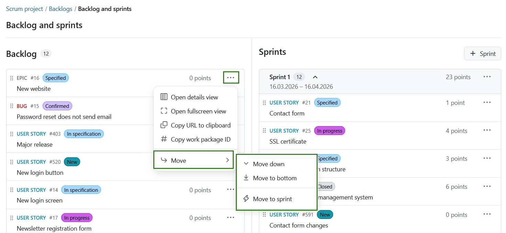
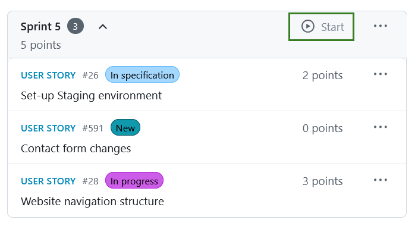
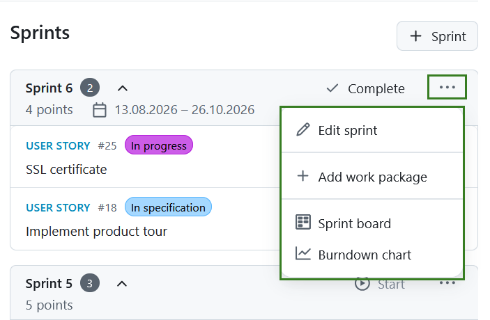
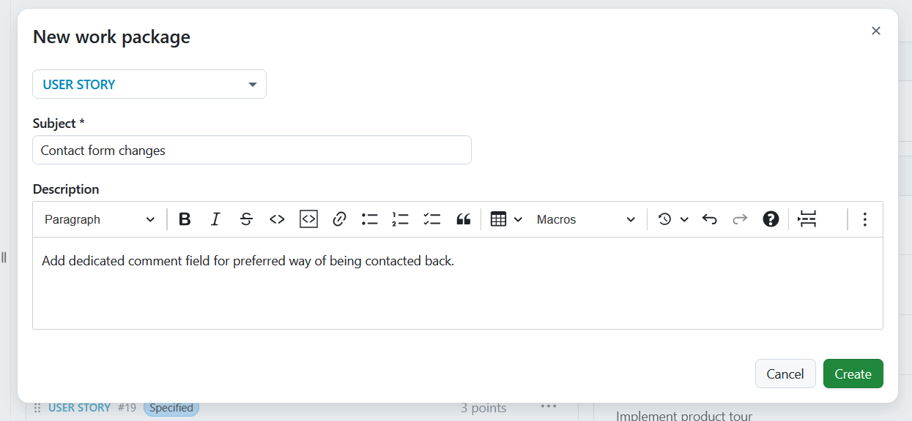
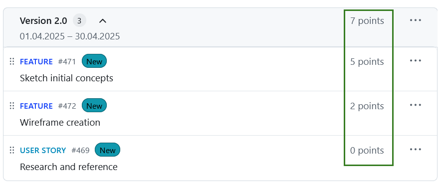
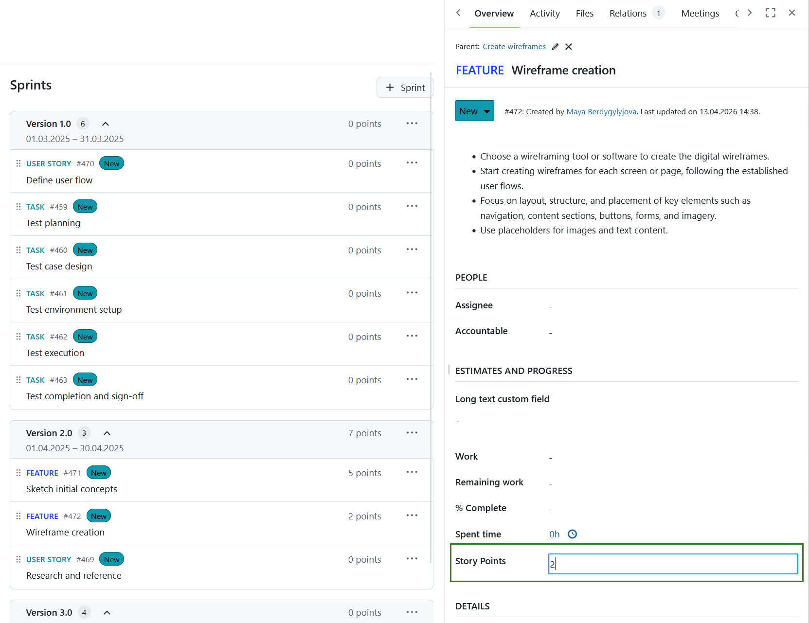
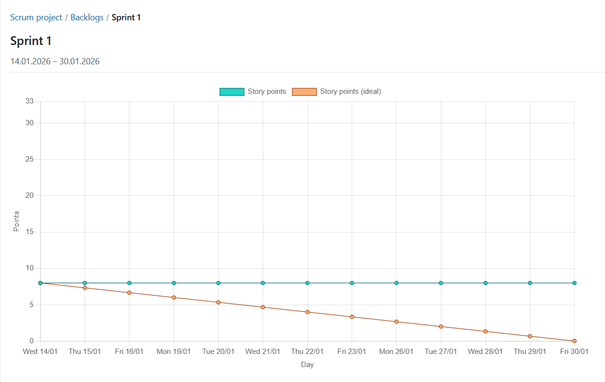

---
sidebar_navigation:
  title: Backlogs (Scrum)
  priority: 850
description: Support your Scrum methodology with Backlogs
keywords: backlogs, scrum, backlog, agile, sprint, sprint bucket
---

# Backlog and sprints

> [!NOTE]
> The **Backlogs** module is getting a reset with OpenProject 17.3 release and will undergo further changes in the upcoming versions. We will keep updating the documentation over time to reflect these changes.

Working in agile project teams is becoming increasingly important, and with OpenProject, it is easier than ever.

OpenProject supports your work with the Agile and Scrum methodology by providing a variety of improved functionalities. You can now create and manage sprints, record and prioritize work packages in sprints and the backlog, use automated sprint boards or burndown-charts, and much more. For more information, please refer to the OpenProject [agile and scrum features](https://www.openproject.org/collaboration-software-features/agile-project-management/) page.

A **Backlog** is defined as a module that allows you to use the backlogs feature in OpenProject. In order to use backlogs in a project, the Backlogs module has to be activated in the project settings.

Please note that this user guide does not represent an introduction to Scrum methodology, but merely explains the Scrum-related functionalities and user instructions in OpenProject.

## Manage the backlog

The Backlog is automatically populated based on the work packages in a project that are not yet in sprints. When you add a work package to a sprint, or close it, the work package will no longer be visible in the backlog. 

When there are too many items in the Backlog, a **Show more items** link appears in the middle. This compacts the middle section so that you always see the top and the bottom of the backlog. 

Next to every work package listed in the backlog or sprint, you can access the **More (three dots)** menu, including the following options:

- Open **details view** or **fullscreen view** of a work package. These options allow you to choose how much information (about the backlog item) you'd like to be displayed. 
- **Copy** the work package URL or ID to the clipboard.
- **Move** a work package.

Details view opens the work package information on the right side, the same way as in the notifications center.

Opening the fullscreen view opens the work package in fullscreen.

With the **Move** option, you can order items according to your preference within the backlog or move them to a sprint. You can also drag and drop the work packages. 

## Create and manage sprints

>  [!IMPORTANT] 
>  Starting with the OpenProject 17.3 release, Sprints are new objects no longer linked to versions (as was the case with previous OpenProject versions). 

A **Sprint** is a planned and time-boxed period in which a Scrum team completes a defined set of tasks. They are containers or buckets where work packages can be manually added or removed from the Backlog via a drag-and-drop icon.

### Create a sprint

To create a sprint, click the **+ Sprint** button in the top right corner of the Backlogs module. This opens up a form for you to fill in details about the sprint name, start date, and completion date. The duration is automatically calculated. Click the **Create** button to proceed.

The naming of sprints is number-based by default (e.g. Sprint 1, Sprint 2). These names can be edited according to your team's work rhythm.

### Start or complete a sprint

Your sprint is set in motion by clicking the **Start sprint** button. Clicking it will open the sprint board.

> [!NOTE]
> A sprint cannot be started if another sprint is already in progress. In this case the button will be disabled.

Once a sprint has started, it is considered active and can be managed through the **Sprint menu** options, which include:

- Complete sprint
- Edit sprint
- Add work package
- Open a Sprint board
- Burndown chart

### Add a work package

In order to create a new work package in the Backlogs module, click on the More (three dots) icon in the top right corner of a Sprint and choose **+ Add work package** from the drop-down menu.

A form dialog will appear to create a new work package. Here, you directly specify the work package type, subject, and description. Click **Create** to proceed.

A new item will be added to the backlog to display the newly created story.

### Prioritize stories

You can prioritize different work packages within a backlog or sprint by either using the **Move** option or by dragging & dropping them. This allows you to assign work packages to a specific sprint, return to a backlog or re-order them within a sprint.

### Story points

In a sprint, you can directly document necessary effort as story points. The overall effort for a sprint is automatically calculated, and the sum of story points is displayed in the top row.

Story points are defined as numbers assigned to a work package used to estimate (relatively) the size of the work.

You can edit story points directly from the backlogs view. In order to do so, simply click the work package you want to edit and make the desired changes in the detailed view of the work package that will open on the right.

### Sprint boards

Sprint boards are especially helpful for teams to track and visualize progress from the start. When you click the **Start sprint** within the Backlog, a dedicated sprint board is automatically created and you are forwarded to the active sprint board. 

Boards are named using this pattern: [Project name: Sprint name]. As an example: **Scrum project: Sprint 1**.

The sprint board inherits project permissions automatically, which means it is accessible to all project members by default.

> [!NOTE]
> The sprint board and burndown chart are only visible on the menu when a sprint is active.

### Burndown charts

**Burndown charts** are a helpful tool to visualize a sprint’s progress. With OpenProject, you can generate sprint and task burndown charts automatically.

> [!TIP]
> As a precondition, the sprint’s start and end date must be defined and the information on story points should be well maintained.

The sprint burndown is calculated from the sum of estimated story points. If a user story is set to “closed“ (or another status which is defined as closed (see admin settings)), it counts towards the burndown.

The task burndown is calculated from the estimated number of hours necessary to complete a task. If a task is set to “closed“, the burndown is adjusted.

The remaining story points per sprint are displayed in the chart. Optionally, the ideal burn-down can be displayed for reference. The ideal burndown assumes a linear completion of story points from the beginning to the end of a sprint.

