---
sidebar_navigation:
  title: Working with backlogs
  priority: 990
description: Working with backlogs (scrum)
keywords: backlogs, scrum, agile, burndown
---

# Working with Backlogs

The starting point for effective work in Scrum teams is a well-maintained and prioritized product backlog as well as the creation of sprint backlogs. In OpenProject, you can easily record and specify requirements represented by user stories. Moreover, you can respond to inquiries and sort them by priority for implementation.

| Topic                                               | Content                                                      |
| --------------------------------------------------- | ------------------------------------------------------------ |
| [Create a new backlog](#create-a-new-backlog)       | How to create a new product backlog or sprint.               |
| [Create a new user story](#create-a-new-user-story) | How to create a new user story, epic, bug in the backlogs view. |
| [Prioritize user stories](#prioritize-user-stories) | How to prioritize user stories in the backlogs view.         |
| [Story points](#working-with-story-points)          | Estimate user stories and document story points.             |
| [Sprint duration](#edit-sprint-duration)            | How to edit sprint duration.                                 |
| [Burndown chart](#burndown-chart)                   | How to view the burndown chart.                              |
| [Sprint wiki](#sprint-wiki)                         | How to create a sprint wiki to document sprint information.  |

## Create a new backlog

The first thing you will do is to **create a new backlog version** (product backlog or sprints). Read here on [creating a new backlogs version or a sprint](../manage-sprints). You can always manage the backlog versions under project settings, if you have the necessary administrator rights.

The versions (product backlog or sprint) will then appear in the Backlogs module either on the left or on the right side.

Sprint 1, Sprint 2, Bug Backlog, Product Backlog in the example below are all versions in a project, displayed in the Backlogs view. You can create a new version with the green + Version button at the top of the backlogs view.

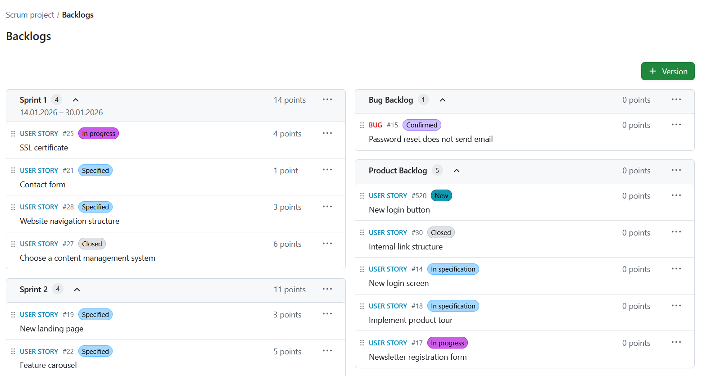

> [!NOTE]
> The columns of the version are actually sorted differently. The left column for sprints is sorted chronologically, i.e. according to the time of creation, since sprints usually also run chronologically in project management planning.
The right column (for backlogs) is sorted alphabetically, so that you can determine the sequence of the backlogs yourself.

## Create a new user story

In order to create a new work package in the *Backlogs* module, click on the **More (three dots)** icon in the top right corner or a Sprint or Bug Backlog and choose *New Story* from the drop-down menu.

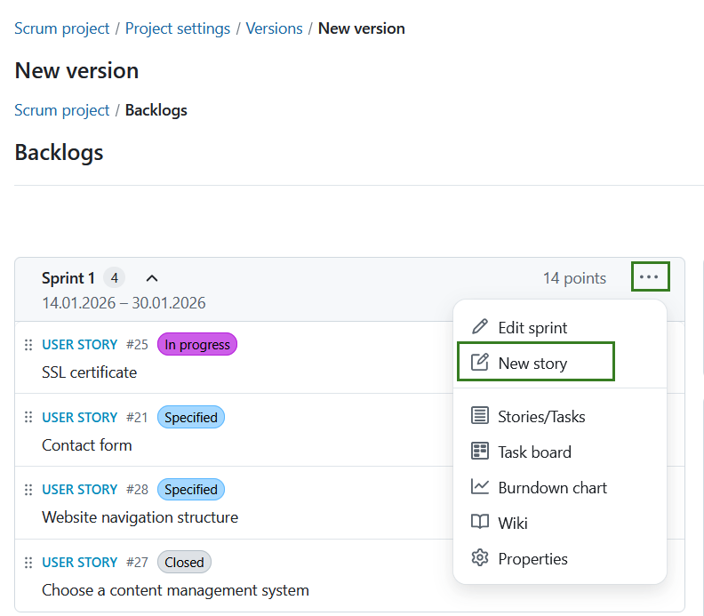

> A form dialog will appear to create a new work package. Here, you directly specify the work package type, subject and description. The list of types contains those work package types that are activated in the [System Administration](../../../system-admin-guide/backlogs/). Click **Create** to proceed.

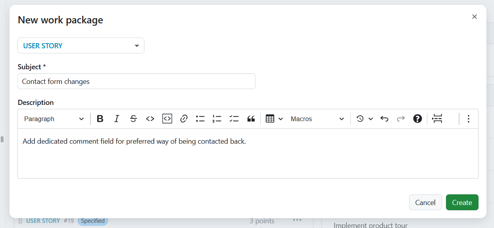

A new item will be added to the backlog to display the newly created story.

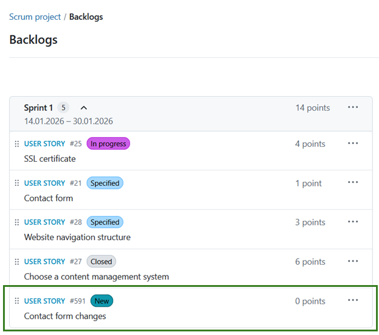

> Clicking on an item within the sprint opens the work package detail view on the right side, so you can make adjustments while staying in the Backlogs module.

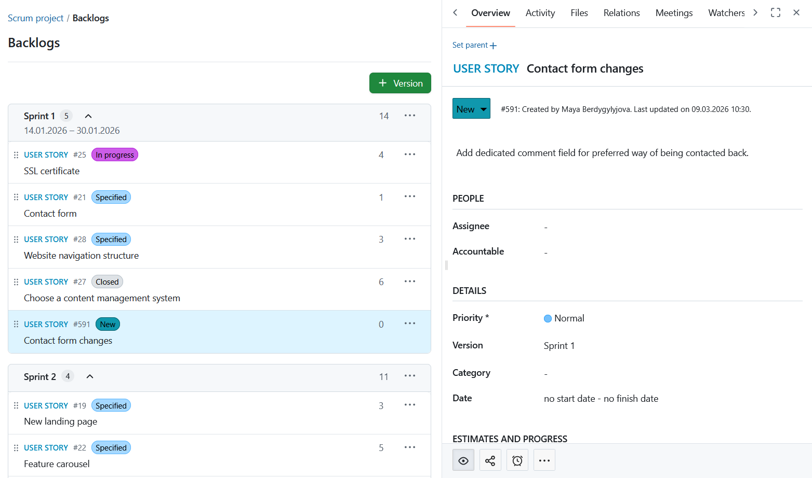

Clicking on the work package ID opens the work package in full screen, where you can specify additional work package attributes.

Of course, new user stories can also be directly created following the usual procedure of [creating a new work package](../../work-packages/create-work-package/). In order to do so, choose a work package type and target version which are activated in the [backlogs settings in the Administration](../../../system-admin-guide/backlogs) – such as feature or bug, and product or sprint backlog, respectively.

**Displaying all user stories and tasks for a sprint** is also possible by selecting *Stories/Tasks* in the drop-down menu next to the sprint title.

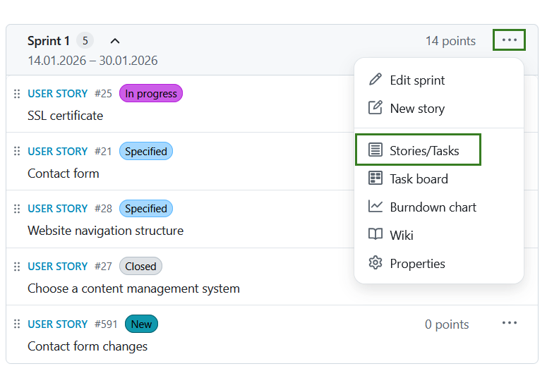

This will take you to the filtered work package view of all user stories and tasks in a sprint.

> [!NOTE]
> All tasks created for a user story via the task board view are automatically configured as child work packages of a user story. The task is thus always automatically assigned to the target version of the parent work package (i.e. the user story).

## Prioritize user stories

You can prioritize different work packages within the product backlog using drag & drop and you can assign them to a specific sprint backlog or re-order them within a sprint.

> [!NOTE]
> If you move a work package into the backlogs view, the target version will automatically be adapted in the background.

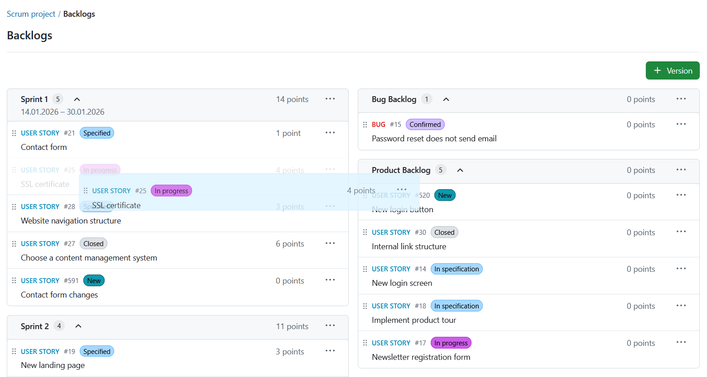

## Working with story points

In a sprint, you can directly document necessary effort as story points. The overall effort for a sprint is automatically calculated, whereby the sum of story points is displayed in the top row.

**Story points** are defined as numbers assigned to a work package used to estimate (relatively) the size of the work.

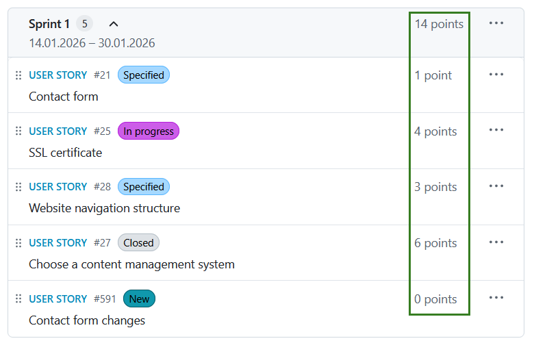

You can easily edit story points directly from the backlogs view. In order to do so, simply click in the line of the work package you want to edit, and make the desired changes in the detailed view of the work package that will open on the right.

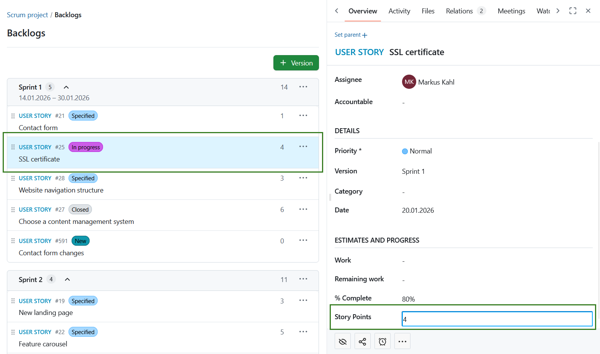

## Edit sprint duration

Moreover, you can adjust the start and end date of a backlog in the backlogs view. Click the **More (three dots)** icon to the right of the sprint name and select *Edit sprint*.

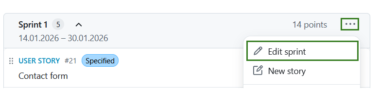

Clicking on the date opens a calendar where you can make your changes.

> [!NOTE]
> Apart from start and end date, you can also adjust the sprint name. To do so, you have to be a project administrator.

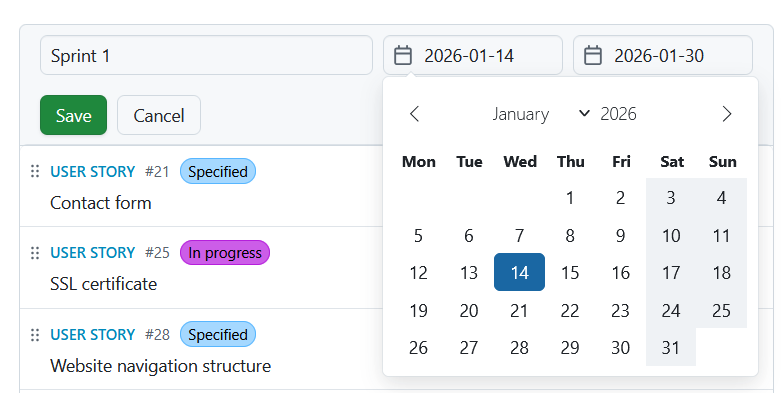

> [!NOTE]
> A backlog version will be shown under [Roadmap](../../roadmap/), but not in a [Gantt chart](../../gantt-chart). If you want to display a sprint in a timeline, you can create a new work package, select a phase as a work package type, give it the same name as to a specific version (for example Sprint 1) and assign the same start and end date.

## Burndown chart

**Burndown charts** are a helpful tool to visualize a sprint’s progress. With OpenProject, you can generate sprint and task burndown charts automatically. 

> [!TIP]
> As a precondition, the sprint’s start and end date must be entered in the title and the information on story points is well maintained.

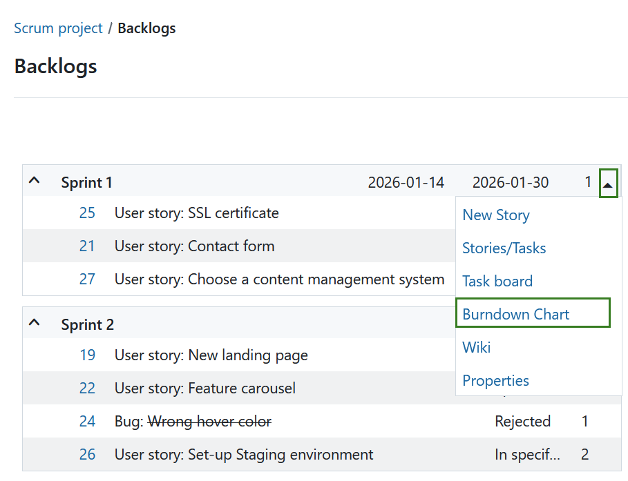

The sprint burndown is calculated from the sum of estimated story points. If a user story is set to “closed“ (or another status which is defined as closed (see admin settings)), it counts towards the burndown.

The task burndown is calculated from the estimated number of hours necessary to complete a task. If a task is set to “closed“, the burndown is adjusted.

The remaining story points per sprint are displayed in the chart. Optionally, the ideal burn-down can be displayed for reference. The ideal burndown assumes a linear completion of story points from the beginning to the end of a sprint.

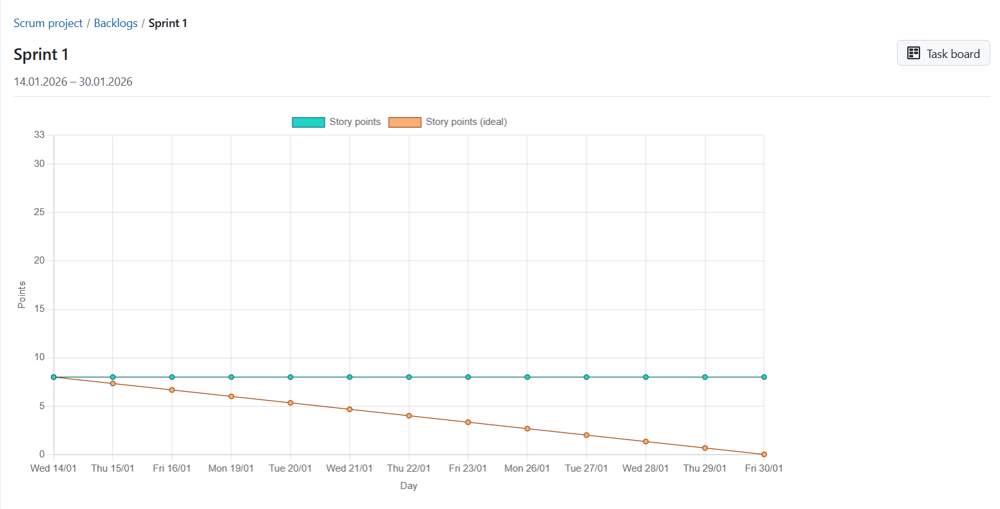

## Sprint wiki

OpenProject also allows you to create a wiki page associated with a sprint directly from the backlog. You can document sprint information, e.g. ratios, sprint meetings, retrospective, sprint planning or sprint review meetings.

In order to do so, click on the arrow on the left of the respective Sprint title to open the drop-down menu. A click on **Wiki** will take you to the Wiki editing page.

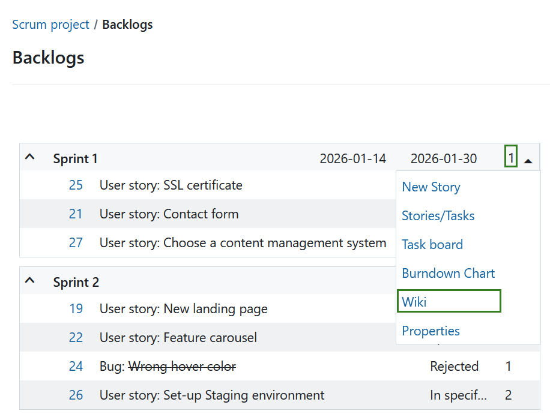

Here, you have all the tools for creating wiki pages at your disposal, with the title already pre-set and related to the selected sprint. You can insert and edit content using the text field and make changes to the formatting using the navigation pane above. You can also add comments and files from your hard drive. Once you have configured the wiki page according to your preferences, click **Save**.

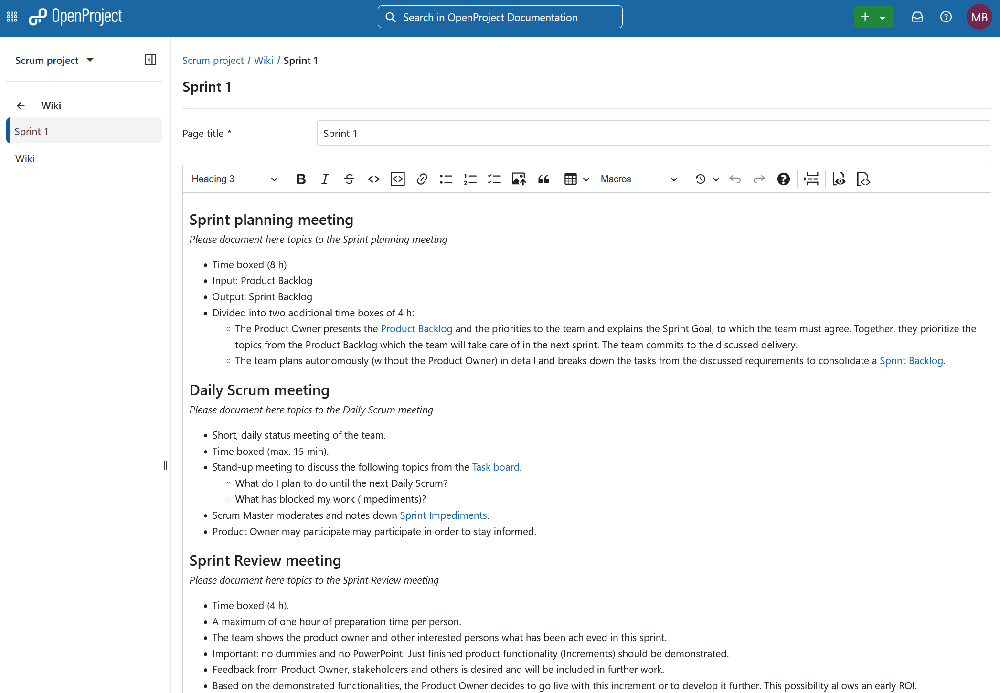

> [!NOTE]
> This wiki page can be linked to multiple versions. 

> [!TIP]
> If instead of linking a specific (central) wiki page, you want to create a new pre-structured wiki page per version (for example per Sprint), you can configure the [sprint wiki template](../../../system-admin-guide/backlogs/#sprint-wiki) in the Administration -> Backlogs. 