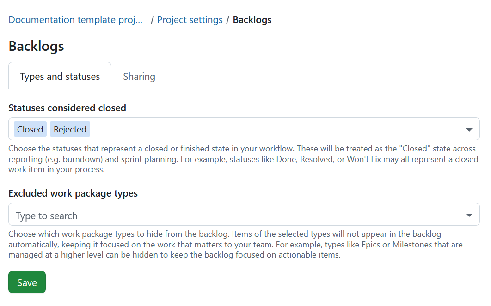
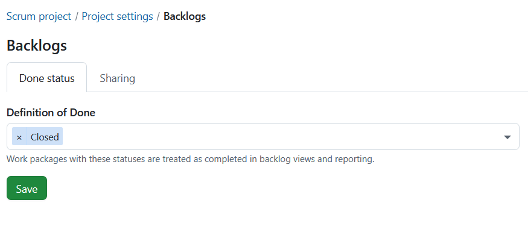
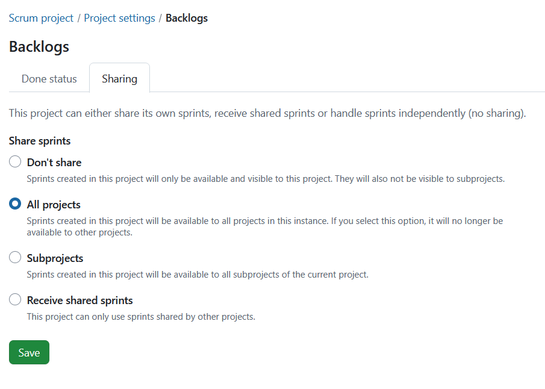

---
sidebar_navigation:
  title: Backlogs settings
  priority: 300
description: Backlogs settings.
keywords: backlogs settings, backlogs, definition of done, share sprint, sprints, agile, scrum
---
# Backlogs settings

In OpenProject, you can configure your Backlogs settings specific to each project.

## Set the definition of done

You can define what "done" means for the Backlogs module. This determines when a work package should be considered complete and included in the backlog views and reporting. 

Choose the status or statuses which should be treated as "done".

Press the **Save** button to apply your changes.

## Sharing sprints

Sharing is a project-level setting that allows you to choose whether sprints should be shared across projects or not.

> [!NOTE]
> This is not a sprint-level setting as is currently the case with versions.

**Don't share:** This is the default setting for projects. Sprints can be created in this project and are available and visible only within this project. None of the created sprints are shared with any other project or sub-projects.

**Share sprints:** Sprints can be created in this project and shared with either **all projects** or **subprojects**:

**All projects:** Selecting this option means the sprints created are available to all projects within the instance. It also means that other projects will not be able to use this option.

**Subprojects:** Sprints created in this project will be available to all subprojects of the current project.

**Receive shared sprints:** No sprints can be created within this project. Instead, only sprints shared by other projects can be used. 

